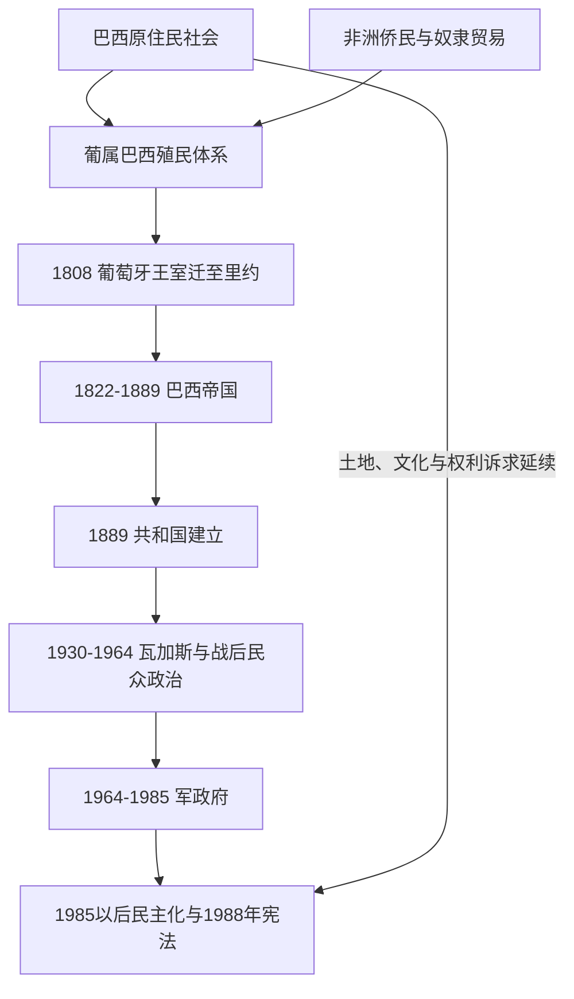

# 巴西历史

## 历史主线

巴西历史从多样的原住民社会、葡萄牙殖民和大西洋奴隶制出发。1808年葡萄牙王室迁至里约热内卢，使巴西成为帝国政治中心；1822年独立后，巴西以君主制形式维持广阔领土统一，奴隶制直到1888年才废除。1889年共和国建立后，寡头政治、瓦加斯时代、民众政治、军政府和1988年宪法下的民主化依次塑造现代巴西。

## 演进图

## 时期导航

| 顺序 | 阶段 | 时间 | 简要概括 |
|---:|---|---|---|
| 1 | [原住民与葡属巴西](/%E4%BA%BA%E6%96%87%E7%A7%91%E5%AD%A6/%E5%8E%86%E5%8F%B2/%E7%BE%8E%E6%B4%B2/%E5%8D%97%E7%BE%8E/%E5%B7%B4%E8%A5%BF/%E5%8E%9F%E4%BD%8F%E6%B0%91%E4%B8%8E%E8%91%A1%E5%B1%9E%E5%B7%B4%E8%A5%BF.md) | 1500-1808年 | 沿海殖民、糖业、矿业、内陆扩张和奴隶制塑造殖民社会。 |
| 2 | [王室迁都、独立与巴西帝国](/%E4%BA%BA%E6%96%87%E7%A7%91%E5%AD%A6/%E5%8E%86%E5%8F%B2/%E7%BE%8E%E6%B4%B2/%E5%8D%97%E7%BE%8E/%E5%B7%B4%E8%A5%BF/%E7%8E%8B%E5%AE%A4%E8%BF%81%E9%83%BD%E3%80%81%E7%8B%AC%E7%AB%8B%E4%B8%8E%E5%B7%B4%E8%A5%BF%E5%B8%9D%E5%9B%BD.md) | 1808-1889年 | 王室迁都、君主制独立、咖啡扩张、巴拉圭战争、废奴与帝国终结。 |
| 3 | [旧共和国](/%E4%BA%BA%E6%96%87%E7%A7%91%E5%AD%A6/%E5%8E%86%E5%8F%B2/%E7%BE%8E%E6%B4%B2/%E5%8D%97%E7%BE%8E/%E5%B7%B4%E8%A5%BF/%E6%97%A7%E5%85%B1%E5%92%8C%E5%9B%BD.md) | 1889-1930年 | 联邦共和国、咖啡寡头、地区政治与社会反抗。 |
| 4 | [瓦加斯与战后民众政治](/%E4%BA%BA%E6%96%87%E7%A7%91%E5%AD%A6/%E5%8E%86%E5%8F%B2/%E7%BE%8E%E6%B4%B2/%E5%8D%97%E7%BE%8E/%E5%B7%B4%E8%A5%BF/%E7%93%A6%E5%8A%A0%E6%96%AF%E4%B8%8E%E6%88%98%E5%90%8E%E6%B0%91%E4%BC%97%E6%94%BF%E6%B2%BB.md) | 1930-1964年 | 国家工业化、威权与民选阶段交替，政治危机最终导致政变。 |
| 5 | [军政府与民主化](/%E4%BA%BA%E6%96%87%E7%A7%91%E5%AD%A6/%E5%8E%86%E5%8F%B2/%E7%BE%8E%E6%B4%B2/%E5%8D%97%E7%BE%8E/%E5%B7%B4%E8%A5%BF/%E5%86%9B%E6%94%BF%E5%BA%9C%E4%B8%8E%E6%B0%91%E4%B8%BB%E5%8C%96.md) | 1964-1988年 | 军人统治、国家暴力、经济波动与1988年新宪法。 |
| 6 | [当代巴西](/%E4%BA%BA%E6%96%87%E7%A7%91%E5%AD%A6/%E5%8E%86%E5%8F%B2/%E7%BE%8E%E6%B4%B2/%E5%8D%97%E7%BE%8E/%E5%B7%B4%E8%A5%BF/%E5%BD%93%E4%BB%A3%E5%B7%B4%E8%A5%BF.md) | 1988年至今 | 民主竞争、社会政策、资源经济、腐败调查、环境与不平等争议。 |

## 君主、摄政与总统

长序列统一维护在[巴西君主、摄政与总统表](/%E4%BA%BA%E6%96%87%E7%A7%91%E5%AD%A6/%E5%8E%86%E5%8F%B2/%E7%BE%8E%E6%B4%B2/%E5%8D%97%E7%BE%8E/%E5%B7%B4%E8%A5%BF/%E5%B7%B4%E8%A5%BF%E5%90%9B%E4%B8%BB%E3%80%81%E6%91%84%E6%94%BF%E4%B8%8E%E6%80%BB%E7%BB%9F%E8%A1%A8.md)：包括若昂六世的联合王国前史、佩德罗一世与佩德罗二世、1831—1840年全部三人和单人摄政、1889年以来全部总统、临时代行者、军政府以及未就职当选人的辨析。

## 政体辨析

- 1822-1889年巴西是立宪君主制帝国；佩德罗一世和佩德罗二世并非葡萄牙国王，而是巴西皇帝。
- 1889年共和国通过军事政变建立；这不等于种族、土地和社会结构立即改变。
- 1964-1985年军政府保留部分选举和制度外观，但政治自由受到严重限制。
- 1988年宪法是民主化的重要制度节点，民主巩固仍面临地区、阶级、种族和环境问题。

## 相关入口

- 上级目录：[南美历史](/%E4%BA%BA%E6%96%87%E7%A7%91%E5%AD%A6/%E5%8E%86%E5%8F%B2/%E7%BE%8E%E6%B4%B2/%E5%8D%97%E7%BE%8E/README.md)。
- 殖民背景：[西属南美与葡属巴西](/%E4%BA%BA%E6%96%87%E7%A7%91%E5%AD%A6/%E5%8E%86%E5%8F%B2/%E7%BE%8E%E6%B4%B2/%E5%8D%97%E7%BE%8E/%E8%A5%BF%E5%B1%9E%E5%8D%97%E7%BE%8E%E4%B8%8E%E8%91%A1%E5%B1%9E%E5%B7%B4%E8%A5%BF.md)。
- 区域当代史：[现代南美区域秩序](/%E4%BA%BA%E6%96%87%E7%A7%91%E5%AD%A6/%E5%8E%86%E5%8F%B2/%E7%BE%8E%E6%B4%B2/%E5%8D%97%E7%BE%8E/%E7%8E%B0%E4%BB%A3%E5%8D%97%E7%BE%8E%E5%8C%BA%E5%9F%9F%E7%A7%A9%E5%BA%8F.md)。
