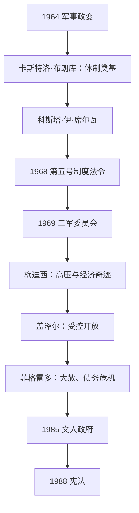

# 军政府与民主化

## 时间

1964-1988年。

## 概括

1964年政变后，巴西由军人总统和国家安全体制主导。政权在1960年代末至1970年代初加强审查、拘禁、酷刑和政治排斥，同时推进基础设施和工业项目。经济“奇迹”后出现债务、通胀与不平等问题。1970年代末政治开放逐步开始，1985年文人政府恢复，1988年宪法为新的民主秩序提供框架。

## 统治结构

| 阶段 | 特点 |
|---|---|
| 军人政权巩固 | 通过制度法令限制政党、选举与司法独立，军方高层决定总统继任。 |
| 强硬统治 | 1968年后政治迫害和审查加剧，反对派、学生、工人和武装组织受打压。 |
| 渐进开放 | 1970年代末开始放松限制，社会运动、工会和新政党扩大空间。 |
| 民主转型 | 1985年文人总统就任，1988年宪法确认公民权利与民主制度。 |

## 重要事件

- 1968年《第五号制度法令》扩大行政权并成为高压统治象征。
- 政权以反共和发展主义为名实施安全政策，侵犯人权的责任成为民主化后追忆与调查议题。
- 1970年代大型水电、交通和亚马孙开发项目扩大国家存在，也造成环境、原住民和土地冲突。
- 经济高速增长未能持续，石油危机、外债和通胀削弱政权合法性。
- “直接选举现在”运动虽未立即实现总统直选，却推动社会和政治力量汇合。
- 1988年宪法承认广泛社会权利、民主程序和原住民土地权利，成为后续政治的重要基础。

## 政权演进图

## 政变、统治与开放过程

- **夺权与制度化（1964—1967）**：军方以反共、反通胀和恢复秩序为名推翻古拉特。国会在军方清洗议员、暂停权利的条件下间接选出卡斯特洛·布朗库；制度法令高于普通宪法，1965年取消旧政党，建立官方党与许可反对党两党格局。
- **高压升级（1967—1974）**：科斯塔·伊·席尔瓦时期学生、工人和反对派扩大抗议，少数组织转向城市游击。1968年第五号制度法令允许关闭国会、暂停人身保护和清洗公职。1969年总统病重时三军委员会排除法定文人副总统，随后梅迪西时期酷刑、失踪、审查和反游击达到高峰。
- **“经济奇迹”的条件与代价**：国家信贷、外资、工资压制、基础设施和有利国际融资推动1968—1973年高速增长；财富集中、城市贫困、原住民土地侵占和外债同步扩大。石油价格与国际利率变化使模式在1970年代后期失去支撑。
- **受控开放（1974—1979）**：盖泽尔试图由总统控制“缓慢、渐进、安全”的开放，并压制拒绝退场的强硬派；反对党选举进展、教会、人权律师、工会和家属运动扩大社会空间。开放不是军方主动恩赐，而是统治集团调整与社会压力的结果。
- **民主转型（1979—1988）**：菲格雷多时期大赦使流亡者回国，也保护国家暴力实施者；新工会、工人党和“直接选举现在”运动形成全国联盟。1985年选举人团选出坦克雷多，但其未就职即病逝，副手萨尔内接任；1987—1988年制宪会议把公民、社会和原住民权利写入新宪法。
- **未决遗产**：转型没有立即改革军警体系或全面追责。真相委员会、档案、纪念与土地权争议持续，说明政权终结和历史责任解决是两回事。

军人总统、1969年三军委员会、未就职的坦克雷多与文人继承完整表见[巴西君主、摄政与总统表](/%E4%BA%BA%E6%96%87%E7%A7%91%E5%AD%A6/%E5%8E%86%E5%8F%B2/%E7%BE%8E%E6%B4%B2/%E5%8D%97%E7%BE%8E/%E5%B7%B4%E8%A5%BF/%E5%B7%B4%E8%A5%BF%E5%90%9B%E4%B8%BB%E3%80%81%E6%91%84%E6%94%BF%E4%B8%8E%E6%80%BB%E7%BB%9F%E8%A1%A8.md)。

## 演变关系

- 前一节点：[瓦加斯与战后民众政治](/%E4%BA%BA%E6%96%87%E7%A7%91%E5%AD%A6/%E5%8E%86%E5%8F%B2/%E7%BE%8E%E6%B4%B2/%E5%8D%97%E7%BE%8E/%E5%B7%B4%E8%A5%BF/%E7%93%A6%E5%8A%A0%E6%96%AF%E4%B8%8E%E6%88%98%E5%90%8E%E6%B0%91%E4%BC%97%E6%94%BF%E6%B2%BB.md)。
- 后一节点：[当代巴西](/%E4%BA%BA%E6%96%87%E7%A7%91%E5%AD%A6/%E5%8E%86%E5%8F%B2/%E7%BE%8E%E6%B4%B2/%E5%8D%97%E7%BE%8E/%E5%B7%B4%E8%A5%BF/%E5%BD%93%E4%BB%A3%E5%B7%B4%E8%A5%BF.md)。
- 所属总览：[巴西历史](/%E4%BA%BA%E6%96%87%E7%A7%91%E5%AD%A6/%E5%8E%86%E5%8F%B2/%E7%BE%8E%E6%B4%B2/%E5%8D%97%E7%BE%8E/%E5%B7%B4%E8%A5%BF/README.md)。
