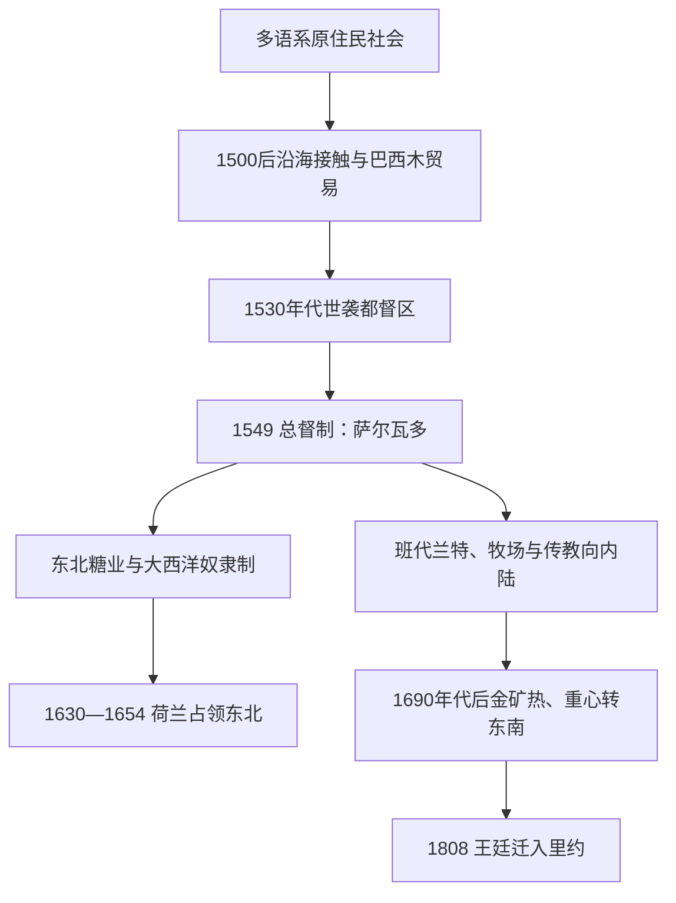

# 原住民与葡属巴西

## 时间

1500-1808年；原住民族群及非洲侨民社会延续至今。

## 概括

葡萄牙抵达前，巴西地区已有图皮语系、杰语系、阿拉瓦克语系及其他多种社会。殖民初期依赖沿海贸易、原住民劳役和传教，随后糖业种植园、大西洋奴隶贸易、金矿和内陆远征使殖民范围扩大。殖民社会由欧洲移民、被奴役非洲人及其后代、原住民和不同自由有色人群共同构成，不能只以宗主国行政线解释。

## 殖民统治结构

| 层级 | 角色 | 说明 |
|---|---|---|
| 葡萄牙王室 | 宗主权与贸易政策 | 通过殖民官员、特许和税收行使权力。 |
| 总督 / 副王 | 殖民地最高行政 | 1549年后总督制加强，后期常称副王。 |
| 地方市政会与种植园主 | 地方权力 | 土地、奴隶劳动和港口贸易给予地方精英深厚影响。 |
| 教会与传教团 | 宗教、教育和聚落组织 | 既保护部分原住民免遭奴役，也参与文化改造和殖民治理。 |
| 原住民、逃奴社群与被奴役者 | 抵抗、逃亡、谈判与劳动主体 | 不是被动对象；其行动持续塑造殖民边界。 |

## 重要过程

- 1500年葡萄牙航队抵达巴西海岸；《托德西利亚斯条约》提供欧洲列强的外交背景，但不代表当地土地无人居住。
- 16世纪糖业在东北沿海扩张，奴隶贸易迅速成为劳动力来源。
- 17世纪荷兰曾控制巴西东北部分地区，巴西殖民史也与荷兰—葡萄牙帝国竞争有关。
- “班代兰特”远征、传教站、牧场和矿区推动殖民者深入内陆，常伴随对原住民的捕获、战争与土地侵占。
- 1690年代后米纳斯吉拉斯金矿繁荣，人口和经济重心逐步向东南移动。
- 逃奴建立的基隆布等社群表明被奴役者以逃亡、武装抵抗和自主聚落反抗奴役制度。
- 1808年拿破仑战争迫使葡萄牙王室迁往里约热内卢，殖民地与宗主国关系进入新阶段。

## 殖民演进图

## 殖民扩张的具体过程

- **接触与联盟**：早期葡萄牙商站以巴西木和原住民交换为主，法国商人也在海岸活动。葡萄牙人依赖图皮等群体的航路、食物与战争联盟；天花、麻疹等疾病和奴役战争造成巨大人口损失，但不同族群反应并不一致。
- **都督区与总督制**：1530年代王室把海岸分为世袭都督区，只有伯南布哥、圣维森特等少数较成功。1549年首任总督托梅·德·索萨在萨尔瓦多建立中央行政；总督、地方市政会、教会和种植园主之间长期共享而非单向垂直统治。
- **糖与奴隶制**：磨坊需要土地、信贷和持续劳力。殖民者先奴役原住民，后日益依赖跨大西洋贩运的非洲人；被奴役者通过怠工、诉讼、逃亡、宗教社群和基隆布抵抗。帕尔马雷斯在17世纪形成大型逃奴聚落联盟，1694—1695年遭殖民军摧毁。
- **帝国竞争**：荷兰西印度公司1630年占领伯南布哥等糖区，拿骚的约翰·毛里茨统治期重组金融和城市；葡萄牙种植园主、王室和本地军队经长期战争于1654年驱逐荷兰人，荷兰技术和资本随后推动加勒比糖业竞争。
- **内陆扩张**：圣保罗班代兰特捕掠原住民、搜寻矿产并攻击西班牙传教区；牧场沿河谷扩展，王室与西班牙通过条约逐渐按实际占领调整边界。不能把今日国界倒推为1500年既定疆域。
- **金矿与行政重心**：17世纪末米纳斯吉拉斯发现黄金，王室设铸币、税关和“第五税”，里约成为矿区出口和奴隶输入中心，1763年殖民首府由萨尔瓦多迁里约。1789年米纳斯密谋和1798年巴伊亚起义分别反映精英税负与更广泛平等诉求。
- **直接转折**：1807年法军入侵葡萄牙，英国海军护送王室横渡大西洋。1808年开放港口、设银行、法院和军政机构，使巴西不再按普通殖民地运作。

## 殖民结构的兴衰

葡属巴西的崛起依靠大西洋航运、糖金咖啡出口、奴隶劳动和地方联盟；其结构性代价是土地集中、区域不均与对强迫劳动的依赖。18世纪末税收、走私、精英自治诉求和奴隶及自由有色人反抗逐渐削弱旧秩序；直接使殖民关系改变的不是一次本地起义，而是1808年王廷把帝国中心迁到里约。后续君主、摄政与共和国元首见[巴西君主、摄政与总统表](/%E4%BA%BA%E6%96%87%E7%A7%91%E5%AD%A6/%E5%8E%86%E5%8F%B2/%E7%BE%8E%E6%B4%B2/%E5%8D%97%E7%BE%8E/%E5%B7%B4%E8%A5%BF/%E5%B7%B4%E8%A5%BF%E5%90%9B%E4%B8%BB%E3%80%81%E6%91%84%E6%94%BF%E4%B8%8E%E6%80%BB%E7%BB%9F%E8%A1%A8.md)。

## 演变关系

- 后一节点：[王室迁都、独立与巴西帝国](/%E4%BA%BA%E6%96%87%E7%A7%91%E5%AD%A6/%E5%8E%86%E5%8F%B2/%E7%BE%8E%E6%B4%B2/%E5%8D%97%E7%BE%8E/%E5%B7%B4%E8%A5%BF/%E7%8E%8B%E5%AE%A4%E8%BF%81%E9%83%BD%E3%80%81%E7%8B%AC%E7%AB%8B%E4%B8%8E%E5%B7%B4%E8%A5%BF%E5%B8%9D%E5%9B%BD.md)。
- 所属总览：[巴西历史](/%E4%BA%BA%E6%96%87%E7%A7%91%E5%AD%A6/%E5%8E%86%E5%8F%B2/%E7%BE%8E%E6%B4%B2/%E5%8D%97%E7%BE%8E/%E5%B7%B4%E8%A5%BF/README.md)。
