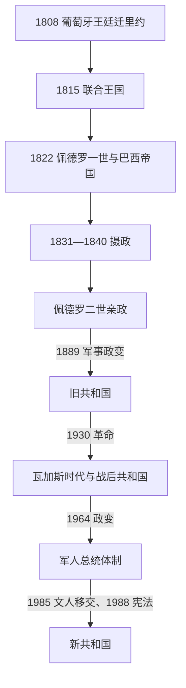

# 巴西君主、摄政与总统表

## 口径

本表把联合王国时期的葡萄牙君主、独立后的两位巴西皇帝、未成年皇帝名下的摄政机构，以及1889年以来所有实际就任的共和国国家元首分开排列。未就职的当选人、短暂代行者、军政府集体与被排除的法定继承人均在备注中说明，避免用一条“总统名单”抹去实际权力更替。

## 政体与元首演进图

## 联合王国与巴西皇帝

| 序列 | 统治者 | 在位 | 继承关系 / 地位 | 关键事件与备注 |
|---|---|---|---|---|
| 前史 | 若昂六世 | 1815—1822年作为葡萄牙、巴西和阿尔加维联合王国国王 | 1816年正式即位；王廷在里约。1821年返葡，佩德罗留任摄政王。 | 是联合王国君主而非“巴西皇帝”，1822年巴西脱离其王国。 |
| 1 | **佩德罗一世** | 1822—1831年 | 若昂六世之子；1822年宣布独立并受拥立 | 1824年宪法、承认独立、顺铂战争与皇权—议会冲突；1831年退位。 |
| 2（名义在位） | **佩德罗二世** | 1831—1889年；1840年开始亲政 | 佩德罗一世之子，五岁继位 | 摄政期后“成年政变”提前亲政；咖啡、议会政治、巴拉圭战争与废奴；1889年被军人政变推翻。 |

> 佩德罗二世从1831年退位诏生效起即为皇帝，1840年是亲政而非“开始在位”。

## 摄政机构完整表

| 阶段 | 时间 | 摄政者 | 权力与事件 |
|---|---|---|---|
| 临时三人摄政 | 1831年4月7日—6月17日 | 若泽·若阿金·卡内罗·德·坎普斯（卡拉韦拉斯侯爵）、尼古劳·佩雷拉·德·坎普斯·韦尔盖罗、弗朗西斯科·德·利马·伊·席尔瓦 | 退位后维持中央权力并召集制度安排。 |
| 常设三人摄政 | 1831年6月17日—1835年10月12日 | 弗朗西斯科·德·利马·伊·席尔瓦、若泽·达·科斯塔·卡瓦略（后蒙特阿莱格里侯爵）、若昂·布劳利奥·穆尼斯 | 1834年附加法扩大省级自治并改为一人摄政。 |
| 一人摄政 | 1835年10月12日—1837年9月19日 | 迪奥戈·安东尼奥·费若 | 自由派摄政；面对卡巴纳任、法鲁皮利亚等叛乱后辞职。 |
| 一人摄政 | 1837年9月19日—1840年7月23日 | 佩德罗·德·阿劳若·利马（后奥林达侯爵） | 保守派“回归”加强中央；1840年佩德罗二世提前亲政。 |

## 共和国国家元首完整表

| 序列 | 国家元首 / 集体机构 | 在位 | 取得权力方式 | 关键事件与备注 |
|---:|---|---|---|---|
| 1 | **德奥多罗·达·丰塞卡** | 1889—1891 | 军人；临时政府后任宪制总统 | 政变推翻帝国；与国会冲突后辞职。 |
| 2 | 弗洛里亚诺·佩绍托 | 1891—1894 | 副总统继任 | 镇压联邦主义者与舰队叛乱，巩固新共和国。 |
| 3 | 普鲁登特·德·莫赖斯 | 1894—1898 | 选举 | 首位文人总统；处理卡努杜斯战争。 |
| 4 | 坎普斯·萨莱斯 | 1898—1902 | 选举 | 财政紧缩与“州长政治”巩固。 |
| 5 | 罗德里格斯·阿尔维斯 | 1902—1906 | 选举 | 里约改造与公共卫生运动；1918年再度当选但就职前病逝。 |
| 6 | 阿丰索·佩纳 | 1906—1909 | 选举；任内去世 | 移民、铁路与咖啡经济扩张。 |
| 7 | 尼洛·佩萨尼亚 | 1909—1910 | 副总统继任 | 完成佩纳余任。 |
| 8 | 赫尔梅斯·达·丰塞卡 | 1910—1914 | 选举；军人 | “救国政策”干预州政治。 |
| 9 | 文塞斯劳·布拉斯 | 1914—1918 | 选举 | 一战、工业增长与1917年工运。 |
| 10 | 德尔芬·莫雷拉 | 1918—1919 | 副总统代行；后继任 | 罗德里格斯·阿尔维斯未就职即病逝，依法重新选举。 |
| 11 | 埃皮塔西奥·佩索阿 | 1919—1922 | 补选 | 战后经济与青年军官反叛前夜。 |
| 12 | 阿图尔·贝尔纳德斯 | 1922—1926 | 选举 | 长期戒严并应对“十人军官运动”。 |
| 13 | 华盛顿·路易斯 | 1926—1930 | 选举；政变罢黜 | 咖啡危机与继承争议触发1930年革命。 |
| 过渡 | 1930年军事执政委员会 | 1930年10月24日—11月3日 | 塔索·弗拉戈索、梅纳·巴雷托、伊萨伊亚斯·德·诺罗尼亚 | 推翻华盛顿·路易斯后把权力交给瓦加斯；当选人茹利奥·普列斯特斯从未就职。 |
| 14 | **热图利奥·瓦加斯** | 1930—1945 | 革命政府；1934年间接选出；1937年自我政变 | 中央集权、劳动法和工业化；“新国家”独裁在军方压力下终结。 |
| 15 | 若泽·利尼亚雷斯 | 1945—1946 | 最高法院院长临时执政 | 主持选举与宪政移交。 |
| 16 | 欧里科·加斯帕尔·杜特拉 | 1946—1951 | 选举；军人 | 1946年宪法、反共政策和战后开放。 |
| 17 | **热图利奥·瓦加斯** | 1951—1954 | 直接选举；任内自杀 | 国家主义与劳工政治在军政压力中危机化。 |
| 18 | 卡费·菲略 | 1954—1955 | 副总统继任；因病离职 | 瓦加斯死后的过渡。 |
| 19 | 卡洛斯·卢斯 | 1955年11月8—11日 | 众议院议长代行 | 被防止政变的军事行动解除职权。 |
| 20 | 内雷乌·拉莫斯 | 1955年11月—1956年1月 | 参议院副议长代行 | 保障库比契克就职。 |
| 21 | 儒塞利诺·库比契克 | 1956—1961 | 选举 | “五十年进步压缩为五年”、工业化与建设巴西利亚。 |
| 22 | 雅尼奥·夸德罗斯 | 1961年1—8月 | 选举；辞职 | 突然后辞职引发继承危机。 |
| 23 | 拉涅里·马齐利 | 1961年8—9月 | 众议院议长代行 | 军方阻挠副总统古拉特继任期间的临时元首。 |
| 24 | 若昂·古拉特 | 1961—1964 | 副总统继任；政变罢黜 | 先在议会制妥协下就任，1963年恢复总统制；改革冲突和冷战极化后被推翻。 |
| 25 | 拉涅里·马齐利 | 1964年4月 | 众议院议长代行 | 军方掌权与首位军人总统就任之间的名义元首。 |
| 26 | 温贝托·卡斯特洛·布朗库 | 1964—1967 | 国会间接选举；军方实际筛选 | 制度法令限制政党与权利，建立军政体制。 |
| 27 | 阿图尔·达·科斯塔·伊·席尔瓦 | 1967—1969 | 间接选举；因病失能 | 1968年第五号制度法令开启高压阶段。 |
| 过渡 | 1969年军事执政委员会 | 1969年8—10月 | 奥古斯托·拉德马克、奥雷利奥·德·利拉·塔瓦雷斯、马西奥·梅洛 | 排除文人副总统佩德罗·阿莱舒，显示实权在军方高层。 |
| 28 | 埃米利奥·梅迪西 | 1969—1974 | 军方筛选、国会间接选举 | 镇压最严厉，“经济奇迹”与不平等并存。 |
| 29 | 埃内斯托·盖泽尔 | 1974—1979 | 间接选举 | 启动受控、缓慢且不均衡的政治开放。 |
| 30 | 若昂·菲格雷多 | 1979—1985 | 间接选举 | 大赦、政党重组、债务与通胀危机；军政体制终结。 |
| 未就职 | 坦克雷多·内维斯 | 1985年当选 | 选举人团选出；就职前病重并去世 | 依法不列实际总统，其副手萨尔内先代行后继任。 |
| 31 | 若泽·萨尔内 | 1985—1990 | 副总统代行后继任 | 文人政府恢复，制宪并颁布1988年宪法。 |
| 32 | 费尔南多·科洛尔 | 1990—1992 | 直接选举；辞职并遭弹劾程序 | 反通胀激进方案、市场开放与腐败危机。 |
| 33 | 伊塔马尔·佛朗哥 | 1992—1995 | 副总统继任 | “雷亚尔计划”为通胀稳定奠基。 |
| 34 | 费尔南多·恩里克·卡多佐 | 1995—2003 | 直接选举；连任 | 货币稳定、私有化与社会政策调整。 |
| 35 | **路易斯·伊纳西奥·卢拉·达席尔瓦** | 2003—2011 | 直接选举；连任 | 社会转移支付、资源繁荣与联盟总统制。 |
| 36 | 迪尔玛·罗塞夫 | 2011—2016 | 直接选举；连任后被弹劾 | 首位女总统；衰退、抗议与财政责任争议导致罢免。 |
| 37 | 米歇尔·特梅尔 | 2016—2019 | 副总统继任 | 财政与劳动改革，合法性争议持续。 |
| 38 | 雅伊尔·博索纳罗 | 2019—2023 | 直接选举 | 保守民粹、疫情治理争议、亚马孙与制度冲突。 |
| 39 | **路易斯·伊纳西奥·卢拉·达席尔瓦** | 2023年至今 | 直接选举；第三个非连续任期 | 截至2026年7月14日仍任总统；总统兼国家元首和政府首脑。 |

## 名义权力与实际权力辨析

- 帝国宪法下，皇帝既任命内阁又拥有“调节权”；内阁主席承担日常政府协调，但议会多数、宫廷与省级精英共同限制皇权，不能把帝国写成绝对君主制。
- 1889年后总统兼国家元首与政府首脑。旧共和国的宪法选举受到地方寡头、公开投票和 patronage 网络控制，形式选举不等于普遍竞争。
- 1930—1945年的瓦加斯先后以临时政府、间接宪政和1937年独裁三种名义统治，实际连续掌握中央行政。
- 1964—1985年总统虽经国会间接选出，候选人实由军方筛选；1969年军人委员会排除法定副总统，尤其显示实际权力结构。
- 1985年坦克雷多·内维斯当选但未宣誓就职；因此表中保留其“未就职”位置而不计入实际总统序列。
- 1988年宪法下总统仍需依赖多党国会联盟、联邦州长、司法机关和社会组织；弹劾与司法介入应按宪法角色解释，不等于这些机关成为日常政府首脑。

## 相关笔记

- 总览：[巴西历史](/%E4%BA%BA%E6%96%87%E7%A7%91%E5%AD%A6/%E5%8E%86%E5%8F%B2/%E7%BE%8E%E6%B4%B2/%E5%8D%97%E7%BE%8E/%E5%B7%B4%E8%A5%BF/README.md)。
- 帝国过程：[王室迁都、独立与巴西帝国](/%E4%BA%BA%E6%96%87%E7%A7%91%E5%AD%A6/%E5%8E%86%E5%8F%B2/%E7%BE%8E%E6%B4%B2/%E5%8D%97%E7%BE%8E/%E5%B7%B4%E8%A5%BF/%E7%8E%8B%E5%AE%A4%E8%BF%81%E9%83%BD%E3%80%81%E7%8B%AC%E7%AB%8B%E4%B8%8E%E5%B7%B4%E8%A5%BF%E5%B8%9D%E5%9B%BD.md)。
