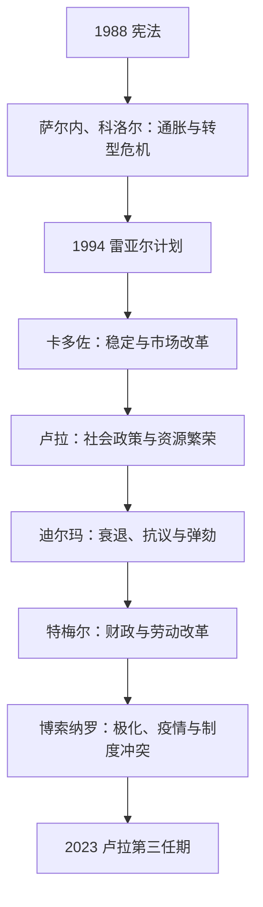

# 当代巴西

## 时间

1988年至今。

## 概括

1988年宪法后，巴西形成竞争性选举民主，并扩大社会权利、公共卫生和地方参与制度。民主制度同时面临经济周期、腐败调查、治安、种族与地区不平等、亚马孙环境、土地冲突和政治极化。巴西在南美、金砖国家、农业矿业能源市场和全球气候政治中具有重要影响。

## 统治结构

| 层级 | 角色 | 说明 |
|---|---|---|
| 总统 | 国家元首与政府首脑 | 联邦总统制，行政权强但需面对国会多党联盟。 |
| 国会 | 立法与预算 | 两院制和多党格局使联盟政治成为常态。 |
| 州与市政府 | 联邦成员与地方治理 | 财政、治安、教育和公共服务存在显著地区差异。 |
| 联邦最高法院等司法机构 | 宪法解释与权利保障 | 在弹劾、选举、反腐和权利争议中具有突出作用。 |

## 重要主题

- 1990年代稳定货币与市场改革改变通胀治理和社会政策空间。
- 2000年代资源出口与收入转移项目降低部分贫困，但经济结构仍依赖大宗商品和不平等土地关系。
- 大规模反腐调查、总统弹劾和选举竞争显示司法、媒体、国会与街头政治相互影响。
- 亚马孙毁林、矿业、农业扩张、水电和原住民领地是国内政策与国际气候议题的交汇处。
- 非洲后裔、原住民、妇女、LGBTQ+群体和城市边缘社区持续争取平等、安全与公共服务。
- 巴西与阿根廷、乌拉圭、巴拉圭在南方共同市场内的关系体现区域合作与贸易摩擦并存。

## 当代政治演进图

## 分阶段过程

| 阶段 | 主要过程 | 转折原因 |
|---|---|---|
| 1988—1994年 | 新宪法扩大权利；科洛尔冻结金融资产、开放市场，后因腐败危机辞职；伊塔马尔政府推出雷亚尔计划 | 民主制度确立但恶性通胀侵蚀合法性，稳定货币成为跨党派优先。 |
| 1995—2002年 | 卡多佐维持稳定、私有化、财政调整并扩大基础社会项目 | 外部金融危机和不平等限制成果，选民转向劳工党联盟。 |
| 2003—2010年 | 卢拉政府在商品繁荣、最低工资、家庭补助和信贷扩张下减贫，并以多党联盟执政 | 增长依赖外部需求，联盟政治也产生腐败和预算交易风险。 |
| 2011—2016年 | 迪尔玛第一任延续社会政策，2013年交通费抗议扩展为公共服务与代表危机；衰退、反腐调查和国会破裂后遭弹劾 | 结构性衰退、财政争议与政治联盟崩溃叠加；弹劾合法性至今有政治争论。 |
| 2016—2022年 | 特梅尔推动支出上限和劳动改革；博索纳罗以反建制、治安与保守议题上台，疫情治理、毁林和选举制度言论加深极化 | 反腐浪潮、社交媒体和旧党制失信重组右翼；疫情与经济冲击反向削弱政府。 |
| 2023—2026年 | 卢拉第三任恢复社会、环境与多边外交议程，在分裂国会、财政约束和保守州级力量中协商 | 2023年1月8日对国家机关的袭击使民主防卫和军警责任成为核心议题。 |

## 当代制度与实际权力

- 总统兼国家元首和政府首脑，但巴西“联盟总统制”要求行政与众参两院多党集团交换议程、职位和预算支持；国会并非被动机构。
- 联邦最高法院和选举法院在弹劾、反腐、虚假信息、原住民土地和政变调查中权力突出；这既提供宪法制衡，也引发司法政治化争论。
- 州长掌警察和重要公共服务，市政府负责基层卫生与教育；疫情和治安政策显示联邦主义可形成合作也可形成冲突。
- 农业、矿业、金融、福音派教会、工会、社会运动和军警群体通过不同渠道影响议程，实际政治不能只按总统个人解释。
- 截至2026年7月14日，路易斯·伊纳西奥·卢拉·达席尔瓦仍任总统。1985年以来所有总统、短期代行与未就职当选人见[巴西君主、摄政与总统表](/%E4%BA%BA%E6%96%87%E7%A7%91%E5%AD%A6/%E5%8E%86%E5%8F%B2/%E7%BE%8E%E6%B4%B2/%E5%8D%97%E7%BE%8E/%E5%B7%B4%E8%A5%BF/%E5%B7%B4%E8%A5%BF%E5%90%9B%E4%B8%BB%E3%80%81%E6%91%84%E6%94%BF%E4%B8%8E%E6%80%BB%E7%BB%9F%E8%A1%A8.md)。

## 主要长期矛盾

经济增长与再分配受生产率、债务和商品周期限制；亚马孙保护同时涉及全球气候、地方就业、非法采矿、农业扩张和原住民领地；警察暴力、监禁、种族与地区差距并不会因选举民主自动消失。民主危机的直接触发可能是弹劾、司法案件或街头动员，结构背景则是高度不平等和碎片化政党体系。

## 演变关系

- 前一节点：[军政府与民主化](/%E4%BA%BA%E6%96%87%E7%A7%91%E5%AD%A6/%E5%8E%86%E5%8F%B2/%E7%BE%8E%E6%B4%B2/%E5%8D%97%E7%BE%8E/%E5%B7%B4%E8%A5%BF/%E5%86%9B%E6%94%BF%E5%BA%9C%E4%B8%8E%E6%B0%91%E4%B8%BB%E5%8C%96.md)。
- 区域背景：[现代南美区域秩序](/%E4%BA%BA%E6%96%87%E7%A7%91%E5%AD%A6/%E5%8E%86%E5%8F%B2/%E7%BE%8E%E6%B4%B2/%E5%8D%97%E7%BE%8E/%E7%8E%B0%E4%BB%A3%E5%8D%97%E7%BE%8E%E5%8C%BA%E5%9F%9F%E7%A7%A9%E5%BA%8F.md)。
- 所属总览：[巴西历史](/%E4%BA%BA%E6%96%87%E7%A7%91%E5%AD%A6/%E5%8E%86%E5%8F%B2/%E7%BE%8E%E6%B4%B2/%E5%8D%97%E7%BE%8E/%E5%B7%B4%E8%A5%BF/README.md)。
