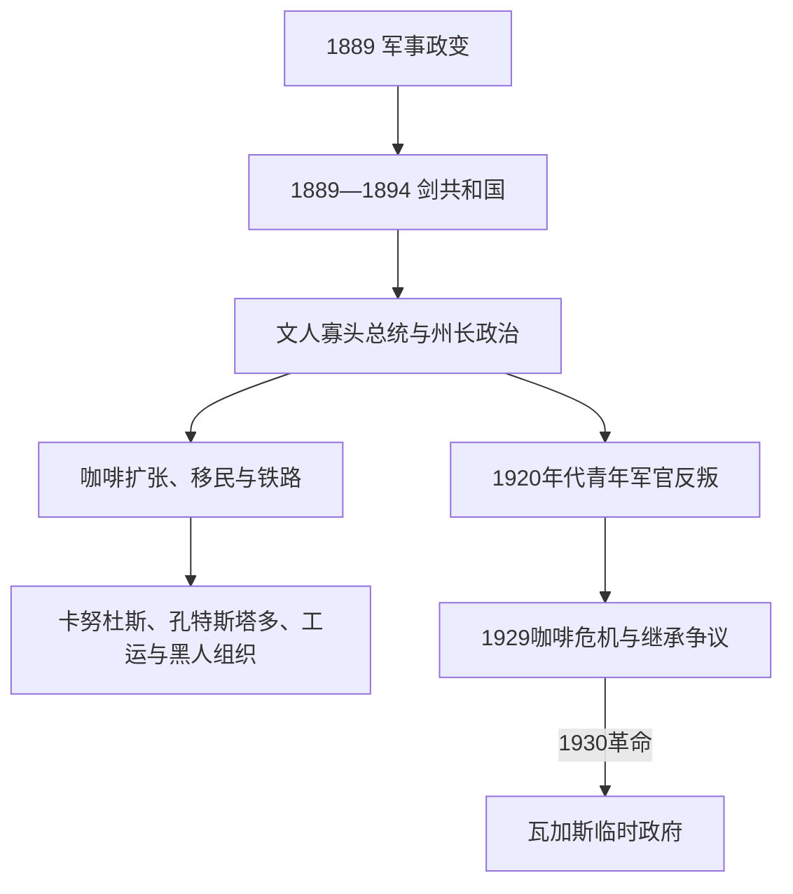

# 旧共和国

## 时间

1889-1930年。

## 概括

1889年后巴西成为联邦共和国，但旧共和国的权力主要由地区寡头、咖啡出口利益、地方政治机器和军队共同塑造。工业化、城市劳工、移民、农村贫困和地区不平等加剧，选举并未普遍自由平等。1929年世界经济危机冲击咖啡经济，1930年革命使瓦加斯上台，终结旧共和国政治均衡。

## 统治结构

| 力量 | 角色 | 说明 |
|---|---|---|
| 总统与联邦政府 | 宪法上的行政核心 | 联邦制给予各州较大权力，中央统合能力有限。 |
| 圣保罗、米纳斯吉拉斯精英 | 地区寡头 | “咖啡加牛奶政治”概括两州在总统政治中的轮替影响，但不应视为毫无例外的固定规则。 |
| 地方领袖 | 选举与土地控制 | “科罗内利斯莫”以土地、依附和地方机器影响投票。 |
| 军队与城市中产 | 政治挑战者 | 青年军官运动、工人组织和城市改革力量质疑寡头政治。 |

## 重要事件

- 1891年宪法确立联邦共和国和总统制。
- 咖啡出口推动铁路、港口和城市发展，却使经济高度依赖国际价格。
- 欧洲、日本等地移民进入东南和南部，与城市劳工和农村社会变化相连。
- 1896-1897年卡努杜斯战争显示国家对边缘农村社群的暴力镇压。
- 1917年大罢工等劳动运动反映工业化下的工资和生活条件问题。
- 1920年代青年军官运动批评腐败、选举操控和地方寡头。
- 1929年危机后咖啡价格暴跌，1930年瓦加斯领导的政治军事联盟夺取政权。

## 政权演进图

## 共和国的建立与分阶段发展

- **剑共和国（1889—1894）**：德奥多罗以军人政变推翻君主制，1891年宪法采用联邦、总统和政教分离。德奥多罗企图解散国会失败后辞职；副总统弗洛里亚诺面对舰队叛乱和南部联邦主义者战争，以强力镇压巩固共和国。
- **寡头协调（1894—1910）**：普鲁登特·德·莫赖斯开启文人总统，坎普斯·萨莱斯以“州长政治”交换中央承认和地方选票。公开投票、识字门槛、地方武装与科罗内尔 patronage 排斥多数人口；“咖啡加牛奶”说明圣保罗、米纳斯的重要性，但并非机械轮流规则。
- **出口繁荣与社会冲突**：咖啡稳定政策、铁路和移民推动圣保罗工业与城市化。卡努杜斯（1896—1897）和孔特斯塔多战争（1912—1916）显示共和国把边缘宗教农村社群视作安全威胁；1910年鞭笞起义揭露海军种族化体罚，1917年大罢工显示劳工组织扩张。
- **体制失稳（1910—1930）**：城市中产、工人、黑人社团、女性组织和青年军官质疑被封闭的选举秩序。1922年科帕卡巴纳堡起义、1924年圣保罗起义和普列斯特斯纵队未直接夺权，却形成反寡头军政网络。
- **直接终结**：1929年崩盘使咖啡价格和州财政恶化。华盛顿·路易斯打破地区继承妥协支持圣保罗人茹利奥·普列斯特斯，米纳斯、南里奥格兰德和帕拉伊巴组成自由联盟。瓦加斯败选后，帕拉伊巴副总统候选人若昂·佩索阿遇刺被政治化；1930年10月军政起义推翻总统，军方委员会把权力交给瓦加斯。

## 兴衰分析

旧共和国的稳定来自联邦自治、出口收入和地方机器，衰落则源于经济过度依赖咖啡、社会参与扩张而制度入口狭窄、军队内部代际冲突；1929年危机与1930年继承争议是直接触发而非唯一原因。完整总统、代行者、1930年军政府及未就职当选人见[巴西君主、摄政与总统表](/%E4%BA%BA%E6%96%87%E7%A7%91%E5%AD%A6/%E5%8E%86%E5%8F%B2/%E7%BE%8E%E6%B4%B2/%E5%8D%97%E7%BE%8E/%E5%B7%B4%E8%A5%BF/%E5%B7%B4%E8%A5%BF%E5%90%9B%E4%B8%BB%E3%80%81%E6%91%84%E6%94%BF%E4%B8%8E%E6%80%BB%E7%BB%9F%E8%A1%A8.md)。

## 演变关系

- 前一节点：[王室迁都、独立与巴西帝国](/%E4%BA%BA%E6%96%87%E7%A7%91%E5%AD%A6/%E5%8E%86%E5%8F%B2/%E7%BE%8E%E6%B4%B2/%E5%8D%97%E7%BE%8E/%E5%B7%B4%E8%A5%BF/%E7%8E%8B%E5%AE%A4%E8%BF%81%E9%83%BD%E3%80%81%E7%8B%AC%E7%AB%8B%E4%B8%8E%E5%B7%B4%E8%A5%BF%E5%B8%9D%E5%9B%BD.md)。
- 后一节点：[瓦加斯与战后民众政治](/%E4%BA%BA%E6%96%87%E7%A7%91%E5%AD%A6/%E5%8E%86%E5%8F%B2/%E7%BE%8E%E6%B4%B2/%E5%8D%97%E7%BE%8E/%E5%B7%B4%E8%A5%BF/%E7%93%A6%E5%8A%A0%E6%96%AF%E4%B8%8E%E6%88%98%E5%90%8E%E6%B0%91%E4%BC%97%E6%94%BF%E6%B2%BB.md)。
- 所属总览：[巴西历史](/%E4%BA%BA%E6%96%87%E7%A7%91%E5%AD%A6/%E5%8E%86%E5%8F%B2/%E7%BE%8E%E6%B4%B2/%E5%8D%97%E7%BE%8E/%E5%B7%B4%E8%A5%BF/README.md)。
