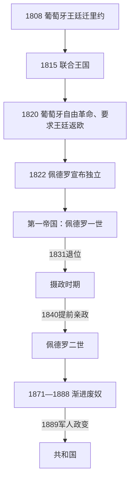

# 王室迁都、独立与巴西帝国

## 时间

1808-1889年。

## 概括

1808年葡萄牙王室迁至里约热内卢，巴西从殖民地转为葡萄牙帝国的政治中心。1822年佩德罗宣布独立，巴西建立立宪帝国而非共和国。帝国以中央集权、咖啡出口和奴隶制维持统一，却也经历省份叛乱、摄政危机、巴拉圭战争、废奴运动和军队、教会、精英关系恶化，最终在1889年政变中终结。

## 皇帝世系与统治结构

| 顺序 / 阶段 | 时间 | 国家元首 / 实际结构 | 说明 |
|---|---|---|---|
| **佩德罗一世** | 1822-1831年 | 巴西皇帝 | 独立、1824年宪法与第一帝国；后退位。 |
| 摄政时期 | 1831-1840年 | 摄政机构 | 皇帝未成年，各省叛乱与中央—地方矛盾突出。 |
| **佩德罗二世** | 1840-1889年 | 巴西皇帝 | 长期统治，咖啡经济、巴拉圭战争、废奴与帝国危机并行。 |
| 内阁与议会 | 帝国时期 | 政府首脑与立法机构 | 立宪体制下皇帝拥有“调节权”，实际政治受皇室、精英和政党网络影响。 |

## 重要事件

- 1808年王室开放港口、建立行政和文化机构；1815年巴西升格为“葡萄牙、巴西和阿尔加维联合王国”的组成部分。
- 1822年9月巴西宣布独立，1824年颁布宪法，确立世袭君主制与天主教国教地位。
- 摄政时期出现卡巴纳任、法鲁皮利亚等多场省份叛乱，说明领土统一并非自然结果。
- 1840年佩德罗二世提前亲政，中央政府逐步恢复稳定。
- 咖啡出口成为主要经济支柱，奴隶劳动仍是庄园经济核心。
- 1864-1870年巴拉圭战争中，巴西与阿根廷、乌拉圭联盟作战，军队政治影响上升。
- 1871年《自由胎儿法》、1885年《六旬法》和1888年《黄金法》逐步至最终废除奴隶制；废奴没有同时解决土地、就业与种族不平等。
- 1889年军人发动政变推翻帝国，建立共和国。

## 政权演进图

## 分阶段发展与重要转折

1. **王廷国家（1808—1821）**：若昂摄政王开放港口、取消殖民制造限制，建立巴西银行、最高法院、王家图书馆和军政部。1815年巴西升为联合王国组成部分，里约由殖民首府变成跨大西洋君主国中心；行政增长也加重税负和地区不满，1817年伯南布哥革命即遭镇压。
2. **独立与第一帝国（1821—1831）**：葡萄牙自由革命要求王廷返里斯本并恢复对巴西省份控制。佩德罗留任摄政，1822年9月宣布独立；巴伊亚、马拉尼昂、帕拉和顺铂省仍经战斗或谈判才纳入。1824年佩德罗解散制宪会议并颁布宪法，以“调节权”强化皇帝；赤道邦联、顺铂战争和葡萄牙王位问题削弱支持，1831年退位。
3. **摄政危机（1831—1840）**：未成年佩德罗二世名义在位，三人、后单人摄政管理国家。1834年附加法扩大省自治，却未终止卡巴纳任、巴拉伊亚达、萨比纳达和法鲁皮利亚等叛乱；保守派以秩序为名推动中央回收权力，1840年自由派支持皇帝提前亲政。
4. **第二帝国巩固（1840—1870）**：中央以省长任命、国民卫队、议会两党轮替和咖啡关税维持领土。1850年终止跨大西洋奴隶贸易后，国内奴隶买卖和欧洲移民扩大。巴拉圭战争动员大规模军队，胜利提高军官集团组织性，也暴露财政与奴隶制矛盾。
5. **废奴与帝国终结（1871—1889）**：自由胎儿法、六旬法和逃奴网络逐步侵蚀奴隶制，1888年《黄金法》无赔偿废奴。帝国失去部分奴隶主支持；军队对文官控制不满，教会冲突和共和主义扩张，皇室又缺乏被精英接受的未来继承安排。1889年德奥多罗等军官发动政变，皇室未组织持续抵抗。

## 兴衰原因分层

| 层次 | 帝国稳定条件 | 帝国衰落因素 |
|---|---|---|
| 结构 | 君主连续性、咖啡税收、中央任命与地方精英妥协 | 土地和奴隶制不平等、地区差距、政党代表狭窄 |
| 外部与战争 | 英国承认、对外贸易、巴拉圭战争胜利 | 英国反奴隶贸易压力、战争债务和军队政治化 |
| 直接触发 | 佩德罗二世长期个人威望 | 1888废奴联盟重组、军方不满、1889年政变 |

两位皇帝、全部摄政成员和1889年后所有总统见[巴西君主、摄政与总统表](/%E4%BA%BA%E6%96%87%E7%A7%91%E5%AD%A6/%E5%8E%86%E5%8F%B2/%E7%BE%8E%E6%B4%B2/%E5%8D%97%E7%BE%8E/%E5%B7%B4%E8%A5%BF/%E5%B7%B4%E8%A5%BF%E5%90%9B%E4%B8%BB%E3%80%81%E6%91%84%E6%94%BF%E4%B8%8E%E6%80%BB%E7%BB%9F%E8%A1%A8.md)。

## 演变关系

- 前一节点：[原住民与葡属巴西](/%E4%BA%BA%E6%96%87%E7%A7%91%E5%AD%A6/%E5%8E%86%E5%8F%B2/%E7%BE%8E%E6%B4%B2/%E5%8D%97%E7%BE%8E/%E5%B7%B4%E8%A5%BF/%E5%8E%9F%E4%BD%8F%E6%B0%91%E4%B8%8E%E8%91%A1%E5%B1%9E%E5%B7%B4%E8%A5%BF.md)。
- 后一节点：[旧共和国](/%E4%BA%BA%E6%96%87%E7%A7%91%E5%AD%A6/%E5%8E%86%E5%8F%B2/%E7%BE%8E%E6%B4%B2/%E5%8D%97%E7%BE%8E/%E5%B7%B4%E8%A5%BF/%E6%97%A7%E5%85%B1%E5%92%8C%E5%9B%BD.md)。
- 区域战争背景：[拉普拉塔、巴拉圭与乌拉圭](/%E4%BA%BA%E6%96%87%E7%A7%91%E5%AD%A6/%E5%8E%86%E5%8F%B2/%E7%BE%8E%E6%B4%B2/%E5%8D%97%E7%BE%8E/%E6%8B%89%E6%99%AE%E6%8B%89%E5%A1%94%E3%80%81%E5%B7%B4%E6%8B%89%E5%9C%AD%E4%B8%8E%E4%B9%8C%E6%8B%89%E5%9C%AD.md)。
- 所属总览：[巴西历史](/%E4%BA%BA%E6%96%87%E7%A7%91%E5%AD%A6/%E5%8E%86%E5%8F%B2/%E7%BE%8E%E6%B4%B2/%E5%8D%97%E7%BE%8E/%E5%B7%B4%E8%A5%BF/README.md)。
