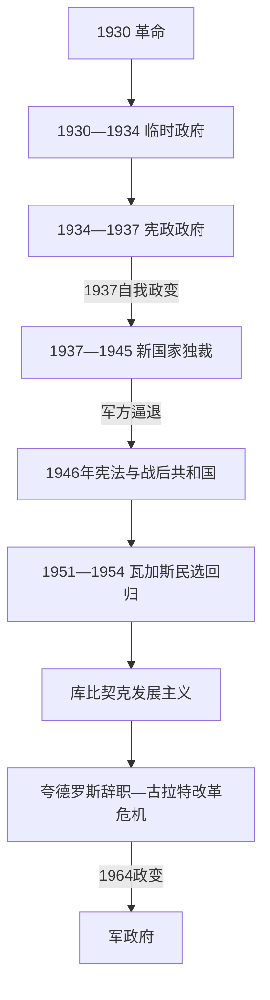

# 瓦加斯与战后民众政治

## 时间

1930-1964年。

## 概括

1930年后，热图利奥·瓦加斯以革命政府、宪政政府和“新国家”独裁三种形态重组巴西政治。国家推动工业化、劳动立法和中央集权，也限制政党与言论自由。1945年瓦加斯下台后，巴西恢复选举政治；其1951年经选举回归、1954年自杀，以及继任政府的经济危机与改革冲突，显示民众政治、军队和精英之间的不稳定平衡。1964年政变终结这一阶段。

## 主要政治阶段

| 阶段 | 时间 | 统治结构与特征 |
|---|---|---|
| 临时政府 | 1930-1934年 | 瓦加斯集中权力，削弱旧寡头联盟。 |
| 宪政政府 | 1934-1937年 | 新宪法与有限竞选政治并存。 |
| “新国家” | 1937-1945年 | 威权统治、审查、国家主导工业化和劳动制度。 |
| 战后共和国 | 1945-1964年 | 多党选举、发展主义、劳工政治与军政危机。 |

## 重要事件

- 国家钢铁、石油和基础设施项目加强了工业化与国家经济角色。
- 劳动法典提供工人保护与国家调解机制，但工会受到国家控制。
- 二战中巴西加入同盟国，派遣远征军赴意大利作战；这加剧国内对民主化的要求。
- 1945年瓦加斯被迫下台；1951年以民选总统身份回归。
- 1954年瓦加斯在政治危机中自杀，成为巴西民众政治的重大象征。
- 库比契克时期提出快速工业化和新首都巴西利亚建设；经济增长也带来通胀和债务。
- 若昂·古拉特的改革计划引发土地、劳工、军队、企业和冷战政治冲突，1964年军方发动政变。

## 政权演进图

## 建立、转型与崩溃过程

- **1930年联盟夺权**：瓦加斯联合受挫州精英、青年军官和城市改革派推翻旧共和国；联盟共同反对圣保罗寡头，却对联邦、劳工和民主目标并不一致。临时政府任命州干预官、关闭旧议会并建立劳动与教育部门。
- **制宪与激化（1932—1937）**：圣保罗1932年制宪革命虽战败却迫使中央举行制宪。1934年宪法引入社会权利和间接选举；共产主义民族解放联盟1935年起义及镇压、右翼整体主义扩张，为行政紧急权提供借口。
- **“新国家”独裁（1937—1945）**：政府以伪造的“科恩计划”宣称共产威胁，瓦加斯解散国会、取消政党、实行审查和政治警察。国家建立钢铁公司、工业委员会和1943年劳动法典；工人获得法定权利，同时工会被纳入国家许可与控制。
- **下台原因**：巴西参加同盟国并向欧洲派兵，使“对外反法西斯、对内独裁”的矛盾突出；军方担心瓦加斯以群众动员延续个人权力。1945年军方逼其下台，但瓦加斯主义政党和劳动制度保留下来。
- **战后共和国（1946—1961）**：杜特拉政府颁布1946年宪法；瓦加斯1951年经普选回归，以石油国家主义和工资政策获得工人支持，却遭反对派、军方与媒体围攻，1954年自杀暂时阻断政变。库比契克以汽车业、公路和巴西利亚推动发展主义，也增加通胀和外债。
- **继承危机与1964年政变**：夸德罗斯1961年辞职，军方反对副总统古拉特继任，议会制妥协后才就职；1963年公投恢复总统制。古拉特“基础改革”、工会与农民动员、保守群众运动、通胀、军纪危机和美国支持的反共环境叠加，1964年军方推翻政府。

## 权力与兴衰辨析

瓦加斯并非在1930—1964年连续执政：1930—1945年是革命—独裁连续统治，1951—1954年是民选任期；1946—1951及1954年后由其他总统执政。阶段稳定依赖工业化联盟、国家劳动调解和军队支持，崩溃常发生在总统动员群众而军方、国会和州精英拒绝妥协之时。完整总统与代行序列见[巴西君主、摄政与总统表](/%E4%BA%BA%E6%96%87%E7%A7%91%E5%AD%A6/%E5%8E%86%E5%8F%B2/%E7%BE%8E%E6%B4%B2/%E5%8D%97%E7%BE%8E/%E5%B7%B4%E8%A5%BF/%E5%B7%B4%E8%A5%BF%E5%90%9B%E4%B8%BB%E3%80%81%E6%91%84%E6%94%BF%E4%B8%8E%E6%80%BB%E7%BB%9F%E8%A1%A8.md)。

## 演变关系

- 前一节点：[旧共和国](/%E4%BA%BA%E6%96%87%E7%A7%91%E5%AD%A6/%E5%8E%86%E5%8F%B2/%E7%BE%8E%E6%B4%B2/%E5%8D%97%E7%BE%8E/%E5%B7%B4%E8%A5%BF/%E6%97%A7%E5%85%B1%E5%92%8C%E5%9B%BD.md)。
- 后一节点：[军政府与民主化](/%E4%BA%BA%E6%96%87%E7%A7%91%E5%AD%A6/%E5%8E%86%E5%8F%B2/%E7%BE%8E%E6%B4%B2/%E5%8D%97%E7%BE%8E/%E5%B7%B4%E8%A5%BF/%E5%86%9B%E6%94%BF%E5%BA%9C%E4%B8%8E%E6%B0%91%E4%B8%BB%E5%8C%96.md)。
- 所属总览：[巴西历史](/%E4%BA%BA%E6%96%87%E7%A7%91%E5%AD%A6/%E5%8E%86%E5%8F%B2/%E7%BE%8E%E6%B4%B2/%E5%8D%97%E7%BE%8E/%E5%B7%B4%E8%A5%BF/README.md)。
