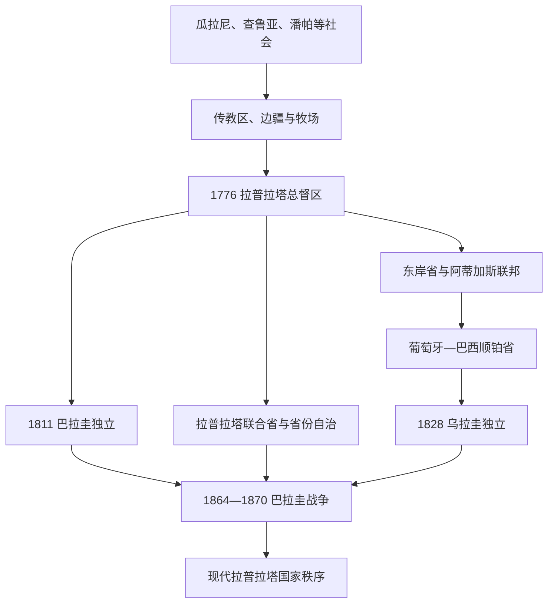

# 拉普拉塔、巴拉圭与乌拉圭

## 时间

16世纪至今；19世纪国家形成和地区战争为主线。

## 概括

拉普拉塔河流域连接今日阿根廷、乌拉圭、巴拉圭、玻利维亚部分地区和巴西南部。布宜诺斯艾利斯的港口经济、内陆省份的自治、瓜拉尼语社会、巴西与西班牙帝国竞争及大西洋贸易共同塑造该地区。乌拉圭成为巴西与阿根廷之间的缓冲国家；巴拉圭在19世纪的国家建设和巴拉圭战争中遭受巨大破坏。

## 主要政治节点

| 时间 | 事件 | 影响 |
|---|---|---|
| 1776年 | 拉普拉塔总督区设立 | 布宜诺斯艾利斯成为行政与贸易中心。 |
| 1810年 | 五月革命 | 拉普拉塔联合省革命开始。 |
| 1811年 | 巴拉圭脱离西班牙控制 | 形成相对独立的国家政治路径。 |
| 1825-1828年 | 东岸地区战争与乌拉圭独立 | 英国调停后，乌拉圭作为独立国家出现。 |
| 1830-1860年代 | 阿根廷联邦与统一冲突 | 布宜诺斯艾利斯和各省围绕关税、联邦和代表权争夺。 |
| 1864-1870年 | 巴拉圭战争 | 巴拉圭对巴西、阿根廷、乌拉圭联盟作战，人口和社会遭受灾难。 |

## 说明

- 巴拉圭的瓜拉尼语在国家社会中具有异常强的延续性，不能把它只当作西班牙殖民的边缘地区。
- 乌拉圭的形成与地区力量均衡、港口贸易、边界牧场经济和外部调停有关。
- 阿根廷的国家整合、农业出口和移民社会影响整个拉普拉塔地区，详见[阿根廷历史](/%E4%BA%BA%E6%96%87%E7%A7%91%E5%AD%A6/%E5%8E%86%E5%8F%B2/%E7%BE%8E%E6%B4%B2/%E5%8D%97%E7%BE%8E/%E9%98%BF%E6%A0%B9%E5%BB%B7/README.md)。
- 19世纪战争、土地集中和出口经济改变了原住民、农村居民和边界社会的生活，现代国界并未抹去跨河流域的社会联系。

## 演进图

## 国家形成与战争过程

- **巴拉圭独立**：布宜诺斯艾利斯远征军1811年未能迫使巴拉圭接受其领导，本地军官随即推翻西班牙总督。弗朗西亚通过孤立贸易、打击旧精英和集中土地建立强中央；卡洛斯·安东尼奥·洛佩斯再开放贸易、建设军队和基础设施，其子索拉诺·洛佩斯继承了高度军事化但外交空间狭窄的国家。
- **乌拉圭形成**：阿蒂加斯以省份联邦和土地改革挑战布宜诺斯艾利斯中央主义；葡萄牙1816年入侵，东岸成为顺铂省。1825年“三十三东方人”起义引发巴西—阿根廷战争，双方均难取胜，英国调停的1828年和约把乌拉圭塑为独立缓冲国。
- **乌拉圭内战**：里韦拉红党与奥里韦白党围绕港口、农村、阿根廷和巴西联盟对抗；1839—1851年“大战争”中，蒙得维的亚防卫政府与内地塞里托政府并立。外部干预与罗萨斯败亡结束战争，却留下党派军事网络。
- **巴拉圭战争进程**：乌拉圭内战、巴西干预、阿根廷河运政策和索拉诺·洛佩斯的战略误判相互作用。1864年巴拉圭扣押巴西船只并入侵马托格罗索，后穿越阿根廷进攻；巴西、阿根廷和乌拉圭组成三国同盟。1866年图尤蒂、库鲁派蒂等战役造成巨大伤亡，盟军突破乌迈塔后占领亚松森；洛佩斯坚持至1870年战死。
- **战争后果**：巴拉圭人口、生产和国家机构遭灾难性破坏，领土和财政受损；巴西军队和废奴压力上升，阿根廷中央国家加强，乌拉圭红党政权获巩固。人口损失具体比例因统计基础不足存在争议，不宜使用极端单一数字。
- **20世纪路径**：巴拉圭查科战争后军人政治扩大，斯特罗斯纳1954—1989年建立红党—军队独裁；乌拉圭先发展巴特列主义福利国家，1973—1985年经历军民独裁，后恢复稳定选举。

巴拉圭、乌拉圭全部集体政府、并立政权、军人和文人民选元首见[拉普拉塔共和国国家元首表](/%E4%BA%BA%E6%96%87%E7%A7%91%E5%AD%A6/%E5%8E%86%E5%8F%B2/%E7%BE%8E%E6%B4%B2/%E5%8D%97%E7%BE%8E/%E6%8B%89%E6%99%AE%E6%8B%89%E5%A1%94%E5%85%B1%E5%92%8C%E5%9B%BD%E5%9B%BD%E5%AE%B6%E5%85%83%E9%A6%96%E8%A1%A8.md)；阿根廷见[阿根廷国家元首表](/%E4%BA%BA%E6%96%87%E7%A7%91%E5%AD%A6/%E5%8E%86%E5%8F%B2/%E7%BE%8E%E6%B4%B2/%E5%8D%97%E7%BE%8E/%E9%98%BF%E6%A0%B9%E5%BB%B7/%E9%98%BF%E6%A0%B9%E5%BB%B7%E5%9B%BD%E5%AE%B6%E5%85%83%E9%A6%96%E8%A1%A8.md)。

## 演变关系

- 殖民背景：[西属南美与葡属巴西](/%E4%BA%BA%E6%96%87%E7%A7%91%E5%AD%A6/%E5%8E%86%E5%8F%B2/%E7%BE%8E%E6%B4%B2/%E5%8D%97%E7%BE%8E/%E8%A5%BF%E5%B1%9E%E5%8D%97%E7%BE%8E%E4%B8%8E%E8%91%A1%E5%B1%9E%E5%B7%B4%E8%A5%BF.md)。
- 独立背景：[南美独立与国家形成](/%E4%BA%BA%E6%96%87%E7%A7%91%E5%AD%A6/%E5%8E%86%E5%8F%B2/%E7%BE%8E%E6%B4%B2/%E5%8D%97%E7%BE%8E/%E5%8D%97%E7%BE%8E%E7%8B%AC%E7%AB%8B%E4%B8%8E%E5%9B%BD%E5%AE%B6%E5%BD%A2%E6%88%90.md)。
- 巴西区域关系：[巴西历史](/%E4%BA%BA%E6%96%87%E7%A7%91%E5%AD%A6/%E5%8E%86%E5%8F%B2/%E7%BE%8E%E6%B4%B2/%E5%8D%97%E7%BE%8E/%E5%B7%B4%E8%A5%BF/README.md)。
- 所属总览：[南美历史](/%E4%BA%BA%E6%96%87%E7%A7%91%E5%AD%A6/%E5%8E%86%E5%8F%B2/%E7%BE%8E%E6%B4%B2/%E5%8D%97%E7%BE%8E/README.md)。
