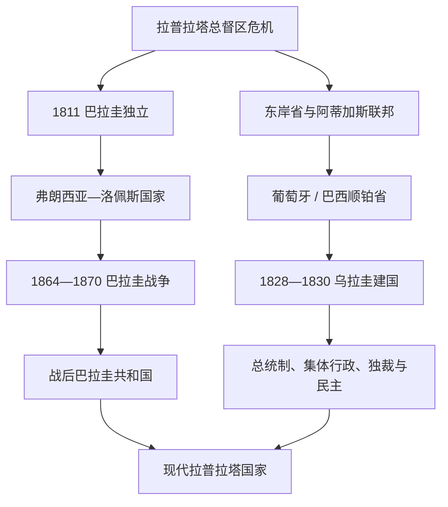

# 拉普拉塔共和国国家元首表

## 范围与口径

本表列出巴拉圭和乌拉圭从独立革命、临时集体政府、考迪罗统治到现代总统制的完整国家元首序列。巴拉圭战争期间的并立政府、乌拉圭“大围城”两政府、1952—1967年的九人国家政府委员会，以及军民独裁时期的名义与实际权力均单列。现代信息核验截至2026年7月14日。

## 政权演进图

## 巴拉圭国家元首完整表

| 国家元首 / 集体机构 | 在位 | 地位 / 取得权力方式 | 关键事件与备注 |
|---|---|---|---|
| 1811年高级执政委员会 | 1811—1813 | 富尔亨西奥·耶格罗斯、佩德罗·胡安·卡瓦列罗、何塞·加斯帕尔·罗德里格斯·德·弗朗西亚、弗朗西斯科·哈维尔·博加林、费尔南多·德拉莫拉 | 独立后的集体行政；成员先后被排除。 |
| 共和国执政官 | 1813—1814 | 富尔亨西奥·耶格罗斯、何塞·加斯帕尔·罗德里格斯·德·弗朗西亚 | 仿罗马双执政官，四个月轮换。 |
| **何塞·加斯帕尔·罗德里格斯·德·弗朗西亚** | 1814—1840 | 先任临时、后终身独裁者 | 孤立主义、中央控制和削弱殖民精英；任内去世。 |
| 曼努埃尔·安东尼奥·奥尔蒂斯临时委员会 | 1840年9月20日—1841年1月22日 | 曼努埃尔·安东尼奥·奥尔蒂斯任主席，成员为阿古斯丁·卡涅特、巴勃罗·佩雷拉、米格尔·马尔多纳多、加维诺·阿罗约 | 弗朗西亚死后由市政与军营首脑组成；因迟迟不召集全国大会而被军人推翻。 |
| 胡安·何塞·梅迪纳三人团 | 1841年1月22日—2月9日 | 胡安·何塞·梅迪纳、何塞·加夫列尔·贝尼特斯、何塞·多明戈·坎波斯 | 承诺召集大会却在不足一月内再次被军营首脑推翻。 |
| 马里亚诺·罗克·阿隆索 | 1841年2月9日—3月14日 | 武装部队总司令，卡洛斯·安东尼奥·洛佩斯任秘书 | 召集全国大会并转入双执政官制度。 |
| 共和国执政官 | 1841—1844 | 马里亚诺·罗克·阿隆索、卡洛斯·安东尼奥·洛佩斯 | 双执政过渡。 |
| **卡洛斯·安东尼奥·洛佩斯** | 1844—1862 | 国会选出总统；多次续任 | 国家建设、对外开放和军队扩张。 |
| 弗朗西斯科·索拉诺·洛佩斯 | 1862—1870 | 副总统 / 国会承认；战死 | 巴拉圭战争导致政权和社会灾难。 |
| 临时三人政府 | 1869—1870 | 西里洛·安东尼奥·里瓦罗拉、卡洛斯·洛伊萨加、何塞·迪亚斯·德·贝多亚 | 盟军占领下成立，与索拉诺·洛佩斯政权并存至1870年。 |
| 法昆多·马查因 | 1870年8月31日 | 国会选出；同日被推翻 | 仅数小时。 |
| 西里洛·安东尼奥·里瓦罗拉 | 1870—1871 | 临时政府成员后宪制总统；辞职 | 战后国家重建。 |
| 萨尔瓦多·霍韦利亚诺斯 | 1871—1874 | 副总统继任 | 战后占领与债务。 |
| 胡安·包蒂斯塔·吉尔 | 1874—1877 | 选举；遇刺 | 党派形成期。 |
| 伊希尼奥·乌里亚特 | 1877—1878 | 副总统继任 | 完成余任。 |
| 坎迪多·巴雷罗 | 1878—1880 | 选举；任内去世 | 军人精英影响。 |
| 贝纳迪诺·卡瓦列罗 | 1880—1886 | 临时后选举 | 红党建立与土地私有化。 |
| 帕特里西奥·埃斯科瓦尔 | 1886—1890 | 选举 | 红党寡头秩序。 |
| 胡安·瓜尔韦托·冈萨雷斯 | 1890—1894 | 选举；政变罢黜 | 党内冲突。 |
| 马科斯·莫里尼戈 | 1894年6—11月 | 副总统继任 | 主持选举。 |
| 胡安·包蒂斯塔·埃古斯基萨 | 1894—1898 | 选举 | 党派调和。 |
| 埃米利奥·阿塞瓦尔 | 1898—1902 | 选举；政变罢黜 | 财政和党争。 |
| 安德烈斯·埃克托尔·卡瓦略 | 1902年1—11月 | 副总统继任 | 过渡。 |
| 胡安·安东尼奥·埃斯库拉 | 1902—1904 | 选举；自由革命推翻 | 红党长期统治终结。 |
| 胡安·包蒂斯塔·高纳 | 1904—1905 | 革命后临时总统；辞职 | 自由党掌权。 |
| 塞西利奥·巴埃斯 | 1905—1906 | 临时总统 | 文人自由派过渡。 |
| 贝尼格诺·费雷拉 | 1906—1908 | 选举；政变推翻 | 军政冲突。 |
| 埃米利亚诺·冈萨雷斯·纳韦罗 | 1908—1910 | 副总统继任 | 完成任期。 |
| 曼努埃尔·贡德拉 | 1910—1911 | 选举；政变中辞职 | 自由党派系冲突。 |
| 阿尔维诺·哈拉 | 1911年1—7月 | 军事夺权；被推翻 | 短暂军人统治。 |
| 利韦拉托·马西亚尔·罗哈斯 | 1911—1912 | 国会 / 军方妥协；辞职 | 内战。 |
| 佩德罗·佩尼亚 | 1912年2—3月 | 临时总统 | 短暂过渡。 |
| 埃米利亚诺·冈萨雷斯·纳韦罗 | 1912年3—8月 | 临时总统 | 主持选举。 |
| 爱德华多·沙雷尔 | 1912—1916 | 选举 | 恢复相对制度稳定。 |
| 曼努埃尔·佛朗哥 | 1916—1919 | 选举；任内去世 | 教育和文官政治。 |
| 何塞·佩德罗·蒙特罗 | 1919—1920 | 副总统继任 | 完成任期。 |
| 曼努埃尔·贡德拉 | 1920—1921 | 选举；内战前辞职 | 党派分裂。 |
| 费利克斯·派瓦 | 1921年10—11月 | 副总统代行 | 一个月过渡。 |
| 欧塞维奥·阿亚拉 | 1921—1923 | 国会指定临时总统 | 内战后稳定。 |
| 埃利希奥·阿亚拉 | 1923—1924 | 临时总统；为参选辞职 | 财政改革。 |
| 路易斯·阿尔韦托·里亚特 | 1924年3—8月 | 副总统代行 | 主持选举。 |
| 埃利希奥·阿亚拉 | 1924—1928 | 选举 | 文人制度与查科备战。 |
| 何塞·帕特里西奥·古吉亚里 | 1928—1932 | 选举 | 1931年暂退接受弹劾审判，埃米利亚诺·冈萨雷斯·纳韦罗代行后复职。 |
| 欧塞维奥·阿亚拉 | 1932—1936 | 选举；政变推翻 | 查科战争胜利但军人和退伍军人政治兴起。 |
| 拉斐尔·佛朗哥 | 1936—1937 | 二月革命夺权；被推翻 | 民族主义与社会改革。 |
| 费利克斯·派瓦 | 1937—1939 | 临时后宪制总统 | 签订查科和平条约。 |
| 何塞·费利克斯·埃斯蒂加里维亚 | 1939—1940 | 选举；任内空难去世 | 1940年威权宪法。 |
| 伊希尼奥·莫里尼戈 | 1940—1948 | 部长继任后独裁；军政压力下辞职 | 二战、党禁与1947年内战。 |
| 胡安·曼努埃尔·弗鲁托斯 | 1948年6—8月 | 最高法院院长临时总统 | 主持就任。 |
| 胡安·纳塔利西奥·冈萨雷斯 | 1948—1949 | 选举；军事压力下辞职 | 红党派系斗争。 |
| 雷蒙多·罗隆 | 1949年1—2月 | 军事夺权；迅速被推翻 | 仅数周。 |
| 费利佩·莫拉斯·洛佩斯 | 1949年2—9月 | 临时后国会确认；辞职 | 党内更替。 |
| 费德里科·查韦斯 | 1949—1954 | 临时后选举；政变推翻 | 红党与军方联盟破裂。 |
| 托马斯·罗梅罗·佩雷拉 | 1954年5—8月 | 临时总统 | 为斯特罗斯纳参选过渡。 |
| **阿尔弗雷多·斯特罗斯纳** | 1954—1989 | 军事政变后长期选举式独裁；政变推翻 | 红党—军队—国家机器结合、经济建设与系统镇压。 |
| 安德烈斯·罗德里格斯 | 1989—1993 | 军事政变后选举 | 民主开放、1992年宪法。 |
| 胡安·卡洛斯·瓦斯莫西 | 1993—1998 | 选举 | 首位长期连续文人总统，仍受军方挑战。 |
| 劳尔·库瓦斯·格劳 | 1998—1999 | 选举；政治危机中辞职 | 副总统遇刺和“巴拉圭三月”。 |
| 路易斯·安赫尔·冈萨雷斯·马基 | 1999—2003 | 参议院主席依继承就任 | 合法性与经济危机。 |
| 尼卡诺尔·杜阿尔特·弗鲁托斯 | 2003—2008 | 选举 | 财政稳定和红党调整。 |
| 费尔南多·卢戈 | 2008—2012 | 选举；快速弹劾罢免 | 终结红党61年连续执政，土地冲突导致危机。 |
| 费德里科·佛朗哥 | 2012—2013 | 副总统继任 | 卢戈罢免后的过渡。 |
| 奥拉西奥·卡特斯 | 2013—2018 | 选举 | 商业保守主义与连任争议。 |
| 马里奥·阿夫多·贝尼特斯 | 2018—2023 | 选举 | 疫情、反腐与红党派系竞争。 |
| **圣地亚哥·培尼亚** | 2023年至今 | 选举 | 截至2026年7月14日仍任总统。 |

## 乌拉圭国家元首完整表

| 国家元首 / 集体机构 | 在位 | 地位 / 取得权力方式 | 关键事件与备注 |
|---|---|---|---|
| 何塞·赫尔瓦西奥·阿蒂加斯 | 1815—1820 | “自由人民保护者”，联邦联盟实际领袖 | 并非后来的乌拉圭总统；葡萄牙入侵后流亡。 |
| 卡洛斯·费德里科·莱科尔 | 1817—1826 | 葡萄牙 / 巴西顺铂省总督 | 殖民 / 帝国行政首脑，实际控制蒙得维的亚。 |
| 东方省临时政府 | 1825年6月14日—9月19日 | 曼努埃尔·卡列罗斯·特谢拉任主席；成员为曼努埃尔·杜兰、马里亚诺·洛雷托·德·戈门索罗、弗朗西斯科·华金·穆尼奥斯、胡安·何塞·巴斯克斯、加夫列尔·安东尼奥·佩雷拉 | 组织解放区行政并召集代表会议；8月后把主要行政与军事权交给拉瓦列哈。 |
| 胡安·安东尼奥·拉瓦列哈 | 1825年9月19日—1828年12月2日 | 东方省总督兼总司令 | 领导对巴西战争并主张与拉普拉塔联合省联合；1828年和约造成新的独立国家过渡。 |
| 路易斯·爱德华多·佩雷斯 | 1828年8月27日—12月1日 | 拉瓦列哈任命的临时总督兼总司令 | 与拉瓦列哈的军事职位短期重叠；在《初步和平公约》框架下处理新国家行政。 |
| 华金·苏亚雷斯 | 1828年12月2—22日 | 制宪议会任命的临时总督 | 在龙德奥返国就任前代行，宣布新国家开始独立行使权力。 |
| 何塞·龙德奥 | 1828年12月22日—1830年4月17日 | 制宪议会任命的临时总督兼总司令；辞职 | 在里韦拉与拉瓦列哈竞争间维持制宪过渡。 |
| 胡安·安东尼奥·拉瓦列哈 | 1830年4月17日—10月24日 | 制宪议会任命的临时总督兼总司令 | 1830年宪法颁布和宣誓期间掌行政权，首届总统选举败给里韦拉。 |
| 路易斯·爱德华多·佩雷斯 | 1830年10月24日—11月6日 | 参议院主席代行行政权 | 在总统选出与弗鲁克图奥索·里韦拉正式就任之间过渡。 |
| **弗鲁克图奥索·里韦拉** | 1830—1834 | 首任宪制总统 | 红党基础形成；对原住民查鲁亚人的国家暴力。 |
| 卡洛斯·阿纳亚 | 1834—1835 | 参议院主席代行 | 主持奥里韦就任。 |
| 曼努埃尔·奥里韦 | 1835—1838 | 选举；内战中辞职 | 白党基础形成。 |
| 加夫列尔·安东尼奥·佩雷拉 | 1838—1839 | 参议院主席代行 | 里韦拉就任前过渡。 |
| 弗鲁克图奥索·里韦拉 | 1839—1843 | 选举；第二任 | 大围城和乌拉圭内战爆发。 |
| 华金·苏亚雷斯 | 1843—1852 | “防卫政府”参议院主席代行总统 | 在蒙得维的亚长期执政；与奥里韦的塞里托政府并立。 |
| 曼努埃尔·奥里韦 | 1843—1851年并立 | 塞里托政府最高首脑 | 控制大部分内地，受阿根廷罗萨斯支持；不另计宪制连续序号。 |
| 贝尔纳多·贝罗 | 1852年2—3月 | 参议院主席代行 | 内战结束后的过渡。 |
| 胡安·弗朗西斯科·希罗 | 1852—1853 | 选举；政变中辞职 | 尝试“融合政治”。 |
| 三人执政团 | 1853—1854 | 弗鲁克图奥索·里韦拉、胡安·安东尼奥·拉瓦列哈、贝南西奥·弗洛雷斯 | 前两人很快去世，弗洛雷斯独掌权。 |
| 贝南西奥·弗洛雷斯 | 1854—1855 | 三人团成员后事实总统；辞职 | 保守派反抗。 |
| 曼努埃尔·巴西利奥·布斯塔曼特 | 1855—1856 | 参议院主席代行 | 过渡。 |
| 何塞·马里亚·普拉 | 1856年2—3月 | 参议院主席代行 | 短暂过渡。 |
| 加夫列尔·安东尼奥·佩雷拉 | 1856—1860 | 选举 | “融合政治”与夸因特罗斯事件。 |
| 贝尔纳多·贝罗 | 1860—1864 | 选举 | 白党改革与地区冲突。 |
| 阿塔纳西奥·阿吉雷 | 1864—1865 | 参议院主席代行 | 巴西干预和弗洛雷斯战争中失势。 |
| 托马斯·比利亚尔瓦 | 1865年2月 | 参议院主席代行 | 向弗洛雷斯交权。 |
| 贝南西奥·弗洛雷斯 | 1865—1868 | 临时独裁者；遇刺 | 三国同盟战争和红党统治。 |
| 佩德罗·巴雷拉 | 1868年2—3月 | 参议院主席代行 | 主持选举。 |
| 洛伦索·巴特列 | 1868—1872 | 选举 | 长矛革命与党派战争。 |
| 托马斯·戈门索罗 | 1872—1873 | 参议院主席代行 | 战后和解。 |
| 何塞·欧亨尼奥·埃劳里 | 1873—1875 | 选举；军政压力下辞职 | “军人主义”前夜。 |
| 佩德罗·巴雷拉 | 1875—1876 | 事实 / 临时总统 | 被洛伦索·拉托雷取代。 |
| 洛伦索·拉托雷 | 1876—1880 | 临时总督后总统；辞职 | 军人主义、畜牧和国家行政现代化。 |
| 弗朗西斯科·安东尼诺·比达尔 | 1880—1882 | 选举；辞职 | 为桑托斯让位。 |
| 马克西莫·桑托斯 | 1882—1886 | 选举；通过继任安排短暂续掌权 | 军人主义与个人统治。 |
| 弗朗西斯科·安东尼诺·比达尔 | 1886年3—5月 | 选举后辞职 | 使桑托斯以参议院主席身份继任。 |
| 马克西莫·桑托斯 | 1886年5—11月 | 参议院主席继任；辞职 | 受伤和反对压力下离任。 |
| 马克西莫·塔赫斯 | 1886—1890 | 选举；军人 | 向文人政治过渡。 |
| 胡利奥·埃雷拉·伊·奥韦斯 | 1890—1894 | 选举 | 文人红党秩序。 |
| 邓肯·斯图尔特 | 1894年3月 | 参议院主席代行 | 短暂过渡。 |
| 胡安·伊迪亚特·博尔达 | 1894—1897 | 选举；遇刺 | 白党起义与腐败争议。 |
| 胡安·林多尔福·奎斯塔斯 | 1897—1903 | 参议院主席代行、事实后宪制总统 | 和解与制度重组。 |
| **何塞·巴特列·伊·奥多涅斯** | 1903—1907 | 选举 | 1904年内战后国家垄断暴力、社会改革。 |
| 克劳迪奥·威利曼 | 1907—1911 | 选举 | 巴特列改革延续。 |
| 何塞·巴特列·伊·奥多涅斯 | 1911—1915 | 选举；第二任 | 福利、世俗化与集体行政构想。 |
| 费利西亚诺·比埃拉 | 1915—1919 | 选举 | 改革“停顿”与1918年宪法。 |
| 巴尔塔萨尔·布鲁姆 | 1919—1923 | 选举 | 双重行政制度初期。 |
| 何塞·塞拉托 | 1923—1927 | 选举 | 战后繁荣。 |
| 胡安·坎皮斯特吉 | 1927—1931 | 选举 | 大萧条冲击。 |
| 加夫列尔·特拉 | 1931—1938 | 选举；1933年自我政变 | 解散议会并建立威权宪政。 |
| 阿尔弗雷多·巴尔多米尔 | 1938—1943 | 选举；1942年“良性政变” | 拆解特拉体制、向同盟国靠拢。 |
| 胡安·何塞·德·阿梅萨加 | 1943—1947 | 选举 | 民主制度恢复。 |
| 托马斯·贝雷塔 | 1947年3—8月 | 选举；任内去世 | 短任。 |
| 路易斯·巴特列·贝雷斯 | 1947—1951 | 副总统继任 | 新巴特列主义、工业化与福利。 |
| 安德烈斯·马丁内斯·特鲁埃瓦 | 1951—1952 | 选举；转入集体行政 | 推动国家政府委员会制。 |
| 国家政府委员会（红党） | 1952—1955 | 安德烈斯·马丁内斯·特鲁埃瓦任主席 | 九人集体国家元首第一届。 |
| 国家政府委员会（红党） | 1955—1959 | 主席依次为路易斯·巴特列·贝雷斯、阿尔韦托·苏维里亚、阿图罗·莱萨马、卡洛斯·费舍尔、路易斯·巴特列·贝雷斯 | 年度轮值，完整保留主席更替。 |
| 国家政府委员会（白党） | 1959—1963 | 主席依次为马丁·埃切戈延、贝尼托·纳尔多内、爱德华多·维克托·阿埃多、福斯蒂诺·阿里森 | 白党首次取得中央行政。 |
| 国家政府委员会（白党） | 1963—1967 | 主席依次为丹尼尔·费尔南德斯·克雷斯波、路易斯·希安纳塔西奥、华盛顿·贝尔特兰、阿尔韦托·埃贝尔·乌谢尔 | 经济与社会危机中决定恢复一人总统制。 |
| 奥斯卡·赫斯蒂多 | 1967年3—12月 | 选举；任内去世 | 恢复总统制。 |
| 豪尔赫·帕切科·阿雷科 | 1967—1972 | 副总统继任 | 紧急措施、劳工冲突与城市游击战。 |
| 胡安·马里亚·博达韦里 | 1972—1976 | 选举；1973年自我政变，后被军方罢黜 | 名义文人总统转为军民独裁。 |
| 阿尔韦托·德米切利 | 1976年6—9月 | 国务委员会主席被军方任命；后罢免 | 拒绝长期清洗政治权利。 |
| 阿帕里西奥·门德斯 | 1976—1981 | 军方任命总统 | 独裁体制、1976年制度法令。 |
| 格雷戈里奥·阿尔瓦雷斯 | 1981—1985 | 军人总统 | 1980年宪法公投失败后主持谈判移交。 |
| 拉斐尔·阿迭戈·布鲁诺 | 1985年2—3月 | 最高法院院长临时总统 | 独裁结束与当选总统就任间过渡。 |
| 胡利奥·马里亚·桑吉内蒂 | 1985—1990 | 选举 | 民主恢复与军人赦免争议。 |
| 路易斯·阿尔韦托·拉卡列 | 1990—1995 | 选举 | 市场改革与区域一体化。 |
| 胡利奥·马里亚·桑吉内蒂 | 1995—2000 | 选举；第二任 | 制度巩固。 |
| 豪尔赫·巴特列 | 2000—2005 | 选举 | 2002年金融危机。 |
| 塔瓦雷·巴斯克斯 | 2005—2010 | 选举 | 首位广泛阵线总统、社会改革。 |
| 何塞·穆希卡 | 2010—2015 | 选举 | 社会自由化与区域外交。 |
| 塔瓦雷·巴斯克斯 | 2015—2020 | 选举；第二任 | 财政、教育与权利政策。 |
| 路易斯·拉卡列·波乌 | 2020—2025 | 选举 | 中右翼联盟、疫情与社会保障改革。 |
| **亚曼杜·奥尔西** | 2025年3月1日至今 | 选举 | 截至2026年7月14日仍任总统。 |

## 名义权力与并立关系

- 巴拉圭1869年临时三人政府在盟军占领区成立时，索拉诺·洛佩斯仍在内地作战；两者是战争中的并立政权。
- 斯特罗斯纳时期虽定期举行选举，红党、军队、警察与国家资源共同排除实质竞争，应视为选举式独裁而非普通总统轮替。
- 乌拉圭1843—1851年“防卫政府”控制蒙得维的亚，奥里韦“塞里托政府”控制大部分内地；完整叙述必须并列。
- 1952—1967年的国家政府委员会整体才是国家元首，年度主席只是集体机构代表；表中仍列全主席以维持领导连续性。
- 1973年博达韦里以民选总统身份参与自我政变，1976年又被军方罢免；前后阶段的名义合法性与实际军权不同。
- 两国现行总统均兼国家元首和政府首脑，不设独立议会制总理。

## 相关笔记

- 主笔记：[拉普拉塔、巴拉圭与乌拉圭](/%E4%BA%BA%E6%96%87%E7%A7%91%E5%AD%A6/%E5%8E%86%E5%8F%B2/%E7%BE%8E%E6%B4%B2/%E5%8D%97%E7%BE%8E/%E6%8B%89%E6%99%AE%E6%8B%89%E5%A1%94%E3%80%81%E5%B7%B4%E6%8B%89%E5%9C%AD%E4%B8%8E%E4%B9%8C%E6%8B%89%E5%9C%AD.md)。
