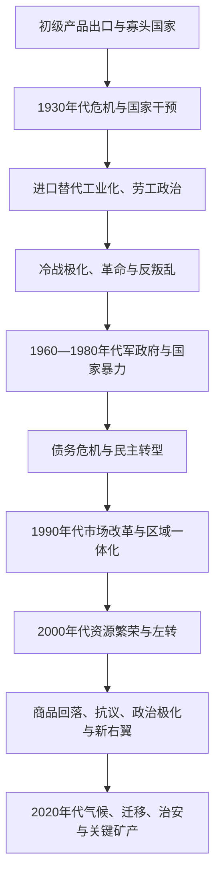

# 现代南美区域秩序

## 时间

约1930年至今，重点为1960年代以后的军事政权、民主化和区域合作。

## 概括

20世纪南美各国面对出口经济波动、工业化、城市化、土地问题和冷战介入。许多国家在1960-1980年代经历军政府、政治迫害和经济危机，随后以不同方式恢复选举民主。区域合作组织、共同市场、资源出口和中国等外部市场改变国家关系，但政治周期、债务、贫富差距、原住民权利和亚马孙环境仍是共同难题。

## 区域主线

| 主题 | 主要内容 |
|---|---|
| 发展模式 | 从初级产品出口到进口替代工业化、债务危机、市场改革与资源繁荣，路径各不相同。 |
| 冷战与国家暴力 | 巴西、阿根廷、智利、乌拉圭等军政府及多国反叛乱战争造成失踪、酷刑和流亡。 |
| 民主化 | 1970年代末至1990年代，多数国家恢复或巩固选举政治，并围绕追责、赦免与记忆展开争论。 |
| 区域合作 | 安第斯共同体、南方共同市场和南美国家联盟等机制体现贸易与政治协调尝试。 |
| 资源与环境 | 石油、铜、锂、铁矿、大豆和水电带来财政与出口收入，也引发土地、污染和森林保护争议。 |
| 社会与民族 | 非洲后裔、原住民、农村社区、移民与城市贫民的权利运动改变公民资格和公共政策。 |

## 重要节点

- 1964年巴西政变、1973年智利政变、1976年阿根廷政变等事件显示冷战与国内阶级、军队、经济危机相互交织。
- 1980年代债务危机削弱威权政府与发展模式，推动紧缩、通胀治理和政治重组。
- 1991年南方共同市场成立，促进阿根廷、巴西、巴拉圭和乌拉圭之间的贸易协调。
- 2000年代大宗商品需求上升，部分国家扩大社会支出与资源民族主义；价格回落后财政和政治压力加重。
- 亚马孙毁林、矿业、水坝、气候变化和原住民领地成为跨国议题，不能仅用“经济发展”概括。
- 委内瑞拉危机、哥伦比亚和平进程、跨境迁移和边境安全表明区域政治问题常跨越单一国家。

## 区域演进图

## 分阶段过程与因果

1. **1930年代转折**：世界市场崩溃削弱咖啡、硝石、谷物和矿产出口财政。瓦加斯、阿根廷保守军政与智利人民阵线等不同政权扩大关税、国企和工业政策，国家开始更深介入劳资关系。
2. **战后民众政治与冷战**：城市工人、妇女和中产扩大选举参与；庇隆主义、巴特列主义、基督教民主与左翼形成不同改革方案。古巴革命、美国安全政策、土地不平等和本地军队传统共同加剧极化。
3. **军事独裁与国家暴力**：巴西1964年、智利1973年、阿根廷1976年等政变并非单一外部操纵，也不能脱离冷战支持理解。军政府以反共、秩序和经济重组自我正当化，通过跨国“秃鹰行动”等网络迫害异议者。
4. **债务与民主化**：1970年代外债和利率上升在1980年代触发危机；经济失灵、工会与人权运动、军内分裂和国际环境变化共同削弱独裁。转型常以谈判、赦免或军方保留权力展开，后续追责程度不同。
5. **市场改革与区域一体化**：私有化、贸易开放和反通胀方案稳定部分经济，也增加失业、去工业化与社会不平等争议。南方共同市场、安第斯共同体和跨国基础设施把民主和平与经贸绑定。
6. **21世纪政治周期**：资源繁荣为社会转移和国家投资提供空间，“粉红浪潮”内部从温和联盟到制宪型政府差异很大。2010年代价格回落、腐败案件、治安和财政紧缩推动新一轮左右轮替，不能用单一“左—右钟摆”解释。
7. **2020年代新议题**：疫情放大卫生与债务压力；委内瑞拉外流、海地与全球移民改变城市和边境政治；亚马孙、锂、铜、海上石油与能源转型把环境正义、原住民领地和全球战略竞争连在一起。

## 区域机制的兴衰

| 机制 | 崛起条件 | 受挫原因 | 仍有影响 |
|---|---|---|---|
| 南方共同市场 | 阿根廷—巴西民主化与降低战争风险 | 保护主义、宏观政策分歧和成员政治冲突 | 关税、产业链与人员流动仍重要。 |
| 安第斯共同体 | 小中型经济体协调贸易和制度 | 成员路线分化、委内瑞拉退出及双边协议 | 法律、贸易与迁移框架继续运作。 |
| 南美国家联盟 | 2000年代政治共识和自主外交诉求 | 政府更替、意识形态化与机构薄弱 | 留下跨国协调经验，后续复兴方案反复出现。 |
| 亚马孙合作 | 共同流域和主权关切 | 执行资源不足、发展模式冲突 | 毁林、火灾、犯罪和气候融资使其重新重要。 |

各国名义与实际国家元首连续表见[北部南美国家元首表](/%E4%BA%BA%E6%96%87%E7%A7%91%E5%AD%A6/%E5%8E%86%E5%8F%B2/%E7%BE%8E%E6%B4%B2/%E5%8D%97%E7%BE%8E/%E5%8C%97%E9%83%A8%E5%8D%97%E7%BE%8E%E5%9B%BD%E5%AE%B6%E5%85%83%E9%A6%96%E8%A1%A8.md)、[安第斯共和国国家元首表](/%E4%BA%BA%E6%96%87%E7%A7%91%E5%AD%A6/%E5%8E%86%E5%8F%B2/%E7%BE%8E%E6%B4%B2/%E5%8D%97%E7%BE%8E/%E5%AE%89%E7%AC%AC%E6%96%AF%E5%85%B1%E5%92%8C%E5%9B%BD%E5%9B%BD%E5%AE%B6%E5%85%83%E9%A6%96%E8%A1%A8.md)、[拉普拉塔共和国国家元首表](/%E4%BA%BA%E6%96%87%E7%A7%91%E5%AD%A6/%E5%8E%86%E5%8F%B2/%E7%BE%8E%E6%B4%B2/%E5%8D%97%E7%BE%8E/%E6%8B%89%E6%99%AE%E6%8B%89%E5%A1%94%E5%85%B1%E5%92%8C%E5%9B%BD%E5%9B%BD%E5%AE%B6%E5%85%83%E9%A6%96%E8%A1%A8.md)、[巴西君主、摄政与总统表](/%E4%BA%BA%E6%96%87%E7%A7%91%E5%AD%A6/%E5%8E%86%E5%8F%B2/%E7%BE%8E%E6%B4%B2/%E5%8D%97%E7%BE%8E/%E5%B7%B4%E8%A5%BF/%E5%B7%B4%E8%A5%BF%E5%90%9B%E4%B8%BB%E3%80%81%E6%91%84%E6%94%BF%E4%B8%8E%E6%80%BB%E7%BB%9F%E8%A1%A8.md)与[阿根廷国家元首表](/%E4%BA%BA%E6%96%87%E7%A7%91%E5%AD%A6/%E5%8E%86%E5%8F%B2/%E7%BE%8E%E6%B4%B2/%E5%8D%97%E7%BE%8E/%E9%98%BF%E6%A0%B9%E5%BB%B7/%E9%98%BF%E6%A0%B9%E5%BB%B7%E5%9B%BD%E5%AE%B6%E5%85%83%E9%A6%96%E8%A1%A8.md)。

## 演变关系

- 巴西：[巴西历史](/%E4%BA%BA%E6%96%87%E7%A7%91%E5%AD%A6/%E5%8E%86%E5%8F%B2/%E7%BE%8E%E6%B4%B2/%E5%8D%97%E7%BE%8E/%E5%B7%B4%E8%A5%BF/README.md)。
- 阿根廷：[阿根廷历史](/%E4%BA%BA%E6%96%87%E7%A7%91%E5%AD%A6/%E5%8E%86%E5%8F%B2/%E7%BE%8E%E6%B4%B2/%E5%8D%97%E7%BE%8E/%E9%98%BF%E6%A0%B9%E5%BB%B7/README.md)。
- 北部南美：[北部南美与大哥伦比亚](/%E4%BA%BA%E6%96%87%E7%A7%91%E5%AD%A6/%E5%8E%86%E5%8F%B2/%E7%BE%8E%E6%B4%B2/%E5%8D%97%E7%BE%8E/%E5%8C%97%E9%83%A8%E5%8D%97%E7%BE%8E%E4%B8%8E%E5%A4%A7%E5%93%A5%E4%BC%A6%E6%AF%94%E4%BA%9A.md)。
- 所属总览：[南美历史](/%E4%BA%BA%E6%96%87%E7%A7%91%E5%AD%A6/%E5%8E%86%E5%8F%B2/%E7%BE%8E%E6%B4%B2/%E5%8D%97%E7%BE%8E/README.md)。
