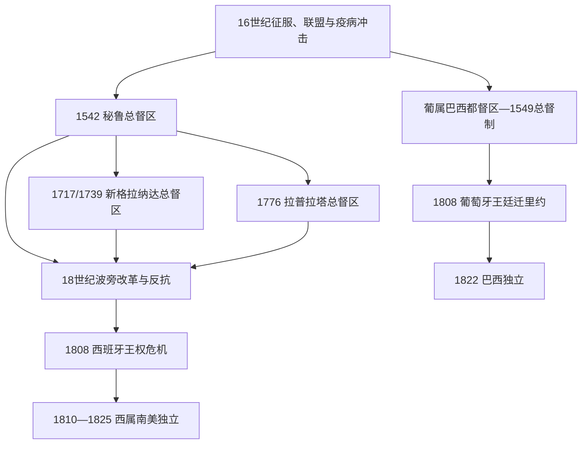

# 西属南美与葡属巴西

## 时间

16世纪初至19世纪前期；殖民制度遗产延续至今。

## 概括

南美殖民不是单一的“欧洲占领”。西班牙在安第斯建立秘鲁总督区，后分出新格拉纳达和拉普拉塔总督区；葡萄牙从大西洋沿岸逐步扩张为覆盖巴西大部的殖民体系。矿业、种植园、传教、强制劳役、奴隶贸易、地方贸易和原住民外交共同塑造殖民社会。不同地区的实际控制程度、种族等级、土地制度和教会力量并不相同。

## 殖民政治实体

| 体系 | 主要区域 | 行政特点 |
|---|---|---|
| 秘鲁总督区 | 安第斯、太平洋沿岸及早期西属南美核心 | 利马为中心；波托西白银与米塔劳役具有全球影响。 |
| 新格拉纳达总督区 | 今日哥伦比亚、厄瓜多尔、委内瑞拉、巴拿马部分地区 | 多次设立与调整，沿岸与高地差异显著。 |
| 拉普拉塔总督区 | 今日阿根廷、乌拉圭、巴拉圭、玻利维亚部分地区 | 1776年设立，布宜诺斯艾利斯的贸易地位上升。 |
| 葡属巴西 | 巴西及其内陆扩张地区 | 先由世袭都督区管理，1549年设总督；1808年王室迁入后地位改变。 |
| 圭亚那殖民地 | 北岸多块殖民地 | 荷兰、英国、法国分别经营，语言和制度遗产不同。 |

## 经济与社会

- 波托西等银矿以强制劳役、雇佣劳动和全球白银贸易连接安第斯、欧洲、非洲和亚洲。
- 巴西东北部糖业、后来的矿业和咖啡经济严重依赖被奴役的非洲人及其后代；奴隶制度不是经济背景的附注，而是殖民社会的核心结构。
- 西班牙殖民当局以恩科米恩达、徭役、贡纳、传教与米塔等制度从原住民社区取得劳力和资源，实际执行因地区而异。
- 教会经营教育、慈善、传教和土地，也参与殖民权力；原住民与非洲后裔在天主教框架中形成混合而非单向接受的宗教实践。
- 贸易限制和走私长期并存，港口、矿区、内陆市场和边疆的联系比总督区地图更复杂。

## 殖民体系演进图

## 征服与殖民国家的形成

- **西班牙安第斯**：皮萨罗集团利用印加内战和地方盟友俘获阿塔瓦尔帕，1533年占库斯科；征服者内斗、曼科·印卡起义和“新法”冲突说明殖民秩序并未立即建立。1542年设秘鲁总督区，托莱多总督在16世纪后期重组聚居村、贡赋和波托西米塔，才形成较稳定汲取体系。
- **葡属巴西**：葡萄牙先以巴西木贸易和沿海据点维持声索，1530年代设世袭都督区，1549年建立总督制。糖业、奴隶贸易、荷兰占领与复归、班代兰特远征和18世纪金矿热使殖民中心由东北沿海扩向东南和内陆。
- **边疆不是空白**：马普切人在比奥比奥河以南长期阻挡西班牙；亚马孙、圭亚那高原、潘帕斯和格兰查科的殖民控制呈点线状。传教团、贸易、通婚、俘虏和战争比地图上的帝国边界更能说明实际权力。

## 制度运行与改革

| 机制 | 运行方式 | 长期影响 |
|---|---|---|
| 总督、审理院与市政会 | 王室官僚、司法机构与地方城市精英相互制衡 | 中央命令经地方谈判执行，克里奥尔精英积累政治经验。 |
| 恩科米恩达、贡赋与米塔 | 通过原住民共同体征收劳役和资源，地区差异显著 | 人口损失、迁徙与社区重组；原住民亦用诉讼维护土地。 |
| 奴隶制与大西洋贸易 | 巴西、圭亚那和西属港口输入大量被奴役非洲人 | 非洲侨民塑造农业、矿业、城市、宗教和抵抗文化。 |
| 教会与传教 | 教区、修会、学校、地产和边疆聚落 | 提供治理与文化框架，也成为土地、劳役和王权改革冲突场域。 |
| 波旁与庞巴尔改革 | 提税、重组总督区、驱逐耶稣会、开放有限贸易 | 提升财政与防务，却激化地方精英、原住民和民众反抗。 |

## 殖民体系衰落与直接瓦解

- **结构因素**：广阔空间、走私和地方经济使垄断贸易难以执行；欧洲出生官员与美洲出生精英竞争；种族和法律等级制造长期不平等。
- **社会反抗**：图帕克·阿马鲁二世和图帕克·卡塔里1780—1781年起义、圭亚那奴隶起义、基隆布和边疆抵抗表明殖民秩序持续受挑战；这些行动目标不等同于19世纪民族国家方案。
- **外部压力**：英荷法帝国竞争、七年战争、美国与海地革命、拿破仑战争改变贸易和主权想象。
- **直接触发**：1808年西班牙国王被迫退位造成主权真空；同年葡萄牙王廷迁里约则把殖民行政中心反向移入美洲。两种危机解释了西属南美多共和国战争独立与巴西君主制独立的不同路径。
- **遗产**：独立继承总督区官僚、教会、庄园、奴隶制和区域贸易，却失去帝国财政与王权仲裁；新国家因此同时面对连续性和合法性真空。

## 演变关系

- 前史：[安第斯文明与印加帝国](/%E4%BA%BA%E6%96%87%E7%A7%91%E5%AD%A6/%E5%8E%86%E5%8F%B2/%E7%BE%8E%E6%B4%B2/%E5%8D%97%E7%BE%8E/%E5%AE%89%E7%AC%AC%E6%96%AF%E6%96%87%E6%98%8E%E4%B8%8E%E5%8D%B0%E5%8A%A0%E5%B8%9D%E5%9B%BD.md)。
- 后续：[南美独立与国家形成](/%E4%BA%BA%E6%96%87%E7%A7%91%E5%AD%A6/%E5%8E%86%E5%8F%B2/%E7%BE%8E%E6%B4%B2/%E5%8D%97%E7%BE%8E/%E5%8D%97%E7%BE%8E%E7%8B%AC%E7%AB%8B%E4%B8%8E%E5%9B%BD%E5%AE%B6%E5%BD%A2%E6%88%90.md)。
- 巴西国家线：[巴西历史](/%E4%BA%BA%E6%96%87%E7%A7%91%E5%AD%A6/%E5%8E%86%E5%8F%B2/%E7%BE%8E%E6%B4%B2/%E5%8D%97%E7%BE%8E/%E5%B7%B4%E8%A5%BF/README.md)。
- 所属总览：[南美历史](/%E4%BA%BA%E6%96%87%E7%A7%91%E5%AD%A6/%E5%8E%86%E5%8F%B2/%E7%BE%8E%E6%B4%B2/%E5%8D%97%E7%BE%8E/README.md)。
