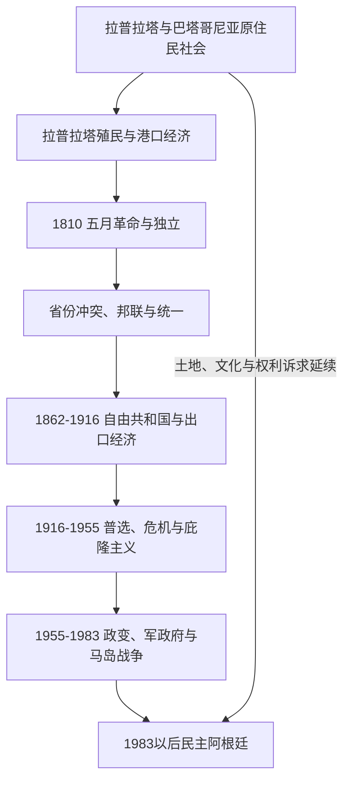

# 阿根廷历史

## 历史主线

阿根廷历史以拉普拉塔河流域的原住民社会、西班牙殖民港口经济、1810年革命和19世纪省份内战为起点。1853年宪法与1862年国家统一后，农业出口、欧洲移民、铁路和领土扩张促进国家市场形成，也伴随对原住民的军事征服和土地集中。20世纪的普选、庇隆主义、军人政变、国家恐怖主义、马岛战争和1983年民主恢复，塑造了当代阿根廷围绕人权、通胀、债务与联邦政治的长期议题。

## 演进图

## 时期导航

| 顺序 | 阶段 | 时间 | 简要概括 |
|---:|---|---|---|
| 1 | [原住民、拉普拉塔殖民与独立](/%E4%BA%BA%E6%96%87%E7%A7%91%E5%AD%A6/%E5%8E%86%E5%8F%B2/%E7%BE%8E%E6%B4%B2/%E5%8D%97%E7%BE%8E/%E9%98%BF%E6%A0%B9%E5%BB%B7/%E5%8E%9F%E4%BD%8F%E6%B0%91%E3%80%81%E6%8B%89%E6%99%AE%E6%8B%89%E5%A1%94%E6%AE%96%E6%B0%91%E4%B8%8E%E7%8B%AC%E7%AB%8B.md) | 16世纪-1816年 | 河流流域与草原社会、总督区、五月革命和独立宣言。 |
| 2 | [省份冲突、邦联与国家整合](/%E4%BA%BA%E6%96%87%E7%A7%91%E5%AD%A6/%E5%8E%86%E5%8F%B2/%E7%BE%8E%E6%B4%B2/%E5%8D%97%E7%BE%8E/%E9%98%BF%E6%A0%B9%E5%BB%B7/%E7%9C%81%E4%BB%BD%E5%86%B2%E7%AA%81%E3%80%81%E9%82%A6%E8%81%94%E4%B8%8E%E5%9B%BD%E5%AE%B6%E6%95%B4%E5%90%88.md) | 1816-1862年 | 联邦派与统一派冲突、罗萨斯统治、1853年宪法与国家统一。 |
| 3 | [自由共和国与出口经济](/%E4%BA%BA%E6%96%87%E7%A7%91%E5%AD%A6/%E5%8E%86%E5%8F%B2/%E7%BE%8E%E6%B4%B2/%E5%8D%97%E7%BE%8E/%E9%98%BF%E6%A0%B9%E5%BB%B7/%E8%87%AA%E7%94%B1%E5%85%B1%E5%92%8C%E5%9B%BD%E4%B8%8E%E5%87%BA%E5%8F%A3%E7%BB%8F%E6%B5%8E.md) | 1862-1916年 | 农牧出口、铁路、移民、土地集中与“沙漠征服”。 |
| 4 | [普选、危机与庇隆主义](/%E4%BA%BA%E6%96%87%E7%A7%91%E5%AD%A6/%E5%8E%86%E5%8F%B2/%E7%BE%8E%E6%B4%B2/%E5%8D%97%E7%BE%8E/%E9%98%BF%E6%A0%B9%E5%BB%B7/%E6%99%AE%E9%80%89%E3%80%81%E5%8D%B1%E6%9C%BA%E4%B8%8E%E5%BA%87%E9%9A%86%E4%B8%BB%E4%B9%89.md) | 1916-1955年 | 激进党、1930年政变、庇隆主义兴起及其首次被推翻。 |
| 5 | [政变、军政府与民主恢复](/%E4%BA%BA%E6%96%87%E7%A7%91%E5%AD%A6/%E5%8E%86%E5%8F%B2/%E7%BE%8E%E6%B4%B2/%E5%8D%97%E7%BE%8E/%E9%98%BF%E6%A0%B9%E5%BB%B7/%E6%94%BF%E5%8F%98%E3%80%81%E5%86%9B%E6%94%BF%E5%BA%9C%E4%B8%8E%E6%B0%91%E4%B8%BB%E6%81%A2%E5%A4%8D.md) | 1955-1983年 | 政治不稳定、1976年独裁、国家恐怖主义和马岛战争。 |
| 6 | [当代阿根廷](/%E4%BA%BA%E6%96%87%E7%A7%91%E5%AD%A6/%E5%8E%86%E5%8F%B2/%E7%BE%8E%E6%B4%B2/%E5%8D%97%E7%BE%8E/%E9%98%BF%E6%A0%B9%E5%BB%B7/%E5%BD%93%E4%BB%A3%E9%98%BF%E6%A0%B9%E5%BB%B7.md) | 1983年至今 | 民主巩固、人权审判、货币与债务危机、社会和党派重组。 |

## 国家元首专表

1810年以来的革命委员会、三人执政团、最高执政官、无统一总统时期的省际外事代表、阿根廷邦联总统、1862年后全部宪制与事实总统，以及2001年数日内的完整继承，统一见[阿根廷国家元首表](/%E4%BA%BA%E6%96%87%E7%A7%91%E5%AD%A6/%E5%8E%86%E5%8F%B2/%E7%BE%8E%E6%B4%B2/%E5%8D%97%E7%BE%8E/%E9%98%BF%E6%A0%B9%E5%BB%B7/%E9%98%BF%E6%A0%B9%E5%BB%B7%E5%9B%BD%E5%AE%B6%E5%85%83%E9%A6%96%E8%A1%A8.md)。

## 政体与国家结构

阿根廷是联邦总统制共和国。1853年宪法为联邦架构提供基础，布宜诺斯艾利斯在1860年代完全纳入后国家统一才相对稳定。总统、国会、最高法院、各省政府和工会、军队、经济利益集团之间的关系，持续影响政治发展。

## 相关入口

- 上级目录：[南美历史](/%E4%BA%BA%E6%96%87%E7%A7%91%E5%AD%A6/%E5%8E%86%E5%8F%B2/%E7%BE%8E%E6%B4%B2/%E5%8D%97%E7%BE%8E/README.md)。
- 区域背景：[拉普拉塔、巴拉圭与乌拉圭](/%E4%BA%BA%E6%96%87%E7%A7%91%E5%AD%A6/%E5%8E%86%E5%8F%B2/%E7%BE%8E%E6%B4%B2/%E5%8D%97%E7%BE%8E/%E6%8B%89%E6%99%AE%E6%8B%89%E5%A1%94%E3%80%81%E5%B7%B4%E6%8B%89%E5%9C%AD%E4%B8%8E%E4%B9%8C%E6%8B%89%E5%9C%AD.md)。
- 当代区域史：[现代南美区域秩序](/%E4%BA%BA%E6%96%87%E7%A7%91%E5%AD%A6/%E5%8E%86%E5%8F%B2/%E7%BE%8E%E6%B4%B2/%E5%8D%97%E7%BE%8E/%E7%8E%B0%E4%BB%A3%E5%8D%97%E7%BE%8E%E5%8C%BA%E5%9F%9F%E7%A7%A9%E5%BA%8F.md)。
