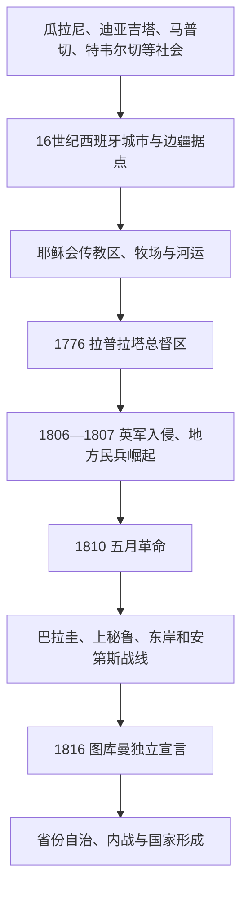

# 原住民、拉普拉塔殖民与独立

## 时间

16世纪至1816年。

## 概括

今日阿根廷境内包括瓜拉尼、马普切、克丘亚、迪亚吉塔、特韦尔切等多种原住民社会；拉普拉塔殖民体系的实际控制主要集中于城市、牧场、传教区和河流交通线。1776年拉普拉塔总督区设立后，布宜诺斯艾利斯的港口、关税和大西洋贸易地位上升。1806-1807年英军入侵和1808年西班牙王权危机，为1810年五月革命创造条件；1816年图库曼会议宣布独立。

## 殖民统治结构

| 层级 | 角色 | 说明 |
|---|---|---|
| 西班牙王室 | 宗主权与贸易制度 | 试图控制港口、白银流通和行政任命。 |
| 拉普拉塔总督 | 总督区最高行政 | 1776年设立，以布宜诺斯艾利斯为中心。 |
| 市政会与商人 | 城市政治经济力量 | 港口关税和贸易特权使布宜诺斯艾利斯精英影响突出。 |
| 传教团与边疆军事据点 | 边疆治理 | 与瓜拉尼等社会形成复杂的传教、贸易、冲突与协商关系。 |
| 原住民族群 | 自主社会与外交力量 | 草原和南部地区长期不受殖民政府完整控制。 |

## 重要事件

- 16-17世纪西班牙在拉普拉塔沿岸、内陆山谷和西北建立城市与牧场网络。
- 耶稣会在瓜拉尼地区建立传教社区；其保护、控制和文化改造同时存在。
- 1776年总督区成立，试图加强西班牙对大西洋南部的行政与军事控制。
- 1806-1807年英军入侵被当地民兵击退，提升克里奥尔精英和民兵的政治影响。
- 1810年五月革命建立自治政府；1816年7月9日图库曼会议宣布联合省脱离西班牙。
- 独立宣言没有解决各省、港口、原住民领地和未来国家边界问题，后续冲突持续数十年。

## 演进图

## 殖民与独立的具体过程

- **多中心前史**：西北山谷与安第斯贸易相连，瓜拉尼社会沿河流分布，潘帕斯和巴塔哥尼亚的马普切化网络通过牲畜、俘虏和盐路跨越后来的国界。西班牙城市控制呈岛状，南部大部分地区并非实际殖民领土。
- **城市—边疆殖民**：圣地亚哥-德尔埃斯特罗、科尔多瓦、门多萨、布宜诺斯艾利斯等城市分别连接上秘鲁、智利和大西洋。波托西白银需求拉动骡运、纺织与食品；布宜诺斯艾利斯长期依靠走私和牛皮贸易，港口利益与内陆商路并不总一致。
- **传教与原住民政治**：耶稣会瓜拉尼传教区组织农业、工艺和民兵，既限制奴隶捕掠，也以基督教和集中聚居改造生活。1767年耶稣会被逐后，王室和地方精英接管资源，许多社区分散或重组。
- **总督区改革**：1776年从秘鲁总督区分出拉普拉塔总督区，首任总督佩德罗·德·塞瓦略斯和后继者强化布宜诺斯艾利斯、蒙得维的亚防务与关税；波托西矿区被纳入，使港口更能支配内陆财政。
- **英军入侵的转折**：1806年英军占布宜诺斯艾利斯，西班牙总督撤离；圣地亚哥·德·利涅尔斯与本地民兵反攻。1807年第二次入侵再败，克里奥尔民兵证明可在缺乏本土援军时自卫，并获得武装与政治组织。
- **五月革命与战争**：1810年开放市政会废黜总督，第一委员会以费尔南多七世名义执政。革命军在上秘鲁反复受挫，巴拉圭拒绝布宜诺斯艾利斯领导，东岸阿蒂加斯转向联邦方案；贝尔格拉诺、圭梅斯和圣马丁分别维持北线、边区游击与跨安第斯战略。
- **独立宣言的边界**：1816年图库曼会议宣布联合省独立，却没有巴拉圭、东岸和多数联邦派代表；它解决对西班牙法理关系，不等于阿根廷国界、宪法或中央权威已经完成。

1810年以来革命委员会、三人执政团、最高执政官和全部国家元首见[阿根廷国家元首表](/%E4%BA%BA%E6%96%87%E7%A7%91%E5%AD%A6/%E5%8E%86%E5%8F%B2/%E7%BE%8E%E6%B4%B2/%E5%8D%97%E7%BE%8E/%E9%98%BF%E6%A0%B9%E5%BB%B7/%E9%98%BF%E6%A0%B9%E5%BB%B7%E5%9B%BD%E5%AE%B6%E5%85%83%E9%A6%96%E8%A1%A8.md)。

## 演变关系

- 前史与区域背景：[拉普拉塔、巴拉圭与乌拉圭](/%E4%BA%BA%E6%96%87%E7%A7%91%E5%AD%A6/%E5%8E%86%E5%8F%B2/%E7%BE%8E%E6%B4%B2/%E5%8D%97%E7%BE%8E/%E6%8B%89%E6%99%AE%E6%8B%89%E5%A1%94%E3%80%81%E5%B7%B4%E6%8B%89%E5%9C%AD%E4%B8%8E%E4%B9%8C%E6%8B%89%E5%9C%AD.md)。
- 后一节点：[省份冲突、邦联与国家整合](/%E4%BA%BA%E6%96%87%E7%A7%91%E5%AD%A6/%E5%8E%86%E5%8F%B2/%E7%BE%8E%E6%B4%B2/%E5%8D%97%E7%BE%8E/%E9%98%BF%E6%A0%B9%E5%BB%B7/%E7%9C%81%E4%BB%BD%E5%86%B2%E7%AA%81%E3%80%81%E9%82%A6%E8%81%94%E4%B8%8E%E5%9B%BD%E5%AE%B6%E6%95%B4%E5%90%88.md)。
- 所属总览：[阿根廷历史](/%E4%BA%BA%E6%96%87%E7%A7%91%E5%AD%A6/%E5%8E%86%E5%8F%B2/%E7%BE%8E%E6%B4%B2/%E5%8D%97%E7%BE%8E/%E9%98%BF%E6%A0%B9%E5%BB%B7/README.md)。
