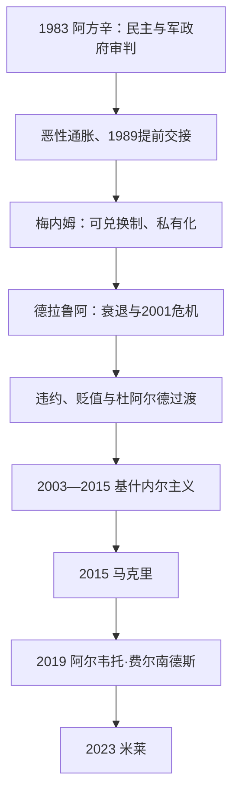

# 当代阿根廷

## 时间

1983年至今。

## 概括

1983年民主恢复后，阿根廷在审判军政府罪行、重建选举制度和处理高通胀、外债、贫困与货币危机之间不断调整。经济稳定方案、私有化、2001年危机、社会抗争和新的庇隆主义与非庇隆主义联盟轮替，显示民主并未消除深层结构问题。人权记忆、联邦财政、出口农业、能源、性别权利和马尔维纳斯主权主张仍是公共政治的重要主题。

## 统治结构

| 层级 | 角色 | 说明 |
|---|---|---|
| 总统 | 国家元首与政府首脑 | 联邦总统制，行政权与紧急经济措施在危机中常受关注。 |
| 国会 | 立法与预算 | 两院制，省份利益影响联邦政治。 |
| 省政府 | 联邦成员 | 财政转移、资源和地方政治对国家联盟重要。 |
| 司法与人权机构 | 宪法和责任追究 | 军政府罪行审判与权利案件使司法在民主转型中具有突出位置。 |

## 重要过程

- 阿方辛政府审判军政府领导人，确立民主转型中的责任追究先例，但也面对军方压力和经济危机。
- 1990年代货币可兑换计划一度抑制通胀，伴随私有化、失业和外债问题。
- 2001-2002年经济、金融和政治危机导致违约、银行限制和大规模抗议。
- 后续政府以债务重组、社会补贴和出口收入恢复经济，但通胀与财政问题持续。
- 社会运动推动失踪者记忆、性别平等、婚姻平权和生育权等议题进入法律与公共政策。
- 阿根廷与巴西的贸易、货币和工业关系在南方共同市场中具有核心地位。

## 当代政治演进图

## 政府更替与经济政治过程

| 阶段 | 主要政策与事件 | 兴衰转折 |
|---|---|---|
| 阿方辛，1983—1989年 | 失踪者委员会、《永不再来》报告和1985年军政府审判；后在军人叛乱压力下通过限制追诉法律 | 外债、财政赤字与恶性通胀使工资和国家能力崩溃，提前向梅内姆交接。 |
| 梅内姆，1989—1999年 | 一比一可兑换制、私有化、贸易开放；1994年修宪允许连任；赦免军政人物 | 初期稳定通胀，后因高估汇率、失业、外债和外部冲击累积脆弱性。 |
| 联盟政府与2001危机 | 德拉鲁阿维持固定汇率，紧缩和债务置换未恢复信心；“冻结存款”后抗议、镇压和总统辞职 | 五位行政权代行者在十余日内更替，违约显示货币方案、债务和政治联盟同时崩溃。 |
| 杜阿尔德与基什内尔主义，2002—2015年 | 贬值、出口税和社会补助后复苏；内斯托尔重启人权审判，克里斯蒂娜扩大养老金、补贴和国家干预 | 商品繁荣与闲置产能支持增长，后外汇短缺、通胀、统计争议和政治极化加深。 |
| 马克里，2015—2019年 | 放松外汇管制、渐进财政调整、重新进入国际信贷；2018年货币危机后接受国际货币基金组织方案 | 资本流动逆转、通胀和债务削弱“渐进主义”。 |
| 阿尔韦托·费尔南德斯，2019—2023年 | 债务重组、疫情管制和社会救助；执政联盟内部与副总统阵营分裂 | 干旱、储备短缺、财政货币失衡和高通胀导致政治重组。 |
| 米莱，2023年至今 | 以财政休克、放松管制和缩减国家为核心，依靠行政法令、国会谈判与省长联盟推进改革 | 通胀回落、社会成本、就业与联邦财政之间的权衡仍在发展，不能把短期指标当作历史终局。 |

## 民主制度与实际权力

- 总统兼国家元首与政府首脑；内阁首席部长负责协调并向国会报告，但不是议会制总理。截至2026年7月14日，哈维尔·米莱仍任总统。
- 国会两院、23省和布宜诺斯艾利斯自治市掌握立法、财政和地方执行资源。没有稳定单一多数时，总统必须与省长、中间党团和工会谈判。
- 司法在人权审判、债务、劳工和反腐案件中具有政治影响；2003年后撤销限制追诉法律，使军政府罪行审判重新展开。
- 工会、社会运动、出口农业、工业、金融和非正规劳动者构成不同权力基础。庇隆主义是跨派别联盟传统，不能等同某一固定经济纲领。
- 马尔维纳斯主权主张由历届民主政府延续，但外交主张不改变英国对群岛的实际控制；战争记忆与退伍军人政策应同军事独裁责任区分。
- 完整国家元首、2001年短期继承和事实总统见[阿根廷国家元首表](/%E4%BA%BA%E6%96%87%E7%A7%91%E5%AD%A6/%E5%8E%86%E5%8F%B2/%E7%BE%8E%E6%B4%B2/%E5%8D%97%E7%BE%8E/%E9%98%BF%E6%A0%B9%E5%BB%B7/%E9%98%BF%E6%A0%B9%E5%BB%B7%E5%9B%BD%E5%AE%B6%E5%85%83%E9%A6%96%E8%A1%A8.md)。

## 长期矛盾

反复危机通常由外汇约束、财政货币失衡、债务与商品周期共同形成，直接触发可能是挤兑、选举或政策冲击。把每轮危机归因于单一政党会忽略固定汇率遗产、联邦财政、产业结构与社会保护之间的长期张力；同样，民主连续性虽自1983年保持，却不保证经济政策连续。

## 演变关系

- 前一节点：[政变、军政府与民主恢复](/%E4%BA%BA%E6%96%87%E7%A7%91%E5%AD%A6/%E5%8E%86%E5%8F%B2/%E7%BE%8E%E6%B4%B2/%E5%8D%97%E7%BE%8E/%E9%98%BF%E6%A0%B9%E5%BB%B7/%E6%94%BF%E5%8F%98%E3%80%81%E5%86%9B%E6%94%BF%E5%BA%9C%E4%B8%8E%E6%B0%91%E4%B8%BB%E6%81%A2%E5%A4%8D.md)。
- 区域背景：[现代南美区域秩序](/%E4%BA%BA%E6%96%87%E7%A7%91%E5%AD%A6/%E5%8E%86%E5%8F%B2/%E7%BE%8E%E6%B4%B2/%E5%8D%97%E7%BE%8E/%E7%8E%B0%E4%BB%A3%E5%8D%97%E7%BE%8E%E5%8C%BA%E5%9F%9F%E7%A7%A9%E5%BA%8F.md)。
- 所属总览：[阿根廷历史](/%E4%BA%BA%E6%96%87%E7%A7%91%E5%AD%A6/%E5%8E%86%E5%8F%B2/%E7%BE%8E%E6%B4%B2/%E5%8D%97%E7%BE%8E/%E9%98%BF%E6%A0%B9%E5%BB%B7/README.md)。
