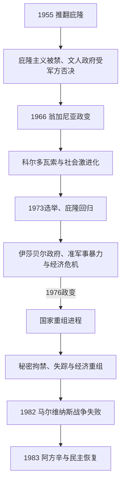

# 政变、军政府与民主恢复

## 时间

1955-1983年。

## 概括

1955年后，庇隆主义支持者、军队、文人政党、工会和经济精英之间的冲突导致多次政变与短暂民选政府交替。1976年军方建立独裁政权，以“国家重组进程”为名实施绑架、酷刑、秘密拘禁和失踪等国家恐怖主义。1982年马岛战争失败削弱军政府，1983年选举恢复文人统治，开启民主追责与制度重建。

## 统治结构

| 阶段 | 时间 | 主要结构 |
|---|---|---|
| 庇隆主义被禁与军政轮替 | 1955-1973年 | 军队限制庇隆主义政治参与，文人政府合法性受损。 |
| 庇隆主义回归与危机 | 1973-1976年 | 政治暴力、经济危机和派系冲突加深。 |
| 军事独裁 | 1976-1983年 | 军事委员会和武装力量主导，议会与政党受限制。 |
| 民主恢复 | 1983年 | 阿方辛当选，文人宪政秩序重新建立。 |

## 重要事件

- 1966年翁加尼亚政变加强威权统治，学生、工人和地方抗议不断扩大。
- 1973年庇隆主义重新合法化，胡安·庇隆短暂回归总统职位，后由伊莎贝尔·庇隆继任。
- 1976年军方发动政变，开始“肮脏战争”；失踪者家属和五月广场母亲组织成为人权运动象征。
- 军政府以市场化和外债扩张应对经济，工业、就业和社会分配承受严重后果。
- 1982年阿根廷占领马尔维纳斯群岛，引发与英国战争；战败加速军政府失去支持。
- 1983年民主选举恢复，军政府时期的犯罪成为审判、赦免和公共记忆的长期议题。

## 政权演进图

## 军政轮替与国家恐怖主义的过程

- **排除性秩序（1955—1966）**：洛纳尔迪短暂主张和解，阿兰布鲁转向清洗庇隆主义并处决1956年起义者。弗朗迪西依靠庇隆选票当选，却在军方压力下反复干预省份并被罢黜；吉多以宪法继承形式就任，但军队决定政治边界。伊利亚政府得票基础有限，1966年再遭政变。
- **“阿根廷革命”（1966—1973）**：翁加尼亚取消政党竞争，镇压大学“长棍之夜”，试图以技术官僚长期统治。工资冻结和地区不平等推动1969年科尔多瓦索；军方内部先后以莱文斯顿、拉努塞更换总统，最终承认必须恢复选举。
- **群众政治与暴力升级（1973—1976）**：坎波拉就任后释放政治犯，庇隆回国日埃塞萨发生派系屠杀。庇隆第三任试图调和工会、企业与军队，1974年去世后伊莎贝尔继任；阿根廷反共联盟实施暗杀，游击组织继续行动，政府早已授权军队进行“消灭”行动。
- **1976年政变与权力结构**：陆海空三军委员会是最高机构，魏地拉、比奥拉、加尔铁里和比尼奥内先后任事实总统。国家把数百个秘密拘禁中心、酷刑、婴儿劫夺和“死亡飞行”纳入反叛乱；失踪人数的具体统计口径有差异，但系统性国家犯罪无争议。
- **经济与社会重组**：马丁内斯·德奥斯政策开放金融、压低工资并扩大外债，资本外逃和去工业化削弱合法性。工会、教会、人权律师、五月广场母亲与祖母等在高压下持续组织。
- **马尔维纳斯战争**：加尔铁里军政府在经济和政治危机中于1982年4月占领群岛，误判英国反应与美国立场。海空战失败造成军人伤亡，社会支持急剧崩溃，三军无法再共同维系统治。
- **民主恢复**：比尼奥内试图以“最终文件”和自我大赦封闭追责，但1983年选举由阿方辛胜出。文人政府建立失踪者委员会并审判军政府首领，民主转型由此与人权责任绑定，而非只是一场选举更替。

全部事实总统、短期军方代行者、1973年三次文人更替和1983年后元首见[阿根廷国家元首表](/%E4%BA%BA%E6%96%87%E7%A7%91%E5%AD%A6/%E5%8E%86%E5%8F%B2/%E7%BE%8E%E6%B4%B2/%E5%8D%97%E7%BE%8E/%E9%98%BF%E6%A0%B9%E5%BB%B7/%E9%98%BF%E6%A0%B9%E5%BB%B7%E5%9B%BD%E5%AE%B6%E5%85%83%E9%A6%96%E8%A1%A8.md)。

## 演变关系

- 前一节点：[普选、危机与庇隆主义](/%E4%BA%BA%E6%96%87%E7%A7%91%E5%AD%A6/%E5%8E%86%E5%8F%B2/%E7%BE%8E%E6%B4%B2/%E5%8D%97%E7%BE%8E/%E9%98%BF%E6%A0%B9%E5%BB%B7/%E6%99%AE%E9%80%89%E3%80%81%E5%8D%B1%E6%9C%BA%E4%B8%8E%E5%BA%87%E9%9A%86%E4%B8%BB%E4%B9%89.md)。
- 后一节点：[当代阿根廷](/%E4%BA%BA%E6%96%87%E7%A7%91%E5%AD%A6/%E5%8E%86%E5%8F%B2/%E7%BE%8E%E6%B4%B2/%E5%8D%97%E7%BE%8E/%E9%98%BF%E6%A0%B9%E5%BB%B7/%E5%BD%93%E4%BB%A3%E9%98%BF%E6%A0%B9%E5%BB%B7.md)。
- 所属总览：[阿根廷历史](/%E4%BA%BA%E6%96%87%E7%A7%91%E5%AD%A6/%E5%8E%86%E5%8F%B2/%E7%BE%8E%E6%B4%B2/%E5%8D%97%E7%BE%8E/%E9%98%BF%E6%A0%B9%E5%BB%B7/README.md)。
