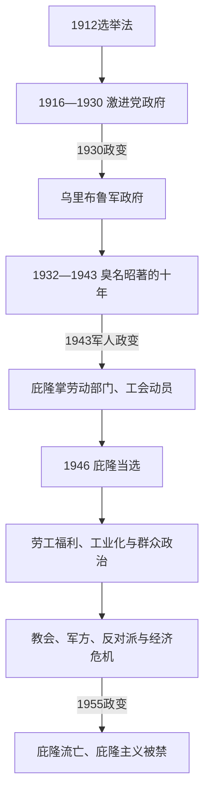

# 普选、危机与庇隆主义

## 时间

1916-1955年。

## 概括

1916年后，扩大选举权使激进公民联盟进入中央政治，但社会冲突、经济依赖和军队干预并未消失。1930年政变结束民选政府，开启“臭名昭著的十年”。1943年军人政变中崛起的胡安·庇隆通过劳工政策、国家干预和大众动员建立庇隆主义；伊娃·庇隆的社会政治角色和妇女选举权扩展改变了政治参与。1955年政变推翻庇隆，未能消除其社会影响。

## 主要政治阶段

| 阶段 | 时间 | 特征 |
|---|---|---|
| 激进公民联盟政府 | 1916-1930年 | 普选扩展、劳工冲突与经济依赖并存。 |
| “臭名昭著的十年” | 1930-1943年 | 军事政变后保守联盟、选举舞弊和危机治理。 |
| 庇隆主义政府 | 1946-1955年 | 劳工权利、社会福利、国家工业政策和强烈政治对立。 |

## 重要事件

- 1919年“悲惨周”显示劳资矛盾、反犹暴力和国家镇压。
- 1930年乌里布鲁政变打破民选政府连续性，军队成为常态政治仲裁者。
- 二战时期工业化与城市劳工增长，为庇隆主义的群众基础提供条件。
- 庇隆在劳工部门建立与工会的紧密关系，1946年当选总统。
- 1947年妇女选举权获得法律承认，伊娃·庇隆推动女性政治组织。
- 政府扩大社会福利和劳工权利，也压制反对派媒体和政治力量。
- 1955年“解放革命”政变推翻庇隆；庇隆主义被禁并未使其消失。

## 政权演进图

## 分阶段过程与重要事件

1. **激进党普选政府（1916—1930）**：伊里戈延以联邦干预打破省级保守机器，扩张中产参与，并在劳资冲突中时而调停、时而镇压。1919年“悲惨周”中军警和民族主义团体攻击工人及犹太社区；1921—1922年巴塔哥尼亚罢工者遭军队屠杀，显示普选并不等于社会民主。
2. **1930年政变**：大萧条打击出口、伊里戈延年老与党内分裂削弱政府。乌里布鲁获军方、保守精英和部分媒体支持发动政变，最高法院“事实政府理论”后来为多次军政权提供法律外衣。
3. **“臭名昭著的十年”（1930—1943）**：乌里布鲁社团主义方案失败后，胡斯托等以选举舞弊维持保守联盟。罗卡—朗西曼协定保障对英肉类贸易却被批为依附；央行、工业和国家调节扩大。二战中立、继承舞弊和军官民族主义促成1943年政变。
4. **庇隆崛起（1943—1946）**：胡安·庇隆在劳动与社会福利秘书处承认工会、提高工资并建立政治联盟。1945年军内对手拘押他，10月17日工人动员迫使释放；1946年选举把军政干部转化为群众政党领导。
5. **第一庇隆主义（1946—1955）**：政府以外汇储备国有化铁路、公用事业，扩大进口替代、福利、集体谈判和1949年宪法；伊娃·庇隆基金会与妇女庇隆党推动社会动员，1947年女性取得全国选举权。政府同时限制反对派媒体、大学和司法独立。
6. **鼎盛与衰落**：战后农产品价格和储备支持早期再分配；1950年代外汇短缺、农业停滞和通胀迫使紧缩。与天主教会决裂、反对派结盟和军内阴谋扩大，1955年海军轰炸五月广场后，九月军队推翻庇隆。
7. **长期遗产**：政变取缔名称、标志和候选人，却无法消除工会、劳工身份和庇隆主义选民；此后的军政制度一直面对“最大群众力量被排除”的合法性难题。

## 兴衰原因分层

庇隆主义崛起的结构条件是战时工业化和城市工人增长，组织机制是国家劳动部门与工会联盟，直接转折是1945年10月17日动员。1955年垮台的结构因素是外汇约束与制度极化，外部背景是冷战反共，直接触发则是教会—军方联盟和军事叛乱。完整总统与军政府序列见[阿根廷国家元首表](/%E4%BA%BA%E6%96%87%E7%A7%91%E5%AD%A6/%E5%8E%86%E5%8F%B2/%E7%BE%8E%E6%B4%B2/%E5%8D%97%E7%BE%8E/%E9%98%BF%E6%A0%B9%E5%BB%B7/%E9%98%BF%E6%A0%B9%E5%BB%B7%E5%9B%BD%E5%AE%B6%E5%85%83%E9%A6%96%E8%A1%A8.md)。

## 演变关系

- 前一节点：[自由共和国与出口经济](/%E4%BA%BA%E6%96%87%E7%A7%91%E5%AD%A6/%E5%8E%86%E5%8F%B2/%E7%BE%8E%E6%B4%B2/%E5%8D%97%E7%BE%8E/%E9%98%BF%E6%A0%B9%E5%BB%B7/%E8%87%AA%E7%94%B1%E5%85%B1%E5%92%8C%E5%9B%BD%E4%B8%8E%E5%87%BA%E5%8F%A3%E7%BB%8F%E6%B5%8E.md)。
- 后一节点：[政变、军政府与民主恢复](/%E4%BA%BA%E6%96%87%E7%A7%91%E5%AD%A6/%E5%8E%86%E5%8F%B2/%E7%BE%8E%E6%B4%B2/%E5%8D%97%E7%BE%8E/%E9%98%BF%E6%A0%B9%E5%BB%B7/%E6%94%BF%E5%8F%98%E3%80%81%E5%86%9B%E6%94%BF%E5%BA%9C%E4%B8%8E%E6%B0%91%E4%B8%BB%E6%81%A2%E5%A4%8D.md)。
- 所属总览：[阿根廷历史](/%E4%BA%BA%E6%96%87%E7%A7%91%E5%AD%A6/%E5%8E%86%E5%8F%B2/%E7%BE%8E%E6%B4%B2/%E5%8D%97%E7%BE%8E/%E9%98%BF%E6%A0%B9%E5%BB%B7/README.md)。
