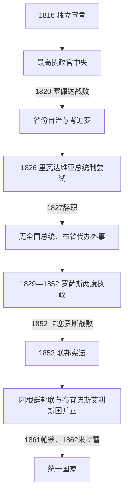

# 省份冲突、邦联与国家整合

## 时间

1816-1862年。

## 概括

独立后的拉普拉塔联合省没有立即成为统一的阿根廷国家。布宜诺斯艾利斯与内陆省份围绕关税、河流贸易、联邦制和政治代表权发生长期冲突。胡安·曼努埃尔·德·罗萨斯在布宜诺斯艾利斯掌握强权，1852年被推翻后，各省制定1853年宪法；布宜诺斯艾利斯在1862年后正式纳入统一国家，国家整合才取得相对稳定框架。

## 主要政治实体

| 阶段 | 时间 | 统治结构 |
|---|---|---|
| 省份自治与内战 | 1816-1829年 | 各省考迪罗、地方民兵和城市精英竞争，中央权威脆弱。 |
| 罗萨斯统治 | 1829-1852年 | 布宜诺斯艾利斯省长罗萨斯控制对外关系与港口资源，实行强人政治。 |
| 阿根廷邦联 | 1853-1861年 | 各省通过1853年宪法建立联邦，布宜诺斯艾利斯一度分离。 |
| 统一国家 | 1862年起 | 米特雷就任总统，布宜诺斯艾利斯与邦联制度逐步结合。 |

## 重要事件

- 1819年、1826年宪法尝试因省份反对而未能建立稳定中央政府。
- 联邦派强调省份自治，统一派倾向布宜诺斯艾利斯主导的中央化，两者并非固定社会阶级而是多层政治联盟。
- 罗萨斯以“联邦主义”名义集中权力，对反对者实施审查和暴力；同时依赖港口关税和大地主支持。
- 1852年卡塞罗斯战役中，乌尔基萨击败罗萨斯，开启制宪与国家重组。
- 1853年宪法确立联邦共和国；1860年代布宜诺斯艾利斯最终纳入，国家行政、军队和财政开始更集中化。
- 对原住民领地的扩张在国家整合中持续推进，为后期“沙漠征服”奠定条件。

## 政权演进图

## 内战与整合的阶段过程

1. **中央崩溃（1819—1820）**：最高执政官要求省份服从并试图用1819年中央主义宪法固定权力。圣菲、恩特雷里奥斯联邦军在塞佩达击败中央军，国会和执政官制度解体，各省成为事实主权单位。
2. **省际协定与总统试验（1820—1827）**：各省以皮拉尔、四边形等条约协调战争和贸易。对巴西的顺铂战争促成1826年国会设总统并选里瓦达维亚；其首都国有化、中央宪法和和平条款遭省份反对，辞职后总统职位撤销。
3. **罗萨斯崛起（1829—1835）**：多雷戈被统一派将领拉瓦列处决引发联邦派反击。罗萨斯依托布宜诺斯艾利斯牧场、民兵和港口关税成为省长；第一次任期后拒绝在权力不足时续任，边疆远征和党内危机扩大其威望。
4. **罗萨斯强权（1835—1852）**：国会授予“公共权力总和”，马索尔卡等组织压制反对者；各省仍有本地政府，但把外交和战争委托布宜诺斯艾利斯。法国、英法封锁、乌拉圭大战争和国内联邦派反叛被逐一克服，关税集中却使内河省份长期不满。
5. **直接垮台**：恩特雷里奥斯考迪罗乌尔基萨需要开放河运并反对罗萨斯无限拖延制宪，1851年“宣告”收回外交权，与巴西、乌拉圭结盟；1852年卡塞罗斯战役击败罗萨斯。
6. **宪法与并立国家（1852—1861）**：圣尼古拉斯协定与1853年宪法建立阿根廷邦联，乌尔基萨任总统；布宜诺斯艾利斯因关税和代表权分离成一国。1859年塞佩达迫其接受宪法修订，1861年帕翁战役后米特雷取得实际优势，邦联中央瓦解。
7. **1862年整合的限度**：米特雷就任统一总统后，军队、税关和外交逐步中央化，但拉里奥哈等地联邦抵抗、原住民自主领地和省级财政差异仍存在；国家统一是长期强制与谈判，不是单一宪法日期。

## 兴衰原因

罗萨斯秩序的稳定来自港口关税、牧业出口、联邦盟约和强制政治；衰落来自内河贸易利益、无制度化继承、外部战争负担及乌尔基萨倒戈，卡塞罗斯是直接触发。邦联的失败不说明联邦原则失败，而是缺少布宜诺斯艾利斯关税与人口资源；1860年修宪后的统一国家仍保持联邦省份。完整首脑序列见[阿根廷国家元首表](/%E4%BA%BA%E6%96%87%E7%A7%91%E5%AD%A6/%E5%8E%86%E5%8F%B2/%E7%BE%8E%E6%B4%B2/%E5%8D%97%E7%BE%8E/%E9%98%BF%E6%A0%B9%E5%BB%B7/%E9%98%BF%E6%A0%B9%E5%BB%B7%E5%9B%BD%E5%AE%B6%E5%85%83%E9%A6%96%E8%A1%A8.md)。

## 演变关系

- 前一节点：[原住民、拉普拉塔殖民与独立](/%E4%BA%BA%E6%96%87%E7%A7%91%E5%AD%A6/%E5%8E%86%E5%8F%B2/%E7%BE%8E%E6%B4%B2/%E5%8D%97%E7%BE%8E/%E9%98%BF%E6%A0%B9%E5%BB%B7/%E5%8E%9F%E4%BD%8F%E6%B0%91%E3%80%81%E6%8B%89%E6%99%AE%E6%8B%89%E5%A1%94%E6%AE%96%E6%B0%91%E4%B8%8E%E7%8B%AC%E7%AB%8B.md)。
- 后一节点：[自由共和国与出口经济](/%E4%BA%BA%E6%96%87%E7%A7%91%E5%AD%A6/%E5%8E%86%E5%8F%B2/%E7%BE%8E%E6%B4%B2/%E5%8D%97%E7%BE%8E/%E9%98%BF%E6%A0%B9%E5%BB%B7/%E8%87%AA%E7%94%B1%E5%85%B1%E5%92%8C%E5%9B%BD%E4%B8%8E%E5%87%BA%E5%8F%A3%E7%BB%8F%E6%B5%8E.md)。
- 所属总览：[阿根廷历史](/%E4%BA%BA%E6%96%87%E7%A7%91%E5%AD%A6/%E5%8E%86%E5%8F%B2/%E7%BE%8E%E6%B4%B2/%E5%8D%97%E7%BE%8E/%E9%98%BF%E6%A0%B9%E5%BB%B7/README.md)。
