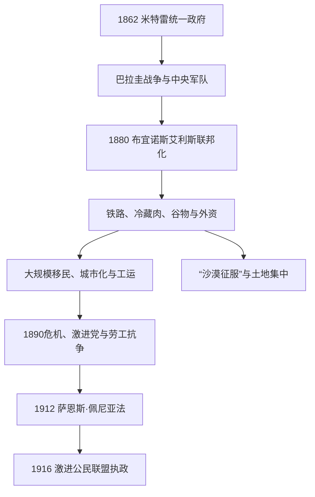

# 自由共和国与出口经济

## 时间

1862-1916年。

## 概括

国家统一后，阿根廷以肉类、羊毛、谷物和后来的冷冻食品出口融入世界市场。铁路、港口、外资和欧洲移民迅速改变潘帕斯草原与城市社会；布宜诺斯艾利斯成为区域大都市。经济增长伴随土地集中、劳动冲突、选举操控和对原住民的军事征服。1912年萨恩斯·佩尼亚法扩大秘密和强制男性选举权，1916年伊波利托·伊里戈延当选，标志旧寡头政治被突破。

## 统治结构

| 力量 | 角色 | 说明 |
|---|---|---|
| 总统与联邦政府 | 国家整合与出口政策 | 控制铁路、移民、教育和军队建设。 |
| 省级精英与大地产主 | 土地与选举网络 | 受益于出口经济与地方权力。 |
| 外国资本与贸易商 | 铁路、金融、港口 | 英国资本尤其重要，但国家并非完全由外资控制。 |
| 移民、工会与城市社群 | 新社会力量 | 社会主义、无政府主义和激进主义挑战旧政治。 |

## 重要事件

- 1864-1870年巴拉圭战争加强阿根廷军队和国家财政，但也造成巨大地区破坏。
- 1870-1880年代国家向巴塔哥尼亚和潘帕斯南部推进，所谓“沙漠征服”伴随原住民被杀害、驱逐和土地掠夺。
- 1880年布宜诺斯艾利斯联邦化，首都与省的关系重组。
- 大量欧洲移民进入，城市工人阶级、互助会、报刊和新政治文化形成。
- 出口繁荣依赖国际市场，财富与土地集中并未自动带来社会平等。
- 1912年选举法改革削弱公开操控，1916年激进公民联盟胜选。

## 政权与经济演进图

## 国家扩张与出口模式的具体过程

- **中央国家巩固**：米特雷、萨米恩托和阿韦利亚内达政府建立全国军队、法院、邮政、学校和统计。1864—1870年巴拉圭战争扩大征兵和财政，也触发省份叛乱；中央用军事胜利压制蒙托内拉反抗。
- **首都与财政**：布宜诺斯艾利斯省掌港口和海关，仍可挑战中央。1880年罗卡支持的联邦军击败省军，城市联邦化、另建拉普拉塔为省会，国家才稳定控制主要关税。
- **出口增长机制**：英国资本建设铁路、港口和冷藏链，潘帕斯小麦、玉米、羊毛与牛肉进入欧洲市场。国家通过土地测量、移民政策和货币金融连接产区；增长高度依赖国际资本、运费与需求。
- **“沙漠征服”过程**：南部边界长期由军事堡垒、贸易和原住民联盟共同构成。阿道福·阿尔西纳先筑壕防御，罗卡1878—1885年发动大规模进攻，杀害、俘虏和迁移马普切、兰克尔、特韦尔切等群体；土地随后集中给军人、公司和大地产主。把它只写成“开发无人荒地”会复制国家宣传。
- **移民与社会政治**：意大利、西班牙等移民扩张城市劳工、租户农民、互助会和报刊，无政府主义、社会主义与激进主义发展。国家以居留法、戒严和暴力镇压部分工运，1909年“红色周”、1910年百年庆典镇压显示繁荣与排斥并存。
- **寡头制度的突破**：1890年巴林危机、青年公民联盟起义和总统华雷斯·塞尔曼辞职暴露封闭政治。激进公民联盟以弃选和起义要求真实投票；1912年萨恩斯·佩尼亚法规定男性秘密、强制登记投票，1916年伊里戈延胜选。
- **转型而非彻底终结**：改革扩大男性公民参与，却未立即给予女性全国选举权，也没有消除省级干预、土地集中和外资依赖。自由共和国的国家机构、出口设施和社会矛盾都被下一时期继承。

1862年以来各总统、继任者与后来的事实元首见[阿根廷国家元首表](/%E4%BA%BA%E6%96%87%E7%A7%91%E5%AD%A6/%E5%8E%86%E5%8F%B2/%E7%BE%8E%E6%B4%B2/%E5%8D%97%E7%BE%8E/%E9%98%BF%E6%A0%B9%E5%BB%B7/%E9%98%BF%E6%A0%B9%E5%BB%B7%E5%9B%BD%E5%AE%B6%E5%85%83%E9%A6%96%E8%A1%A8.md)。

## 演变关系

- 前一节点：[省份冲突、邦联与国家整合](/%E4%BA%BA%E6%96%87%E7%A7%91%E5%AD%A6/%E5%8E%86%E5%8F%B2/%E7%BE%8E%E6%B4%B2/%E5%8D%97%E7%BE%8E/%E9%98%BF%E6%A0%B9%E5%BB%B7/%E7%9C%81%E4%BB%BD%E5%86%B2%E7%AA%81%E3%80%81%E9%82%A6%E8%81%94%E4%B8%8E%E5%9B%BD%E5%AE%B6%E6%95%B4%E5%90%88.md)。
- 后一节点：[普选、危机与庇隆主义](/%E4%BA%BA%E6%96%87%E7%A7%91%E5%AD%A6/%E5%8E%86%E5%8F%B2/%E7%BE%8E%E6%B4%B2/%E5%8D%97%E7%BE%8E/%E9%98%BF%E6%A0%B9%E5%BB%B7/%E6%99%AE%E9%80%89%E3%80%81%E5%8D%B1%E6%9C%BA%E4%B8%8E%E5%BA%87%E9%9A%86%E4%B8%BB%E4%B9%89.md)。
- 所属总览：[阿根廷历史](/%E4%BA%BA%E6%96%87%E7%A7%91%E5%AD%A6/%E5%8E%86%E5%8F%B2/%E7%BE%8E%E6%B4%B2/%E5%8D%97%E7%BE%8E/%E9%98%BF%E6%A0%B9%E5%BB%B7/README.md)。
