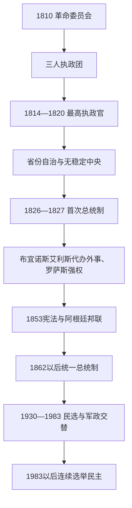

# 阿根廷国家元首表

## 口径

阿根廷在1810—1862年间多次没有统一总统：革命委员会、三人执政团、最高执政官、省级考迪罗、布宜诺斯艾利斯外事代表和阿根廷邦联总统先后出现。本表先按实际全国或省际行政权排列这些过渡政体，再列1862年国家统一后的全部宪制、事实、临时和代行国家元首。短暂代行与未形成常设总统职位的集体机构均明确标注。

## 国家元首演进图

## 1810—1862年革命政府、最高执政官与邦联首脑

| 政体 / 职位 | 时间 | 国家元首或集体成员 | 权力与备注 |
|---|---|---|---|
| 第一委员会（五月委员会） | 1810年5月25日—12月18日 | 主席科尔内利奥·萨韦德拉；秘书马里亚诺·莫雷诺、胡安·何塞·帕索；委员曼努埃尔·阿尔韦蒂、米格尔·德·阿斯库埃纳加、曼努埃尔·贝尔格拉诺、胡安·何塞·卡斯特利、多明戈·马特乌、胡安·拉雷亚 | 以费尔南多七世名义建立革命政府；向各城镇派军并邀请内地代表，内部很快分化为萨韦德拉派与莫雷诺派。 |
| 大委员会 | 1810年12月18日—1811年9月22日 | 主席依次为科尔内利奥·萨韦德拉、多明戈·马特乌。成立时18名成员为萨韦德拉、莫雷诺、帕索、阿斯库埃纳加、马特乌、拉雷亚、贝尔格拉诺、卡斯特利、阿尔韦蒂、何塞·西蒙·加西亚·德·科西奥、胡安·弗朗西斯科·塔拉戈纳、曼努埃尔·费利佩·莫利纳、格雷戈里奥·富内斯、何塞·胡利安·佩雷斯、弗朗西斯科·德·古鲁查加、胡安·伊格纳西奥·戈里蒂、何塞·安东尼奥·奥尔莫斯·德·阿吉莱拉、曼努埃尔·伊格纳西奥·莫利纳；其后实际加入伊波利托·比耶特斯、马塞利诺·波夫莱特、何塞·伊格纳西奥·费尔南德斯·马拉多纳、弗朗西斯科·奥尔蒂斯·德·奥坎波、佩德罗·弗朗西斯科·德·乌里亚特、尼古拉斯·罗德里格斯·佩尼亚、阿塔纳西奥·古铁雷斯、胡安·阿拉贡和华金·坎帕纳 | 纳入内地代表，却因战争失利、派系清洗和布宜诺斯艾利斯市政会压力而被三人团取代；贝尔格拉诺和卡斯特利在外领军，费利西亚诺·奇克拉纳虽获选为替补但未就任。 |
| 第一执政三人团 | 1811年9月23日—1812年10月8日 | 最初为费利西亚诺·奇克拉纳、曼努埃尔·德·萨拉特亚、胡安·何塞·帕索；1812年4月胡安·马丁·德·普埃雷东接替帕索 | 三名执政官是集体元首，政府秘书贝尔纳迪诺·里瓦达维亚掌握显著实际影响；中央集权和军事危机最终触发政变。 |
| 第二执政三人团 | 1812年10月8日—1814年1月31日 | 最初为尼古拉斯·罗德里格斯·佩尼亚、安东尼奥·阿尔瓦雷斯·洪特、胡安·何塞·帕索；1813年2月何塞·胡利安·佩雷斯接替帕索，8月赫尔瓦西奥·安东尼奥·德·波萨达斯接替阿尔瓦雷斯·洪特，11月胡安·拉雷亚接替佩雷斯 | 召集1813年议会，废除多项殖民身份制度并推动独立象征；随后以一人最高执政官制取代集体行政。 |
| 最高执政官 | 1814—1815 | 赫尔瓦西奥·安东尼奥·德·波萨达斯 | 首任一人行政首脑。 |
| 最高执政官 | 1815年1—4月 | 卡洛斯·马里亚·德·阿尔韦亚尔 | 因军事与政治反对被推翻。 |
| 最高执政官 | 1815—1816 | 何塞·龙多被任命但在军中；伊格纳西奥·阿尔瓦雷斯·托马斯实际代行 | 名义与实际权力分离。 |
| 最高执政官 | 1816年4—7月 | 安东尼奥·冈萨雷斯·德·巴尔卡塞 | 图库曼会议期间的过渡。 |
| 最高执政官 | 1816—1819 | **胡安·马丁·德·普埃雷东** | 支持圣马丁安第斯军，中央与省份矛盾加深。 |
| 最高执政官 | 1819—1820 | 何塞·龙多 | 塞佩达战败后中央政府解体。 |
| 无全国行政首脑 | 1820—1826 | 各省自治；布宜诺斯艾利斯政府处理部分对外事务 | “1820年无政府状态”不是没有政府，而是没有公认中央政府。 |
| 共和国总统 | 1826—1827 | 贝纳迪诺·里瓦达维亚 | 首位使用总统称号；中央集权宪法和对巴西战争压力下辞职。 |
| 临时总统 | 1827年7—8月 | 比森特·洛佩斯·伊·普拉内斯 | 解散全国政府，将权力退回省份。 |
| 省际外事代表 | 1827—1828 | 曼努埃尔·多雷戈（布宜诺斯艾利斯省长） | 在无总统体制下代表多数省办理外交；被拉瓦列政变处决。 |
| 省际外事代表 | 1828—1829 | 胡安·拉瓦列（事实掌权） | 统一派军事政变后统治布宜诺斯艾利斯。 |
| 省际外事代表 | 1829年 | 胡安·何塞·比亚蒙特 | 临时省长，促成联邦派接管。 |
| 省际外事代表 | 1829—1832 | **胡安·曼努埃尔·德·罗萨斯** | 作为布宜诺斯艾利斯省长掌对外关系。 |
| 省际外事代表 | 1832—1833 | 胡安·拉蒙·巴尔卡塞 | 罗萨斯暂离权力。 |
| 省际外事代表 | 1833—1834 | 胡安·何塞·比亚蒙特 | 联邦派内部冲突。 |
| 省际外事代表 | 1834—1835 | 曼努埃尔·比森特·马萨 | 过渡省长。 |
| 省际外事代表 | 1835—1852 | **胡安·曼努埃尔·德·罗萨斯** | 获“公共权力总和”，以港口关税、军警与省际协定维持实际国家领导。 |
| 临时邦联执政 | 1852—1854 | 胡斯托·何塞·德·乌尔基萨 | 卡塞罗斯战役后推动1853年宪法；布宜诺斯艾利斯分离。 |
| 阿根廷邦联总统 | 1854—1860 | 胡斯托·何塞·德·乌尔基萨 | 首位1853年宪法下总统。 |
| 阿根廷邦联总统 | 1860—1861 | 圣地亚哥·德尔基 | 帕翁战役后辞职。 |
| 代总统 | 1861年11—12月 | 胡安·埃斯特班·佩德内拉 | 邦联中央机构停止运作。 |
| 临时全国行政 | 1862年4—10月 | 巴托洛梅·米特雷 | 以布宜诺斯艾利斯省长身份受各省委托，随后当选宪制总统。 |

## 1862年以来国家元首完整表

| 序列 | 国家元首 | 在位 | 取得权力方式 | 关键事件与备注 |
|---:|---|---|---|---|
| 1 | **巴托洛梅·米特雷** | 1862—1868 | 选举 | 国家统一、巴拉圭战争与中央机构建设。 |
| 2 | 多明戈·福斯蒂诺·萨米恩托 | 1868—1874 | 选举 | 教育、铁路与国家能力扩张。 |
| 3 | 尼古拉斯·阿韦利亚内达 | 1874—1880 | 选举 | 移民、边疆战争与首都问题。 |
| 4 | 胡利奥·阿亨蒂诺·罗卡 | 1880—1886 | 选举 | 布宜诺斯艾利斯联邦化；“沙漠征服”后土地集中。 |
| 5 | 米格尔·华雷斯·塞尔曼 | 1886—1890 | 选举；危机中辞职 | 寡头政治与1890年金融、政治危机。 |
| 6 | 卡洛斯·佩列格里尼 | 1890—1892 | 副总统继任 | 稳定财政与制度。 |
| 7 | 路易斯·萨恩斯·佩尼亚 | 1892—1895 | 选举；辞职 | 政治联盟破裂。 |
| 8 | 何塞·埃瓦里斯托·乌里布鲁 | 1895—1898 | 副总统继任 | 完成余任。 |
| 9 | 胡利奥·阿亨蒂诺·罗卡 | 1898—1904 | 选举；第二任 | 国家行政与出口经济继续扩张。 |
| 10 | 曼努埃尔·金塔纳 | 1904—1906 | 选举；任内去世 | 激进党起义与政治改革压力。 |
| 11 | 何塞·菲格罗亚·阿尔科塔 | 1906—1910 | 副总统继任 | 推动寡头联盟重组。 |
| 12 | 罗克·萨恩斯·佩尼亚 | 1910—1914 | 选举；任内去世 | 1912年秘密、强制男性投票改革。 |
| 13 | 维克托里诺·德拉普拉萨 | 1914—1916 | 副总统继任 | 主持首次改革后总统选举。 |
| 14 | **伊波利托·伊里戈延** | 1916—1922 | 选举 | 激进公民联盟执政、劳工冲突和国家调停。 |
| 15 | 马塞洛·托尔夸托·德·阿尔韦亚尔 | 1922—1928 | 选举 | 出口繁荣与激进党分裂。 |
| 16 | 伊波利托·伊里戈延 | 1928—1930 | 选举；政变罢黜 | 大萧条与政治反对中被军方推翻。 |
| 17 | 何塞·费利克斯·乌里布鲁 | 1930—1932 | 事实总统 | 首场成功军事政变，压制政党并尝试社团主义。 |
| 18 | 阿古斯丁·佩德罗·胡斯托 | 1932—1938 | 受操控选举 | “臭名昭著的十年”、选举舞弊与英阿贸易安排。 |
| 19 | 罗伯托·马里亚·奥尔蒂斯 | 1938—1942 | 选举；因病辞职 | 尝试削弱舞弊。 |
| 20 | 拉蒙·卡斯蒂略 | 1942—1943 | 副总统继任；政变罢黜 | 二战中立与继承争议。 |
| 21 | 阿图罗·劳森 | 1943年6月4—7日 | 事实总统 | 政变后仅三天即被军内更换。 |
| 22 | 佩德罗·巴勃罗·拉米雷斯 | 1943—1944 | 事实总统 | 军政府、民族主义与对轴心国断交压力。 |
| 23 | 埃德尔米罗·法雷尔 | 1944—1946 | 事实总统 | 庇隆从劳工和副总统职位崛起，后恢复选举。 |
| 24 | **胡安·多明戈·庇隆** | 1946—1955 | 选举；连任后政变罢黜 | 劳工权利、福利、国家工业政策与反对派压制。 |
| 25 | 爱德华多·洛纳尔迪 | 1955年9—11月 | 事实总统 | 推翻庇隆后因路线温和被军内替换。 |
| 26 | 佩德罗·欧亨尼奥·阿兰布鲁 | 1955—1958 | 事实总统 | 取缔庇隆主义并恢复选举。 |
| 27 | 阿图罗·弗朗迪西 | 1958—1962 | 选举；被军方拘押罢黜 | 发展主义、石油投资与军方否决政治。 |
| 28 | 何塞·马里亚·吉多 | 1962—1963 | 参议院临时议长依法宣誓；受军方控制 | 以宪法继承形式覆盖军事干预。 |
| 29 | 阿图罗·伊利亚 | 1963—1966 | 选举；政变罢黜 | 庇隆主义仍受限，经济与军媒反对加剧。 |
| 30 | 胡安·卡洛斯·翁加尼亚 | 1966—1970 | 事实总统 | “阿根廷革命”取消政党竞争；社会抗议迫使下台。 |
| 31 | 罗伯托·莱文斯顿 | 1970—1971 | 事实总统 | 军政府内部更替。 |
| 32 | 亚历杭德罗·阿古斯丁·拉努塞 | 1971—1973 | 事实总统 | 安排政治开放与庇隆主义回归。 |
| 33 | 埃克托尔·坎波拉 | 1973年5—7月 | 选举；辞职 | 为庇隆重新参选让路。 |
| 34 | 劳尔·阿尔韦托·拉斯蒂里 | 1973年7—10月 | 众议院议长临时执政 | 主持重新选举。 |
| 35 | 胡安·多明戈·庇隆 | 1973—1974 | 选举；任内去世 | 庇隆主义内部左右冲突升级。 |
| 36 | 玛丽亚·埃斯特拉·马丁内斯·德·庇隆（伊莎贝尔·庇隆） | 1974—1976 | 副总统继任；政变罢黜 | 首位女性总统；经济、暴力与军方危机。 |
| 37 | 豪尔赫·拉斐尔·魏地拉 | 1976—1981 | 军事委员会推举；事实总统 | 国家恐怖主义与强迫失踪。 |
| 38 | 罗伯托·爱德华多·比奥拉 | 1981年3—12月 | 军方更替；事实总统 | 经济与军内危机。 |
| 39 | 卡洛斯·拉科斯特 | 1981年12月11—22日 | 军方临时代行 | 比奥拉与加尔铁里之间过渡。 |
| 40 | 莱奥波尔多·加尔铁里 | 1981—1982 | 军方更替；事实总统 | 发动马尔维纳斯战争，战败后垮台。 |
| 41 | 阿尔弗雷多·奥斯卡·圣让 | 1982年6—7月 | 军方临时代行 | 三军就继任争执期间过渡。 |
| 42 | 雷纳尔多·比尼奥内 | 1982—1983 | 事实总统 | 组织向民选政府移交并试图限制追责。 |
| 43 | **劳尔·阿方辛** | 1983—1989 | 直接选举；提前交接 | 恢复民主、审判军政府首领；恶性通胀削弱政府。 |
| 44 | 卡洛斯·梅内姆 | 1989—1999 | 直接选举；连任 | 可兑换制、私有化与1994年修宪。 |
| 45 | 费尔南多·德拉鲁阿 | 1999—2001 | 直接选举；危机中辞职 | 衰退、债务和银行限制引发社会爆发。 |
| 46 | 拉蒙·普埃尔塔 | 2001年12月21—23日 | 参议院临时议长代行行政权 | 总统、副总统均空缺后的继承。 |
| 47 | 阿道福·罗德里格斯·萨阿 | 2001年12月23—30日 | 国会选举临时总统；辞职 | 宣布主权债务违约。 |
| 48 | 爱德华多·卡马尼奥 | 2001年12月31日—2002年1月2日 | 众议院议长代行 | 再次空缺时主持国会选择继任者。 |
| 49 | 爱德华多·杜阿尔德 | 2002—2003 | 国会选举完成余任 | 终止固定汇率并处理社会危机。 |
| 50 | 内斯托尔·基什内尔 | 2003—2007 | 直接选举 | 债务重组、重启人权追诉与国家干预。 |
| 51 | 克里斯蒂娜·费尔南德斯·德·基什内尔 | 2007—2015 | 直接选举；连任 | 社会政策、外汇与通胀争议、政治极化。 |
| 过渡说明 | 费德里科·皮内多 | 2015年12月10日数小时 | 参议院临时议长短时代行行政权 | 司法裁定旧任午夜结束、新任中午宣誓形成空档；通常不计入总统编号。 |
| 52 | 毛里西奥·马克里 | 2015—2019 | 直接选举 | 市场改革、外债与2018年国际货币基金组织方案。 |
| 53 | 阿尔韦托·费尔南德斯 | 2019—2023 | 直接选举 | 疫情、债务重组、通胀与执政联盟分裂。 |
| 54 | **哈维尔·米莱** | 2023年至今 | 直接选举 | 截至2026年7月14日仍任总统；总统同时为国家元首与政府首脑。 |

## 实际权力辨析

- 1820—1826年及1827—1852年没有稳定的全国总统，但布宜诺斯艾利斯依靠港口关税和省际授权办理外交。把罗萨斯只列为“省长”会低估其全国实际权力，把他写成宪制总统又不符合当时制度。
- 1853—1861年的阿根廷邦联与布宜诺斯艾利斯国一度并立；乌尔基萨和德尔基的宪制权威不覆盖分离的最大港口省。
- 1930、1943、1955、1962、1966和1976年的军事干预形态不同。吉多虽以继承规则宣誓，军方却拘押前任、限制议会并决定政策边界，因此表中单列为“宪法外干预下的文人元首”。
- 1976—1983年军事委员会是最高实际权力机构，总统由军方内部产生；魏地拉、比奥拉、加尔铁里和比尼奥内的更替不能只按一般总统继承理解。
- 2001年总统与副总统空缺后，参议院临时议长、国会选出的临时总统和众议院议长依继承次序接替，数日内多次更换均应保留。
- 1983年以来总统兼国家元首与政府首脑；内阁首席部长负责行政协调，但并非议会制总理。

## 相关笔记

- 总览：[阿根廷历史](/%E4%BA%BA%E6%96%87%E7%A7%91%E5%AD%A6/%E5%8E%86%E5%8F%B2/%E7%BE%8E%E6%B4%B2/%E5%8D%97%E7%BE%8E/%E9%98%BF%E6%A0%B9%E5%BB%B7/README.md)。
