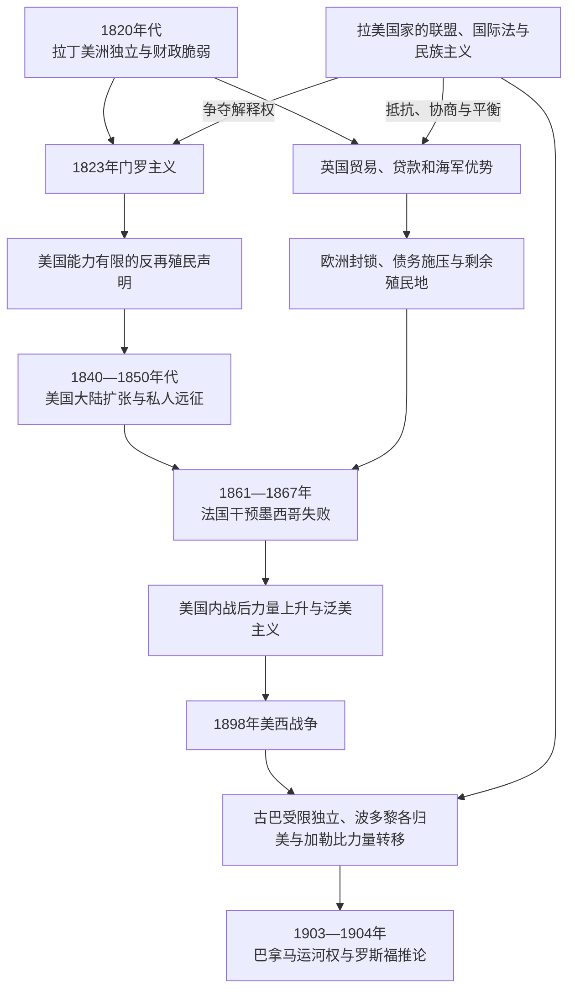

# 19世纪帝国主义与门罗主义

## 时间

1823—1904年为主；相关外交观念、边界争议和干预遗产延续至今。

## 概括

西班牙和葡萄牙美洲帝国解体后，美洲并未成为没有外部权力的空间。新国家在战争债务、薄弱税制、出口市场和军事不足中建立，英国、法国、西班牙及其他欧洲力量继续通过殖民地、贸易、贷款、海军封锁、领土占领和扶植政权影响地区。美国则从力量有限的共和国发展为横跨大陆、控制加勒比通道并拥有海外领地的强国。

1823年门罗主义宣布欧洲不应在美洲建立新殖民地或干预新独立国家，同时承诺美国不介入既有欧洲殖民地和欧洲内部战争。它最初不是一项能由美国单独执行的安全体系，英国海军和欧洲力量平衡对阻止西班牙复辟更重要。19世纪后期，美国政府逐渐把门罗主义解释为自身在西半球的特殊地位；1904年罗斯福推论更以防止欧洲干预为由，主张美国可以对拉丁美洲国家进行“国际警察”式干预。

拉丁美洲国家并非被动对象。它们以区域会议、国际法、债务原则、军队改革、对不同列强的平衡和民族主义争取空间。门罗主义有时被用来反对欧洲征服，也因美国兼并、干预和不承认拉美平等主权而受到批评。

## 权力重组主线

## 门罗主义的形成

### 1823年的国际背景

拉丁美洲独立战争接近胜利时，欧洲保守君主国是否帮助西班牙恢复殖民统治成为外交问题。英国已从拉美贸易获利，不希望西班牙垄断恢复，曾考虑与美国联合发表反干预声明。美国国务卿约翰·昆西·亚当斯主张单独表态，避免成为英国政策的附属。

门罗总统在1823年国情咨文中提出几项相互关联的原则：

- 美洲已独立的地区不应成为欧洲未来殖民对象。
- 欧洲若干预美洲新国家，将被美国视为不友好行为。
- 美国不干预欧洲国家内部事务和既有欧洲殖民地。
- 欧洲与美洲被描述为政治制度和安全利益不同的空间。

这是一份总统政策声明，不是经美洲国家共同谈判的条约，也不是国际法自动授权。美国当时海军和陆军能力不足，无法普遍阻止欧洲行动；英国的海上优势、欧洲列强相互牵制及西班牙自身衰弱，是原则未受全面挑战的重要条件。

### 拉美的理解

玻利瓦尔等领导人希望建立美洲共和国间合作，1826年巴拿马会议尝试讨论共同防务和争端解决。美国参与迟缓且目标不同，区域联盟没有形成强制体系。拉美政治家可能欢迎反再殖民立场，却不接受美国拥有单方面解释或干涉权。

“美洲属于美洲人”的口号后来常被引用，但“谁代表美洲”正是争议核心。对新国家而言，反欧洲殖民与防范美国扩张同样重要。

## 英国的非正式帝国

英国在拉美多数地区不追求直接占领广阔内陆，而以承认新国家、自由贸易、商人、贷款、航运、铁路和海军建立影响。伦敦金融市场为政府和企业提供资金，也制造债务违约、海关抵押和外交施压。

英国商品冲击部分本地手工业，但外贸也为国家带来关税和基础设施。拉美政府会在英国、法国、美国和其他投资者之间选择，合同并非完全由外方单方面决定；问题在于军力、信贷和市场规模显著不对称。

英国仍保有加拿大、英属洪都拉斯、英属圭亚那和加勒比殖民地。1833年英国重新占据马尔维纳斯 / 福克兰群岛，阿根廷持续主张主权。19世纪末，英属圭亚那与委内瑞拉边界争端促使美国以门罗主义介入仲裁，显示这一原则开始被用于扩大美国外交角色，而非单纯反殖民。

## 法国、西班牙与欧洲武力干预

### 法国对墨西哥

法国在1838—1839年以赔偿纠纷发动“糕点战争”，封锁墨西哥港口。更大规模干预发生在1861年以后。墨西哥暂停外债偿付后，英法西联合施压；英西达成协议撤出，拿破仑三世继续战争，企图建立亲法君主国。

法国军队扶植哈布斯堡的马克西米连为墨西哥皇帝。墨西哥共和政府在华雷斯领导下坚持抵抗。美国内战期间无力直接阻止法国，战后以外交和边境军事压力支持法国撤军。1867年帝国崩溃，马克西米连被处决，共和国恢复。

事件证明门罗主义能否产生效果取决于美国力量和墨西哥自身抵抗；把法国失败只归因美国声明，会抹去墨西哥战争的主体性。

### 西班牙的残余帝国与再干预

西班牙保有古巴、波多黎各等殖民地，并在1860年代重新占领多米尼加一段时期。1864年西班牙占领秘鲁钦查群岛，引发与秘鲁、智利等国的战争，1866年炮击瓦尔帕莱索和卡亚俄后退出。拉美共和国以外交和军事合作反对旧宗主国复辟。

古巴经历十年战争等独立斗争，奴隶制于1886年废除，殖民战争仍持续到1898年。西班牙残余殖民问题最终与美国干预结合，形成新的帝国转换。

### 法英封锁拉普拉塔

法国和英国在1830—1840年代先后封锁布宜诺斯艾利斯及拉普拉塔水域，以贸易、航行和地区战争为由施压。阿根廷邦联抵抗以及欧洲自身成本迫使列强谈判。事件在阿根廷民族主义记忆中成为维护河流主权的象征，也显示“非正式帝国”仍可能使用直接武力。

## 美国大陆扩张

### 得克萨斯、美墨战争与领土兼并

得克萨斯的英美定居者、墨西哥联邦危机、奴隶制和原住民边疆共同导致1835—1836年革命。美国于1845年兼并得克萨斯，边界争议与扩张主义推动1846—1848年美墨战争。美军占领墨西哥城后，《瓜达卢佩—伊达尔戈条约》使墨西哥割让今日美国西南大片领土，美国另于1853年完成加兹登购地。

战争将“天定命运”与奴隶制是否向西扩张直接相连，并在墨西哥留下深刻失地记忆。条约承诺的墨西哥居民财产和公民权在执行中经常受侵害，原住民族则未被视为土地谈判主体。

### 原住民领地的内部殖民

美国、加拿大、阿根廷和智利等新国家把殖民时代的领土主张向原住民控制区推进。美国迁移政策和西部战争、阿根廷“荒漠远征”、智利占领阿劳卡尼亚等，以国家统一和“文明”语言夺取土地。这些行动由美洲独立国家实施，却具有定居殖民和内部帝国性质。

### 私人远征与“阻挠者”

19世纪中叶，一些美国私人武装试图征服拉丁美洲领土。威廉·沃克在尼加拉瓜夺权并恢复奴隶制，后被中美洲联军击败。私人远征得到部分扩张主义者支持，却不总受美国政府正式控制。古巴兼并倡议和“奥斯坦德宣言”也显示奴隶制利益与加勒比扩张相连。

## 拉美国家的外交与战争

### 共同防务和国际法

拉美政府举行多次泛美或拉美会议，讨论共同防务、仲裁和国际法。地区分裂、不同威胁认知和国内政局使联盟难以长期制度化，但不能据此认定没有外交自主。

卡尔沃主义主张外国投资者不应享有超越本国人的外交保护，应先使用当地司法；1902年阿根廷外长路易斯·德拉戈提出，公共债务不应成为武装干预和领土占领理由。这些原则回应欧洲封锁，并为后来拉美主权论述提供基础。

### 国家间战争与外部资本

三国同盟战争、硝石战争等主要是南美国家间冲突，不可简单称为欧洲代理战争；英国等外部贸易和金融利益影响物资与外交，却不等于从伦敦直接操纵全部行动。战争改变巴拉圭、玻利维亚、秘鲁、智利和阿根廷国家形成、边界与财政，也暴露出口资源和军队建设的重要性。

拉美国家会主动利用外资修建铁路、港口和电报，但收益、债务和土地让渡分配不均。外部依赖与国家能力增长可以同时发生。

## 泛美主义与美国力量上升

1889—1890年第一届美洲国家国际会议在华盛顿召开，推动商业信息和争端讨论，后来发展为泛美联盟传统。美国希望扩大贸易和政治领导，拉美代表则维护主权平等并抵制过度控制。“泛美主义”因此既是合作平台，也是权力竞争场域。

美国工业、海军和大陆铁路发展后，门罗主义的物质基础增强。国务卿奥尔尼在1895年英属圭亚那—委内瑞拉边界争端中声称美国在西半球具有主导地位，英国接受仲裁；这常被视为门罗主义由防御声明向地区霸权解释转变的标志。

## 1898年美西战争

### 战争过程

古巴独立战争自1895年再次爆发，西班牙集中营政策造成严重人道灾难。美国舆论、经济和战略利益推动干预；“缅因号”在哈瓦那爆炸成为直接政治催化剂，爆炸原因当时即有争议。美国国会宣称古巴应自由，并通过《特勒修正案》表示不吞并古巴。

战争在加勒比和太平洋同时进行。西班牙迅速战败，《巴黎条约》使波多黎各、关岛和菲律宾转归美国，古巴由美国军事占领后获得形式独立。美国由大陆扩张国家转为拥有海外领地的帝国强国。

### 结果与矛盾

古巴1902年独立前被迫接受《普拉特修正案》，允许美国在特定条件干预并取得关塔那摩湾租借安排。波多黎各成为美国领地，其居民后来取得美国公民身份，却没有与州完全相同的联邦政治代表。菲律宾反对美国接管，引发美菲战争，显示“解放殖民地”的语言可转为新的殖民统治。

1898年不是门罗主义的简单胜利，而是欧洲旧殖民衰退与美国帝国扩张的交叉点。

## 巴拿马运河与罗斯福推论

法国运河公司在巴拿马工程失败后，美国把跨洋运河视为海军和贸易核心。与哥伦比亚批准条约的谈判失败后，1903年巴拿马分离，美国阻止哥伦比亚军队有效干预并迅速承认新国家。美巴条约给予美国运河区近似主权的广泛控制，运河1914年通航。

1902—1903年英德意等国因债务封锁委内瑞拉，刺激美国寻求避免欧洲以债务为由占领加勒比。1904年罗斯福推论宣称，拉美国家的“长期不当行为”可能要求美国行使国际警察权。这把反欧洲干预原则转换为美国单边干预依据，为多米尼加海关接管和20世纪加勒比军事占领奠定思想框架。

## 主要权力工具

| 工具 | 使用者 | 运作方式 | 对主权的影响 |
|---|---|---|---|
| 外交承认 | 英国、美国、法国等 | 以承认换贸易、条约和政治关系 | 帮助新国家进入国际体系，也可附带条件 |
| 贷款与债券 | 欧洲银行、商人和政府 | 为战争和基建融资，违约后重组债务 | 税收与海关可能被外部监督 |
| 海军封锁 | 英法西及后来美国 | 以索赔、债务或战争为由封港 | 直接切断关税和贸易，迫使谈判 |
| 领土兼并 | 美国、英国及其他国家 | 战争、购买、定居和条约 | 重划北美、加勒比和南大西洋边界 |
| 扶植政权 | 法国干预墨西哥等 | 军事占领并建立友好政府 | 需要本地合作者，但也遭长期抵抗 |
| 私人公司 | 铁路、矿业、香蕉、运河企业 | 特许权、土地、港口和劳工控制 | 企业可能获得接近公共权力的影响 |
| 国际法与仲裁 | 拉美国家、美国、欧洲列强 | 边界、索赔和债务争端司法化 | 可限制战争，也受力量不平等影响 |
| 泛美会议 | 美洲各国 | 商业合作、仲裁和制度化外交 | 提供平等谈判场域，也成为美国领导工具 |

## 重要事件

| 时间 | 事件 | 过程与影响 |
|---|---|---|
| 1823年 | 门罗主义提出 | 反对欧洲新殖民和干预，早期执行能力有限 |
| 1826年 | 巴拿马会议 | 拉美共和国尝试共同防务和合作，制度成果有限但区域主义延续 |
| 1833年 | 英国重新占据马尔维纳斯 / 福克兰群岛 | 形成英国与阿根廷长期主权争议 |
| 1838—1839年 | 法国“糕点战争” | 以索赔为由封锁墨西哥，显示海军外交持续 |
| 1845—1850年 | 英法封锁拉普拉塔 | 外部通航要求与阿根廷邦联主权冲突，最终谈判撤出 |
| 1846—1848年 | 美墨战争 | 美国兼并大片领土，北美权力差距扩大 |
| 1855—1857年 | 沃克控制尼加拉瓜 | 私人扩张和奴隶制计划被中美洲联军击败 |
| 1861—1867年 | 法国干预墨西哥 | 扶植帝制失败，共和政府恢复 |
| 1864—1866年 | 西班牙与南美太平洋国家冲突 | 西班牙占岛和炮击遭地区抵抗，旧宗主复辟进一步受挫 |
| 1889—1890年 | 第一届美洲国家国际会议 | 泛美制度化开端，美国领导与拉美主权平等争论并存 |
| 1895—1899年 | 委内瑞拉—英属圭亚那争端仲裁 | 美国扩大门罗主义解释，英国接受仲裁 |
| 1898年 | 美西战争 | 西班牙加勒比帝国终结，美国取得领地并控制古巴转型 |
| 1902—1903年 | 委内瑞拉债务封锁 | 欧洲海军施压引发德拉戈主义和美国政策转向 |
| 1903年 | 巴拿马分离与运河条约 | 美国取得运河区广泛权力，哥伦比亚主权受损 |
| 1904年 | 罗斯福推论 | 门罗主义被扩为美国干预拉美的单边依据 |

## 门罗主义的阶段变化

| 阶段 | 主要含义 | 实际能力与应用 |
|---|---|---|
| 1823—1840年代 | 反对欧洲再殖民，区分美欧政治空间 | 美国能力有限，主要依赖力量平衡，且同时进行大陆扩张 |
| 1840—1860年代 | 与“天定命运”、加勒比和反欧洲干预并存 | 美墨战争显示其并非普遍反扩张；内战期间法国仍能进入墨西哥 |
| 1865—1890年代 | 美国力量上升，要求欧洲退出墨西哥并介入边界争端 | 从防御性宣言转向美国主导西半球秩序 |
| 1898—1904年 | 海外帝国、运河和加勒比安全 | 美国取代西班牙并限制古巴主权，罗斯福推论公开正当化干预 |

## 帝国影响扩大的原因

### 结构因素

- 新国家财政依赖关税和外债，战争或价格下跌容易引发违约。
- 工业国掌握海军、信贷、保险和高附加值商品，在谈判中占优势。
- 拉美出口铁路和港口常由外资建设，形成增长与依赖并存。
- 国家边界和中央政府仍在形成，边疆与地区军阀限制统一外交。

### 外部压力

- 欧洲列强保有加勒比和南美殖民地，可直接部署舰队。
- 美国人口、工业和海军增长，使其从被欧洲威胁者变为地区扩张者。
- 全球商品需求推动矿产、鸟粪、硝石、糖、咖啡和香蕉等出口竞争。

### 直接触发

- 债务违约、商人索赔、边界争端和内战常成为封锁或干预借口。
- 美国“缅因号”爆炸、哥伦比亚拒绝运河条约等事件把长期战略转为直接行动。
- 拉美国内派别有时邀请外援，外部势力也会夸大保护侨民或秩序的理由。

## 长期后果

- 美国在西半球的安全边界从本土海岸扩展到加勒比、运河和太平洋通道。
- 欧洲直接殖民缩小，金融、企业和债务影响继续存在。
- 拉美外交发展不干涉、主权平等、仲裁和反债务武力等原则。
- 北美和南美国家的内部定居殖民继续侵占原住民土地。
- 波多黎各、关塔那摩湾、马尔维纳斯 / 福克兰等地位与争议延续，显示帝国遗产未完全结束。
- “反欧洲帝国主义”可以与美国自身扩张并存，成为后来拉美反帝政治的核心批判。
- 泛美制度为区域合作提供框架，也长期面临大国权力不对称。

## 关键辨析

- **门罗主义不是美洲共同条约**：它是美国单方面政策，拉美国家没有授权美国代表全洲。
- **1823年的声明不等于1904年的干预权**：其解释随美国力量和战略发生根本变化。
- **非正式帝国不等于没有强制**：贷款、关税、企业和海军威胁可在不吞并领土时限制主权。
- **拉美国家不是列强棋子**：它们能抵抗、结盟、仲裁和利用列强竞争。
- **反欧洲殖民不等于反一切殖民**：美国大陆扩张和拉美国家内部定居殖民同样需要分析。
- **1898年既是解放战争介入也是帝国转换**：古巴脱离西班牙，波多黎各等却转归美国。
- **商业基础设施既能增长也能依赖**：不能把所有外资项目一概写成掠夺或现代化。

## 演变关系

- 前置独立浪潮：[美洲革命与独立浪潮](/%E4%BA%BA%E6%96%87%E7%A7%91%E5%AD%A6/%E5%8E%86%E5%8F%B2/%E7%BE%8E%E6%B4%B2/%E6%AE%96%E6%B0%91%E4%B8%8E%E7%8B%AC%E7%AB%8B/%E7%BE%8E%E6%B4%B2%E9%9D%A9%E5%91%BD%E4%B8%8E%E7%8B%AC%E7%AB%8B%E6%B5%AA%E6%BD%AE.md)。
- 北美领土变化：[北美大陆的边界重组](/%E4%BA%BA%E6%96%87%E7%A7%91%E5%AD%A6/%E5%8E%86%E5%8F%B2/%E7%BE%8E%E6%B4%B2/%E5%8C%97%E7%BE%8E/%E5%8C%97%E7%BE%8E%E5%A4%A7%E9%99%86%E7%9A%84%E8%BE%B9%E7%95%8C%E9%87%8D%E7%BB%84.md)。
- 墨西哥改革与法国干预：[改革战争、法国干涉与复辟共和国](/%E4%BA%BA%E6%96%87%E7%A7%91%E5%AD%A6/%E5%8E%86%E5%8F%B2/%E7%BE%8E%E6%B4%B2/%E5%8C%97%E7%BE%8E/%E5%A2%A8%E8%A5%BF%E5%93%A5/%E6%94%B9%E9%9D%A9%E6%88%98%E4%BA%89%E3%80%81%E6%B3%95%E5%9B%BD%E5%B9%B2%E6%B6%89%E4%B8%8E%E5%A4%8D%E8%BE%9F%E5%85%B1%E5%92%8C%E5%9B%BD.md)。
- 巴拿马与现代中美洲：[当代中美洲与巴拿马](/%E4%BA%BA%E6%96%87%E7%A7%91%E5%AD%A6/%E5%8E%86%E5%8F%B2/%E7%BE%8E%E6%B4%B2/%E4%B8%AD%E7%BE%8E%E6%B4%B2/%E5%BD%93%E4%BB%A3%E4%B8%AD%E7%BE%8E%E6%B4%B2%E4%B8%8E%E5%B7%B4%E6%8B%BF%E9%A9%AC.md)。
- 所属总览：[美洲殖民与独立](/%E4%BA%BA%E6%96%87%E7%A7%91%E5%AD%A6/%E5%8E%86%E5%8F%B2/%E7%BE%8E%E6%B4%B2/%E6%AE%96%E6%B0%91%E4%B8%8E%E7%8B%AC%E7%AB%8B/README.md)。
