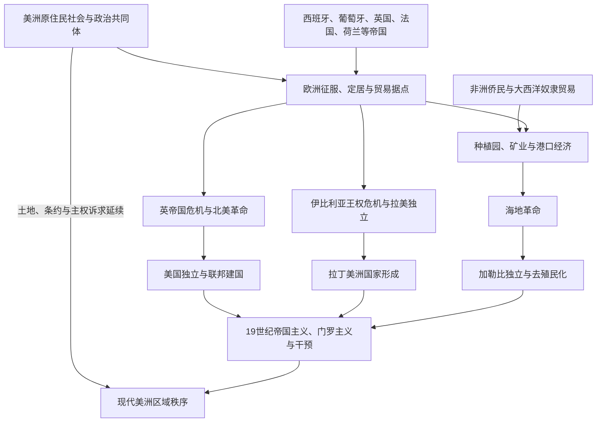

# 美洲殖民与独立

## 概括

本目录处理跨越北美、中美洲、加勒比和南美的共同历史：欧洲帝国以征服、贸易公司、传教、定居、种植园和矿业进入美洲；大西洋奴隶贸易把非洲被强迫迁移者及其后代置于美洲社会的中心；18至19世纪的美国革命、海地革命和拉丁美洲独立战争摧毁或重组殖民帝国。独立后的国家仍面临外债、贸易依赖、边界争端、门罗主义和欧洲—美国干预等问题。

## 职责边界

- 本目录是美洲殖民、奴隶贸易、革命、独立与19世纪干预的跨区域规范入口，负责比较共同机制和区域差异。
- 北美、中美洲、加勒比与南美目录负责当地事件、政治实体和国家形成；相关国家页负责本国阶段，不在本目录复制完整国家通史。
- 欧洲接触以前的文明与历史空间仍归各区域入口维护，例如[中部美洲文明](/%E4%BA%BA%E6%96%87%E7%A7%91%E5%AD%A6/%E5%8E%86%E5%8F%B2/%E7%BE%8E%E6%B4%B2/%E4%B8%AD%E7%BE%8E%E6%B4%B2/%E4%B8%AD%E9%83%A8%E7%BE%8E%E6%B4%B2%E6%96%87%E6%98%8E.md)与[安第斯文明与印加帝国](/%E4%BA%BA%E6%96%87%E7%A7%91%E5%AD%A6/%E5%8E%86%E5%8F%B2/%E7%BE%8E%E6%B4%B2/%E5%8D%97%E7%BE%8E/%E5%AE%89%E7%AC%AC%E6%96%AF%E6%96%87%E6%98%8E%E4%B8%8E%E5%8D%B0%E5%8A%A0%E5%B8%9D%E5%9B%BD.md)。

## 跨区域演进图

## 专题入口

| 主题 | 入口 | 内容 |
|---|---|---|
| 殖民帝国 | [欧洲殖民帝国与美洲](/%E4%BA%BA%E6%96%87%E7%A7%91%E5%AD%A6/%E5%8E%86%E5%8F%B2/%E7%BE%8E%E6%B4%B2/%E6%AE%96%E6%B0%91%E4%B8%8E%E7%8B%AC%E7%AB%8B/%E6%AC%A7%E6%B4%B2%E6%AE%96%E6%B0%91%E5%B8%9D%E5%9B%BD%E4%B8%8E%E7%BE%8E%E6%B4%B2.md) | 西、葡、英、法、荷等帝国制度和区域差异。 |
| 奴隶贸易与侨民 | [大西洋奴隶贸易、种植园与侨民](/%E4%BA%BA%E6%96%87%E7%A7%91%E5%AD%A6/%E5%8E%86%E5%8F%B2/%E7%BE%8E%E6%B4%B2/%E6%AE%96%E6%B0%91%E4%B8%8E%E7%8B%AC%E7%AB%8B/%E5%A4%A7%E8%A5%BF%E6%B4%8B%E5%A5%B4%E9%9A%B6%E8%B4%B8%E6%98%93%E3%80%81%E7%A7%8D%E6%A4%8D%E5%9B%AD%E4%B8%8E%E4%BE%A8%E6%B0%91.md) | 中间航程、种植园、抵抗、废奴与非洲侨民。 |
| 革命与独立 | [美洲革命与独立浪潮](/%E4%BA%BA%E6%96%87%E7%A7%91%E5%AD%A6/%E5%8E%86%E5%8F%B2/%E7%BE%8E%E6%B4%B2/%E6%AE%96%E6%B0%91%E4%B8%8E%E7%8B%AC%E7%AB%8B/%E7%BE%8E%E6%B4%B2%E9%9D%A9%E5%91%BD%E4%B8%8E%E7%8B%AC%E7%AB%8B%E6%B5%AA%E6%BD%AE.md) | 美国革命、海地革命、拉美独立和巴西独立的比较。 |
| 19世纪干预 | [19世纪帝国主义与门罗主义](/%E4%BA%BA%E6%96%87%E7%A7%91%E5%AD%A6/%E5%8E%86%E5%8F%B2/%E7%BE%8E%E6%B4%B2/%E6%AE%96%E6%B0%91%E4%B8%8E%E7%8B%AC%E7%AB%8B/19%E4%B8%96%E7%BA%AA%E5%B8%9D%E5%9B%BD%E4%B8%BB%E4%B9%89%E4%B8%8E%E9%97%A8%E7%BD%97%E4%B8%BB%E4%B9%89.md) | 门罗主义、欧洲干预、美国扩张、债务与炮舰外交。 |

## 重要转折与时间节点

| 时间 | 转折 | 跨区域意义 |
|---|---|---|
| 1492年以后 | 欧洲跨大西洋接触与加勒比殖民 | 征服、疾病、强制劳动和全球航路开始重组美洲 |
| 1494年 | 《托德西利亚斯条约》 | 西葡试图分配海外扩张范围，原住民族并未参与 |
| 16世纪 | 墨西哥、安第斯征服及巴西糖业扩大 | 总督区、矿业、种植园和跨洋奴隶贸易形成 |
| 17世纪 | 英、法、荷等殖民势力扩大 | 定居殖民、毛皮边疆、公司和加勒比糖岛竞争加剧 |
| 1756—1763年 | 七年战争 | 英法北美力量重组，帝国财政改革促成革命危机 |
| 1775—1783年 | 美国革命 | 十三殖民地独立并建立共和国，奴隶制与原住民问题未解 |
| 1791—1804年 | 海地革命 | 被奴役者摧毁奴隶制和法国殖民统治 |
| 1808—1826年 | 伊比利亚王权危机与拉美独立战争 | 西葡大陆帝国解体，多国与巴西帝国形成 |
| 1823年 | 门罗主义提出 | 美国宣示反欧洲再殖民，后续解释随实力扩张而改变 |
| 1846—1848年 | 美墨战争 | 北美领土和美拉权力差距发生重大变化 |
| 1898年 | 美西战争 | 西班牙加勒比帝国终结，美国成为海外帝国强国 |
| 1903—1904年 | 巴拿马运河权与罗斯福推论 | 门罗主义转为美国在加勒比干预的依据之一 |

## 重要辨析

- 殖民并非从欧洲登陆那一刻起就完成统治。征服、条约、战争、原住民联盟、传教、贸易和地方妥协常持续数代。
- 奴隶贸易和种植园是近代美洲的制度核心，不能作为“背景”略去；不同殖民地的废奴日期和补偿安排也不相同。
- 美国、海地、拉丁美洲和巴西的独立过程相互影响，却有不同社会结构和国家形式。
- 门罗主义最初是1823年的外交声明，后来在不同阶段被扩大解释；不能把19世纪所有美国政策都直接等同于该宣言。

## 相关区域

- [北美历史](/%E4%BA%BA%E6%96%87%E7%A7%91%E5%AD%A6/%E5%8E%86%E5%8F%B2/%E7%BE%8E%E6%B4%B2/%E5%8C%97%E7%BE%8E/README.md)
- [中美洲与中部美洲](/%E4%BA%BA%E6%96%87%E7%A7%91%E5%AD%A6/%E5%8E%86%E5%8F%B2/%E7%BE%8E%E6%B4%B2/%E4%B8%AD%E7%BE%8E%E6%B4%B2/README.md)
- [加勒比历史](/%E4%BA%BA%E6%96%87%E7%A7%91%E5%AD%A6/%E5%8E%86%E5%8F%B2/%E7%BE%8E%E6%B4%B2/%E5%8A%A0%E5%8B%92%E6%AF%94/README.md)
- [南美历史](/%E4%BA%BA%E6%96%87%E7%A7%91%E5%AD%A6/%E5%8E%86%E5%8F%B2/%E7%BE%8E%E6%B4%B2/%E5%8D%97%E7%BE%8E/README.md)

## 直接上级

- [美洲历史](/%E4%BA%BA%E6%96%87%E7%A7%91%E5%AD%A6/%E5%8E%86%E5%8F%B2/%E7%BE%8E%E6%B4%B2/README.md)
