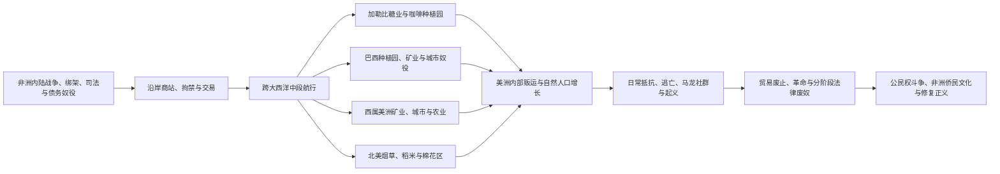

# 大西洋奴隶贸易、种植园与侨民

## 时间

15世纪中叶—19世纪末；非洲侨民社会、种族秩序、公民权和修复正义议题延续至今。

## 概括

跨大西洋奴隶贸易把约1,250万名被奴役的非洲人强迫送上大西洋船只，约1,070万人在美洲等地登陆；数字来自现存航运资料和统计推算，不能包括所有未记录运输、非洲内陆死亡与美洲内部强制迁徙。大多数抵达者被运往巴西和加勒比，而不是后来成为美国的地区。捕获、沿岸拘禁、中段航行、贩卖、劳动和家庭分离构成连续的暴力链条。

欧洲商人没有在一个“原本没有奴役”的非洲大陆上凭空创造奴隶制，但大西洋需求显著扩大人口商品化、战争、绑架、司法奴役和国家间竞争。非洲统治者、商人和中介的参与不能消除欧洲船主、殖民政府、种植园主和金融网络对跨洋体系的组织责任，也不能把所有非洲社会都写成同等获利者。

美洲种植园把土地、信贷、海运、加工设施、殖民军队和可继承的奴隶身份结合起来。糖、咖啡、烟草、稻米、靛蓝、棉花和矿业的收益支撑帝国财政与大西洋商业；被奴役者则通过工作节奏、家庭、宗教、市场、逃亡、马龙社群、船上反抗、起义、参军和诉讼不断争取生存与自由。法律废奴终结了人格财产制，却没有自动提供土地、赔偿、教育和政治平等。

## 制度链条

## 规模、方向与资料边界

| 项目 | 约略规模或分布 | 说明 |
|---|---|---|
| 强迫登船 | 约1,250万人 | 主要指有航次资料支持的跨大西洋估计，不含所有内陆死亡和未记录贩运 |
| 抵达大西洋另一岸 | 约1,070万人 | 船上疾病、饥饿、暴力、自杀和反抗造成大规模死亡 |
| 主要目的地 | 巴西与加勒比占绝大部分 | 英属北美 / 美国直接输入占比远低于其19世纪被奴役人口占比 |
| 高峰时期 | 18世纪及19世纪前期仍很活跃 | 废奴舆论兴起与实际贸易迅速扩大曾长期并存 |
| 航运记录范围 | 约1501—1866年最完整 | 数据库根据船只、港口、人数和相似航次推算缺失资料 |
| 美洲内部贩运 | 规模巨大但记录更分散 | 加勒比转运、巴西国内贸易、美国国内奴隶贸易等再次拆散家庭 |

统计应呈现为可修正的估计而非精确到个位的“总账”。现存资料多由商人、港口和镇压机构制造，记录人的数量，却常抹去姓名、家庭和个人经历。获救非洲人的姓名、广告、诉讼、教会记录、口述史和考古材料可帮助恢复个体生命。

## 体系形成

### 大西洋岛屿的先例

15世纪葡萄牙和西班牙在马德拉、加那利、圣多美等大西洋岛屿发展糖业，结合欧洲资本、土地征服、制糖技术和被奴役非洲劳工。岛屿经验后来被移植到巴西和加勒比，但规模、土地条件和帝国制度发生变化。

### 美洲人口灾难与劳动力制度

欧洲征服后，美洲原住民因疾病、战争、强制迁徙和劳动制度遭遇人口灾难。西班牙殖民者使用恩科米恩达、米塔等制度强征原住民劳动；葡萄牙、英国、法国、荷兰及其他殖民社会也奴役或强迫原住民。非洲奴隶贸易的扩大没有立即取代原住民劳动，两者长期并存并相互影响。

非洲劳工并非因为“天然适合”热带劳动而被选择。殖民者的军事和海运能力、既有奴隶贸易、疾病环境、逃亡条件、法律分类以及种植园对可持续补充劳动力的需求，共同推动了非洲人口的强迫输入。把原因归结为体质差异会重复奴隶制时代的种族神话。

### 国家、特许公司与私人资本

葡萄牙商人早期占据优势，荷兰、英国和法国在17—18世纪扩大参与。西班牙王室常通过“阿西恩托”合同授权外国商人向西属美洲供给被奴役者。英国皇家非洲公司、法国港口商人、荷兰西印度公司及各类私人船主参与运输，保险商、造船者、银行、军队、港口和殖民官员共同支撑体系。

所谓“三角贸易”可说明欧洲商品、非洲俘虏和美洲种植园产品之间的联系，却不是每艘船都完成同一三角路线。巴西—西非、加勒比岛际、美洲内部和欧洲直航等网络同样重要。

## 从捕获到中段航行

### 非洲内陆与海岸

被奴役者可能来自战争俘虏、绑架、惩罚、债务或政治清洗。非洲国家和商人会主动谈判、拒绝、参战或从交易获利，也有社会因人口流失、暴力和政治失衡遭受严重损害。欧洲人长期主要控制沿岸船只和商站，深入内陆的能力有限，因此依赖非洲中介；这种依赖不等于交易双方拥有相同全球权力。

俘虏被迫步行到海岸，在堡垒、船舱或临时围场中拘禁。内陆行程和等待装船已造成死亡、家庭分离与创伤，不能只从船离岸时开始计算暴力。

### 中段航行

船主在货运利润、航程速度和俘虏存活之间计算，拥挤、通风不良、疾病、营养不足和惩罚普遍存在。妇女、男子和儿童的拘禁方式及遭受的性暴力有所不同。船员死亡率也可能很高，但船员拥有法律人格和工作契约，被奴役者则被当作可出售财产，两者不可等同。

反抗贯穿航程，包括拒食、破坏设备、跳海、袭击船员和有组织夺船。船主以镣铐、隔离、鞭打和处决镇压。成功反抗较少留下殖民记录，但失败也迫使贩运者增加武装和防范成本。

## 种植园复合体

### 糖业

甘蔗必须在收割后迅速压榨和熬煮，种植园需要大片土地、磨坊、锅炉、熟练工匠、运输和密集劳动力。巴西东北、巴巴多斯、牙买加、圣多明各、古巴等地区先后成为糖业中心。高死亡率和极端工作强度使许多岛屿长期依赖持续输入新奴隶。

18世纪法属圣多明各成为世界最富庶的糖和咖啡殖民地之一，其财富与残酷劳动、种族等级和大量新输入非洲人口密不可分。1791年开始的海地革命证明种植园体系的强制稳定可以被被奴役者组织性摧毁。

### 烟草、稻米、靛蓝、咖啡与棉花

英属切萨皮克烟草种植园、卡罗来纳和乔治亚稻米与靛蓝区、巴西和加勒比咖啡区以及19世纪美国南部棉花区形成不同劳动制度。稻米种植大量使用来自西非稻作区的知识；棉花轧花和工业需求扩大后，美国国内奴隶贸易把上南部人口强迫迁往深南部。

矿山、牧场、码头、家庭、作坊和城市也广泛使用奴隶劳动。把奴隶制只写成“大种植园田间劳动”会遗漏女性家务劳动、技术工匠、租工、自营市场和城市社会。

### 土地、法律与种族化

殖民法把奴隶身份规定为终身、可买卖并常按母系继承，限制婚姻、移动、武器、识字和司法证词。肤色和血统逐渐被用来把社会差异自然化，形成白人自由与黑人奴役相联的种族秩序。各帝国法律不完全相同，实际生活也受自由有色人、混合家庭、城市市场和地方习惯影响，但人格财产化是共同核心。

## 被奴役者的生活与行动

| 行动领域 | 具体方式 | 历史意义 |
|---|---|---|
| 家庭与亲属 | 结婚、教养、代亲、跨种植园联系和寻找被卖亲属 | 在买卖和死亡压力下重建照料关系，奴隶法通常不充分承认其家庭权 |
| 生产知识 | 稻作、畜牧、金属、医药、航海、制糖和手工业 | 被奴役者不是无技能劳力，其知识直接创造殖民财富 |
| 宗教与文化 | 非洲宗教重组、基督教再解释、音乐、舞蹈、语言和饮食 | 形成海地伏都、坎东布雷、桑特里亚等多样传统，不能视为单一“非洲文化”复制 |
| 日常抵抗 | 放慢劳动、隐匿产物、破坏工具、争取休息和维持禁忌 | 不一定推翻制度，却持续限制种植园主控制 |
| 市场与赎身 | 出售自种产品、受雇劳动、积蓄和购买自由 | 在部分城市和殖民地形成有限空间，仍受主人和法律约束 |
| 逃亡与马龙社会 | 短期离开、长期隐居、加入独立聚落 | 巴西基隆博、牙买加马龙和苏里南群体建立持久政治共同体 |
| 起义与参军 | 船上暴动、种植园起义、革命战争和以军役换自由 | 使殖民政府不断调整警察、军队和解放政策 |
| 法律与请愿 | 自由诉讼、洗礼和婚姻权主张、废奴请愿 | 利用帝国自身法律矛盾扩大自由空间 |

强调行动能力不应浪漫化奴役。人在极端强制下作出的生存选择，不代表制度较温和；合作、谈判和反抗也可能在同一人生中并存。

## 马龙社群与起义

逃亡者在山区、森林、沼泽和殖民边界建立聚落。巴西帕尔马雷斯在17世纪形成大型基隆博联盟；牙买加马龙与英国殖民军长期战争后签订条约；苏里南多个马龙民族通过战争和谈判获得自治。马龙社群与原住民、自由人和种植园之间既有联盟、贸易，也有冲突，不能概括为与外界完全隔绝。

重大起义包括17—18世纪加勒比和南美多次奴隶暴动、1763年伯比斯起义、1791年圣多明各起义及其发展成海地革命、1831—1832年牙买加浸信会战争等。起义的直接结果不同，但共同提高殖民镇压成本，并迫使废奴运动面对被奴役者主动争取自由的事实。

## 废奴进程

废奴不是欧洲思想家单方面“赠予”的改革。被奴役者起义和逃亡、自由黑人组织、宗教与世俗废奴主义、革命战争、经济变化、奴隶主补偿政治及国家竞争共同作用。

| 时间 | 地区或措施 | 结果与限制 |
|---|---|---|
| 1791—1804年 | 海地革命 | 被奴役者摧毁圣多明各奴隶制并建立独立国家，对整个大西洋形成震动 |
| 1807—1808年 | 英国、美国禁止本国跨洋奴隶贸易 | 未立即废除境内奴隶制；走私和他国贸易持续 |
| 1833—1838年 | 英属帝国废奴及“学徒制”结束 | 奴隶主获得巨额补偿，被解放者普遍未获土地补偿 |
| 1848年 | 法属殖民地废奴 | 第二共和国废除殖民奴隶制，此前法国曾在1794年废除、拿破仑于1802年恢复 |
| 1848年 | 丹属西印度群岛废奴 | 起义压力促使总督宣布解放 |
| 1863年 | 荷属殖民地废奴 | 苏里南等地随后实行过渡性国家监督劳动 |
| 1865年 | 美国宪法第十三修正案 | 正式废除奴隶制，但保留刑罚例外，重建失败后种族压迫重组 |
| 1886年 | 古巴废奴 | 西班牙美洲主要奴隶制中心之一终结，过渡劳动制度此前延缓自由 |
| 1888年 | 巴西《黄金法》 | 美洲最后一个大型奴隶制国家正式废奴，未实施土地改革或普遍补偿 |

英国海军镇压贸易、国际条约和混合法庭拦截部分船只，但19世纪上半叶巴西与古巴的非法输入仍然庞大。禁止贸易、废除奴隶身份和实现平等是三个不同阶段。

## 非洲侨民社会

“非洲侨民”不是一个起源、语言和文化完全统一的群体。西非、中西非、东南非及印度洋地区的人被迫汇入不同美洲社会，世代出生于美洲的人又形成新的地方身份。共同的黑人认同常在种族压迫和政治组织中发展，不能倒推为所有初抵者原有的单一身份。

侨民创造和重组了语言、宗教、音乐、舞蹈、饮食、农业技术、军事传统和政治思想。克里奥尔语、爵士及其他音乐传统、非裔宗教、狂欢节和烹饪并非种植园暴力的“正面补偿”，而是人在压迫中创造社会的成果。它们构成美洲文化核心，而不是边缘附属。

自由黑人、马龙群体、海地革命者、废奴主义者、重建时期政治人物、工会和20世纪民权及反殖民运动，把大西洋不同地区相连。侨民史也包括返回非洲、移居欧洲及加勒比内部迁徙。

## 经济影响与争议

奴隶贸易和种植园收益推动港口、造船、保险、信贷、炼糖、纺织原料和帝国财政。它们对英国工业革命、欧洲资本形成和美洲国家发展的贡献程度存在学术争论，但不能因争论具体比例而否认奴役是大西洋经济的结构性组成。

种植园财富高度集中，土地和政治权力由少数精英控制。废奴后，契约劳工、债务劳动、佃农制、刑罚劳工和移民劳工常接替部分生产，而种族等级继续决定工资、土地、教育和司法。经济“现代化”没有自动消除奴隶制遗产。

## 长期影响

- **人口与家庭**：数百万人的强迫迁移和美洲内部贩运重塑大西洋人口，留下难以恢复的亲属断裂。
- **国家与资本**：殖民财政、港口、金融和商品市场依赖奴役收益，相关机构积累延续至废奴以后。
- **土地不平等**：种植园土地集中和未进行充分解放后改革，使许多后代长期缺乏资产。
- **种族秩序**：奴隶法建立的肤色等级在公民身份、警务、住房和劳动市场中以新形式延续。
- **文化与政治**：非洲侨民是美洲语言、宗教、艺术、食物和民主斗争的建构者。
- **记忆与修复正义**：纪念、档案开放、教育、道歉、返还和赔偿方案争论，关注的不只是过去责任，也包括可量化的持续不平等。

## 关键辨析

- **非洲存在旧有奴役不等于大西洋体系只是旧制度延续**：跨洋规模、终身世袭、种族法和全球商品生产造成质变。
- **“三角贸易”不是固定航线模板**：实际包含多边、双边、美洲内部和非洲—巴西等路线。
- **抵达美国者不是跨洋输入的多数**：巴西和加勒比是最主要目的地。
- **种植园之外也有奴隶制**：矿业、牧业、家庭、港口、军队和城市手工业同样使用被奴役劳动。
- **行动能力不等于自由**：生存、谈判和文化创造发生在强制结构中。
- **禁运、废奴和平等不是同一事件**：法律改变之后仍需土地、公民权和反种族主义斗争。
- **侨民文化不是静止“遗产”**：它持续创新并塑造当代美洲。

## 演变关系

- 殖民制度框架：[欧洲殖民帝国与美洲](/%E4%BA%BA%E6%96%87%E7%A7%91%E5%AD%A6/%E5%8E%86%E5%8F%B2/%E7%BE%8E%E6%B4%B2/%E6%AE%96%E6%B0%91%E4%B8%8E%E7%8B%AC%E7%AB%8B/%E6%AC%A7%E6%B4%B2%E6%AE%96%E6%B0%91%E5%B8%9D%E5%9B%BD%E4%B8%8E%E7%BE%8E%E6%B4%B2.md)。
- 非洲来源与社会变化：[西非历史](/%E4%BA%BA%E6%96%87%E7%A7%91%E5%AD%A6/%E5%8E%86%E5%8F%B2/%E9%9D%9E%E6%B4%B2/%E8%A5%BF%E9%9D%9E/README.md)、[中非历史](/%E4%BA%BA%E6%96%87%E7%A7%91%E5%AD%A6/%E5%8E%86%E5%8F%B2/%E9%9D%9E%E6%B4%B2/%E4%B8%AD%E9%9D%9E/README.md)。
- 革命转折：[海地革命与法属加勒比](/%E4%BA%BA%E6%96%87%E7%A7%91%E5%AD%A6/%E5%8E%86%E5%8F%B2/%E7%BE%8E%E6%B4%B2/%E5%8A%A0%E5%8B%92%E6%AF%94/%E6%B5%B7%E5%9C%B0%E9%9D%A9%E5%91%BD%E4%B8%8E%E6%B3%95%E5%B1%9E%E5%8A%A0%E5%8B%92%E6%AF%94.md)。
- 巴西主线：[巴西历史](/%E4%BA%BA%E6%96%87%E7%A7%91%E5%AD%A6/%E5%8E%86%E5%8F%B2/%E7%BE%8E%E6%B4%B2/%E5%8D%97%E7%BE%8E/%E5%B7%B4%E8%A5%BF/README.md)。
- 美国奴隶制与内战：[分裂危机与南北战争](/%E4%BA%BA%E6%96%87%E7%A7%91%E5%AD%A6/%E5%8E%86%E5%8F%B2/%E7%BE%8E%E6%B4%B2/%E5%8C%97%E7%BE%8E/%E7%BE%8E%E5%9B%BD/%E5%88%86%E8%A3%82%E5%8D%B1%E6%9C%BA%E4%B8%8E%E5%8D%97%E5%8C%97%E6%88%98%E4%BA%89.md)。
- 所属总览：[美洲殖民与独立](/%E4%BA%BA%E6%96%87%E7%A7%91%E5%AD%A6/%E5%8E%86%E5%8F%B2/%E7%BE%8E%E6%B4%B2/%E6%AE%96%E6%B0%91%E4%B8%8E%E7%8B%AC%E7%AB%8B/README.md)。
