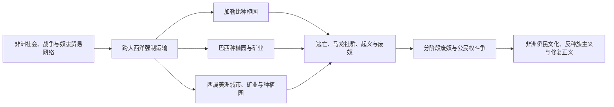

# 大西洋奴隶贸易、种植园与侨民

## 时间

16世纪至19世纪；非洲侨民社会、种族秩序和修复正义议题延续至今。

## 概括

跨大西洋奴隶贸易把数以千万计的非洲人强迫迁移到美洲，死亡、分离和暴力贯穿捕获、运输和种植园劳动。加勒比、巴西和西属美洲的糖、咖啡、烟草、棉花、矿业和港口经济高度依赖奴隶劳动；北美奴隶制则与种植园农业、国内奴隶贸易和领土扩张相连。被奴役者并非没有行动能力：家庭、宗教、市场、逃亡、马龙社群、起义和法律斗争构成持续抵抗。

## 制度链条

## 重要过程

- “三角贸易”是理解商业路线的概念，不能掩盖各地参与者、商品和暴力形式的复杂差异。
- 18世纪加勒比糖业和法属圣多明各种植园是世界经济的重要中心，建立在极端奴役之上。
- 巴西是跨大西洋奴隶贸易的重要目的地；奴隶制直到1888年才在法律上废除。
- 英帝国1830年代、法属殖民地1848年、美国1865年、西班牙加勒比较晚废奴；法律废奴不等于立即实现土地、教育或政治平等。
- 逃奴社群在巴西、牙买加、苏里南等地形成持久共同体，并同殖民政府进行战争或谈判。
- 音乐、宗教、语言、饮食、家庭和政治传统表明非洲侨民不是“遗产”，而是美洲社会的持续建构者。

## 演变关系

- 殖民框架：[欧洲殖民帝国与美洲](/%E4%BA%BA%E6%96%87%E7%A7%91%E5%AD%A6/%E5%8E%86%E5%8F%B2/%E7%BE%8E%E6%B4%B2/%E6%AE%96%E6%B0%91%E4%B8%8E%E7%8B%AC%E7%AB%8B/%E6%AC%A7%E6%B4%B2%E6%AE%96%E6%B0%91%E5%B8%9D%E5%9B%BD%E4%B8%8E%E7%BE%8E%E6%B4%B2.md)。
- 海地革命：[海地革命与法属加勒比](/%E4%BA%BA%E6%96%87%E7%A7%91%E5%AD%A6/%E5%8E%86%E5%8F%B2/%E7%BE%8E%E6%B4%B2/%E5%8A%A0%E5%8B%92%E6%AF%94/%E6%B5%B7%E5%9C%B0%E9%9D%A9%E5%91%BD%E4%B8%8E%E6%B3%95%E5%B1%9E%E5%8A%A0%E5%8B%92%E6%AF%94.md)。
- 巴西：[巴西历史](/%E4%BA%BA%E6%96%87%E7%A7%91%E5%AD%A6/%E5%8E%86%E5%8F%B2/%E7%BE%8E%E6%B4%B2/%E5%8D%97%E7%BE%8E/%E5%B7%B4%E8%A5%BF/README.md)。
- 美国奴隶制与内战：[分裂危机与南北战争](/%E4%BA%BA%E6%96%87%E7%A7%91%E5%AD%A6/%E5%8E%86%E5%8F%B2/%E7%BE%8E%E6%B4%B2/%E5%8C%97%E7%BE%8E/%E7%BE%8E%E5%9B%BD/%E5%88%86%E8%A3%82%E5%8D%B1%E6%9C%BA%E4%B8%8E%E5%8D%97%E5%8C%97%E6%88%98%E4%BA%89.md)。
- 所属总览：[美洲殖民与独立](/%E4%BA%BA%E6%96%87%E7%A7%91%E5%AD%A6/%E5%8E%86%E5%8F%B2/%E7%BE%8E%E6%B4%B2/%E6%AE%96%E6%B0%91%E4%B8%8E%E7%8B%AC%E7%AB%8B/README.md)。
