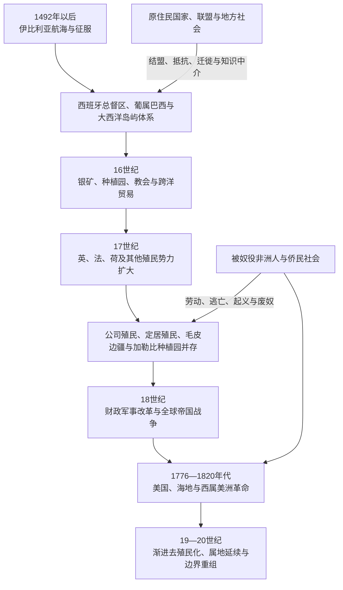

# 欧洲殖民帝国与美洲

## 时间

15世纪末—19世纪；若干海外属地、自治领关系和未完成去殖民化问题延续至今。

## 概括

欧洲在美洲的殖民扩张不是一张空白地图被迅速涂色，也不是各帝国复制同一模式。西班牙依靠征服联盟、城市、总督区、教会、矿业和原住民贡役建立广阔帝国；葡萄牙在巴西以沿海种植园、奴隶贸易、矿业和内陆远征扩展；英国在北美和加勒比分别形成定居殖民、贸易港与种植园社会；法国、荷兰、丹麦、瑞典和俄国则以毛皮、港口、岛屿、公司与海上网络参与竞争。

殖民者的法律声明经常早于实际控制。美洲原住民国家、联盟、村社和流动社会通过战争、外交、迁徙、贸易、传教关系与生态知识限制并重塑帝国边界。非洲被奴役者及其后代则是种植园、矿业、城市和港口的核心劳动者，也是革命、马龙社会和废奴运动的主体。

殖民帝国既产生跨大西洋国家和商业体系，也造成疾病、人口灾难、土地剥夺、奴役、文化压制和种族等级。殖民统治的结束并非一次同步事件：美国、海地和拉丁美洲在18—19世纪革命独立，加拿大和加勒比多地走向自治或渐进去殖民化，格陵兰、波多黎各、法属美洲等则形成不同的现代属地或自治关系。

## 扩张与竞争主线

## 扩张背景与条件

| 条件 | 具体机制 | 历史作用 |
|---|---|---|
| 大西洋航海 | 船型、风带知识、制图、港口和远洋融资 | 使欧洲王室和商人维持跨海航线，但高度依赖地方向导与经验 |
| 王室竞争 | 卡斯蒂利亚、葡萄牙及后来的英法荷争夺贸易、税收和战略据点 | 把美洲战争同欧洲和非洲战争连接起来 |
| 教皇敕令与条约 | 伊比利亚王权以宗教和《托德西利亚斯条约》等主张分界 | 提供欧洲内部合法性，原住民族并未同意其分配 |
| 征服联盟 | 殖民军与反对墨西加、印加或地方对手的原住民结盟 | 少量欧洲人得以击败大国，但盟友目标与殖民者并不相同 |
| 疾病与人口变化 | 天花、麻疹等传染病在缺乏既往免疫的人口中传播 | 造成巨大人口损失，破坏政治与生产，却不是征服的唯一原因 |
| 金银与商品需求 | 波托西、墨西哥银矿，糖、烟草、毛皮、染料等 | 支撑帝国财政、海运和强制劳动体系 |
| 公司与私人资本 | 特许公司、商人、种植园主、传教团和边疆远征者 | 国家把成本和风险转给私人，随后常加强直接管理 |
| 军事技术与堡垒 | 火器、钢铁、战马、海军和沿海据点 | 形成局部优势，但在内陆、森林与草原长期受补给和地方抵抗限制 |

## 西班牙帝国

### 建立过程

1492年以后，西班牙先在加勒比建立殖民据点。对泰诺等原住民的强制劳动、战争和疾病造成严重人口灾难。1519—1521年，科尔特斯联合特拉斯卡拉等墨西加敌对势力攻占特诺奇蒂特兰；1530年代皮萨罗集团利用印加内战、俘虏阿塔瓦尔帕并争夺安第斯核心。征服不是首都陷落即告完成，玛雅地区、智利南部、北部边疆和亚马孙周边的战争持续数十年至数百年。

西班牙在原有城市、道路、贡纳和地方首领体系上建立殖民行政。原住民盟友、翻译、贵族和社区保留不同程度权利，同时受到贡赋、土地侵占、强制劳动和宗教改造。殖民社会并非欧洲人完全取代本地制度，而是权力不平等下的重组。

### 行政结构

| 机构或角色 | 职能 | 实际权力与限制 |
|---|---|---|
| 国王与印度事务机构 | 颁布法律、任命官员、管理贸易和司法 | 距离造成信息迟延，地方官员与精英拥有裁量 |
| 总督 | 代表王权统筹军政、财政和司法 | 受审问制度、法院、教会及地方利益约束 |
| 审理院 | 高等法院并承担部分行政职能 | 在总督缺位或冲突时可能成为实际权力中心 |
| 地方总督与边疆军政长官 | 管理省份、战争和防务 | 边疆更依赖军队、传教站与地方联盟 |
| 市政会 | 城市土地、市场、治安与地方政治 | 常由克里奥尔精英控制，也有原住民市镇组织 |
| 教会和修会 | 传教、教育、土地、登记和道德司法 | 既可批评虐待，也深度参与文化改造与殖民秩序 |
| 原住民首领和村社 | 征集贡赋、调解土地与社区事务 | 能维护部分共同体权利，也可能承受殖民征收压力 |

新西班牙总督区于1535年建立，秘鲁总督区于1542年建立；18世纪又设新格拉纳达和拉普拉塔总督区，以加强财政、防务和边疆管理。行政边界会反复变化，不能直接视为现代国家的固定前身。

### 劳动、土地与贸易

恩科米恩达把特定社区贡纳或劳动收益授予征服者，并非形式上的土地所有权，却造成严重强制。王室逐步限制世袭后， repartimiento、安第斯米塔、庄园债务和矿业劳动继续存在。殖民法名义上把原住民视为王室臣民而非奴隶，但例外、非法奴役和实际强迫十分普遍。

塞维利亚—加的斯垄断与船队制度试图控制美洲贸易，走私和跨帝国交易始终存在。白银流向欧洲并经马尼拉联系亚洲，西班牙美洲因而属于全球贸易体系。

## 葡萄牙帝国与巴西

葡萄牙最初把巴西海岸用于巴西木贸易，16世纪30年代设世袭领地，1549年设总督以加强中央管理。领地制度成效不一，地方种植园主、城市、教会和王室官员共同构成统治。

东北糖业依赖原住民和非洲奴隶劳动，后者规模不断扩大。17世纪荷兰一度占领巴西东北重要糖区，1654年被逐出。班代兰特从圣保罗向内陆远征，寻找奴隶和矿产，攻击原住民和传教聚落；他们扩大葡萄牙实际控制，却不完全服从王室。

18世纪米纳斯吉拉斯金矿和钻石推动人口向内陆迁移，王室加强税收并迁都里约热内卢。葡萄牙在实践中越过《托德西利亚斯条约》界线，通过占领、河流和后续条约扩大巴西。1808年王室逃避拿破仑入侵迁至里约，使殖民地成为帝国政治中心，并为1822年相对连续的君主制独立创造条件。

## 英国帝国

### 北美殖民地

英国北美殖民地包括公司殖民地、业主殖民地和王室殖民地。弗吉尼亚以烟草和契约劳工起步，17世纪后越来越依赖非洲奴隶；新英格兰以小农、港口、宗教共同体和海上贸易为主；中部殖民地具有多民族农业和城市经济。差异不能被“十三殖民地模式”抹平。

殖民议会控制部分税收和地方法律，总督代表王室或业主。长期的地方自治经验不表示殖民地民主平等：投票受财产、性别和种族限制，原住民土地被扩张，被奴役者没有政治人格。

英国通过航海法和海关推行重商主义，但走私广泛。七年战争后伦敦试图让殖民地承担防务成本，加强税收和驻军，直接激化北美革命。

### 加拿大和加勒比

英国在17—18世纪扩大加勒比糖岛，奴隶制和种植园主政治占核心。1763年击败法国后取得加拿大，但保留魁北克天主教和法国民法的部分地位，以便统治法裔居民。美国革命后，效忠派迁入英属北美，殖民行政与人口结构重组。

英国19世纪废奴并逐步发展责任政府和自治领制度，因此不同地区从直接殖民到自治的路径远比一次“独立宣言”复杂。加勒比许多殖民地到20世纪才独立，部分仍为英国海外领地。

## 法国帝国

法国在圣劳伦斯河、五大湖和密西西比河流域建立新法兰西，以毛皮、传教站、堡垒和原住民联盟维持广阔但人口稀少的网络。总督负责军事外交，行政官负责司法财政，领主制组织部分加拿大乡村。法国对内陆的控制依赖休伦—温达特、阿尔冈昆及后来多种联盟，联盟伙伴并非法国属民。

加勒比法属岛屿走向另一模式。马提尼克、瓜德罗普和圣多明各发展糖、咖啡和奴隶种植园；《黑法典》试图规范奴隶制与宗教，不能使制度变得温和。圣多明各的财富和人口结构最终孕育1791年奴隶革命。

1763年《巴黎条约》后，法国失去加拿大及多数北美大陆领地，但保留重要加勒比殖民地。拿破仑于1803年出售路易斯安那，与海地战争失败和欧洲战略有关。

## 荷兰及其他殖民势力

### 荷兰

荷兰西印度公司经营新尼德兰、加勒比据点、奴隶贸易和一度占领的巴西东北。新阿姆斯特丹是多语贸易港，1664年被英国占领并改为纽约。苏里南的种植园与奴隶制发展，马龙社会在内陆长期抵抗。荷兰加勒比和苏里南后来走向不同的自治、独立或属地路径。

### 丹麦、瑞典与库尔兰

丹麦经营格陵兰、加勒比西印度群岛和贸易据点，1917年把丹属西印度群岛售予美国，成为美属维尔京群岛。丹麦—挪威在格陵兰的殖民及后来的自治关系属于北大西洋的独特路径。

瑞典在特拉华河建立新瑞典，1655年被荷兰征服；库尔兰在多巴哥有短暂尝试。这些小型殖民项目规模有限，却说明美洲竞争并非只有五大帝国。

### 俄国

俄国从西伯利亚、堪察加和阿留申群岛进入阿拉斯加，以海獭皮和特许公司建立俄属美洲。殖民者依赖阿留申等原住民航海与捕猎知识，也使用强迫劳动和暴力。补给成本、人口稀少及英美竞争使殖民脆弱，俄国于1867年把阿拉斯加售予美国。

## 原住民政治与边疆

| 地区 | 原住民作用 | 对殖民边界的影响 |
|---|---|---|
| 墨西哥与安第斯核心 | 联盟、翻译、贡赋、村社诉讼和长期反抗 | 欧洲征服依赖本地盟友，殖民制度重用并改造既有政治 |
| 北美东北与五大湖 | 毛皮贸易、军盟和中立外交 | 英法竞争受易洛魁联盟、休伦—温达特等政治选择影响 |
| 大平原与西南 | 马文化、贸易、突袭和部落联盟 | 科曼奇等力量建立区域霸权，西班牙和后来国家边界长期有限 |
| 智利南部 | 马普切战争、议会和边界外交 | 西班牙未能完全征服比奥比奥河以南，形成长期谈判边疆 |
| 亚马孙与巴西内陆 | 迁徙、传教聚落、奴隶袭击和逃避 | 葡萄牙领土扩大不等于持续控制，许多社会保持自主 |
| 北极与阿拉斯加 | 海洋知识、抵抗和贸易 | 俄国公司高度依赖原住民劳动，楚科奇等迫使帝国改变策略 |
| 加勒比 | 泰诺、加勒比等社会的抵抗与人口灾难 | 早期殖民暴力和疾病重塑岛屿人口，原住民后裔并未完全消失 |

原住民族会在帝国间选择盟友、利用贸易取得武器、迁入边境或起诉殖民官员。某次结盟不是永久“亲某帝国”，而是面对地方对手、土地和生存压力的策略。殖民地图中标注的领地应理解为主张范围，而非每处都被稳定统治。

## 教会、传教与文化改造

天主教修会、英法新教团体和俄国东正教传教士建立教堂、学校、语言文本和定居点。传教士有时反对殖民者非法奴役，帮助社区在法律中申诉；传教体系也推动迁居、劳动纪律、宗教压制和儿童教育控制。

原住民和非洲侨民并非只在“接受”或“拒绝”之间选择。他们会把圣徒、仪式、亲族和地方神圣空间重新组合，形成混合或并存传统。正式洗礼记录不能证明原有信仰完全消失。

## 帝国战争与边界转移

| 时间 | 战争或条约 | 美洲结果 |
|---|---|---|
| 1494年 | 《托德西利亚斯条约》 | 西葡试图划分海外势力，实际边界后来被殖民推进改写 |
| 1580—1640年 | 伊比利亚联盟及英荷战争 | 葡萄牙殖民地更易遭西班牙敌国攻击，荷兰进入巴西和加勒比 |
| 1654—1667年 | 荷兰退出巴西、英荷条约调整 | 葡萄牙恢复巴西东北，英国巩固纽约，荷兰保留苏里南等地 |
| 1701—1714年 | 西班牙王位继承战争 | 英国取得贸易和战略利益，奴隶贸易合同成为竞争内容 |
| 1754—1763年 | 七年战争的美洲战场 | 英国取得加拿大并扩大优势，法国北美大陆帝国基本终结 |
| 1775—1783年 | 美国独立战争 | 十三殖民地独立，英属北美和原住民边界重组 |
| 1791—1804年 | 海地革命 | 法属圣多明各奴隶制与殖民统治被推翻 |
| 1808年以后 | 拿破仑战争与伊比利亚王权危机 | 西葡美洲合法性断裂，独立战争扩大 |
| 1867年 | 俄国出售阿拉斯加 | 俄国退出北美领土统治，美国扩展至北太平洋 |

## 殖民体系的鼎盛条件

- **跨洋财政军事国家**：海军、税收、特许公司和战争信贷保护航线与港口。
- **强制劳动**：原住民贡役、非洲奴隶制、契约劳动和债务劳动支撑矿业与种植园。
- **地方中介**：原住民首领、混合家庭、翻译、克里奥尔精英和自由有色人连接帝国与社区。
- **城市与港口**：墨西哥城、利马、哈瓦那、萨尔瓦多、魁北克、波士顿等组织行政和贸易。
- **生态与商品互补**：银、糖、烟草、毛皮、咖啡、棉花等进入全球市场。
- **法律差异化**：帝国按种族、身份、出生地和法人特权分配权利，以分层治理维持秩序。

## 衰落与转型原因

| 因素类型 | 具体表现 | 作用 |
|---|---|---|
| 结构矛盾 | 殖民地承担税收和贸易限制，却缺乏平等政治代表 | 地方精英、商人和普通居民对宗主国不满累积 |
| 人口与社会变化 | 克里奥尔、本地出生人口、自由有色人与多种地方身份增长 | 殖民社会形成不同于宗主国的政治利益 |
| 强制制度危机 | 奴隶反抗、原住民战争、马龙社会和边疆成本 | 证明统治需要持续暴力且并非稳定 |
| 帝国竞争 | 七年战争、美国独立战争、法国革命战争和拿破仑战争 | 财政压力和宗主国战败削弱殖民控制 |
| 思想与法律 | 自然权、人民主权、自由贸易和废奴论述传播 | 为不同群体提供政治语言，但实际适用高度选择性 |
| 改革反作用 | 波旁和庞巴尔式财政行政集中 | 提高收入，也损害地方特权并激发反抗 |
| 直接触发 | 1770年代英美税制危机、1791年圣多明各起义、1808年伊比利亚王权崩溃 | 把长期矛盾转化为革命和独立战争 |

帝国衰落并不等于殖民关系完全结束。独立国家常继承殖民边界、土地集中、种族分类和出口结构；加拿大、加勒比和北大西洋属地则通过自治、联邦、王室关系或公投走向不同政治地位。

## 长期影响

- 西班牙语、葡萄牙语、英语、法语和荷兰语成为主要国家语言，同时与原住民语言、克里奥尔语和非洲侨民语言并存。
- 罗马法、普通法、天主教和新教制度影响国家法律与教育，但地方社会不断改造它们。
- 殖民边界成为许多现代国界来源，也制造跨境民族和长期争端。
- 大庄园、种植园、保留地和国有土地制度形成不均等土地结构。
- 种族、血统、奴隶身份和公民资格的殖民分类在独立后以新形式延续。
- 美洲、欧洲、非洲和亚洲被矿产、商品、移民与强迫迁徙连接成全球体系。
- 原住民主权、属地地位、档案与文物返还、语言恢复和修复正义仍是未完成的去殖民化议题。

## 关键辨析

- **发现不等于无人居住地区的首次历史**：欧洲航海是跨大西洋接触的转折，不是美洲历史起点。
- **征服不等于立即控制全境**：边疆、森林、草原和高地长期由原住民政治塑造。
- **殖民帝国模式不同但共享强制核心**：行政、宗教和自治程度有别，土地剥夺与不平等劳动普遍存在。
- **传教不只是保护或压迫之一**：两种作用可能由同一机构在不同情境同时产生。
- **克里奥尔不等于单一族群**：词义随西葡、法语和其他殖民语境变化。
- **独立不自动完成去殖民化**：边界、土地、种族和属地问题可延续数代。

## 演变关系

- 强制劳动与侨民：[大西洋奴隶贸易、种植园与侨民](/%E4%BA%BA%E6%96%87%E7%A7%91%E5%AD%A6/%E5%8E%86%E5%8F%B2/%E7%BE%8E%E6%B4%B2/%E6%AE%96%E6%B0%91%E4%B8%8E%E7%8B%AC%E7%AB%8B/%E5%A4%A7%E8%A5%BF%E6%B4%8B%E5%A5%B4%E9%9A%B6%E8%B4%B8%E6%98%93%E3%80%81%E7%A7%8D%E6%A4%8D%E5%9B%AD%E4%B8%8E%E4%BE%A8%E6%B0%91.md)。
- 革命与解体：[美洲革命与独立浪潮](/%E4%BA%BA%E6%96%87%E7%A7%91%E5%AD%A6/%E5%8E%86%E5%8F%B2/%E7%BE%8E%E6%B4%B2/%E6%AE%96%E6%B0%91%E4%B8%8E%E7%8B%AC%E7%AB%8B/%E7%BE%8E%E6%B4%B2%E9%9D%A9%E5%91%BD%E4%B8%8E%E7%8B%AC%E7%AB%8B%E6%B5%AA%E6%BD%AE.md)。
- 19世纪外部控制：[19世纪帝国主义与门罗主义](/%E4%BA%BA%E6%96%87%E7%A7%91%E5%AD%A6/%E5%8E%86%E5%8F%B2/%E7%BE%8E%E6%B4%B2/%E6%AE%96%E6%B0%91%E4%B8%8E%E7%8B%AC%E7%AB%8B/19%E4%B8%96%E7%BA%AA%E5%B8%9D%E5%9B%BD%E4%B8%BB%E4%B9%89%E4%B8%8E%E9%97%A8%E7%BD%97%E4%B8%BB%E4%B9%89.md)。
- 所属总览：[美洲殖民与独立](/%E4%BA%BA%E6%96%87%E7%A7%91%E5%AD%A6/%E5%8E%86%E5%8F%B2/%E7%BE%8E%E6%B4%B2/%E6%AE%96%E6%B0%91%E4%B8%8E%E7%8B%AC%E7%AB%8B/README.md)。
