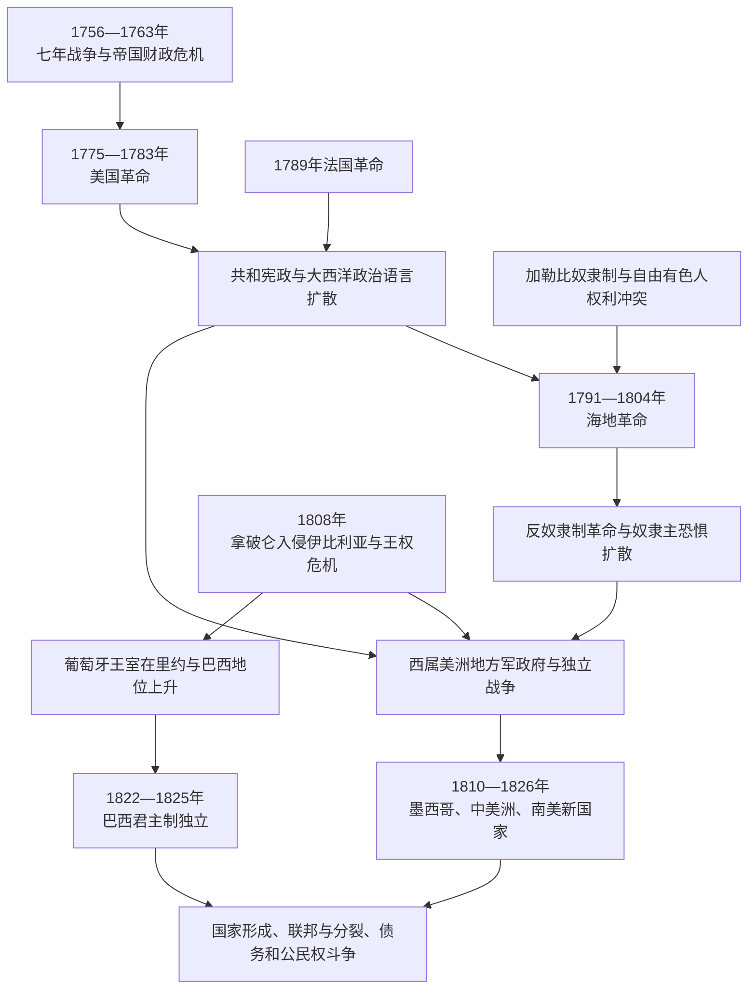

# 美洲革命与独立浪潮

## 时间

1775—1826年为第一轮核心；加拿大、加勒比和其他属地的自治与去殖民化延续至20—21世纪。

## 概括

美洲革命共享帝国战争、财政改革、地方自治、启蒙政治语言、奴隶制和种族等级等背景，却不是一场统一运动。十三殖民地革命建立联邦共和国但保留奴隶制并扩大对原住民土地的侵占；海地革命由被奴役者摧毁奴隶制和法国殖民统治；西属美洲在1808年王权危机后爆发多条革命战线；巴西因葡萄牙王室迁居里约而走向君主制独立。中美洲、加拿大和加勒比又形成不同的联邦、自治和渐进去殖民化路径。

“独立”不能只按宣言日期判断。地方政权建立、王党军失败、宗主国承认、宪法运行、边界控制和国际融资常发生在不同年份。革命参与者的目标也不同：克里奥尔精英可能争取自治和贸易自由，被奴役者争取人身解放，原住民共同体关心土地和贡役，士兵与农民关心征税、军役和地方权力，妇女在供应、情报、请愿与政治社群中发挥作用，却往往被新宪法排除。

## 革命与独立主线

## 共同背景

### 帝国战争与财政集中

七年战争及其他全球战争使欧洲列强背负债务。英国在北美加强税收、海关和驻军；西班牙波旁王朝提高税收、重组军队、限制地方职位并强化贸易管理；葡萄牙庞巴尔改革也试图集中行政。改革提高帝国收入，却触动殖民地议会、商人、教会和地方精英的既得权力。

殖民地反税并不自动等于普遍民主。许多抗议者反对未经其政治共同体同意的征收，却仍接受奴役、财产门槛和原住民排除。

### 地方政治与新公共空间

市政会、殖民议会、民兵、教会组织、兄弟会、商人网络、报刊和咖啡馆形成地方政治经验。跨大西洋书籍、革命宣言和宪法提供“自然权”“人民主权”“代表”“自由贸易”等语言，各群体按自身处境重新解释。

思想不是革命的充分原因。没有战争、税收、粮价、军队倒戈和王权失灵，政治文本很难单独摧毁帝国；没有传播的合法性语言，地方冲突也未必发展成独立国家。

### 社会等级与被压迫者行动

原住民起义、奴隶逃亡和自由有色人诉求早于独立浪潮。1780—1783年的图帕克·阿马鲁二世及相关安第斯起义虽被镇压，却暴露贡役与殖民统治危机。圣多明各被奴役者在1791年起义，把法国革命关于权利的矛盾转为彻底解放战争。

殖民精英因此既可能动员群众，又害怕社会革命。独立联盟经常承诺废贡、自由或土地，胜利后却缩减承诺。

## 美国革命

### 背景与战争

1763年后，英国以《印花税法》、关税和海关改革让殖民地承担帝国防务成本。殖民者以“无代表不纳税”反对议会权力，波士顿冲突和1773年茶党事件导致伦敦实施惩罚性措施。1774年第一届大陆会议协调抵制，1775年列克星敦与康科德冲突开启战争。

1776年《独立宣言》把自然权和人民同意写入建国论述。英国仍控制重要港口，革命胜利并非必然。1777年萨拉托加战役后法国公开参战，西班牙和荷兰也以各自方式牵制英国；1781年约克镇投降成为主要军事转折，1783年《巴黎条约》承认美国独立。

### 国家建立与限制

邦联体制财政和执行能力薄弱，1787年制宪会议制定联邦宪法，1789年新政府运行。权力分立、联邦制和权利法案影响后世宪政，但妥协保护奴隶制，投票权主要属于男性财产持有者。

被奴役者加入英军或大陆军争取自由，部分黑人成为自由人，南方奴隶制却继续扩张。许多原住民政治体与英国结盟以阻止殖民者西进；独立后美国取得密西西比河以东主张，加速土地侵占。美国革命既是反帝国独立，也是定居殖民国家扩展的转折。

## 海地革命

### 圣多明各社会危机

革命前圣多明各是高利润糖和咖啡殖民地，人口由少数白人、大量被奴役非洲人及自由有色人构成。白人大种植园主、小白人、自由有色人和王室官员对贸易、自治和公民权有不同目标。法国革命后，自由有色人要求平等，殖民政治分裂。

### 起义、废奴与战争

1791年北部奴隶起义迅速扩大。西班牙圣多明各、英国和法国各派介入，被奴役者和自由军队按生存及解放目标调整联盟。1793年法国殖民代表在当地宣布解放，1794年国民公会废除法属殖民地奴隶制。杜桑·卢维杜尔成为关键领导者，逐步击退外国势力并控制全岛大部。

拿破仑于1802年派远征军恢复中央控制，并在其他法属殖民地恢复奴隶制。杜桑被捕后死于法国监狱，海地军队在德萨林等人领导下继续作战；疾病、法军暴行和恢复奴役的威胁使抵抗更坚决。1803年法军败退，1804年海地宣布独立。

### 独立后的困境

海地成为世界上第一个由奴隶革命建立的独立国家，永久废除奴隶制。奴隶主国家担忧革命传播，对海地实行孤立。法国1825年以承认为条件强加巨额赔款，海地长期借债偿付，损害国家财政。革命内部也存在强制农业、地区和领导权冲突，不能只写成没有矛盾的英雄史。

## 西属美洲独立

### 1808年王权危机

拿破仑迫使西班牙国王退位并扶植约瑟夫·波拿巴。西班牙各地成立军政府，殖民地提出一个关键问题：合法君主缺位时，主权应回到人民、地方城市，还是半岛中央机构？1809—1810年，美洲多地建立地方军政府，初期有些仍宣称效忠费尔南多七世。

1812年加的斯宪法尝试建立西班牙跨大西洋君主国，却对代表、种族和地方权力安排争议很大。费尔南多七世复位后恢复专制并派军镇压，促使更多自治派转向彻底独立。

### 墨西哥

1810年伊达尔戈发动起义，群众动员包含反殖民、土地和社会诉求；伊达尔戈被捕处决后，莫雷洛斯推进独立和废除种族等级、奴隶制等纲领，1815年同样被处决。王党军一度恢复控制。

1820年西班牙自由主义革命改变局势，保守精英担心新宪政损害教会和军队特权。王党军官伊图尔维德与独立派格雷罗结盟，以《伊瓜拉计划》推动独立、天主教和社会联合。1821年墨西哥独立，随后第一帝国、共和国和地方冲突接连出现，说明独立联盟并不等于稳定制度。

### 北部南美

委内瑞拉和新格拉纳达的革命经历共和国建立、王党反攻、内战与社会动员。玻利瓦尔在海地援助后承诺解放参军奴隶，并与平原骑兵等力量重建联盟。1819年跨越安第斯取得博亚卡胜利，促成大哥伦比亚；1821年卡拉沃沃巩固委内瑞拉独立。

大哥伦比亚试图联合今日哥伦比亚、委内瑞拉、厄瓜多尔和巴拿马一带，但中央集权、地区利益、军费和领导继承冲突使其到1830年前后解体。

### 南部与安第斯核心

布宜诺斯艾利斯1810年革命后，拉普拉塔各省对中央权力和联邦关系争执不断。圣马丁组织安第斯军，1817年越过山脉，在智利独立力量配合下击败王党军；随后海路进入秘鲁，1821年利马宣告独立。

秘鲁高地王党力量仍强，玻利瓦尔和苏克雷继续作战。1824年阿亚库乔战役摧毁西班牙在南美大陆的主要军事统治，1825年玻利维亚成立。西班牙在部分据点抵抗至1826年，国际承认更晚。

### 中美洲

危地马拉总督辖区于1821年宣布脱离西班牙，短暂并入墨西哥第一帝国。帝国倒台后建立中美洲联邦共和国，地方、教会、自由派—保守派和财政冲突使联邦在1830年代瓦解。独立与国家分裂属于同一连续过程。

## 巴西独立

1807—1808年葡萄牙王室为躲避拿破仑军队迁往里约热内卢，开放巴西港口并建立中央机构。1815年巴西升为葡萄牙、巴西和阿尔加维联合王国的一部分，里约由殖民首府变成君主国政治中心。

1820年葡萄牙自由革命要求国王返回并收回里约机构，引起巴西精英担忧。摄政王佩德罗留在巴西，于1822年宣布独立并加冕为皇帝。部分省份仍有葡萄牙军队，战斗持续到1823年；葡萄牙于1825年承认。

君主制、王室官僚和奴隶主联盟帮助巴西维持相对完整领土，却没有消除省份反抗。奴隶制延续至1888年，独立并非社会革命。佩德罗既是葡萄牙王子又是巴西皇帝，显示殖民与国家继承可以通过王朝分离而非共和革命完成。

## 比较矩阵

| 过程 | 核心时间 | 主要社会联盟 | 政体结果 | 奴隶制与原住民问题 |
|---|---|---|---|---|
| 美国革命 | 1775—1783年；1787—1789年制宪 | 殖民地议会、商人、农民、民兵及外国盟友 | 联邦共和国 | 奴隶制保留，原住民土地扩张加速 |
| 海地革命 | 1791—1804年 | 被奴役者、自由有色人及多次重组的军政联盟 | 独立国家，先帝国后共和国等多次政体变化 | 奴隶制永久废除；法国赔款和国际孤立造成长期负担 |
| 墨西哥独立 | 1810—1821年 | 群众起义、游击力量、后期保守军政精英联盟 | 第一帝国后转共和国 | 正式废除种族等级和奴隶制的过程曲折，土地问题未解决 |
| 北部南美 | 1810—1824年 | 克里奥尔军政领袖、平原骑兵、有色人和部分被奴役者 | 大哥伦比亚后分裂为多国 | 以参军换自由和渐进废奴并存，原住民公社权利受新自由主义土地政策冲击 |
| 南部与秘鲁 | 1810—1826年 | 城市军政府、安第斯军、地方民兵及跨区远征军 | 多个共和国 | 社会等级和大地产延续，原住民贡赋曾以新形式恢复 |
| 巴西独立 | 1822—1825年 | 王室、军队、地主和商人 | 君主制帝国 | 奴隶制和种植园秩序延续，原住民边疆战争持续 |
| 中美洲 | 1821—1830年代 | 省级精英、城市市政会和军政派别 | 短暂联邦后多国分立 | 地方土地与族群等级延续，联邦能力薄弱 |

## 重要事件

| 时间 | 事件 | 过程与长期影响 |
|---|---|---|
| 1763年 | 七年战争结束 | 帝国财政和边界重组，为北美税制危机创造条件 |
| 1776年 | 美国《独立宣言》 | 提出普遍权利语言，但实际公民范围有限 |
| 1783年 | 英美《巴黎条约》 | 英国承认美国，北美原住民和英属加拿大边界受影响 |
| 1787—1789年 | 美国制宪与联邦政府运行 | 建立持久共和国，也以妥协保护奴隶制 |
| 1791年 | 圣多明各奴隶起义 | 开启海地革命，改变大西洋奴隶制政治 |
| 1794年 | 法国首次废除殖民奴隶制 | 革命战争和被奴役者行动共同促成，1802年部分地区被恢复 |
| 1804年 | 海地独立 | 奴隶革命建立独立国家，冲击殖民与种族秩序 |
| 1808年 | 伊比利亚王权危机 | 西葡美洲合法性断裂，地方主权争论爆发 |
| 1810年 | 墨西哥和南美多地革命 | 第一阶段独立战争开始，王党与革命联盟反复变化 |
| 1819年 | 博亚卡战役 | 玻利瓦尔军取得新格拉纳达优势，大哥伦比亚形成 |
| 1821年 | 墨西哥、秘鲁等宣布或推进独立 | 西班牙大陆帝国快速收缩，实际战争仍延续 |
| 1822年 | 巴西宣布独立 | 王朝分离产生君主制国家，殖民社会结构大部延续 |
| 1824年 | 阿亚库乔战役 | 西班牙在南美大陆的主要王党军失败 |
| 1825—1826年 | 玻利维亚成立、最后主要据点投降 | 第一轮拉丁美洲大陆独立战争基本结束 |

## 革命成功条件

- **宗主国危机**：英国财政集中和1808年伊比利亚王权崩溃削弱帝国合法性。
- **地方制度**：议会、市政会、民兵、教会和商人网络提供动员基础。
- **跨社会联盟**：没有农民、被奴役者、有色人、原住民和普通士兵参与，精英难以单独取胜。
- **外援与海权**：法国援美、海地援助玻利瓦尔、英国志愿者和贸易等改变战争资源。
- **地理纵深**：山地、平原、海岸和跨国远征使单一首都失守不决定全局。
- **政治承诺**：自由、废奴、减税、土地和地方自治承诺吸引支持，即使胜利后未完全兑现。

## 独立后的结构难题

| 难题 | 来源 | 结果 |
|---|---|---|
| 联邦与中央集权 | 殖民行政区、地区经济和战争军队各自成形 | 大哥伦比亚、中美洲联邦和拉普拉塔联合方案分裂 |
| 财政与军队 | 战争破坏税源，新国家依赖军队与外国贷款 | 军人政治、债务和政变风险上升 |
| 公民范围 | 殖民种族、性别、财产和奴隶等级 | 宪法宣称平等而投票、土地和司法仍排斥多数人 |
| 土地与原住民主权 | 新国家继承殖民领土主张并追求私人产权 | 村社土地被分割，定居殖民和边疆战争继续 |
| 奴隶制 | 种植园利益与革命军征募承诺冲突 | 海地立即废奴，其他国家渐进或长期保留 |
| 国际承认 | 欧洲列强、美国和英国依据自身利益选择承认 | 外交、贸易和贷款条件影响新国家自主 |
| 合法性 | 王党、共和、君主和地方主义竞争 | 宪法频繁更替，不表示居民没有政治参与，而是国家规则仍在争夺 |

## 加拿大、加勒比与渐进去殖民化

第一轮革命没有让所有美洲殖民地独立。英国保住加拿大和多数加勒比殖民地，西班牙保住古巴、波多黎各，法国、荷兰和丹麦也保有岛屿。加拿大通过1837—1838年叛乱、责任政府、1867年联邦和后续宪政步骤逐渐取得国家自主；加勒比多地到20世纪才独立，另一些选择或保留海外领地、自治国和自由联系地位。

因此，“美洲独立浪潮”既包括战争建国，也包括长期自治、联邦谈判、公投和未完成去殖民化。判断现代地位需分别看主权、国籍、国防、财政和居民政治意愿。

## 长期影响

- 革命确立共和国、成文宪法、联邦制和人民主权的广泛政治语言。
- 海地革命把普遍自由推进到反奴隶制和反种族殖民的根本层面。
- 独立国家继承大量殖民边界、法律、教会、土地和出口结构。
- 战争动员扩大普通人政治经验，胜利后选举和公民权却常重新受限。
- 原住民和黑人群体既参与建国，又经常被新国家边缘化。
- 拉丁美洲跨国统一方案失败后形成多国体系，但区域一体化理想持续存在。
- 欧洲直接殖民减弱后，贷款、贸易、军事和外交干预成为新的外部控制方式。

## 关键辨析

- **大西洋革命相互影响但不是同一剧本**：社会结构、战争和政体结果差异巨大。
- **克里奥尔革命不是全部革命**：群众、黑人、原住民、妇女和军队有独立目标。
- **宣言日期不等于国家完成**：战争、承认、宪法和边界控制需分别标注。
- **共和不自动比君主更平等**：美国和西属美洲共和国保留排斥，巴西君主制也有宪法政治。
- **独立不等于废奴**：除海地外，多数地区以不同速度处理奴隶制。
- **统一失败不能只归因“地方落后”**：地理、财政、战争组织和殖民行政分区都有结构作用。
- **去殖民化没有在1820年代结束**：加勒比、加拿大及现代属地必须进入完整时间线。

## 演变关系

- 殖民背景：[欧洲殖民帝国与美洲](/%E4%BA%BA%E6%96%87%E7%A7%91%E5%AD%A6/%E5%8E%86%E5%8F%B2/%E7%BE%8E%E6%B4%B2/%E6%AE%96%E6%B0%91%E4%B8%8E%E7%8B%AC%E7%AB%8B/%E6%AC%A7%E6%B4%B2%E6%AE%96%E6%B0%91%E5%B8%9D%E5%9B%BD%E4%B8%8E%E7%BE%8E%E6%B4%B2.md)。
- 奴隶制与废奴：[大西洋奴隶贸易、种植园与侨民](/%E4%BA%BA%E6%96%87%E7%A7%91%E5%AD%A6/%E5%8E%86%E5%8F%B2/%E7%BE%8E%E6%B4%B2/%E6%AE%96%E6%B0%91%E4%B8%8E%E7%8B%AC%E7%AB%8B/%E5%A4%A7%E8%A5%BF%E6%B4%8B%E5%A5%B4%E9%9A%B6%E8%B4%B8%E6%98%93%E3%80%81%E7%A7%8D%E6%A4%8D%E5%9B%AD%E4%B8%8E%E4%BE%A8%E6%B0%91.md)。
- 后续外部控制：[19世纪帝国主义与门罗主义](/%E4%BA%BA%E6%96%87%E7%A7%91%E5%AD%A6/%E5%8E%86%E5%8F%B2/%E7%BE%8E%E6%B4%B2/%E6%AE%96%E6%B0%91%E4%B8%8E%E7%8B%AC%E7%AB%8B/19%E4%B8%96%E7%BA%AA%E5%B8%9D%E5%9B%BD%E4%B8%BB%E4%B9%89%E4%B8%8E%E9%97%A8%E7%BD%97%E4%B8%BB%E4%B9%89.md)。
- 美国详史：[美国革命与建国](/%E4%BA%BA%E6%96%87%E7%A7%91%E5%AD%A6/%E5%8E%86%E5%8F%B2/%E7%BE%8E%E6%B4%B2/%E5%8C%97%E7%BE%8E/%E7%BE%8E%E5%9B%BD/%E7%BE%8E%E5%9B%BD%E9%9D%A9%E5%91%BD%E4%B8%8E%E5%BB%BA%E5%9B%BD.md)。
- 海地详史：[海地革命与法属加勒比](/%E4%BA%BA%E6%96%87%E7%A7%91%E5%AD%A6/%E5%8E%86%E5%8F%B2/%E7%BE%8E%E6%B4%B2/%E5%8A%A0%E5%8B%92%E6%AF%94/%E6%B5%B7%E5%9C%B0%E9%9D%A9%E5%91%BD%E4%B8%8E%E6%B3%95%E5%B1%9E%E5%8A%A0%E5%8B%92%E6%AF%94.md)。
- 南美国家形成：[南美独立与国家形成](/%E4%BA%BA%E6%96%87%E7%A7%91%E5%AD%A6/%E5%8E%86%E5%8F%B2/%E7%BE%8E%E6%B4%B2/%E5%8D%97%E7%BE%8E/%E5%8D%97%E7%BE%8E%E7%8B%AC%E7%AB%8B%E4%B8%8E%E5%9B%BD%E5%AE%B6%E5%BD%A2%E6%88%90.md)。
- 墨西哥国家形成：[独立、第一帝国与早期共和国](/%E4%BA%BA%E6%96%87%E7%A7%91%E5%AD%A6/%E5%8E%86%E5%8F%B2/%E7%BE%8E%E6%B4%B2/%E5%8C%97%E7%BE%8E/%E5%A2%A8%E8%A5%BF%E5%93%A5/%E7%8B%AC%E7%AB%8B%E3%80%81%E7%AC%AC%E4%B8%80%E5%B8%9D%E5%9B%BD%E4%B8%8E%E6%97%A9%E6%9C%9F%E5%85%B1%E5%92%8C%E5%9B%BD.md)。
