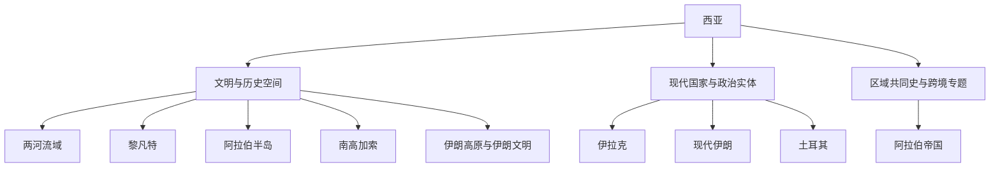

# 西亚

## 范围与概括

西亚连接东地中海、两河流域、伊朗高原、阿拉伯半岛、黑海与里海之间的南高加索，是欧洲、北非、中亚、南亚和印度洋之间的重要历史枢纽。本目录采用“跨国历史空间 + 现代国家与政治实体 + 区域共同史”的组合结构。

- 古代文明、帝国与贸易网络不按现代国界切割。
- 现代国家目录先交代本地前史，再重点维护国家形成、政体与社会变迁。
- 伊朗、土耳其和塞浦路斯直接归入西亚；南高加索的洲际归属存在不同划分，本库为历史比较需要置于西亚。
- 上级入口：[历史](/%E4%BA%BA%E6%96%87%E7%A7%91%E5%AD%A6/%E5%8E%86%E5%8F%B2/README.md)。

## 结构图

## 文明与历史空间入口

| 对象 | 对象类型 | 入口 | 规范范围 |
|---|---|---|---|
| 两河流域文明 | 跨现代国界的区域文明 | [两河流域文明](/%E4%BA%BA%E6%96%87%E7%A7%91%E5%AD%A6/%E5%8E%86%E5%8F%B2/%E8%A5%BF%E4%BA%9A/%E4%B8%A4%E6%B2%B3%E6%B5%81%E5%9F%9F/README.md) | 苏美尔、阿卡德、巴比伦、亚述及其后续区域统治；现代伊拉克另设国家视角 |
| 黎凡特 | 跨国历史区域 | [黎凡特](/%E4%BA%BA%E6%96%87%E7%A7%91%E5%AD%A6/%E5%8E%86%E5%8F%B2/%E8%A5%BF%E4%BA%9A/%E9%BB%8E%E5%87%A1%E7%89%B9/README.md) | 迦南、腓尼基、帝国统治、委任统治及现代政治实体 |
| 阿拉伯半岛 | 历史地理与跨国区域 | [阿拉伯半岛](/%E4%BA%BA%E6%96%87%E7%A7%91%E5%AD%A6/%E5%8E%86%E5%8F%B2/%E8%A5%BF%E4%BA%9A/%E9%98%BF%E6%8B%89%E4%BC%AF%E5%8D%8A%E5%B2%9B/README.md) | 南阿拉伯、伊斯兰兴起、海湾网络与半岛国家 |
| 南高加索 | 跨帝国边疆与历史区域 | [南高加索](/%E4%BA%BA%E6%96%87%E7%A7%91%E5%AD%A6/%E5%8E%86%E5%8F%B2/%E8%A5%BF%E4%BA%9A/%E5%8D%97%E9%AB%98%E5%8A%A0%E7%B4%A2/README.md) | 古代王国、伊朗—奥斯曼—俄罗斯边疆、苏维埃划界与三国历史 |
| 伊朗高原与伊朗文明 | 文明长时段，兼现代国家通史 | [伊朗](/%E4%BA%BA%E6%96%87%E7%A7%91%E5%AD%A6/%E5%8E%86%E5%8F%B2/%E8%A5%BF%E4%BA%9A/%E4%BC%8A%E6%9C%97/README.md) | 埃兰、波斯诸帝国、伊斯兰化、波斯语文化、什叶派国家传统与现代伊朗 |
| 阿拉伯帝国 | 跨区域帝国与文明规范入口 | [阿拉伯帝国](/%E4%BA%BA%E6%96%87%E7%A7%91%E5%AD%A6/%E5%8E%86%E5%8F%B2/%E8%A5%BF%E4%BA%9A/_%E9%80%9A%E5%8F%B2/%E9%98%BF%E6%8B%89%E4%BC%AF%E5%B8%9D%E5%9B%BD/README.md) | 正统哈里发、倭马亚、阿拔斯及帝国分裂后的文明网络 |
| 奥斯曼帝国 | 跨区域帝国规范入口 | [奥斯曼帝国](/%E4%BA%BA%E6%96%87%E7%A7%91%E5%AD%A6/%E5%8E%86%E5%8F%B2/%E8%A5%BF%E4%BA%9A/%E5%9C%9F%E8%80%B3%E5%85%B6/%E5%A5%A5%E6%96%AF%E6%9B%BC%E5%B8%9D%E5%9B%BD/README.md) | 帝国本体与统治结构；西亚各地只展开本地经历 |

## 现代国家与政治实体入口

| 所属历史空间 | 入口 |
|---|---|
| 两河流域 | [伊拉克](/%E4%BA%BA%E6%96%87%E7%A7%91%E5%AD%A6/%E5%8E%86%E5%8F%B2/%E8%A5%BF%E4%BA%9A/%E4%B8%A4%E6%B2%B3%E6%B5%81%E5%9F%9F/%E4%BC%8A%E6%8B%89%E5%85%8B/README.md) |
| 黎凡特 | [叙利亚](/%E4%BA%BA%E6%96%87%E7%A7%91%E5%AD%A6/%E5%8E%86%E5%8F%B2/%E8%A5%BF%E4%BA%9A/%E9%BB%8E%E5%87%A1%E7%89%B9/%E5%8F%99%E5%88%A9%E4%BA%9A/README.md)、[黎巴嫩](/%E4%BA%BA%E6%96%87%E7%A7%91%E5%AD%A6/%E5%8E%86%E5%8F%B2/%E8%A5%BF%E4%BA%9A/%E9%BB%8E%E5%87%A1%E7%89%B9/%E9%BB%8E%E5%B7%B4%E5%AB%A9/README.md)、[约旦](/%E4%BA%BA%E6%96%87%E7%A7%91%E5%AD%A6/%E5%8E%86%E5%8F%B2/%E8%A5%BF%E4%BA%9A/%E9%BB%8E%E5%87%A1%E7%89%B9/%E7%BA%A6%E6%97%A6/README.md)、[以色列](/%E4%BA%BA%E6%96%87%E7%A7%91%E5%AD%A6/%E5%8E%86%E5%8F%B2/%E8%A5%BF%E4%BA%9A/%E9%BB%8E%E5%87%A1%E7%89%B9/%E4%BB%A5%E8%89%B2%E5%88%97/README.md)、[巴勒斯坦](/%E4%BA%BA%E6%96%87%E7%A7%91%E5%AD%A6/%E5%8E%86%E5%8F%B2/%E8%A5%BF%E4%BA%9A/%E9%BB%8E%E5%87%A1%E7%89%B9/%E5%B7%B4%E5%8B%92%E6%96%AF%E5%9D%A6/README.md) |
| 阿拉伯半岛 | [沙特阿拉伯](/%E4%BA%BA%E6%96%87%E7%A7%91%E5%AD%A6/%E5%8E%86%E5%8F%B2/%E8%A5%BF%E4%BA%9A/%E9%98%BF%E6%8B%89%E4%BC%AF%E5%8D%8A%E5%B2%9B/%E6%B2%99%E7%89%B9%E9%98%BF%E6%8B%89%E4%BC%AF/README.md)、[也门](/%E4%BA%BA%E6%96%87%E7%A7%91%E5%AD%A6/%E5%8E%86%E5%8F%B2/%E8%A5%BF%E4%BA%9A/%E9%98%BF%E6%8B%89%E4%BC%AF%E5%8D%8A%E5%B2%9B/%E4%B9%9F%E9%97%A8/README.md)、[阿曼](/%E4%BA%BA%E6%96%87%E7%A7%91%E5%AD%A6/%E5%8E%86%E5%8F%B2/%E8%A5%BF%E4%BA%9A/%E9%98%BF%E6%8B%89%E4%BC%AF%E5%8D%8A%E5%B2%9B/%E9%98%BF%E6%9B%BC/README.md)、[阿联酋](/%E4%BA%BA%E6%96%87%E7%A7%91%E5%AD%A6/%E5%8E%86%E5%8F%B2/%E8%A5%BF%E4%BA%9A/%E9%98%BF%E6%8B%89%E4%BC%AF%E5%8D%8A%E5%B2%9B/%E9%98%BF%E8%81%94%E9%85%8B/README.md)、[卡塔尔](/%E4%BA%BA%E6%96%87%E7%A7%91%E5%AD%A6/%E5%8E%86%E5%8F%B2/%E8%A5%BF%E4%BA%9A/%E9%98%BF%E6%8B%89%E4%BC%AF%E5%8D%8A%E5%B2%9B/%E5%8D%A1%E5%A1%94%E5%B0%94/README.md)、[巴林](/%E4%BA%BA%E6%96%87%E7%A7%91%E5%AD%A6/%E5%8E%86%E5%8F%B2/%E8%A5%BF%E4%BA%9A/%E9%98%BF%E6%8B%89%E4%BC%AF%E5%8D%8A%E5%B2%9B/%E5%B7%B4%E6%9E%97/README.md)、[科威特](/%E4%BA%BA%E6%96%87%E7%A7%91%E5%AD%A6/%E5%8E%86%E5%8F%B2/%E8%A5%BF%E4%BA%9A/%E9%98%BF%E6%8B%89%E4%BC%AF%E5%8D%8A%E5%B2%9B/%E7%A7%91%E5%A8%81%E7%89%B9/README.md) |
| 南高加索 | [亚美尼亚](/%E4%BA%BA%E6%96%87%E7%A7%91%E5%AD%A6/%E5%8E%86%E5%8F%B2/%E8%A5%BF%E4%BA%9A/%E5%8D%97%E9%AB%98%E5%8A%A0%E7%B4%A2/%E4%BA%9A%E7%BE%8E%E5%B0%BC%E4%BA%9A/README.md)、[阿塞拜疆](/%E4%BA%BA%E6%96%87%E7%A7%91%E5%AD%A6/%E5%8E%86%E5%8F%B2/%E8%A5%BF%E4%BA%9A/%E5%8D%97%E9%AB%98%E5%8A%A0%E7%B4%A2/%E9%98%BF%E5%A1%9E%E6%8B%9C%E7%96%86/README.md)、[格鲁吉亚](/%E4%BA%BA%E6%96%87%E7%A7%91%E5%AD%A6/%E5%8E%86%E5%8F%B2/%E8%A5%BF%E4%BA%9A/%E5%8D%97%E9%AB%98%E5%8A%A0%E7%B4%A2/%E6%A0%BC%E9%B2%81%E5%90%89%E4%BA%9A/README.md) |
| 直接归属西亚 | [伊朗](/%E4%BA%BA%E6%96%87%E7%A7%91%E5%AD%A6/%E5%8E%86%E5%8F%B2/%E8%A5%BF%E4%BA%9A/%E4%BC%8A%E6%9C%97/README.md)、[土耳其](/%E4%BA%BA%E6%96%87%E7%A7%91%E5%AD%A6/%E5%8E%86%E5%8F%B2/%E8%A5%BF%E4%BA%9A/%E5%9C%9F%E8%80%B3%E5%85%B6/README.md)、[塞浦路斯](/%E4%BA%BA%E6%96%87%E7%A7%91%E5%AD%A6/%E5%8E%86%E5%8F%B2/%E8%A5%BF%E4%BA%9A/%E5%A1%9E%E6%B5%A6%E8%B7%AF%E6%96%AF/README.md) |

## 区域共同史与跨境专题

| 对象 | 对象类型 | 入口 | 关注点 |
|---|---|---|---|
| 西亚通史 | 区域共同史容器 | [西亚通史](/%E4%BA%BA%E6%96%87%E7%A7%91%E5%AD%A6/%E5%8E%86%E5%8F%B2/%E8%A5%BF%E4%BA%9A/_%E9%80%9A%E5%8F%B2/README.md) | 跨国家、跨子区域的共同过程与规范入口 |
| 阿拉伯帝国 | 跨区域帝国规范入口 | [阿拉伯帝国](/%E4%BA%BA%E6%96%87%E7%A7%91%E5%AD%A6/%E5%8E%86%E5%8F%B2/%E8%A5%BF%E4%BA%9A/_%E9%80%9A%E5%8F%B2/%E9%98%BF%E6%8B%89%E4%BC%AF%E5%B8%9D%E5%9B%BD/README.md) | 伊斯兰兴起、哈里发帝国与政治分裂后的文明延续 |
| 奥斯曼解体、殖民委任统治与现代国家 | 区域共同史 | [进入专题](/%E4%BA%BA%E6%96%87%E7%A7%91%E5%AD%A6/%E5%8E%86%E5%8F%B2/%E8%A5%BF%E4%BA%9A/_%E9%80%9A%E5%8F%B2/%E5%A5%A5%E6%96%AF%E6%9B%BC%E8%A7%A3%E4%BD%93%E3%80%81%E6%AE%96%E6%B0%91%E5%A7%94%E4%BB%BB%E7%BB%9F%E6%B2%BB%E4%B8%8E%E7%8E%B0%E4%BB%A3%E5%9B%BD%E5%AE%B6.md) | 帝国解体、委任统治、边界划分与国家形成 |
| 石油、冷战与地区体系 | 跨境过程与区域体系 | [进入专题](/%E4%BA%BA%E6%96%87%E7%A7%91%E5%AD%A6/%E5%8E%86%E5%8F%B2/%E8%A5%BF%E4%BA%9A/_%E9%80%9A%E5%8F%B2/%E7%9F%B3%E6%B2%B9%E3%80%81%E5%86%B7%E6%88%98%E4%B8%8E%E5%9C%B0%E5%8C%BA%E4%BD%93%E7%B3%BB.md) | 能源、国家财政、外部力量与地区战争 |
| 库尔德地区与库尔德民族运动 | 跨国历史共同体 | [进入专题](/%E4%BA%BA%E6%96%87%E7%A7%91%E5%AD%A6/%E5%8E%86%E5%8F%B2/%E8%A5%BF%E4%BA%9A/_%E9%80%9A%E5%8F%B2/%E5%BA%93%E5%B0%94%E5%BE%B7%E5%9C%B0%E5%8C%BA%E4%B8%8E%E5%BA%93%E5%B0%94%E5%BE%B7%E6%B0%91%E6%97%8F%E8%BF%90%E5%8A%A8.md) | 土耳其、伊拉克、伊朗和叙利亚之间的边疆社会与民族政治 |

## 区域史与国家史的分工

[两河流域文明](/%E4%BA%BA%E6%96%87%E7%A7%91%E5%AD%A6/%E5%8E%86%E5%8F%B2/%E8%A5%BF%E4%BA%9A/%E4%B8%A4%E6%B2%B3%E6%B5%81%E5%9F%9F/README.md)与[伊拉克](/%E4%BA%BA%E6%96%87%E7%A7%91%E5%AD%A6/%E5%8E%86%E5%8F%B2/%E8%A5%BF%E4%BA%9A/%E4%B8%A4%E6%B2%B3%E6%B5%81%E5%9F%9F/%E4%BC%8A%E6%8B%89%E5%85%8B/README.md)是本区域的规范范式：

- 区域文明 README 维护超出现代国界的文明长时段、帝国层叠、共同贸易网络与文化连续性。
- 国家 README 从本国地域回望前史，但重点展开现代边界、国家制度、社会结构与政治变迁。
- 同一事件可在区域页提供比较框架，在国家页解释本地影响；通过链接衔接，不复制整篇通史。
- 两河、黎凡特等历史空间不能被某一个现代国家代替；国家也不能被古代文明直接等同。

## 重要转折

| 时段 | 区域变化 |
|---|---|
| 前4千纪以后 | 两河城市化、文字与早期国家形成，西亚多中心文明网络展开 |
| 前1千纪 | 亚述、巴比伦、波斯等帝国重组跨区域统治 |
| 7世纪以后 | 阿拉伯征服、伊斯兰化与阿拉伯语传播改变区域政治和文化结构 |
| 11—16世纪 | 突厥、蒙古、帖木儿、萨法维与奥斯曼等力量重新连接草原、高原和地中海 |
| 19—20世纪 | 帝国改革与解体、欧洲干预、委任统治和现代国界形成 |
| 20世纪中叶以后 | 石油经济、冷战、民族问题、战争与地区体系交织 |

## 关键辨析

- “西亚”不等同于“阿拉伯世界”、伊斯兰世界或单一文化区。
- 伊朗按广义西亚历史维护；阿富汗继续放在[中亚](/%E4%BA%BA%E6%96%87%E7%A7%91%E5%AD%A6/%E5%8E%86%E5%8F%B2/%E4%B8%AD%E4%BA%9A/README.md)并与伊朗、南亚互引。
- 两河流域、黎凡特、库尔德地区和奥斯曼帝国都跨越现代边界，阅读时应区分文明空间、帝国统治与现代国家。
- 迦太基及马格里布共同史由[北非通史](/%E4%BA%BA%E6%96%87%E7%A7%91%E5%AD%A6/%E5%8E%86%E5%8F%B2/%E5%8C%97%E9%9D%9E/_%E9%80%9A%E5%8F%B2/README.md)维护。

## 上级与相邻区域

- 上级：[历史](/%E4%BA%BA%E6%96%87%E7%A7%91%E5%AD%A6/%E5%8E%86%E5%8F%B2/README.md)
- 相邻区域：[北非](/%E4%BA%BA%E6%96%87%E7%A7%91%E5%AD%A6/%E5%8E%86%E5%8F%B2/%E5%8C%97%E9%9D%9E/README.md)、[中亚](/%E4%BA%BA%E6%96%87%E7%A7%91%E5%AD%A6/%E5%8E%86%E5%8F%B2/%E4%B8%AD%E4%BA%9A/README.md)、[南亚](/%E4%BA%BA%E6%96%87%E7%A7%91%E5%AD%A6/%E5%8E%86%E5%8F%B2/%E5%8D%97%E4%BA%9A/README.md)、[欧洲](/%E4%BA%BA%E6%96%87%E7%A7%91%E5%AD%A6/%E5%8E%86%E5%8F%B2/%E6%AC%A7%E6%B4%B2/README.md)
