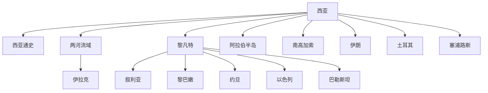

# 西亚

## 范围

西亚连接东地中海、两河流域、伊朗高原、阿拉伯半岛、黑海与里海之间的南高加索，是欧洲、北非、中亚、南亚和印度洋之间的重要历史枢纽。本目录采用“跨国历史子区域 + 现代国家”的嵌套结构。

- 两河流域、黎凡特、阿拉伯半岛和南高加索先建立区域 README，再收纳所属国家。
- 伊朗、土耳其和塞浦路斯直接归入西亚，不设置只有单个国家的中间层。
- 古代区域史不按现代边界切割；国家目录在概括本地前史后，重点维护近现代国家形成和政治发展。

## 结构图

## 通史与子区域

| 类型 | 入口 | 内容 |
|---|---|---|
| 西亚通史 | [西亚通史](/%E4%BA%BA%E6%96%87%E7%A7%91%E5%AD%A6/%E5%8E%86%E5%8F%B2/%E8%A5%BF%E4%BA%9A/_%E9%80%9A%E5%8F%B2/README.md) | 阿拉伯帝国、奥斯曼解体、石油与冷战、库尔德跨国历史 |
| 两河流域 | [两河流域文明](/%E4%BA%BA%E6%96%87%E7%A7%91%E5%AD%A6/%E5%8E%86%E5%8F%B2/%E8%A5%BF%E4%BA%9A/%E4%B8%A4%E6%B2%B3%E6%B5%81%E5%9F%9F/README.md) | 苏美尔、阿卡德、巴比伦、亚述及伊拉克国家史 |
| 黎凡特 | [黎凡特](/%E4%BA%BA%E6%96%87%E7%A7%91%E5%AD%A6/%E5%8E%86%E5%8F%B2/%E8%A5%BF%E4%BA%9A/%E9%BB%8E%E5%87%A1%E7%89%B9/README.md) | 迦南、腓尼基、帝国统治、委任统治及五个现代政治实体 |
| 阿拉伯半岛 | [阿拉伯半岛](/%E4%BA%BA%E6%96%87%E7%A7%91%E5%AD%A6/%E5%8E%86%E5%8F%B2/%E8%A5%BF%E4%BA%9A/%E9%98%BF%E6%8B%89%E4%BC%AF%E5%8D%8A%E5%B2%9B/README.md) | 南阿拉伯、伊斯兰兴起、海湾和半岛七国 |
| 南高加索 | [南高加索](/%E4%BA%BA%E6%96%87%E7%A7%91%E5%AD%A6/%E5%8E%86%E5%8F%B2/%E8%A5%BF%E4%BA%9A/%E5%8D%97%E9%AB%98%E5%8A%A0%E7%B4%A2/README.md) | 古代王国、帝国边疆、苏维埃划界和三国现代史 |

## 国家与政治实体导航

| 所属层级 | 入口 |
|---|---|
| 两河流域 | [伊拉克](/%E4%BA%BA%E6%96%87%E7%A7%91%E5%AD%A6/%E5%8E%86%E5%8F%B2/%E8%A5%BF%E4%BA%9A/%E4%B8%A4%E6%B2%B3%E6%B5%81%E5%9F%9F/%E4%BC%8A%E6%8B%89%E5%85%8B/README.md) |
| 黎凡特 | [叙利亚](/%E4%BA%BA%E6%96%87%E7%A7%91%E5%AD%A6/%E5%8E%86%E5%8F%B2/%E8%A5%BF%E4%BA%9A/%E9%BB%8E%E5%87%A1%E7%89%B9/%E5%8F%99%E5%88%A9%E4%BA%9A/README.md)、[黎巴嫩](/%E4%BA%BA%E6%96%87%E7%A7%91%E5%AD%A6/%E5%8E%86%E5%8F%B2/%E8%A5%BF%E4%BA%9A/%E9%BB%8E%E5%87%A1%E7%89%B9/%E9%BB%8E%E5%B7%B4%E5%AB%A9/README.md)、[约旦](/%E4%BA%BA%E6%96%87%E7%A7%91%E5%AD%A6/%E5%8E%86%E5%8F%B2/%E8%A5%BF%E4%BA%9A/%E9%BB%8E%E5%87%A1%E7%89%B9/%E7%BA%A6%E6%97%A6/README.md)、[以色列](/%E4%BA%BA%E6%96%87%E7%A7%91%E5%AD%A6/%E5%8E%86%E5%8F%B2/%E8%A5%BF%E4%BA%9A/%E9%BB%8E%E5%87%A1%E7%89%B9/%E4%BB%A5%E8%89%B2%E5%88%97/README.md)、[巴勒斯坦](/%E4%BA%BA%E6%96%87%E7%A7%91%E5%AD%A6/%E5%8E%86%E5%8F%B2/%E8%A5%BF%E4%BA%9A/%E9%BB%8E%E5%87%A1%E7%89%B9/%E5%B7%B4%E5%8B%92%E6%96%AF%E5%9D%A6/README.md) |
| 阿拉伯半岛 | [沙特阿拉伯](/%E4%BA%BA%E6%96%87%E7%A7%91%E5%AD%A6/%E5%8E%86%E5%8F%B2/%E8%A5%BF%E4%BA%9A/%E9%98%BF%E6%8B%89%E4%BC%AF%E5%8D%8A%E5%B2%9B/%E6%B2%99%E7%89%B9%E9%98%BF%E6%8B%89%E4%BC%AF/README.md)、[也门](/%E4%BA%BA%E6%96%87%E7%A7%91%E5%AD%A6/%E5%8E%86%E5%8F%B2/%E8%A5%BF%E4%BA%9A/%E9%98%BF%E6%8B%89%E4%BC%AF%E5%8D%8A%E5%B2%9B/%E4%B9%9F%E9%97%A8/README.md)、[阿曼](/%E4%BA%BA%E6%96%87%E7%A7%91%E5%AD%A6/%E5%8E%86%E5%8F%B2/%E8%A5%BF%E4%BA%9A/%E9%98%BF%E6%8B%89%E4%BC%AF%E5%8D%8A%E5%B2%9B/%E9%98%BF%E6%9B%BC/README.md)、[阿联酋](/%E4%BA%BA%E6%96%87%E7%A7%91%E5%AD%A6/%E5%8E%86%E5%8F%B2/%E8%A5%BF%E4%BA%9A/%E9%98%BF%E6%8B%89%E4%BC%AF%E5%8D%8A%E5%B2%9B/%E9%98%BF%E8%81%94%E9%85%8B/README.md)、[卡塔尔](/%E4%BA%BA%E6%96%87%E7%A7%91%E5%AD%A6/%E5%8E%86%E5%8F%B2/%E8%A5%BF%E4%BA%9A/%E9%98%BF%E6%8B%89%E4%BC%AF%E5%8D%8A%E5%B2%9B/%E5%8D%A1%E5%A1%94%E5%B0%94/README.md)、[巴林](/%E4%BA%BA%E6%96%87%E7%A7%91%E5%AD%A6/%E5%8E%86%E5%8F%B2/%E8%A5%BF%E4%BA%9A/%E9%98%BF%E6%8B%89%E4%BC%AF%E5%8D%8A%E5%B2%9B/%E5%B7%B4%E6%9E%97/README.md)、[科威特](/%E4%BA%BA%E6%96%87%E7%A7%91%E5%AD%A6/%E5%8E%86%E5%8F%B2/%E8%A5%BF%E4%BA%9A/%E9%98%BF%E6%8B%89%E4%BC%AF%E5%8D%8A%E5%B2%9B/%E7%A7%91%E5%A8%81%E7%89%B9/README.md) |
| 南高加索 | [亚美尼亚](/%E4%BA%BA%E6%96%87%E7%A7%91%E5%AD%A6/%E5%8E%86%E5%8F%B2/%E8%A5%BF%E4%BA%9A/%E5%8D%97%E9%AB%98%E5%8A%A0%E7%B4%A2/%E4%BA%9A%E7%BE%8E%E5%B0%BC%E4%BA%9A/README.md)、[阿塞拜疆](/%E4%BA%BA%E6%96%87%E7%A7%91%E5%AD%A6/%E5%8E%86%E5%8F%B2/%E8%A5%BF%E4%BA%9A/%E5%8D%97%E9%AB%98%E5%8A%A0%E7%B4%A2/%E9%98%BF%E5%A1%9E%E6%8B%9C%E7%96%86/README.md)、[格鲁吉亚](/%E4%BA%BA%E6%96%87%E7%A7%91%E5%AD%A6/%E5%8E%86%E5%8F%B2/%E8%A5%BF%E4%BA%9A/%E5%8D%97%E9%AB%98%E5%8A%A0%E7%B4%A2/%E6%A0%BC%E9%B2%81%E5%90%89%E4%BA%9A/README.md) |
| 直接归属西亚 | [伊朗](/%E4%BA%BA%E6%96%87%E7%A7%91%E5%AD%A6/%E5%8E%86%E5%8F%B2/%E8%A5%BF%E4%BA%9A/%E4%BC%8A%E6%9C%97/README.md)、[土耳其](/%E4%BA%BA%E6%96%87%E7%A7%91%E5%AD%A6/%E5%8E%86%E5%8F%B2/%E8%A5%BF%E4%BA%9A/%E5%9C%9F%E8%80%B3%E5%85%B6/README.md)、[塞浦路斯](/%E4%BA%BA%E6%96%87%E7%A7%91%E5%AD%A6/%E5%8E%86%E5%8F%B2/%E8%A5%BF%E4%BA%9A/%E5%A1%9E%E6%B5%A6%E8%B7%AF%E6%96%AF/README.md) |

## 区域史与国家史

- 区域 README 负责跨国文明、帝国统治、共同贸易网络和边界形成。
- 国家 README 负责将区域背景落到本地，并展开王朝、殖民统治、独立、政体和社会变迁。
- 同一事件可在区域笔记中提供比较框架，在国家笔记中说明本地过程；两处通过链接互相导航，不复制完整正文。
- 迦太基及马格里布共同史转入[北非通史](/%E4%BA%BA%E6%96%87%E7%A7%91%E5%AD%A6/%E5%8E%86%E5%8F%B2/%E5%8C%97%E9%9D%9E/_%E9%80%9A%E5%8F%B2/README.md)维护。

## 关键辨析

- “西亚”不等同于“阿拉伯世界”或单一文化区。
- 南高加索和塞浦路斯在不同体系中的洲际归属存在差异；本库为历史比较需要归入西亚。
- 伊朗按广义西亚历史维护；阿富汗继续放在中亚并与南亚互引。
- 两河流域和黎凡特的历史范围超出现代边界，因此区域目录不能被单一国家目录替代。

## 上级与相邻区域

- [历史](/%E4%BA%BA%E6%96%87%E7%A7%91%E5%AD%A6/%E5%8E%86%E5%8F%B2/README.md)
- [北非](/%E4%BA%BA%E6%96%87%E7%A7%91%E5%AD%A6/%E5%8E%86%E5%8F%B2/%E5%8C%97%E9%9D%9E/README.md)
- [中亚](/%E4%BA%BA%E6%96%87%E7%A7%91%E5%AD%A6/%E5%8E%86%E5%8F%B2/%E4%B8%AD%E4%BA%9A/README.md)
- [南亚](/%E4%BA%BA%E6%96%87%E7%A7%91%E5%AD%A6/%E5%8E%86%E5%8F%B2/%E5%8D%97%E4%BA%9A/README.md)
- [欧洲](/%E4%BA%BA%E6%96%87%E7%A7%91%E5%AD%A6/%E5%8E%86%E5%8F%B2/%E6%AC%A7%E6%B4%B2/README.md)
