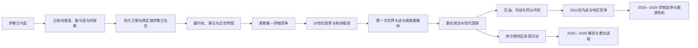

# 西亚通史

本目录整理无法由单一现代国家完整承载的西亚共同历史：伊斯兰兴起和哈里发帝国、奥斯曼解体与委任统治、库尔德跨国社会、石油财政与地区安全体系。具体王朝世系、国家元首和本地战争过程仍由规范帝国或国家目录维护；共同史只解释跨境机制、阶段比较和区域影响。

## 对象与职责

- **跨区域帝国：**阿拉伯帝国只在规范入口维护完整哈里发世系和政治主线，各地区写本地征服、社会转型与后继政权。
- **国家形成：**奥斯曼行省、殖民地、委任地和现代国家不是简单一一对应；本目录比较机制，国家页维护具体政府和领导人。
- **跨国共同体：**库尔德历史按土耳其、伊拉克、伊朗和叙利亚不同制度并列，不虚构统一古代国统。
- **地区体系：**石油、外部军事、阿以冲突和跨境武装相互作用，但不以“资源决定论”替代社会、制度和民族问题。
- **时效边界：**当代内容核验至2026年7月13日；正在进行的停火、解武和整合安排明确写作未定型过程。

## 主题导航

| 顺序 | 对象 | 类型 | 时间 | 规范职责 |
|---|---|---|---|---|
| 1 | [阿拉伯帝国](/%E4%BA%BA%E6%96%87%E7%A7%91%E5%AD%A6/%E5%8E%86%E5%8F%B2/%E8%A5%BF%E4%BA%9A/_%E9%80%9A%E5%8F%B2/%E9%98%BF%E6%8B%89%E4%BC%AF%E5%B8%9D%E5%9B%BD/README.md) | 跨区域帝国与文明 | 7—13世纪 | 正统哈里发、倭马亚、阿拔斯及政治分裂后的制度、世系与文明网络。 |
| 2 | [奥斯曼解体、殖民委任统治与现代国家](/%E4%BA%BA%E6%96%87%E7%A7%91%E5%AD%A6/%E5%8E%86%E5%8F%B2/%E8%A5%BF%E4%BA%9A/_%E9%80%9A%E5%8F%B2/%E5%A5%A5%E6%96%AF%E6%9B%BC%E8%A7%A3%E4%BD%93%E3%80%81%E6%AE%96%E6%B0%91%E5%A7%94%E4%BB%BB%E7%BB%9F%E6%B2%BB%E4%B8%8E%E7%8E%B0%E4%BB%A3%E5%9B%BD%E5%AE%B6.md) | 区域共同史 | 19世纪—20世纪中叶 | 坦志麦特、欧洲殖民、一战、洛桑、英法委任和国家边界形成。 |
| 3 | [库尔德地区与库尔德民族运动](/%E4%BA%BA%E6%96%87%E7%A7%91%E5%AD%A6/%E5%8E%86%E5%8F%B2/%E8%A5%BF%E4%BA%9A/_%E9%80%9A%E5%8F%B2/%E5%BA%93%E5%B0%94%E5%BE%B7%E5%9C%B0%E5%8C%BA%E4%B8%8E%E5%BA%93%E5%B0%94%E5%BE%B7%E6%B0%91%E6%97%8F%E8%BF%90%E5%8A%A8.md) | 跨国社会与政治运动 | 中世纪—2026年 | 边疆埃米尔国、现代民族政治以及四国不同自治、冲突与和平路径。 |
| 4 | [石油、冷战与地区体系](/%E4%BA%BA%E6%96%87%E7%A7%91%E5%AD%A6/%E5%8E%86%E5%8F%B2/%E8%A5%BF%E4%BA%9A/_%E9%80%9A%E5%8F%B2/%E7%9F%B3%E6%B2%B9%E3%80%81%E5%86%B7%E6%88%98%E4%B8%8E%E5%9C%B0%E5%8C%BA%E4%BD%93%E7%B3%BB.md) | 跨境过程与区域体系 | 19世纪末—2026年 | 租让、国有化、欧佩克、阿以冲突、海湾战争、劳工迁移与能源转型。 |

## 历史主线

- **帝国与宗教网络：**阿拉伯征服建立新政治秩序，伊斯兰化和阿拉伯化则以不同速度进行；波斯语、突厥语及地方基督教、犹太教和其他传统继续参与区域社会。
- **多帝国边疆：**拜占庭、哈里发、塞尔柱、蒙古、奥斯曼和伊朗王朝通过行省、贡赋、宗教社群和地方家族治理，实际控制程度随中心能力变化。
- **改革和殖民：**19世纪奥斯曼中央集权与欧洲债务、军事和殖民扩张同步，国家能力增强与地方自治受损并存。
- **战争与划界：**第一次世界大战摧毁旧帝国，安卡拉民族运动、英法占领、地方起义、王朝安排和国际联盟委任共同塑造现代边界。
- **资源和冷战：**石油提高财政与战略价值，国有化和欧佩克增强主权；冷战军援、政变和阿以冲突又强化军队和外部安全依赖。
- **当代多重危机：**2003年伊拉克战争、2011年后内战、2023年后地区战争扩散、2024年叙利亚政权更替及2025—2026年伊朗战争不断重组联盟。

## 区域比较矩阵

| 维度 | 安纳托利亚与北部边疆 | 黎凡特与两河 | 伊朗高原 | 阿拉伯半岛与海湾 |
|---|---|---|---|---|
| 近世主权 | 奥斯曼核心与俄国、高加索边界 | 奥斯曼行省、地方家族和宗教社群 | 萨法维至恺加的伊朗王朝 | 奥斯曼、地方部落王朝、海湾英国保护关系并存 |
| 一战后变化 | 土耳其独立战争推翻色佛尔安排 | 英法委任地和哈希姆王朝组合 | 未成委任地，但受英俄干预和石油租让 | 沙特统一、也门王国、英国亚丁和海湾保护国 |
| 国家建构难题 | 少数群体、军政关系、库尔德问题 | 委任边界、巴勒斯坦、宗派与军队 | 王权—宪政、革命制度、民族和地区差异 | 王朝合法性、部落整合、公民—外劳分层 |
| 能源结构 | 土耳其多为过境和进口国 | 伊拉克富油，黎凡特多为进口或过境 | 大人口油气国家，受制裁和战争影响深 | 高储量、小公民人口国家居多，也门等例外 |
| 当代安全 | 北约、叙利亚边境与库尔德和平进程 | 阿以冲突、叙利亚过渡、伊拉克国家重建 | 核问题、革命卫队、2025—2026战争 | 外军基地、霍尔木兹、王朝安全和多元化转型 |

## 重要转折

| 时间 | 转折 | 区域意义 |
|---|---|---|
| 7世纪 | 伊斯兰兴起与阿拉伯征服 | 政治中心、税制和宗教网络重组，社会转型延续数世纪。 |
| 750年 | 阿拔斯革命 | 权力中心东移伊拉克，波斯和跨族官僚、学术网络扩大。 |
| 11世纪 | 塞尔柱扩张 | 突厥军事集团、波斯官僚和逊尼制度结合。 |
| 1258年 | 蒙古攻陷巴格达 | 阿拔斯在巴格达的政治统治结束，地方王朝和新帝国重组。 |
| 1514—1517年 | 查尔迪兰与奥斯曼征服马穆鲁克 | 奥斯曼—萨法维边界、两圣地和阿拉伯省份秩序形成。 |
| 1839年以后 | 坦志麦特改革 | 中央行政、法律和军队现代化，也加深地方权力冲突。 |
| 1914—1923年 | 一战、种族灭绝、帝国解体与洛桑 | 旧帝国崩溃，现代国家体系和大规模人口迁移形成。 |
| 1920年代 | 委任统治 | 英法以国际制度延续控制，建立后来的国家机构和边界。 |
| 1948年 | 以色列建国与第一次中东战争 | 巴勒斯坦流离失所、边界冲突和地区联盟长期化。 |
| 1951—1960年 | 石油国有化运动与欧佩克 | 资源主权和产油国协调能力增强。 |
| 1967、1973年 | 两次阿以战争 | 占领问题和能源政治重塑国际关系。 |
| 1979年 | 伊朗革命、埃以和约、苏联进入阿富汗 | 革命、国家联盟和海湾安全同步转折。 |
| 1980—1991年 | 两伊战争与海湾战争 | 海湾军事国际化，美军基地和制裁体系扩大。 |
| 2003年 | 伊拉克战争 | 政权更替、国家崩解和跨国武装改变力量平衡。 |
| 2011年以后 | 阿拉伯起义与内战 | 社会经济、代表危机和外部介入叠加。 |
| 2023—2024年 | 加沙战争外溢与阿萨德政府垮台 | 黎巴嫩、红海、叙利亚和伊朗相关网络重新调整。 |
| 2025—2026年 | 伊朗战争、PKK解散与叙东北整合 | 国家间战争与两条库尔德和平进程同时改变地区结构，结果尚未定型。 |

## 与区域和国家目录的分工

- 历史空间：[两河流域](/%E4%BA%BA%E6%96%87%E7%A7%91%E5%AD%A6/%E5%8E%86%E5%8F%B2/%E8%A5%BF%E4%BA%9A/%E4%B8%A4%E6%B2%B3%E6%B5%81%E5%9F%9F/README.md)、[黎凡特](/%E4%BA%BA%E6%96%87%E7%A7%91%E5%AD%A6/%E5%8E%86%E5%8F%B2/%E8%A5%BF%E4%BA%9A/%E9%BB%8E%E5%87%A1%E7%89%B9/README.md)、[阿拉伯半岛](/%E4%BA%BA%E6%96%87%E7%A7%91%E5%AD%A6/%E5%8E%86%E5%8F%B2/%E8%A5%BF%E4%BA%9A/%E9%98%BF%E6%8B%89%E4%BC%AF%E5%8D%8A%E5%B2%9B/README.md)、[南高加索](/%E4%BA%BA%E6%96%87%E7%A7%91%E5%AD%A6/%E5%8E%86%E5%8F%B2/%E8%A5%BF%E4%BA%9A/%E5%8D%97%E9%AB%98%E5%8A%A0%E7%B4%A2/README.md)
- 长时段国家与帝国：[伊朗](/%E4%BA%BA%E6%96%87%E7%A7%91%E5%AD%A6/%E5%8E%86%E5%8F%B2/%E8%A5%BF%E4%BA%9A/%E4%BC%8A%E6%9C%97/README.md)、[土耳其](/%E4%BA%BA%E6%96%87%E7%A7%91%E5%AD%A6/%E5%8E%86%E5%8F%B2/%E8%A5%BF%E4%BA%9A/%E5%9C%9F%E8%80%B3%E5%85%B6/README.md)、[奥斯曼帝国](/%E4%BA%BA%E6%96%87%E7%A7%91%E5%AD%A6/%E5%8E%86%E5%8F%B2/%E8%A5%BF%E4%BA%9A/%E5%9C%9F%E8%80%B3%E5%85%B6/%E5%A5%A5%E6%96%AF%E6%9B%BC%E5%B8%9D%E5%9B%BD/README.md)
- 跨区域互链：[北非通史](/%E4%BA%BA%E6%96%87%E7%A7%91%E5%AD%A6/%E5%8E%86%E5%8F%B2/%E5%8C%97%E9%9D%9E/_%E9%80%9A%E5%8F%B2/README.md)
- 上级：[西亚](/%E4%BA%BA%E6%96%87%E7%A7%91%E5%AD%A6/%E5%8E%86%E5%8F%B2/%E8%A5%BF%E4%BA%9A/README.md)；[历史总览](/%E4%BA%BA%E6%96%87%E7%A7%91%E5%AD%A6/%E5%8E%86%E5%8F%B2/README.md)
