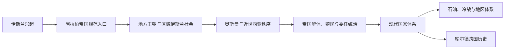

# 西亚通史

## 范围与对象

“_通史”是组织方式，不是把所有对象归为同一种类型。本目录只承担三类内容：

1. 跨越西亚多个子区域和现代国家的区域共同史；
2. 能源、边界、民族运动等跨境过程与区域体系；
3. 无法由单一现代国家完整代表的跨区域文明或帝国规范入口。

具体国家史、地方阶段史和单一王朝在对应区域或国家目录展开。规范入口只维护一次，其他地区从本地视角互链，不重复复制完整主线。

## 主题关系图

## 主题导航

| 对象 | 对象类型 | 时间 | 入口 | 规范职责 |
|---|---|---|---|---|
| 阿拉伯帝国 | 跨区域帝国与文明规范入口 | 7—13世纪 | [阿拉伯帝国](/%E4%BA%BA%E6%96%87%E7%A7%91%E5%AD%A6/%E5%8E%86%E5%8F%B2/%E8%A5%BF%E4%BA%9A/_%E9%80%9A%E5%8F%B2/%E9%98%BF%E6%8B%89%E4%BC%AF%E5%B8%9D%E5%9B%BD/README.md) | 正统哈里发、倭马亚、阿拔斯及政治分裂后的文明网络；各地区只写本地经历 |
| 奥斯曼解体、殖民委任统治与现代国家 | 区域共同史 | 19世纪—20世纪中叶 | [进入专题](/%E4%BA%BA%E6%96%87%E7%A7%91%E5%AD%A6/%E5%8E%86%E5%8F%B2/%E8%A5%BF%E4%BA%9A/_%E9%80%9A%E5%8F%B2/%E5%A5%A5%E6%96%AF%E6%9B%BC%E8%A7%A3%E4%BD%93%E3%80%81%E6%AE%96%E6%B0%91%E5%A7%94%E4%BB%BB%E7%BB%9F%E6%B2%BB%E4%B8%8E%E7%8E%B0%E4%BB%A3%E5%9B%BD%E5%AE%B6.md) | 帝国改革与解体、委任统治、边界划分和国家形成 |
| 石油、冷战与地区体系 | 跨境过程与区域体系 | 19世纪末至今 | [进入专题](/%E4%BA%BA%E6%96%87%E7%A7%91%E5%AD%A6/%E5%8E%86%E5%8F%B2/%E8%A5%BF%E4%BA%9A/_%E9%80%9A%E5%8F%B2/%E7%9F%B3%E6%B2%B9%E3%80%81%E5%86%B7%E6%88%98%E4%B8%8E%E5%9C%B0%E5%8C%BA%E4%BD%93%E7%B3%BB.md) | 能源开发、国家财政、外部力量和地区战争 |
| 库尔德地区与库尔德民族运动 | 跨国历史共同体 | 中世纪至今 | [进入专题](/%E4%BA%BA%E6%96%87%E7%A7%91%E5%AD%A6/%E5%8E%86%E5%8F%B2/%E8%A5%BF%E4%BA%9A/_%E9%80%9A%E5%8F%B2/%E5%BA%93%E5%B0%94%E5%BE%B7%E5%9C%B0%E5%8C%BA%E4%B8%8E%E5%BA%93%E5%B0%94%E5%BE%B7%E6%B0%91%E6%97%8F%E8%BF%90%E5%8A%A8.md) | 跨越土耳其、伊拉克、伊朗和叙利亚的边疆社会与民族政治 |

## 与区域和国家目录的分工

- [两河流域](/%E4%BA%BA%E6%96%87%E7%A7%91%E5%AD%A6/%E5%8E%86%E5%8F%B2/%E8%A5%BF%E4%BA%9A/%E4%B8%A4%E6%B2%B3%E6%B5%81%E5%9F%9F/README.md)、[黎凡特](/%E4%BA%BA%E6%96%87%E7%A7%91%E5%AD%A6/%E5%8E%86%E5%8F%B2/%E8%A5%BF%E4%BA%9A/%E9%BB%8E%E5%87%A1%E7%89%B9/README.md)、[阿拉伯半岛](/%E4%BA%BA%E6%96%87%E7%A7%91%E5%AD%A6/%E5%8E%86%E5%8F%B2/%E8%A5%BF%E4%BA%9A/%E9%98%BF%E6%8B%89%E4%BC%AF%E5%8D%8A%E5%B2%9B/README.md)和[南高加索](/%E4%BA%BA%E6%96%87%E7%A7%91%E5%AD%A6/%E5%8E%86%E5%8F%B2/%E8%A5%BF%E4%BA%9A/%E5%8D%97%E9%AB%98%E5%8A%A0%E7%B4%A2/README.md)维护各历史空间内部的阶段史。
- [伊朗](/%E4%BA%BA%E6%96%87%E7%A7%91%E5%AD%A6/%E5%8E%86%E5%8F%B2/%E8%A5%BF%E4%BA%9A/%E4%BC%8A%E6%9C%97/README.md)维护伊朗文明与现代国家长时段；[土耳其](/%E4%BA%BA%E6%96%87%E7%A7%91%E5%AD%A6/%E5%8E%86%E5%8F%B2/%E8%A5%BF%E4%BA%9A/%E5%9C%9F%E8%80%B3%E5%85%B6/README.md)维护安纳托利亚与土耳其主线，[奥斯曼帝国](/%E4%BA%BA%E6%96%87%E7%A7%91%E5%AD%A6/%E5%8E%86%E5%8F%B2/%E8%A5%BF%E4%BA%9A/%E5%9C%9F%E8%80%B3%E5%85%B6/%E5%A5%A5%E6%96%AF%E6%9B%BC%E5%B8%9D%E5%9B%BD/README.md)是该跨区域帝国的规范入口。
- 阿拉伯帝国向北非的扩张、奥斯曼统治与殖民史同[北非通史](/%E4%BA%BA%E6%96%87%E7%A7%91%E5%AD%A6/%E5%8E%86%E5%8F%B2/%E5%8C%97%E9%9D%9E/_%E9%80%9A%E5%8F%B2/README.md)互引。
- [迦太基](/%E4%BA%BA%E6%96%87%E7%A7%91%E5%AD%A6/%E5%8E%86%E5%8F%B2/%E5%8C%97%E9%9D%9E/_%E9%80%9A%E5%8F%B2/%E8%BF%A6%E5%A4%AA%E5%9F%BA/README.md)由北非通史维护，西亚的黎凡特页面只说明其腓尼基源头。

## 阅读规则

- 先从本页判断对象类型，再进入规范入口。
- 阅读某个现代国家时，古代文明背景回链历史空间，近现代国家形成留在国家目录。
- 阅读跨区域帝国时，以规范入口为主，地区页只补本地统治、社会反应和后续影响。

## 上级

- 直接上级：[西亚](/%E4%BA%BA%E6%96%87%E7%A7%91%E5%AD%A6/%E5%8E%86%E5%8F%B2/%E8%A5%BF%E4%BA%9A/README.md)
- 历史总览：[历史](/%E4%BA%BA%E6%96%87%E7%A7%91%E5%AD%A6/%E5%8E%86%E5%8F%B2/README.md)
