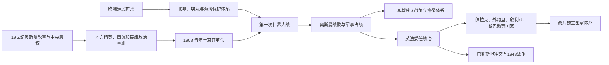

# 奥斯曼解体、殖民委任统治与现代国家

## 时间

19世纪—20世纪中叶

## 概括

现代西亚国家体系不是由某一份秘密协定一次划定。它形成于奥斯曼中央集权与改革、欧洲殖民扩张、地方王朝和民族运动、第一次世界大战、战后军事占领、国际联盟委任统治以及第二次世界大战后权力移交的叠加。新国家继承了部分奥斯曼行省、法院、军队和交通网，也以殖民行政、战略通道、石油利益和地方政治妥协重新组合边界。相同边界内的宗教、语言、部落和城市社群并未因此自动形成一致的国家认同。

## 建立背景

### 奥斯曼改革与中央重组

18世纪末至19世纪，俄国、奥地利和欧洲海权扩张、地方总督坐大、税收承包失控和军事技术差距迫使奥斯曼改革。塞利姆三世、马哈茂德二世先重建军队；1839年《花厅御诏》和1856年改革诏书开启坦志麦特时期，试图统一税收、征兵、法院、教育和臣民身份。1864年行省法把省、桑贾克、县等行政层级标准化，电报、铁路和学校加强首都联系。

改革并非单向“现代化成功”。中央削弱地方军政家族和自治社群，引发新的反抗；新税、征兵和土地登记改变村庄关系；欧洲列强又以保护基督教社群和债权人为由干预。1875年财政违约后，1881年奥斯曼公共债务管理局让外国债权人直接控制部分税源，帝国主权受到经济制约。

### 欧洲殖民和保护体系

法国1830年占领阿尔及利亚、1881年控制突尼斯；英国1882年军事占领名义仍属奥斯曼的埃及；意大利1911年进攻的黎波里塔尼亚和昔兰尼加。英国还通过亚丁据点、海湾休战条约和对科威特等统治者的保护安排控制航路。不同制度包括直接殖民、保护国、名义奥斯曼宗主权和地方王朝自治，不能统称为同一种殖民行政。

欧洲优势来自工业财政、舰队、军事技术和国际协调，也利用地方继承纠纷与商业利益。地方统治者并非完全被动：埃及穆罕默德·阿里王朝、突尼斯侯国、海湾酋长和阿拉伯半岛诸势力都曾借外部关系扩大自身权力。

## 分阶段过程

### 立宪、青年土耳其与帝国民族政治

1876年奥斯曼颁布第一部宪法，但苏丹阿卜杜勒哈米德二世很快暂停议会，以官僚、警察、教育和泛伊斯兰合法性集中统治。1908年联合进步委员会推动恢复宪政，1909年阿卜杜勒哈米德退位。巴尔干战争、难民迁入和领土丧失使统治集团更强调土耳其—穆斯林核心，阿拉伯地方主义、奥斯曼主义、亚美尼亚改革诉求和犹太复国主义等政治方案并行发展。

### 第一次世界大战与帝国瓦解

奥斯曼帝国1914年加入同盟国，在高加索、达达尼尔、两河、巴勒斯坦和阿拉伯半岛多线作战。1915—1916年奥斯曼政府对亚美尼亚人的驱逐和大规模杀戮构成亚美尼亚种族灭绝；亚述、希腊等基督教社群也遭受暴力和人口清洗。战争责任和个别武装冲突不能为针对平民的系统性政策开脱。

1916年侯赛因—麦克马洪通信、英法《赛克斯—皮科协定》和1917年《贝尔福宣言》向不同对象提出相互张力的承诺。赛克斯—皮科只是一项战时势力范围设想，后来边界还由军事占领、圣雷莫会议、地方起义、王朝安排和谈判改变；把所有现代边界都归因于一张秘密地图并不准确。

1918年《穆德洛斯停战协定》后，英法占领阿拉伯省份，协约国又进入伊斯坦布尔并支持希腊登陆士麦那。1920年《色佛尔条约》计划大幅分割安纳托利亚，并提出亚美尼亚和可能的库尔德安排，却因土耳其民族运动胜利而没有落实。

### 土耳其独立战争与洛桑体系

穆斯塔法·凯末尔领导的安卡拉国民运动建立大国民议会，与希腊军、亚美尼亚共和国、法国及伊斯坦布尔政府作战。1922年苏丹制被废，希腊军退出安纳托利亚；1923年《洛桑条约》国际承认土耳其新边界，土耳其共和国成立。希土强制人口交换使约百万以上东正教徒和数十万穆斯林被迫迁移，形成以人口同质化建国的沉重代价。

### 国际联盟委任统治

1920年圣雷莫会议分配英法委任地，国际联盟随后正式批准。委任制度以“指导走向独立”为名，却由英法掌握军队、外交和重要财政。殖民行政同时建立议会、学校、军队和边界，这些机构后来成为独立国家的框架，也制造了代表权、地区不平衡和宗主国依赖。

| 委任地 | 统治结构与过程 | 建国结果 |
|---|---|---|
| 伊拉克 | 英国把巴士拉、巴格达和摩苏尔地区组合；1920年大起义后扶植费萨尔一世，建立受条约约束的君主国 | 1932年加入国际联盟并形式独立，英国军事和石油影响延续。 |
| 巴勒斯坦 | 英国同时承担建立“犹太民族家园”和保护既有居民权利的矛盾义务；移民、购地与代表制度争议升级 | 1936—1939年阿拉伯大起义遭镇压；1947年联合国分治建议、1948年英国撤离和战争导致以色列建立及巴勒斯坦人大规模流离失所。 |
| 外约旦 | 英国在约旦河东扶植阿卜杜拉，以补贴、条约和阿拉伯军团维持统治 | 1946年独立为外约旦哈希姆王国，后改称约旦。 |
| 叙利亚 | 法国划分大黎巴嫩、阿勒颇、大马士革、阿拉维等行政单位，并依靠地方军队 | 1925—1927年大起义后逐步恢复统一框架；1946年法军撤离。 |
| 黎巴嫩 | 1920年“大黎巴嫩”把贝鲁特、山地和周边地区合并，宗派代表制度逐渐成形 | 1943年民族契约和独立，1946年法军撤离；宗派配额兼具协商和固化身份的双重作用。 |

### 半岛与海湾国家形成

阿拉伯起义没有产生统一阿拉伯国家。伊本·沙特先后控制内志、哈萨和汉志，1932年建立沙特阿拉伯；也门北部在奥斯曼撤退后由穆塔瓦基利王朝统治；英国在亚丁和南阿拉伯维持殖民与保护体系。海湾统治家族通过保护条约、石油租让和逐步行政建设形成现代国家，独立时间多晚于黎凡特和两河。

## 重要事件

| 时间 | 事件 | 过程与意义 |
|---|---|---|
| 1830年 | 法国占领阿尔及尔 | 开启北非长期领土殖民，抵抗和移民殖民延续数十年。 |
| 1839年 | 《花厅御诏》 | 坦志麦特改革以安全、财产、税收和征兵规范为目标。 |
| 1856年 | 改革诏书 | 在克里米亚战争后承诺臣民法律平等，同时加深欧洲干预。 |
| 1864年 | 行省法 | 重组地方行政，现代省界和官僚体系部分由此发展。 |
| 1875—1881年 | 财政违约与公共债务管理 | 外国债权人控制部分收入，经济主权受限。 |
| 1876年 | 奥斯曼宪法颁布 | 首次立宪议会短暂运行，后被暂停。 |
| 1882年 | 英国占领埃及 | 名义奥斯曼主权与事实英国控制并存。 |
| 1908年 | 青年土耳其革命 | 恢复宪政，军官和政党政治进入中心。 |
| 1911—1913年 | 意土战争、巴尔干战争 | 帝国失去北非和大部分欧洲领土，大量穆斯林难民迁入。 |
| 1914年 | 奥斯曼加入第一次世界大战 | 帝国成为多战线战场，资源和社会承受极大压力。 |
| 1915—1916年 | 亚美尼亚种族灭绝 | 驱逐、屠杀和饥饿造成大规模死亡及侨民化。 |
| 1916年 | 阿拉伯起义与《赛克斯—皮科协定》 | 反奥斯曼动员和英法战后势力规划并行。 |
| 1917年 | 《贝尔福宣言》 | 英国支持在巴勒斯坦建立犹太民族家园，留下相互冲突的政治承诺。 |
| 1918年 | 奥斯曼停战 | 阿拉伯省份和首都进入协约国军事占领。 |
| 1920年 | 圣雷莫会议、《色佛尔条约》、伊拉克起义 | 委任体系与瓜分方案确立，同时遭地方武装和政治反抗。 |
| 1919—1922年 | 土耳其独立战争 | 安卡拉政府推翻色佛尔安排并废除苏丹制。 |
| 1923年 | 《洛桑条约》与土耳其共和国 | 新土耳其获承认，希土人口交换重塑社会。 |
| 1925—1927年 | 叙利亚大起义 | 跨地区反法斗争遭镇压，却迫使委任当局调整治理。 |
| 1932年 | 伊拉克形式独立 | 首个结束委任、加入国际联盟的阿拉伯国家，英国特权仍存。 |
| 1936—1939年 | 巴勒斯坦阿拉伯大起义 | 反殖民和反移民诉求遭镇压，政治力量在1948年前受重创。 |
| 1943—1946年 | 黎巴嫩、叙利亚和约旦独立 | 二战削弱法国、英国，地方政府取得主权。 |
| 1947—1949年 | 巴勒斯坦分治、以色列建国与第一次中东战争 | 委任统治终结，国家建立、领土战争和巴勒斯坦难民问题并生。 |

## 国家形成的多重因素

### 奥斯曼解体的结构原因

- 连续战争、领土丧失和难民安置耗尽财政与行政能力。
- 外债、贸易特权和列强干预限制改革自主。
- 中央集权触动地方家族、自治地区和宗教社群利益。
- 奥斯曼主义、伊斯兰团结、土耳其民族主义、阿拉伯地方主义等合法性方案竞争。
- 第一次世界大战是直接触发：军事失败、饥荒、种族灭绝和协约国占领使帝国无法恢复原结构。

### 边界为何如此形成

- 部分边界继承奥斯曼行省、沙漠行政线、铁路和税区。
- 英法根据通道、港口、石油和防务划分委任地，但必须与哈希姆王朝、土耳其民族运动、地方精英和起义者妥协。
- 民族和宗教人口高度交错，不存在可以无冲突地逐族划线的地图。
- 划界之后，学校、军队、护照和人口普查才逐步把居民塑造成国家公民；国家身份并非在边界之前已经完全固定。

### 殖民统治衰落的原因

- 世界大战削弱英法财政和军事地位。
- 地方军官、官僚、工会、学生、宗教和民族组织累积动员能力。
- 起义与镇压提高统治成本，国际联盟和联合国的自决语言提供新的合法性。
- 美国、苏联及地区竞争改变列强选择，但外部反殖民立场常与战略利益并不一致。

## 关键辨析

- 《赛克斯—皮科协定》影响战后规划，却没有单独决定全部边界；摩苏尔、土耳其南界、外约旦、巴勒斯坦等都经过后续战争和谈判。
- 委任统治不是平等国际托管，也不等于传统殖民完全换名；它把独立承诺和帝国控制置于同一制度中。
- “阿拉伯民族运动”包含王朝、地方、共和、伊斯兰和社会主义等不同方案，不是统一组织。
- 现代国家不是纯粹“人为”或“天然”的二选一：所有边界都经过制度化，关键在于权力、代表和公民关系如何形成。

## 相关笔记

- 前一主线：[奥斯曼帝国](/%E4%BA%BA%E6%96%87%E7%A7%91%E5%AD%A6/%E5%8E%86%E5%8F%B2/%E8%A5%BF%E4%BA%9A/%E5%9C%9F%E8%80%B3%E5%85%B6/%E5%A5%A5%E6%96%AF%E6%9B%BC%E5%B8%9D%E5%9B%BD/README.md)
- 黎凡特本地过程：[英法委任统治时期](/%E4%BA%BA%E6%96%87%E7%A7%91%E5%AD%A6/%E5%8E%86%E5%8F%B2/%E8%A5%BF%E4%BA%9A/%E9%BB%8E%E5%87%A1%E7%89%B9/%E8%8B%B1%E6%B3%95%E5%A7%94%E4%BB%BB%E7%BB%9F%E6%B2%BB%E6%97%B6%E6%9C%9F.md)
- 后续主题：[石油、冷战与地区体系](/%E4%BA%BA%E6%96%87%E7%A7%91%E5%AD%A6/%E5%8E%86%E5%8F%B2/%E8%A5%BF%E4%BA%9A/_%E9%80%9A%E5%8F%B2/%E7%9F%B3%E6%B2%B9%E3%80%81%E5%86%B7%E6%88%98%E4%B8%8E%E5%9C%B0%E5%8C%BA%E4%BD%93%E7%B3%BB.md)
- 国家入口：[伊拉克](/%E4%BA%BA%E6%96%87%E7%A7%91%E5%AD%A6/%E5%8E%86%E5%8F%B2/%E8%A5%BF%E4%BA%9A/%E4%B8%A4%E6%B2%B3%E6%B5%81%E5%9F%9F/%E4%BC%8A%E6%8B%89%E5%85%8B/README.md)、[叙利亚](/%E4%BA%BA%E6%96%87%E7%A7%91%E5%AD%A6/%E5%8E%86%E5%8F%B2/%E8%A5%BF%E4%BA%9A/%E9%BB%8E%E5%87%A1%E7%89%B9/%E5%8F%99%E5%88%A9%E4%BA%9A/README.md)、[约旦](/%E4%BA%BA%E6%96%87%E7%A7%91%E5%AD%A6/%E5%8E%86%E5%8F%B2/%E8%A5%BF%E4%BA%9A/%E9%BB%8E%E5%87%A1%E7%89%B9/%E7%BA%A6%E6%97%A6/README.md)、[黎巴嫩](/%E4%BA%BA%E6%96%87%E7%A7%91%E5%AD%A6/%E5%8E%86%E5%8F%B2/%E8%A5%BF%E4%BA%9A/%E9%BB%8E%E5%87%A1%E7%89%B9/%E9%BB%8E%E5%B7%B4%E5%AB%A9/README.md)、[以色列](/%E4%BA%BA%E6%96%87%E7%A7%91%E5%AD%A6/%E5%8E%86%E5%8F%B2/%E8%A5%BF%E4%BA%9A/%E9%BB%8E%E5%87%A1%E7%89%B9/%E4%BB%A5%E8%89%B2%E5%88%97/README.md)、[巴勒斯坦](/%E4%BA%BA%E6%96%87%E7%A7%91%E5%AD%A6/%E5%8E%86%E5%8F%B2/%E8%A5%BF%E4%BA%9A/%E9%BB%8E%E5%87%A1%E7%89%B9/%E5%B7%B4%E5%8B%92%E6%96%AF%E5%9D%A6/README.md)
- 上级：[西亚通史](/%E4%BA%BA%E6%96%87%E7%A7%91%E5%AD%A6/%E5%8E%86%E5%8F%B2/%E8%A5%BF%E4%BA%9A/_%E9%80%9A%E5%8F%B2/README.md)
