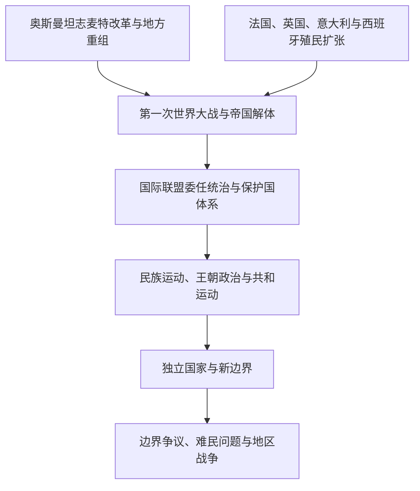

# 奥斯曼解体、殖民委任统治与现代国家

## 时间

19世纪至20世纪中叶

## 概括

现代西亚与北非国家体系形成于奥斯曼改革与收缩、欧洲殖民扩张、第一次世界大战、国际联盟委任统治、地方民族运动及第二次世界大战后非殖民化的共同作用。现代边界既继承帝国行省、港口和交通网络，也体现殖民行政、安全考虑与地方力量妥协。

## 演变关系

## 主要机制

| 机制 | 典型地区 | 历史作用 |
|---|---|---|
| 奥斯曼改革与行省重组 | 安纳托利亚、黎凡特、两河、汉志与北非部分地区 | 扩张中央行政、征税、征兵和法律制度，同时激化中央与地方权力协商 |
| 殖民征服与保护国 | 阿尔及利亚、突尼斯、摩洛哥、利比亚、埃及、海湾 | 建立直接统治或保护关系，重组土地、贸易、军队和行政 |
| 委任统治 | 伊拉克、叙利亚、黎巴嫩、巴勒斯坦、外约旦 | 以国际监督名义延续英法控制，并塑造国家机构与边界 |
| 民族运动 | 土耳其、阿拉伯地区、北非、犹太与巴勒斯坦社会 | 争取独立、自决或建国，同时形成相互竞争的领土方案 |
| 非殖民化 | 北非、海湾、苏丹及东地中海 | 通过战争、谈判或制度移交建立主权国家 |

## 重要转折

- 1830年法国占领阿尔及尔，开启北非长期殖民扩张的重要阶段。
- 19世纪奥斯曼改革强化中央治理，也改变了地方精英、宗教社群与省级行政关系。
- 1882年英国占领埃及；20世纪初法国、意大利和西班牙进一步扩张北非统治。
- 1914—1918年第一次世界大战摧毁奥斯曼帝国原有政治框架。
- 1920年代委任统治制度确立，伊拉克、叙利亚、黎巴嫩、巴勒斯坦和外约旦进入不同英法治理体系。
- 第二次世界大战后，民族主义、国际环境变化与殖民成本上升推动独立浪潮。
- 现代边界建立后仍遗留巴勒斯坦、库尔德地区、西撒哈拉及若干海湾与高加索争端。

## 相关笔记

- 前一主线：[奥斯曼帝国](/%E4%BA%BA%E6%96%87%E7%A7%91%E5%AD%A6/%E5%8E%86%E5%8F%B2/%E8%A5%BF%E4%BA%9A/%E5%9C%9F%E8%80%B3%E5%85%B6/%E5%A5%A5%E6%96%AF%E6%9B%BC%E5%B8%9D%E5%9B%BD/README.md)
- 黎凡特重组：[英法委任统治时期](/%E4%BA%BA%E6%96%87%E7%A7%91%E5%AD%A6/%E5%8E%86%E5%8F%B2/%E8%A5%BF%E4%BA%9A/%E9%BB%8E%E5%87%A1%E7%89%B9/%E8%8B%B1%E6%B3%95%E5%A7%94%E4%BB%BB%E7%BB%9F%E6%B2%BB%E6%97%B6%E6%9C%9F.md)
- 后续主题：[石油、冷战与地区体系](/%E4%BA%BA%E6%96%87%E7%A7%91%E5%AD%A6/%E5%8E%86%E5%8F%B2/%E8%A5%BF%E4%BA%9A/_%E9%80%9A%E5%8F%B2/%E7%9F%B3%E6%B2%B9%E3%80%81%E5%86%B7%E6%88%98%E4%B8%8E%E5%9C%B0%E5%8C%BA%E4%BD%93%E7%B3%BB.md)
- 国家入口：[伊拉克](/%E4%BA%BA%E6%96%87%E7%A7%91%E5%AD%A6/%E5%8E%86%E5%8F%B2/%E8%A5%BF%E4%BA%9A/%E4%B8%A4%E6%B2%B3%E6%B5%81%E5%9F%9F/%E4%BC%8A%E6%8B%89%E5%85%8B/README.md)、[叙利亚](/%E4%BA%BA%E6%96%87%E7%A7%91%E5%AD%A6/%E5%8E%86%E5%8F%B2/%E8%A5%BF%E4%BA%9A/%E9%BB%8E%E5%87%A1%E7%89%B9/%E5%8F%99%E5%88%A9%E4%BA%9A/README.md)、[北非](/%E4%BA%BA%E6%96%87%E7%A7%91%E5%AD%A6/%E5%8E%86%E5%8F%B2/%E5%8C%97%E9%9D%9E/README.md)
