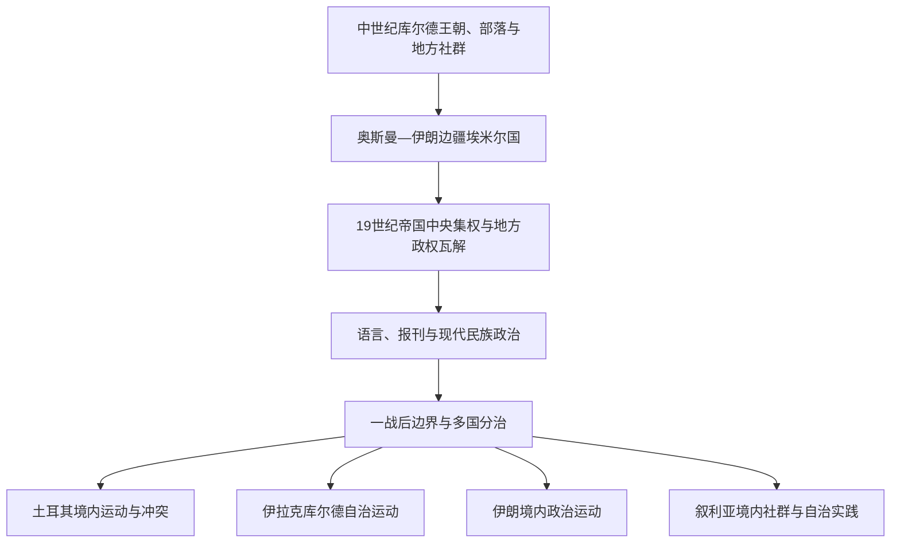

# 库尔德地区与库尔德民族运动

## 时间

中世纪至今，重点为19世纪以来

## 概括

库尔德人主要分布在托罗斯山、扎格罗斯山和上美索不达米亚相连地区，今天跨越土耳其、伊拉克、伊朗、叙利亚及邻近国家。库尔德社会包含多种方言、宗教、部落、城市阶层和政治组织，不存在一条由单一古代王国直线延续至现代民族运动的统一政治谱系。

近世库尔德埃米尔国和部落联盟常处于奥斯曼—伊朗边疆。19世纪帝国中央集权削弱地方政权，现代教育、报刊、战争与流亡网络推动民族政治形成。第一次世界大战后，奥斯曼旧领被划入多个国家，库尔德运动由此分别进入土耳其、伊拉克、伊朗和叙利亚的国家史。

## 演变关系

## 历史阶段

| 阶段 | 主要结构 | 说明 |
|---|---|---|
| 中世纪地方政权 | 库尔德王朝、部落联盟、城镇和宗教网络 | 阿尤布王朝由库尔德家族建立，但其帝国不能等同于现代库尔德民族国家 |
| 奥斯曼—伊朗边疆 | 埃米尔国、部落首领、帝国行省 | 地方政权以纳贡、军役和边疆协防换取不同程度自治 |
| 19世纪中央集权 | 奥斯曼与恺加国家、地方反抗 | 帝国撤销半自治埃米尔国，谢赫、部落和新式知识阶层成为政治动员节点 |
| 一战后重组 | 土耳其、伊拉克、叙利亚与伊朗国家 | 《色佛尔条约》的相关设想未实施，《洛桑条约》确立的新秩序未建立库尔德国家 |
| 现代多国运动 | 政党、游击组织、自治政府、文化与公民运动 | 各国目标、组织、社会基础和国际关系差异显著 |

## 分地区主线

### 土耳其

- 共和国早期以统一国民国家和语言政策整合东南地区，发生谢赫赛义德起义、阿勒维—库尔德地区冲突与德尔西姆军事行动等。
- 库尔德工人党自1984年开始武装斗争，冲突、反恐政策、村庄迁移和多轮和谈深刻影响土耳其政治。
- 合法政党、地方政府、语言文化运动与武装组织不能混为同一主体。

### 伊拉克

- 巴尔扎尼家族、库尔德民主党和后来的库尔德斯坦爱国联盟长期争取自治。
- 1970年自治协议未能稳定落实；1980年代“安法尔”行动与哈拉卜贾化学武器袭击造成大规模平民死亡和流离失所。
- 1991年战争后形成事实自治；2005年伊拉克宪法承认库尔德斯坦地区的联邦地位。
- 自治地区与巴格达在领土、预算、石油出口和安全权力上持续协商。

### 伊朗

- 1946年马哈巴德共和国短暂存在，后被伊朗军队终结。
- 此后库尔德政党、地方社会与中央政府之间经历政治谈判、武装冲突和文化权利争议。
- 伊朗库尔德社会内部存在语言、宗教和政党差异，不应套用伊拉克或土耳其模式。

### 叙利亚

- 法国委任统治和独立后的边界把叙利亚北部库尔德社群置于新的国家框架。
- 1962年哈塞克省特别人口普查使部分库尔德人失去公民身份，相关问题在2011年后部分调整。
- 叙利亚内战期间，库尔德主导力量在东北部建立自治治理与军事体系，并同“伊斯兰国”、叙利亚政府、土耳其及国际力量发生复杂互动。

## 关键辨析

- “库尔德斯坦”可指历史地理、文化区域、政治理想或伊拉克宪法承认的库尔德斯坦地区，必须结合语境。
- 库尔德语包含库尔曼吉语、索拉尼语等主要变体，文字和教育传统也因国家而异。
- 库尔德政治并非单一阵营；政党之间可能合作、竞争甚至冲突。
- 民族自决、国家领土完整、地方自治、安全与居民权利是相互关联但不能相互替代的议题。

## 相关国家与专题

- [土耳其](/%E4%BA%BA%E6%96%87%E7%A7%91%E5%AD%A6/%E5%8E%86%E5%8F%B2/%E8%A5%BF%E4%BA%9A/%E5%9C%9F%E8%80%B3%E5%85%B6/README.md)
- [伊拉克](/%E4%BA%BA%E6%96%87%E7%A7%91%E5%AD%A6/%E5%8E%86%E5%8F%B2/%E8%A5%BF%E4%BA%9A/%E4%B8%A4%E6%B2%B3%E6%B5%81%E5%9F%9F/%E4%BC%8A%E6%8B%89%E5%85%8B/README.md)
- [伊朗](/%E4%BA%BA%E6%96%87%E7%A7%91%E5%AD%A6/%E5%8E%86%E5%8F%B2/%E8%A5%BF%E4%BA%9A/%E4%BC%8A%E6%9C%97/README.md)
- [叙利亚](/%E4%BA%BA%E6%96%87%E7%A7%91%E5%AD%A6/%E5%8E%86%E5%8F%B2/%E8%A5%BF%E4%BA%9A/%E9%BB%8E%E5%87%A1%E7%89%B9/%E5%8F%99%E5%88%A9%E4%BA%9A/README.md)
- [奥斯曼解体、殖民委任统治与现代国家](/%E4%BA%BA%E6%96%87%E7%A7%91%E5%AD%A6/%E5%8E%86%E5%8F%B2/%E8%A5%BF%E4%BA%9A/_%E9%80%9A%E5%8F%B2/%E5%A5%A5%E6%96%AF%E6%9B%BC%E8%A7%A3%E4%BD%93%E3%80%81%E6%AE%96%E6%B0%91%E5%A7%94%E4%BB%BB%E7%BB%9F%E6%B2%BB%E4%B8%8E%E7%8E%B0%E4%BB%A3%E5%9B%BD%E5%AE%B6.md)
