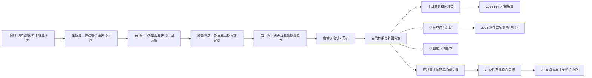

# 库尔德地区与库尔德民族运动

## 时间

中世纪—2026年7月，重点为19世纪以来

## 概括

库尔德人主要分布在托罗斯山、扎格罗斯山和上美索不达米亚相连地带，今天跨越土耳其、伊拉克、伊朗、叙利亚及邻近国家。库尔德社会包含库尔曼吉、索拉尼等语言变体，逊尼派、什叶派、阿列维、雅兹迪等宗教社群，以及部落、村庄、城市中产、工人和侨民。中世纪库尔德家族建立过地方王朝，但现代民族运动并不是某个古代王国不间断延续的结果；它形成于帝国中央集权、报刊教育、战争划界、人口迁徙和现代国家同质化政策。

## 历史背景与地方结构

### 中世纪王朝并非现代民族国家

10—12世纪，哈桑韦希、安纳兹、马尔万等库尔德家族在扎格罗斯和迪亚巴克尔一带建立地方政权。萨拉丁家族出身库尔德，建立阿尤布王朝并统治埃及、叙利亚等地，但其合法性和统治对象以伊斯兰王朝、家族和城市政治为核心，不能倒称为现代“库尔德民族国家”。

“库尔德”在中世纪文献中可指语言、山地生活方式、部落或地区人群，含义随作者与时代变化。现代民族身份建立在这些较早认同之上，却受到19—20世纪人口普查、学校、军队、边界和政党的重新塑造。

### 奥斯曼—伊朗边疆埃米尔国

1514年查尔迪兰战役后，奥斯曼与萨法维长期争夺安纳托利亚东部和扎格罗斯边疆。比特利斯、博坦、索兰、巴班等库尔德埃米尔国通过纳贡、军役、道路防卫和承认宗主权换取不同程度的世袭自治。它们彼此竞争，也可能在奥斯曼和伊朗之间转向。

| 层级 | 权力与关系 |
|---|---|
| 帝国中央 | 任命或承认地方统治者、征收贡赋、要求战时军役，并在边界稳定后扩大直接行政。 |
| 埃米尔家族 | 管理城堡、税收和地方武装，以家族谱系和帝国诏令取得合法性。 |
| 部落首领 | 控制牧道、土地和武装，是埃米尔与村社之间的中介，也可能独立反叛。 |
| 谢赫与宗教网络 | 纳格什班迪、卡迪里等苏菲领袖跨越部落，19世纪后常成为大规模政治动员者。 |
| 农村与城市社群 | 农民、牧民、工匠和商人承担税役，其利益并不总与部落或民族精英一致。 |

## 19世纪：中央集权与现代动员

奥斯曼坦志麦特和恺加伊朗都试图以军队、州县、税收和户籍取代半自治边疆。博坦埃米尔贝迪尔汗在1840年代扩张并与亚述社群发生严重暴力，1847年被奥斯曼军队击败；其他埃米尔国也陆续撤销。旧王侯衰落后，部落首领和苏菲谢赫成为新的跨地区中介。

1880年谢赫乌拜杜拉起事跨越奥斯曼—恺加边界，其书信已出现库尔德人作为拥有共同政治利益群体的表达，常被视为早期现代民族动员节点。然而宗教权威、部落利益和民族诉求仍交织，不能把运动等同于后来世俗民族政党。

报刊、伊斯坦布尔和开罗的侨民组织、新式学校及军队培养了知识精英。与此同时，奥斯曼晚期针对亚美尼亚人的暴力中，部分库尔德部落和哈米迪耶骑兵参与迫害，也有库尔德人保护邻居或拒绝参与；必须区分国家政策、地方行为者和不同社群，不能用后来的共同受压叙事抹去责任。

## 一战、条约与多国分治

第一次世界大战造成征兵、饥荒、俄军推进、人口驱逐和帝国崩溃。库尔德政治组织对未来方案并不一致：有人支持奥斯曼—穆斯林共同体，有人寻求地方自治或独立，部落和城市精英也对领土范围存在分歧。

1920年《色佛尔条约》规定可在安纳托利亚东部启动库尔德地方自治及可能独立程序，但范围、摩苏尔归属和实际支持均未确定。土耳其独立战争改变力量平衡，1923年《洛桑条约》不再设置库尔德政治实体。英国控制的摩苏尔最终并入伊拉克，法国委任下的叙利亚获得北部库尔德地区；现代库尔德人口由此分处四个主要国家。

“一个承诺的库尔德斯坦被单一背叛”过度简化了当时的分歧。色佛尔从未生效，库尔德代表性不足，各列强以自身战略为先，而土耳其民族运动及地方军事结果决定了洛桑秩序。

## 分国历史主线

### 土耳其

共和国以统一土耳其国民、世俗中央行政和土耳其语教育重建东南地区。1925年谢赫赛义德起义同时包含宗教、地方权力和库尔德诉求，镇压后政府扩大非常法庭、迁徙与语言限制。1927—1930年阿拉拉特运动及1937—1938年德尔西姆军事行动再次造成大规模死亡与强制迁移；德尔西姆社群的阿列维信仰、扎扎语和地方结构也说明“库尔德运动”内部高度多样。

库尔德工人党1978年成立，1984年发动武装斗争，最初主张独立，后来转向自治、文化权利和“民主邦联”等目标。国家以紧急状态、乡村卫队、越境行动和大规模迁村应对；平民、征召人员、军警和武装成员都遭受长期伤亡。阿卜杜拉·奥贾兰1999年被捕后，组织战略多次变化。

2013—2015年和平进程一度停火，但科巴尼危机、选举政治、互不信任和暴力事件使谈判崩溃，东南城市战和跨境冲突恢复。合法亲库尔德政党、民选市长、民间文化组织与PKK不是同一主体，把所有政治参与者等同武装组织会遮蔽社会差异。

2025年2月奥贾兰呼吁PKK解除武装和解散，PKK同年5月宣布结束组织结构。2026年2月土耳其议会多党委员会通过配合法律改革和成员重返社会的路线报告；截至2026年6—7月，政府仍在拟定加速解散和融入的法律框架，武器核验、刑责、政治权利、地方治理和叙利亚分支问题尚未全部解决。因此应把它写作正在实施且有争议的和平进程，而不是冲突已经彻底结束。

### 伊拉克

一战后谢赫马哈茂德·巴尔赞吉在苏莱曼尼亚多次反抗英国和伊拉克政府。穆斯塔法·巴尔扎尼领导的运动于1946年建立库尔德民主党，1961年起与巴格达长期交战。1970年自治协议承诺语言和行政权，但基尔库克边界、人口普查和石油控制未解决；1975年伊朗与伊拉克签署《阿尔及尔协定》后撤回援助，库尔德武装迅速受挫。

库尔德斯坦爱国联盟1975年成立，与库尔德民主党既合作也竞争。1987—1988年萨达姆政府“安法尔”行动包括村庄毁灭、集体处决、强制迁移和化学武器使用；1988年哈拉卜贾袭击成为最著名事件之一。1991年海湾战争后起义、镇压和禁飞区促成事实自治，1992年建立地区议会；1994—1998年两大党内战显示民族共同目标并未消除权力竞争。

2005年伊拉克宪法承认库尔德斯坦地区为联邦实体。2014年“伊斯兰国”进攻扩大佩什梅格控制范围，随后在国际支援下反攻。2017年独立公投获高支持，却缺乏巴格达和邻国承认，伊拉克军队重夺基尔库克等争议区。此后预算、油气出口、联邦法院权限和争议领土持续谈判。

### 伊朗

20世纪初西姆科·希卡克在伊朗西北建立武装势力，其行动混合部落权力、地方自治和民族政治。1946年在苏联占领背景下建立的马哈巴德共和国以卡齐·穆罕默德为总统，存在不足一年；苏军撤出后伊朗军队恢复控制，领导人被处决，巴尔扎尼部众转往苏联。

1979年革命后，库尔德政党争取自治，与新共和国迅速爆发战争。伊朗库尔德民主党、科马拉及其他组织在意识形态、社会基础和对外关系上不同。政府以军队、革命卫队、安全审判和跨境打击压制武装与政治活动；同时有选举、地方行政和文化出版等合法空间，但受国家安全和语言政策限制。

2022年库尔德女性吉娜·马赫萨·阿米尼死亡引发“女性、生命、自由”抗议，库尔德地区成为重要中心，运动又扩展为全国性政治危机。这一事件显示性别、民族、公民权和共和国制度相互交织，不能只归入单一民族冲突。

### 叙利亚

法国委任时期，来自土耳其的难民、部落和地方居民共同塑造北部库尔德社群。独立后阿拉伯民族主义政府加强边疆控制；1962年哈塞克特别人口普查使许多库尔德人失去公民身份，另有“阿拉伯带”等土地和定居政策。2004年卡米什利冲突与镇压扩大政治动员。

2011年内战后，政府军撤出部分东北地区，民主联盟党及其武装人民保护部队建立地方治理；2014—2015年科巴尼战役后，库尔德主导的叙利亚民主力量在美国支持下成为打击“伊斯兰国”的主要地面伙伴。自治行政包含阿拉伯、亚述等社区和性别代表制度，也面临一党优势、征兵、被拘“伊斯兰国”人员、资源分配和阿拉伯地区代表性争议。

土耳其把人民保护部队视为PKK延伸，自2016年起多次越境行动；阿夫林、泰勒艾卜耶德等地控制权和人口迁移改变。2024年12月阿萨德政府垮台后，东北自治与新大马士革当局谈判国家统一。2025年3月双方签署原则性整合协议；2026年初冲突后又达成停火和分阶段把军事、行政、安全机构纳入叙利亚国家的安排，并承认库尔德文化、语言和公民权问题。截至2026年6月实施仍在推进，治安人员整合、地方权限、资源和流离失所者返回尚未完全解决。

## 重要事件

| 时间 | 事件 | 结果与长期影响 |
|---|---|---|
| 1514年 | 查尔迪兰战役 | 奥斯曼—萨法维边界竞争促成库尔德埃米尔国的缓冲角色。 |
| 1847年 | 贝迪尔汗政权被击败 | 奥斯曼中央逐步撤销半自治埃米尔国。 |
| 1880—1881年 | 谢赫乌拜杜拉起事 | 跨境宗教—部落运动出现较明确的共同民族政治语言。 |
| 1915—1916年 | 亚美尼亚种族灭绝 | 部分库尔德行为者参与国家暴力，也有拒绝或救助者；地区人口结构被根本改变。 |
| 1920年 | 《色佛尔条约》 | 提出库尔德自治和可能独立程序，但从未实施。 |
| 1923年 | 《洛桑条约》 | 确立土耳其新秩序，库尔德地区分处多国。 |
| 1925年 | 谢赫赛义德起义 | 土耳其扩大东南紧急统治和人口、语言政策。 |
| 1937—1938年 | 德尔西姆军事行动 | 大规模死亡和迁徙成为共和国历史创伤。 |
| 1946年 | 马哈巴德共和国 | 短暂提供现代库尔德国家机构经验，苏军撤出后覆亡。 |
| 1946年 | 伊拉克库尔德民主党成立 | 巴尔扎尼运动转向现代政党组织。 |
| 1961年 | 伊拉克库尔德战争再起 | 自治问题成为伊拉克国家长期核心冲突。 |
| 1962年 | 叙利亚哈塞克人口普查 | 大量库尔德居民被剥夺国籍，影响持续数十年。 |
| 1970年 | 伊拉克自治协议 | 首次正式承诺广泛自治，但边界和执行争议导致失败。 |
| 1975年 | 《阿尔及尔协定》 | 伊朗撤援后伊拉克库尔德运动遭受直接军事挫败。 |
| 1978、1984年 | PKK成立并发动武装斗争 | 土耳其库尔德问题进入持续数十年的武装阶段。 |
| 1987—1988年 | “安法尔”行动和哈拉卜贾袭击 | 大规模国家暴力摧毁村庄并造成平民死亡。 |
| 1991—1992年 | 伊拉克北部事实自治与地区议会 | 国际禁飞区和地方选举形成自治制度。 |
| 1999年 | 奥贾兰被捕 | PKK战略和土耳其冲突进入新阶段。 |
| 2005年 | 伊拉克宪法承认联邦地区 | 库尔德自治获得正式宪法地位。 |
| 2012年以后 | 叙利亚东北自治实践 | 内战权力真空、反“伊斯兰国”战争和外援形成新治理体。 |
| 2013—2015年 | 土耳其和平进程 | 停火与谈判一度推进，最终因政治和安全危机崩溃。 |
| 2017年 | 伊拉克库区独立公投 | 显示社会独立诉求，却引发巴格达和邻国反制。 |
| 2022年 | “女性、生命、自由”抗议 | 从伊朗库尔德地区扩展为全国性运动。 |
| 2025年 | PKK宣布解散和解除武装 | 为结束土耳其长期冲突提供机会，落实取决于法律与政治安排。 |
| 2026年 | 土耳其和平路线立法、叙利亚整合协议 | 两条进程都从军事问题转入制度实施，但结果仍未定型。 |

## 运动兴起、受挫与持续原因

### 民族运动兴起

- 帝国中央集权取消地方自治，旧中介和山地社会受到直接行政冲击。
- 一战后的边界把同语言和亲族网络分割，却也让各国政策产生不同政治经验。
- 学校、报刊、军队、城市化和侨民把地方认同转化为现代组织。
- 禁止语言、剥夺国籍、迁村和暴力镇压扩大共同受压记忆。
- 山地地形、跨境亲族和邻国援助为武装组织提供生存空间。

### 统一运动反复受挫

- 四国都把领土完整和边境安全视为核心国家利益，并可相互协调压制独立方案。
- 库尔德政治内部存在方言、地区、阶级、宗教、家族和意识形态分歧。
- 外部大国常把库尔德武装作为临时伙伴，在战略变化后撤回支持。
- 石油城市、混合人口区和边界归属难以用单一民族原则解决。
- 武装斗争、国家镇压和针对平民的暴力相互强化不信任。

### 自治得以制度化的条件

伊拉克库尔德斯坦的自治依靠长期组织、1991年国际安全环境、地方选举、两大党权力分享及2003年后伊拉克联邦重建。其经验不能机械移植到其他国家：财政依赖、党派军队、争议领土和周边国家关系仍限制主权。叙利亚东北的未来则取决于2026年整合协议如何平衡国家统一、地方治理、文化权利和多族居民代表。

## 关键辨析

- “库尔德斯坦”可指历史地理、文化区域、民族理想，或伊拉克宪法承认的库尔德斯坦地区，必须结合语境。
- 库尔德语不是单一标准口语；库尔曼吉、索拉尼、扎扎语等的分类和身份关系存在学术及政治争议。
- 库尔德政治不是单一阵营。合法政党、地方政府、部落、民间组织、PKK、KDP、PUK、PYD、KDPI等有不同目标和关系。
- 承认国家暴力和文化压制，不等于忽略武装组织对平民、异议者或竞争集团的暴力。
- 阿尤布王朝的库尔德家族出身可以是库尔德历史的一部分，但不能把其跨族伊斯兰帝国直接等同现代民族国家。

## 相关国家与专题

- [土耳其](/%E4%BA%BA%E6%96%87%E7%A7%91%E5%AD%A6/%E5%8E%86%E5%8F%B2/%E8%A5%BF%E4%BA%9A/%E5%9C%9F%E8%80%B3%E5%85%B6/README.md)
- [伊拉克](/%E4%BA%BA%E6%96%87%E7%A7%91%E5%AD%A6/%E5%8E%86%E5%8F%B2/%E8%A5%BF%E4%BA%9A/%E4%B8%A4%E6%B2%B3%E6%B5%81%E5%9F%9F/%E4%BC%8A%E6%8B%89%E5%85%8B/README.md)
- [伊朗](/%E4%BA%BA%E6%96%87%E7%A7%91%E5%AD%A6/%E5%8E%86%E5%8F%B2/%E8%A5%BF%E4%BA%9A/%E4%BC%8A%E6%9C%97/README.md)
- [叙利亚](/%E4%BA%BA%E6%96%87%E7%A7%91%E5%AD%A6/%E5%8E%86%E5%8F%B2/%E8%A5%BF%E4%BA%9A/%E9%BB%8E%E5%87%A1%E7%89%B9/%E5%8F%99%E5%88%A9%E4%BA%9A/README.md)
- [奥斯曼解体、殖民委任统治与现代国家](/%E4%BA%BA%E6%96%87%E7%A7%91%E5%AD%A6/%E5%8E%86%E5%8F%B2/%E8%A5%BF%E4%BA%9A/_%E9%80%9A%E5%8F%B2/%E5%A5%A5%E6%96%AF%E6%9B%BC%E8%A7%A3%E4%BD%93%E3%80%81%E6%AE%96%E6%B0%91%E5%A7%94%E4%BB%BB%E7%BB%9F%E6%B2%BB%E4%B8%8E%E7%8E%B0%E4%BB%A3%E5%9B%BD%E5%AE%B6.md)
- [西亚通史](/%E4%BA%BA%E6%96%87%E7%A7%91%E5%AD%A6/%E5%8E%86%E5%8F%B2/%E8%A5%BF%E4%BA%9A/_%E9%80%9A%E5%8F%B2/README.md)
