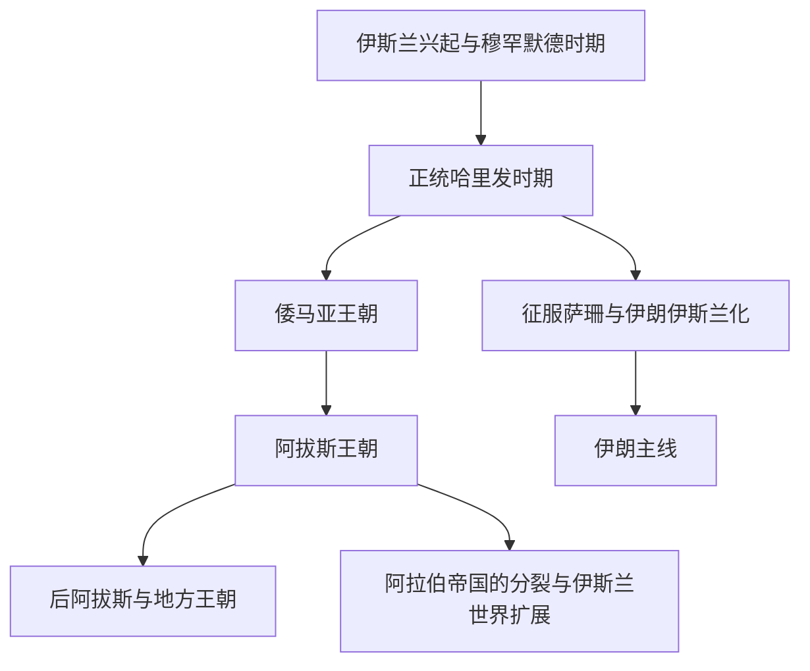

# 阿拉伯帝国

## 概括

阿拉伯帝国是伊斯兰兴起后形成的跨区域帝国体系。它从阿拉伯半岛出发，在正统哈里发、倭马亚和阿拔斯时期扩展到西亚、北非、伊朗、中亚和伊比利亚。它不是现代阿拉伯民族国家的总和，也不等于整个伊斯兰世界；后者在阿拉伯帝国政治分裂后继续由波斯、突厥、蒙古和其他地方王朝扩展。

## 演变图

## 按时间排序的时期导航

| 顺序 | 阶段 | 时间 | 入口 | 简要概括 |
|---:|---|---|---|---|
| 1 | 伊斯兰兴起与正统哈里发时期 | 610年-661年 | [伊斯兰兴起与正统哈里发时期](/%E4%BA%BA%E6%96%87%E7%A7%91%E5%AD%A6/%E5%8E%86%E5%8F%B2/%E8%A5%BF%E4%BA%9A/_%E9%80%9A%E5%8F%B2/%E9%98%BF%E6%8B%89%E4%BC%AF%E5%B8%9D%E5%9B%BD/%E4%BC%8A%E6%96%AF%E5%85%B0%E5%85%B4%E8%B5%B7%E4%B8%8E%E6%AD%A3%E7%BB%9F%E5%93%88%E9%87%8C%E5%8F%91%E6%97%B6%E6%9C%9F.md) | 从穆罕默德传教、麦地那共同体到四大哈里发时代，阿拉伯半岛完成政治和宗教整合，并迅速向叙利亚、埃及、伊朗等方向扩张。 |
| 2 | 倭马亚王朝 | 661年-750年；伊比利亚支系756年-1031年 | [倭马亚王朝](/%E4%BA%BA%E6%96%87%E7%A7%91%E5%AD%A6/%E5%8E%86%E5%8F%B2/%E8%A5%BF%E4%BA%9A/_%E9%80%9A%E5%8F%B2/%E9%98%BF%E6%8B%89%E4%BC%AF%E5%B8%9D%E5%9B%BD/%E5%80%AD%E9%A9%AC%E4%BA%9A%E7%8E%8B%E6%9C%9D.md) | 倭马亚王朝以大马士革为中心，把阿拉伯征服扩展到北非、伊比利亚、中亚和印度河流域，是阿拉伯帝国疆域扩张的高峰。 |
| 3 | 阿拔斯王朝 | 750年-1258年；名义延续至1517年 | [阿拔斯王朝](/%E4%BA%BA%E6%96%87%E7%A7%91%E5%AD%A6/%E5%8E%86%E5%8F%B2/%E8%A5%BF%E4%BA%9A/_%E9%80%9A%E5%8F%B2/%E9%98%BF%E6%8B%89%E4%BC%AF%E5%B8%9D%E5%9B%BD/%E9%98%BF%E6%8B%94%E6%96%AF%E7%8E%8B%E6%9C%9D.md) | 阿拔斯王朝以巴格达为中心，帝国由阿拉伯征服共同体转向更具波斯、突厥和多民族色彩的伊斯兰帝国。 |
| 4 | 后阿拔斯与地方王朝 | 9世纪-13世纪 | [后阿拔斯与地方王朝](/%E4%BA%BA%E6%96%87%E7%A7%91%E5%AD%A6/%E5%8E%86%E5%8F%B2/%E8%A5%BF%E4%BA%9A/_%E9%80%9A%E5%8F%B2/%E9%98%BF%E6%8B%89%E4%BC%AF%E5%B8%9D%E5%9B%BD/%E5%90%8E%E9%98%BF%E6%8B%94%E6%96%AF%E4%B8%8E%E5%9C%B0%E6%96%B9%E7%8E%8B%E6%9C%9D.md) | 阿拔斯中央权力衰落后，塔希尔、萨法尔、萨曼、布韦希、法蒂玛、塞尔柱等地方王朝和军事集团相继兴起。 |
| 5 | 阿拉伯帝国的行政与宗教结构 | 7世纪-13世纪 | [阿拉伯帝国的行政与宗教结构](/%E4%BA%BA%E6%96%87%E7%A7%91%E5%AD%A6/%E5%8E%86%E5%8F%B2/%E8%A5%BF%E4%BA%9A/_%E9%80%9A%E5%8F%B2/%E9%98%BF%E6%8B%89%E4%BC%AF%E5%B8%9D%E5%9B%BD/%E9%98%BF%E6%8B%89%E4%BC%AF%E5%B8%9D%E5%9B%BD%E7%9A%84%E8%A1%8C%E6%94%BF%E4%B8%8E%E5%AE%97%E6%95%99%E7%BB%93%E6%9E%84.md) | 阿拉伯帝国以哈里发制度、迪万行政、税制、军镇和伊斯兰法学共同构成统治结构。 |
| 6 | 阿拉伯帝国的分裂与伊斯兰世界扩展 | 8世纪-13世纪 | [阿拉伯帝国的分裂与伊斯兰世界扩展](/%E4%BA%BA%E6%96%87%E7%A7%91%E5%AD%A6/%E5%8E%86%E5%8F%B2/%E8%A5%BF%E4%BA%9A/_%E9%80%9A%E5%8F%B2/%E9%98%BF%E6%8B%89%E4%BC%AF%E5%B8%9D%E5%9B%BD/%E9%98%BF%E6%8B%89%E4%BC%AF%E5%B8%9D%E5%9B%BD%E7%9A%84%E5%88%86%E8%A3%82%E4%B8%8E%E4%BC%8A%E6%96%AF%E5%85%B0%E4%B8%96%E7%95%8C%E6%89%A9%E5%B1%95.md) | 阿拉伯帝国政治统一逐步瓦解，但伊斯兰信仰、阿拉伯语、学术网络和商业体系继续扩展，形成更广阔的伊斯兰文明圈。 |

## 关键辨析

- 阿拉伯帝国的核心制度是哈里发，但哈里发既有宗教象征，也有现实政治权力，二者在不同时期分离程度不同。
- 倭马亚王朝更偏阿拉伯军事贵族帝国，阿拔斯王朝更偏多民族伊斯兰帝国。
- 阿拔斯以后，政治统一衰退，但伊斯兰文明圈继续扩展。
- 伊朗、安达卢斯、中亚、北非等地区在本目录中只引用阿拉伯帝国主线，不重复维护完整帝国史。

## 相关欧洲历史

- 阿拉伯帝国西扩进入伊比利亚，欧洲侧节点见[伊比利亚半岛](/%E4%BA%BA%E6%96%87%E7%A7%91%E5%AD%A6/%E5%8E%86%E5%8F%B2/%E6%AC%A7%E6%B4%B2/%E4%BC%8A%E6%AF%94%E5%88%A9%E4%BA%9A%E5%8D%8A%E5%B2%9B/README.md)与[安达卢斯与穆斯林统治](/%E4%BA%BA%E6%96%87%E7%A7%91%E5%AD%A6/%E5%8E%86%E5%8F%B2/%E6%AC%A7%E6%B4%B2/%E4%BC%8A%E6%AF%94%E5%88%A9%E4%BA%9A%E5%8D%8A%E5%B2%9B/%E5%AE%89%E8%BE%BE%E5%8D%A2%E6%96%AF%E4%B8%8E%E7%A9%86%E6%96%AF%E6%9E%97%E7%BB%9F%E6%B2%BB.md)。
- 7世纪以后阿拉伯扩张改变拜占庭东部行省格局，参见[东罗马帝国与拜占庭帝国](/%E4%BA%BA%E6%96%87%E7%A7%91%E5%AD%A6/%E5%8E%86%E5%8F%B2/%E6%AC%A7%E6%B4%B2/_%E9%80%9A%E5%8F%B2/%E5%8F%A4%E7%BD%97%E9%A9%AC/%E4%B8%9C%E7%BD%97%E9%A9%AC%E5%B8%9D%E5%9B%BD%E4%B8%8E%E6%8B%9C%E5%8D%A0%E5%BA%AD%E5%B8%9D%E5%9B%BD.md)。
- 倭马亚进入高卢方向与法兰克冲突，参见[法兰克王国](/%E4%BA%BA%E6%96%87%E7%A7%91%E5%AD%A6/%E5%8E%86%E5%8F%B2/%E6%AC%A7%E6%B4%B2/_%E9%80%9A%E5%8F%B2/%E5%90%8E%E7%BD%97%E9%A9%AC%E6%97%B6%E4%BB%A3%E7%9A%84%E6%97%A5%E8%80%B3%E6%9B%BC%E8%AF%B8%E5%9B%BD/%E6%B3%95%E5%85%B0%E5%85%8B%E7%8E%8B%E5%9B%BD/README.md)。

## 相关区域

- 伊朗主线：[伊朗](/%E4%BA%BA%E6%96%87%E7%A7%91%E5%AD%A6/%E5%8E%86%E5%8F%B2/%E8%A5%BF%E4%BA%9A/%E4%BC%8A%E6%9C%97/README.md)。
- 世界帝国对照：[世界大帝国时空图](/%E4%BA%BA%E6%96%87%E7%A7%91%E5%AD%A6/%E5%8E%86%E5%8F%B2/_%E9%80%9A%E5%8F%B2/%E4%B8%96%E7%95%8C%E5%A4%A7%E5%B8%9D%E5%9B%BD%E6%97%B6%E7%A9%BA%E5%9B%BE.md)。
- 欧洲交叉节点：[安达卢斯与穆斯林统治](/%E4%BA%BA%E6%96%87%E7%A7%91%E5%AD%A6/%E5%8E%86%E5%8F%B2/%E6%AC%A7%E6%B4%B2/%E4%BC%8A%E6%AF%94%E5%88%A9%E4%BA%9A%E5%8D%8A%E5%B2%9B/%E5%AE%89%E8%BE%BE%E5%8D%A2%E6%96%AF%E4%B8%8E%E7%A9%86%E6%96%AF%E6%9E%97%E7%BB%9F%E6%B2%BB.md)。

## 与西亚与北非内部主线的关系

- 正统哈里发征服萨珊后，伊朗转入[阿拉伯征服与伊斯兰化时期](/%E4%BA%BA%E6%96%87%E7%A7%91%E5%AD%A6/%E5%8E%86%E5%8F%B2/%E8%A5%BF%E4%BA%9A/%E4%BC%8A%E6%9C%97/%E9%98%BF%E6%8B%89%E4%BC%AF%E5%BE%81%E6%9C%8D%E4%B8%8E%E4%BC%8A%E6%96%AF%E5%85%B0%E5%8C%96%E6%97%B6%E6%9C%9F.md)；完整伊朗后续见[伊朗](/%E4%BA%BA%E6%96%87%E7%A7%91%E5%AD%A6/%E5%8E%86%E5%8F%B2/%E8%A5%BF%E4%BA%9A/%E4%BC%8A%E6%9C%97/README.md)。
- 阿拔斯以后地方王朝、突厥军事集团和塞尔柱兴起，与[塞尔柱与突厥化时期](/%E4%BA%BA%E6%96%87%E7%A7%91%E5%AD%A6/%E5%8E%86%E5%8F%B2/%E8%A5%BF%E4%BA%9A/%E4%BC%8A%E6%9C%97/%E5%A1%9E%E5%B0%94%E6%9F%B1%E4%B8%8E%E7%AA%81%E5%8E%A5%E5%8C%96%E6%97%B6%E6%9C%9F.md)和[安纳托利亚突厥化与罗姆苏丹国](/%E4%BA%BA%E6%96%87%E7%A7%91%E5%AD%A6/%E5%8E%86%E5%8F%B2/%E8%A5%BF%E4%BA%9A/%E5%9C%9F%E8%80%B3%E5%85%B6/%E5%AE%89%E7%BA%B3%E6%89%98%E5%88%A9%E4%BA%9A%E7%AA%81%E5%8E%A5%E5%8C%96%E4%B8%8E%E7%BD%97%E5%A7%86%E8%8B%8F%E4%B8%B9%E5%9B%BD.md)相连。
- 奥斯曼后来取得阿拉伯地区与哈里发象征，后续参见[奥斯曼帝国](/%E4%BA%BA%E6%96%87%E7%A7%91%E5%AD%A6/%E5%8E%86%E5%8F%B2/%E8%A5%BF%E4%BA%9A/%E5%9C%9F%E8%80%B3%E5%85%B6/%E5%A5%A5%E6%96%AF%E6%9B%BC%E5%B8%9D%E5%9B%BD/README.md)。
- 阿拉伯征服萨珊后，两河流域进入伊斯兰帝国体系，阿拔斯时期巴格达成为中心，区域视角见[阿拉伯征服后的两河流域](/%E4%BA%BA%E6%96%87%E7%A7%91%E5%AD%A6/%E5%8E%86%E5%8F%B2/%E8%A5%BF%E4%BA%9A/%E4%B8%A4%E6%B2%B3%E6%B5%81%E5%9F%9F/%E9%98%BF%E6%8B%89%E4%BC%AF%E5%BE%81%E6%9C%8D%E5%90%8E%E7%9A%84%E4%B8%A4%E6%B2%B3%E6%B5%81%E5%9F%9F.md)。
- 阿拉伯帝国和后续伊斯兰世界影响印度洋与印度西北，南亚侧见[德里苏丹国](/%E4%BA%BA%E6%96%87%E7%A7%91%E5%AD%A6/%E5%8E%86%E5%8F%B2/%E5%8D%97%E4%BA%9A/%E5%8D%B0%E5%BA%A6/%E5%BE%B7%E9%87%8C%E8%8B%8F%E4%B8%B9%E5%9B%BD.md)、[莫卧儿帝国](/%E4%BA%BA%E6%96%87%E7%A7%91%E5%AD%A6/%E5%8E%86%E5%8F%B2/%E5%8D%97%E4%BA%9A/%E5%8D%B0%E5%BA%A6/%E8%8E%AB%E5%8D%A7%E5%84%BF%E5%B8%9D%E5%9B%BD.md)。
