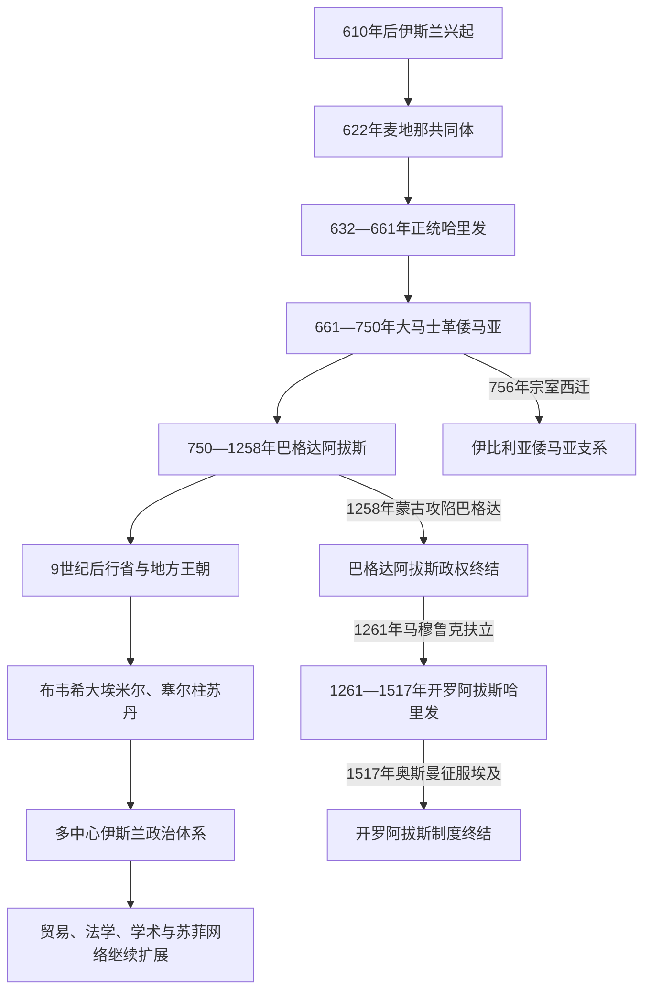

# 阿拉伯帝国

## 范围与概括

本目录维护7—13世纪阿拉伯哈里发帝国及其政治分裂后共同制度、文明网络和阿拔斯名号延续的规范主线。其空间从阿拉伯半岛扩展到西亚、北非、伊朗、中亚、伊比利亚和信德，但“阿拉伯帝国”不是现代阿拉伯国家的总和，也不等于全部伊斯兰世界。

- **政治主线**：穆罕默德与麦地那共同体 → 正统哈里发 → 大马士革倭马亚 → 巴格达阿拔斯 → 地方王朝、埃米尔和苏丹体系。
- **名号延续**：1258年巴格达阿拔斯政权灭亡；1261—1517年开罗阿拔斯是马穆鲁克保护下的礼仪—合法性职位，不是巴格达领土帝国迁都。
- **文明主线**：政治统一收缩后，伊斯兰信仰、阿拉伯语宗教学术、新波斯语文化、法学、朝觐、贸易和苏菲网络继续扩展。
- **规范职责**：本目录维护跨区域共同史和完整哈里发世系；各区域、国家目录只展开当地征服、社会转型和后继政权，避免重复正文与世系。

## 历史主线

1. **共同体与征服国家**：610—632年间，伊斯兰从麦加传教发展为麦地那政治共同体；四位正统哈里发在无固定继承法的情况下整合半岛并征服拜占庭、萨珊大片领土。
2. **王朝帝国**：倭马亚以大马士革、叙利亚军团和行省总督重建内战后的国家，行政阿拉伯化、独立铸币和多路扩张使疆域达到高峰。
3. **多民族巴格达帝国**：阿拔斯依靠呼罗珊革命联盟取代倭马亚，把中心东移两河，扩大伊朗官僚、突厥军人和城市商业网络的作用。
4. **权力分层**：9世纪后，总督、地方王朝、军事集团、大埃米尔与苏丹掌握越来越多军财；哈里发的领土权缩小，但册封、礼仪和宗教合法性没有立即消失。
5. **政治分裂与文明扩展并行**：法蒂玛、科尔多瓦倭马亚、塞尔柱、阿尤布、马穆鲁克等形成多中心国家；伊斯兰化、阿拉伯化、波斯化和突厥化按不同地区与机制展开。
6. **两个制度终点**：1258年终结巴格达阿拔斯领土政权，1517年终结开罗阿拔斯礼仪职位。两者之间不是同一国家连续统治。

## 按时间排序的笔记导航

| 顺序 | 笔记 | 时间 | 类型与内容职责 |
|---:|---|---|---|
| 1 | [伊斯兰兴起与正统哈里发时期](/%E4%BA%BA%E6%96%87%E7%A7%91%E5%AD%A6/%E5%8E%86%E5%8F%B2/%E8%A5%BF%E4%BA%9A/_%E9%80%9A%E5%8F%B2/%E9%98%BF%E6%8B%89%E4%BC%AF%E5%B8%9D%E5%9B%BD/%E4%BC%8A%E6%96%AF%E5%85%B0%E5%85%B4%E8%B5%B7%E4%B8%8E%E6%AD%A3%E7%BB%9F%E5%93%88%E9%87%8C%E5%8F%91%E6%97%B6%E6%9C%9F.md) | 610—661 | 穆罕默德、麦地那共同体、四位正统哈里发完整世系、跨区域征服与第一次内战。 |
| 2 | [倭马亚王朝](/%E4%BA%BA%E6%96%87%E7%A7%91%E5%AD%A6/%E5%8E%86%E5%8F%B2/%E8%A5%BF%E4%BA%9A/_%E9%80%9A%E5%8F%B2/%E9%98%BF%E6%8B%89%E4%BC%AF%E5%B8%9D%E5%9B%BD/%E5%80%AD%E9%A9%AC%E4%BA%9A%E7%8E%8B%E6%9C%9D.md) | 661—750；伊比利亚支系756—1031 | 大马士革十四位哈里发、制度整合、扩张、内战与阿拔斯革命；伊比利亚世系交由欧洲规范页。 |
| 3 | [阿拔斯王朝](/%E4%BA%BA%E6%96%87%E7%A7%91%E5%AD%A6/%E5%8E%86%E5%8F%B2/%E8%A5%BF%E4%BA%9A/_%E9%80%9A%E5%8F%B2/%E9%98%BF%E6%8B%89%E4%BC%AF%E5%B8%9D%E5%9B%BD/%E9%98%BF%E6%8B%94%E6%96%AF%E7%8E%8B%E6%9C%9D.md) | 750—1258；开罗1261—1517 | 革命、巴格达帝国、萨迈拉、埃米尔—苏丹分权、蒙古征服和开罗礼仪制度。 |
| 3A | [阿拔斯哈里发世系表](/%E4%BA%BA%E6%96%87%E7%A7%91%E5%AD%A6/%E5%8E%86%E5%8F%B2/%E8%A5%BF%E4%BA%9A/_%E9%80%9A%E5%8F%B2/%E9%98%BF%E6%8B%89%E4%BC%AF%E5%B8%9D%E5%9B%BD/%E9%98%BF%E6%8B%94%E6%96%AF%E5%93%88%E9%87%8C%E5%8F%91%E4%B8%96%E7%B3%BB%E8%A1%A8.md) | 750—1517 | 巴格达37位、开罗17名人物22段在位；并立、复位、废立、苏丹兼任和权力性质。 |
| 4 | [后阿拔斯与地方王朝](/%E4%BA%BA%E6%96%87%E7%A7%91%E5%AD%A6/%E5%8E%86%E5%8F%B2/%E8%A5%BF%E4%BA%9A/_%E9%80%9A%E5%8F%B2/%E9%98%BF%E6%8B%89%E4%BC%AF%E5%B8%9D%E5%9B%BD/%E5%90%8E%E9%98%BF%E6%8B%94%E6%96%AF%E4%B8%8E%E5%9C%B0%E6%96%B9%E7%8E%8B%E6%9C%9D.md) | 9—13世纪 | 总督世袭、地方军财、竞争哈里发、布韦希、塞尔柱、马穆鲁克及名义宗主权。 |
| 5 | [阿拉伯帝国的行政与宗教结构](/%E4%BA%BA%E6%96%87%E7%A7%91%E5%AD%A6/%E5%8E%86%E5%8F%B2/%E8%A5%BF%E4%BA%9A/_%E9%80%9A%E5%8F%B2/%E9%98%BF%E6%8B%89%E4%BC%AF%E5%B8%9D%E5%9B%BD/%E9%98%BF%E6%8B%89%E4%BC%AF%E5%B8%9D%E5%9B%BD%E7%9A%84%E8%A1%8C%E6%94%BF%E4%B8%8E%E5%AE%97%E6%95%99%E7%BB%93%E6%9E%84.md) | 7—13世纪；礼仪延续至1517 | 哈里发、维齐尔、迪万、行省、税制、军队、司法、乌里玛与苏丹的制度关系。 |
| 6 | [帝国分裂后的伊斯兰世界扩展](/%E4%BA%BA%E6%96%87%E7%A7%91%E5%AD%A6/%E5%8E%86%E5%8F%B2/%E8%A5%BF%E4%BA%9A/_%E9%80%9A%E5%8F%B2/%E9%98%BF%E6%8B%89%E4%BC%AF%E5%B8%9D%E5%9B%BD/%E5%B8%9D%E5%9B%BD%E5%88%86%E8%A3%82%E5%90%8E%E7%9A%84%E4%BC%8A%E6%96%AF%E5%85%B0%E4%B8%96%E7%95%8C%E6%89%A9%E5%B1%95.md) | 8世纪后期—15世纪 | 商贸、学者、苏菲、王朝、语言与知识网络；区分伊斯兰化、阿拉伯化、波斯化和突厥化。 |

## 重要转折

| 时间 | 转折 | 区域与制度意义 |
|---|---|---|
| 622年 | 迁徙麦地那 | 宗教运动取得盟约、司法和军事组织，伊斯兰纪元由此开始。 |
| 632—633年 | 里达战争 | 麦地那重新整合半岛联盟，为跨区域征服集中军力。 |
| 636—642年 | 耶尔穆克、卡迪西亚、尼哈万德与征服埃及 | 拜占庭失去叙利亚、埃及，萨珊中央崩解；社会改宗和语言变化仍延续数世纪。 |
| 656—661年 | 第一次内战 | 继承、复仇和总督权冲突军事化，形成倭马亚王朝及长期宗派记忆。 |
| 680—692年 | 第二次内战 | 倭马亚苏富扬支系结束，马尔万支系再统一并加强国家。 |
| 约696—700年 | 阿卜杜勒·马立克改革 | 行政阿拉伯化、独立铸币和驿传监督塑造王朝帝国。 |
| 711年 | 进入伊比利亚 | 倭马亚扩张抵达西欧；750年后当地形成独立支系。 |
| 747—750年 | 阿拔斯革命 | 呼罗珊联盟推翻倭马亚，政治中心和精英组合东移。 |
| 762年 | 巴格达建都 | 两河流域成为帝国财政、商业和学术中心。 |
| 809—813年 | 阿明—马蒙内战 | 分区继承演变为全面战争，呼罗珊军政力量进入中央。 |
| 836—870年 | 萨迈拉与军人政治 | 突厥近卫左右宫廷，中央和地方军财关系改变。 |
| 909年 | 法蒂玛另称哈里发 | 阿拔斯不再拥有无争议的唯一最高名号。 |
| 945年 | 布韦希控制巴格达 | 大埃米尔掌军政，哈里发保留礼仪和宗教合法性。 |
| 1055年 | 塞尔柱进入巴格达 | 哈里发—苏丹分权成为重要政治模式。 |
| 1258年 | 蒙古攻陷巴格达 | 巴格达阿拔斯领土政权终结，区域国家和文明网络继续重组。 |
| 1261年 | 开罗阿拔斯制度建立 | 马穆鲁克苏丹以阿拔斯宗室强化合法性，哈里发无独立军财。 |
| 1412年 | 穆斯塔因兼任苏丹 | 开罗礼仪职位在宫廷危机中短暂成为权力替代，约半年后被架空。 |
| 1517年 | 奥斯曼征服埃及 | 马穆鲁克国家和开罗阿拔斯职位终结；所谓正式“移交哈里发权”是后起传说。 |

## 阶段比较

| 维度 | 正统哈里发 | 倭马亚 | 巴格达阿拔斯 | 地方王朝与苏丹体系 | 开罗阿拔斯 |
|---|---|---|---|---|---|
| 继承 | 协商、提名、委员会与内战拥立并存 | 王朝内部预立，支系和兄弟竞争 | 阿拔斯男性宗室继承，王储分区、宫廷和军人干预 | 各王朝有家族、军人或部族规则 | 阿拔斯男性宗室，由马穆鲁克苏丹主导废立 |
| 军事支柱 | 半岛盟军和军镇 | 叙利亚军团、行省军 | 呼罗珊军、后来的突厥近卫 | 代莱木、突厥、马穆鲁克、部族和伊克塔军 | 无独立常备军，军权属苏丹 |
| 财政 | 征服收益、迪万和征服区税收 | 行省税、军饷、铸币与新征服收益 | 伊拉克农业、行省税、贸易和复杂迪万 | 地方税源、贡赋、伊克塔和商业 | 由苏丹供养，无独立领土税收 |
| 哈里发权力 | 直接军政与共同体领导 | 王朝军政君主 | 早期直接统治，后期与军政强人分权 | 可能被承认、竞争或只保留礼拜名义 | 礼仪、册封、外交和危机调停 |
| 主要矛盾 | 继承、分配、总督与先知家族权利 | 部落军团、马瓦里待遇、边疆和继承 | 财政地方化、近卫、内战和多重合法性 | 名义宗主权与实际控制分离 | 苏丹废立与象征权威的边界 |

## 关键辨析

- “阿拉伯征服”“伊斯兰化”和“阿拉伯化”是不同过程，速度和地理范围不相同。
- “正统哈里发”是逊尼规范性称谓；世系页仍需说明什叶、哈瓦利吉和并立者的不同合法性观点。
- 倭马亚更依赖阿拉伯征服军精英，阿拔斯扩大多民族参与，但不能把两朝写成绝对的“阿拉伯王朝/波斯王朝”对立。
- 哈里发名号、实际军队、财政和领土控制可以分离；布韦希、塞尔柱和马穆鲁克阶段尤其明显。
- 1258年不是伊斯兰文明终点，1517年也没有可靠同时代证据证明末代开罗阿拔斯举行正式“权力转让”仪式。
- “伊斯兰世界”是多国家、多语言、多族群的历史网络，不是阿拉伯帝国政治统一的别名。

## 跨区域分工与入口

| 主题 / 地区 | 规范分工与入口 |
|---|---|
| 伊比利亚倭马亚与安达卢斯 | 大马士革倭马亚页只记分叉；756—1031年完整地方世系和后续由[安达卢斯与穆斯林统治](/%E4%BA%BA%E6%96%87%E7%A7%91%E5%AD%A6/%E5%8E%86%E5%8F%B2/%E6%AC%A7%E6%B4%B2/%E4%BC%8A%E6%AF%94%E5%88%A9%E4%BA%9A%E5%8D%8A%E5%B2%9B/%E5%AE%89%E8%BE%BE%E5%8D%A2%E6%96%AF%E4%B8%8E%E7%A9%86%E6%96%AF%E6%9E%97%E7%BB%9F%E6%B2%BB.md)维护；半岛入口见[伊比利亚半岛](/%E4%BA%BA%E6%96%87%E7%A7%91%E5%AD%A6/%E5%8E%86%E5%8F%B2/%E6%AC%A7%E6%B4%B2/%E4%BC%8A%E6%AF%94%E5%88%A9%E4%BA%9A%E5%8D%8A%E5%B2%9B/README.md)。 |
| 拜占庭战争 | 哈里发页维护征服与边疆机制；东罗马自身政体见[东罗马帝国与拜占庭帝国](/%E4%BA%BA%E6%96%87%E7%A7%91%E5%AD%A6/%E5%8E%86%E5%8F%B2/%E6%AC%A7%E6%B4%B2/_%E9%80%9A%E5%8F%B2/%E5%8F%A4%E7%BD%97%E9%A9%AC/%E4%B8%9C%E7%BD%97%E9%A9%AC%E5%B8%9D%E5%9B%BD%E4%B8%8E%E6%8B%9C%E5%8D%A0%E5%BA%AD%E5%B8%9D%E5%9B%BD.md)。 |
| 法兰克与西欧边疆 | 倭马亚页解释北非—伊比利亚远征；法兰克政治见[法兰克王国](/%E4%BA%BA%E6%96%87%E7%A7%91%E5%AD%A6/%E5%8E%86%E5%8F%B2/%E6%AC%A7%E6%B4%B2/_%E9%80%9A%E5%8F%B2/%E5%90%8E%E7%BD%97%E9%A9%AC%E6%97%B6%E4%BB%A3%E7%9A%84%E6%97%A5%E8%80%B3%E6%9B%BC%E8%AF%B8%E5%9B%BD/%E6%B3%95%E5%85%B0%E5%85%8B%E7%8E%8B%E5%9B%BD/README.md)。 |
| 伊朗 | 帝国页维护征服和哈里发主线；本地社会转型见[阿拉伯征服与伊斯兰化时期](/%E4%BA%BA%E6%96%87%E7%A7%91%E5%AD%A6/%E5%8E%86%E5%8F%B2/%E8%A5%BF%E4%BA%9A/%E4%BC%8A%E6%9C%97/%E9%98%BF%E6%8B%89%E4%BC%AF%E5%BE%81%E6%9C%8D%E4%B8%8E%E4%BC%8A%E6%96%AF%E5%85%B0%E5%8C%96%E6%97%B6%E6%9C%9F.md)、[伊朗间奏期](/%E4%BA%BA%E6%96%87%E7%A7%91%E5%AD%A6/%E5%8E%86%E5%8F%B2/%E8%A5%BF%E4%BA%9A/%E4%BC%8A%E6%9C%97/%E4%BC%8A%E6%9C%97%E9%97%B4%E5%A5%8F%E6%9C%9F.md)及[伊朗](/%E4%BA%BA%E6%96%87%E7%A7%91%E5%AD%A6/%E5%8E%86%E5%8F%B2/%E8%A5%BF%E4%BA%9A/%E4%BC%8A%E6%9C%97/README.md)。 |
| 两河流域 | 巴格达阿拔斯和蒙古征服的本地影响见[阿拉伯征服后的两河流域](/%E4%BA%BA%E6%96%87%E7%A7%91%E5%AD%A6/%E5%8E%86%E5%8F%B2/%E8%A5%BF%E4%BA%9A/%E4%B8%A4%E6%B2%B3%E6%B5%81%E5%9F%9F/%E9%98%BF%E6%8B%89%E4%BC%AF%E5%BE%81%E6%9C%8D%E5%90%8E%E7%9A%84%E4%B8%A4%E6%B2%B3%E6%B5%81%E5%9F%9F.md)。 |
| 塞尔柱与安纳托利亚 | 哈里发—苏丹关系由本目录维护；本地过程见[塞尔柱与突厥化时期](/%E4%BA%BA%E6%96%87%E7%A7%91%E5%AD%A6/%E5%8E%86%E5%8F%B2/%E8%A5%BF%E4%BA%9A/%E4%BC%8A%E6%9C%97/%E5%A1%9E%E5%B0%94%E6%9F%B1%E4%B8%8E%E7%AA%81%E5%8E%A5%E5%8C%96%E6%97%B6%E6%9C%9F.md)、[安纳托利亚突厥化与罗姆苏丹国](/%E4%BA%BA%E6%96%87%E7%A7%91%E5%AD%A6/%E5%8E%86%E5%8F%B2/%E8%A5%BF%E4%BA%9A/%E5%9C%9F%E8%80%B3%E5%85%B6/%E5%AE%89%E7%BA%B3%E6%89%98%E5%88%A9%E4%BA%9A%E7%AA%81%E5%8E%A5%E5%8C%96%E4%B8%8E%E7%BD%97%E5%A7%86%E8%8B%8F%E4%B8%B9%E5%9B%BD.md)与[奥斯曼帝国](/%E4%BA%BA%E6%96%87%E7%A7%91%E5%AD%A6/%E5%8E%86%E5%8F%B2/%E8%A5%BF%E4%BA%9A/%E5%9C%9F%E8%80%B3%E5%85%B6/%E5%A5%A5%E6%96%AF%E6%9B%BC%E5%B8%9D%E5%9B%BD/README.md)。 |
| 南亚 | 跨印度洋和苏丹国机制在文明扩展页比较；国家世系见[德里苏丹国](/%E4%BA%BA%E6%96%87%E7%A7%91%E5%AD%A6/%E5%8E%86%E5%8F%B2/%E5%8D%97%E4%BA%9A/%E5%8D%B0%E5%BA%A6/%E5%BE%B7%E9%87%8C%E8%8B%8F%E4%B8%B9%E5%9B%BD.md)与[莫卧儿帝国](/%E4%BA%BA%E6%96%87%E7%A7%91%E5%AD%A6/%E5%8E%86%E5%8F%B2/%E5%8D%97%E4%BA%9A/%E5%8D%B0%E5%BA%A6/%E8%8E%AB%E5%8D%A7%E5%84%BF%E5%B8%9D%E5%9B%BD.md)。 |
| 全球帝国比较 | 不在本页重复全球矩阵；参见[世界大帝国时空图](/%E4%BA%BA%E6%96%87%E7%A7%91%E5%AD%A6/%E5%8E%86%E5%8F%B2/_%E9%80%9A%E5%8F%B2/%E4%B8%96%E7%95%8C%E5%A4%A7%E5%B8%9D%E5%9B%BD%E6%97%B6%E7%A9%BA%E5%9B%BE.md)。 |

## 目录层级

- 半岛起点：[阿拉伯半岛](/%E4%BA%BA%E6%96%87%E7%A7%91%E5%AD%A6/%E5%8E%86%E5%8F%B2/%E8%A5%BF%E4%BA%9A/%E9%98%BF%E6%8B%89%E4%BC%AF%E5%8D%8A%E5%B2%9B/README.md)
- 直接上级：[西亚通史](/%E4%BA%BA%E6%96%87%E7%A7%91%E5%AD%A6/%E5%8E%86%E5%8F%B2/%E8%A5%BF%E4%BA%9A/_%E9%80%9A%E5%8F%B2/README.md)
- 宏观区域：[西亚](/%E4%BA%BA%E6%96%87%E7%A7%91%E5%AD%A6/%E5%8E%86%E5%8F%B2/%E8%A5%BF%E4%BA%9A/README.md)
- 历史总览：[历史](/%E4%BA%BA%E6%96%87%E7%A7%91%E5%AD%A6/%E5%8E%86%E5%8F%B2/README.md)
