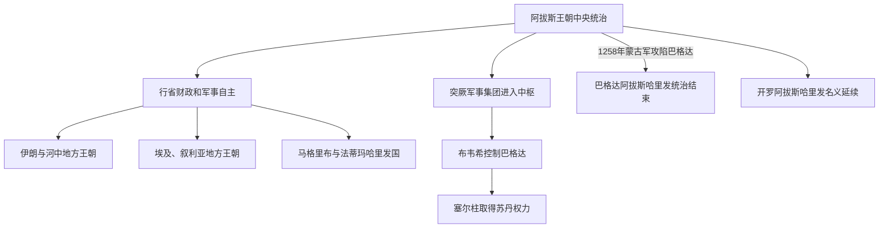

# 后阿拔斯与地方王朝

## 时间

9世纪—13世纪；本页所称“后阿拔斯”指阿拔斯王朝中后期

## 概括

阿拔斯哈里发国并未在9世纪立刻消失，但巴格达中央政府逐渐失去对远方行省、税收和军队的直接控制。各地总督、军事集团和新兴王朝取得世袭或事实独立地位，同时继续承认、争夺或取代哈里发的宗教与政治权威。政治统一瓦解由此产生多中心的伊斯兰国家体系。

## 演变图

## 主要政治阶段和王朝

| 王朝或结构 | 大致时间 | 区域与作用 |
|---|---|---|
| 塔希尔王朝 | 821—873年 | 以呼罗珊为核心，在名义承认哈里发的同时取得地方世袭统治。 |
| 萨法尔王朝 | 861—1003年 | 从锡斯坦兴起，以军事扩张挑战阿拔斯在伊朗东部的控制。 |
| 萨曼王朝 | 819—999年 | 统治河中和呼罗珊，推动波斯语宫廷文化与区域贸易发展。 |
| 图伦、伊赫什德王朝 | 9—10世纪 | 埃及总督体系地方化，控制埃及和部分叙利亚。 |
| 法蒂玛王朝 | 909—1171年 | 以伊斯玛仪派哈里发身份挑战阿拔斯正统，后来以开罗为中心。 |
| 布韦希王朝 | 934—1062年 | 伊朗什叶派军事集团控制巴格达，哈里发保留宗教象征。 |
| 加兹尼王朝 | 977—1186年 | 由突厥军事集团建立，连接呼罗珊、阿富汗与南亚西北。 |
| 塞尔柱帝国及地方苏丹国 | 11—12世纪 | 苏丹掌握军政权力，阿拔斯哈里发保留合法性象征；后续形成多个地方政权。 |
| 开罗阿拔斯哈里发 | 1261—1517年 | 马穆鲁克扶立的名义哈里发，缺乏巴格达时期的领土统治。 |

## 权力结构变化

- 行省总督、税收承包者和军事首领逐渐把职位转为世袭或事实独立权力。
- 宫廷中的突厥军人和军事奴隶集团影响哈里发废立，中枢权力不再只由阿拉伯或波斯文官集团掌握。
- “哈里发”与“苏丹”的职能逐渐分离：哈里发提供宗教和法统象征，苏丹掌握军队和行政。
- 同一地区可能同时存在名义效忠、铸币称名、礼拜宣名和实际独立等不同层次，不能只按“独立/从属”二分。
- 1258年旭烈兀军攻陷巴格达，结束当地阿拔斯哈里发统治，但伊斯兰国家和宗教网络并未随之终结。

## 区域主线

- 伊朗地方王朝：[伊朗间奏期](/%E4%BA%BA%E6%96%87%E7%A7%91%E5%AD%A6/%E5%8E%86%E5%8F%B2/%E8%A5%BF%E4%BA%9A/%E4%BC%8A%E6%9C%97/%E4%BC%8A%E6%9C%97%E9%97%B4%E5%A5%8F%E6%9C%9F.md)。
- 河中与萨曼王朝：[河中绿洲、粟特与萨曼王朝](/%E4%BA%BA%E6%96%87%E7%A7%91%E5%AD%A6/%E5%8E%86%E5%8F%B2/%E4%B8%AD%E4%BA%9A/%E6%B2%B3%E4%B8%AD%E5%9C%B0%E5%8C%BA/%E6%B2%B3%E4%B8%AD%E7%BB%BF%E6%B4%B2%E3%80%81%E7%B2%9F%E7%89%B9%E4%B8%8E%E8%90%A8%E6%9B%BC%E7%8E%8B%E6%9C%9D.md)。
- 法蒂玛统治：[法蒂玛王朝统治下的埃及](/%E4%BA%BA%E6%96%87%E7%A7%91%E5%AD%A6/%E5%8E%86%E5%8F%B2/%E5%8C%97%E9%9D%9E/%E5%9F%83%E5%8F%8A/%E6%B3%95%E8%92%82%E7%8E%9B%E7%8E%8B%E6%9C%9D%E7%BB%9F%E6%B2%BB%E4%B8%8B%E7%9A%84%E5%9F%83%E5%8F%8A.md)。
- 塞尔柱后续：[塞尔柱与突厥化时期](/%E4%BA%BA%E6%96%87%E7%A7%91%E5%AD%A6/%E5%8E%86%E5%8F%B2/%E8%A5%BF%E4%BA%9A/%E4%BC%8A%E6%9C%97/%E5%A1%9E%E5%B0%94%E6%9F%B1%E4%B8%8E%E7%AA%81%E5%8E%A5%E5%8C%96%E6%97%B6%E6%9C%9F.md)、[安纳托利亚突厥化与罗姆苏丹国](/%E4%BA%BA%E6%96%87%E7%A7%91%E5%AD%A6/%E5%8E%86%E5%8F%B2/%E8%A5%BF%E4%BA%9A/%E5%9C%9F%E8%80%B3%E5%85%B6/%E5%AE%89%E7%BA%B3%E6%89%98%E5%88%A9%E4%BA%9A%E7%AA%81%E5%8E%A5%E5%8C%96%E4%B8%8E%E7%BD%97%E5%A7%86%E8%8B%8F%E4%B8%B9%E5%9B%BD.md)。

## 与文明扩展页的分工

本页只维护政治权力的分裂、地方王朝和哈里发—苏丹关系。政治分裂后伊斯兰信仰、阿拉伯语、波斯语文化、贸易与学术网络如何继续扩展，见[帝国分裂后的伊斯兰世界扩展](/%E4%BA%BA%E6%96%87%E7%A7%91%E5%AD%A6/%E5%8E%86%E5%8F%B2/%E8%A5%BF%E4%BA%9A/_%E9%80%9A%E5%8F%B2/%E9%98%BF%E6%8B%89%E4%BC%AF%E5%B8%9D%E5%9B%BD/%E5%B8%9D%E5%9B%BD%E5%88%86%E8%A3%82%E5%90%8E%E7%9A%84%E4%BC%8A%E6%96%AF%E5%85%B0%E4%B8%96%E7%95%8C%E6%89%A9%E5%B1%95.md)。

## 演变关系

- 前一节点：[阿拔斯王朝](/%E4%BA%BA%E6%96%87%E7%A7%91%E5%AD%A6/%E5%8E%86%E5%8F%B2/%E8%A5%BF%E4%BA%9A/_%E9%80%9A%E5%8F%B2/%E9%98%BF%E6%8B%89%E4%BC%AF%E5%B8%9D%E5%9B%BD/%E9%98%BF%E6%8B%94%E6%96%AF%E7%8E%8B%E6%9C%9D.md)。
- 并行过程：[帝国分裂后的伊斯兰世界扩展](/%E4%BA%BA%E6%96%87%E7%A7%91%E5%AD%A6/%E5%8E%86%E5%8F%B2/%E8%A5%BF%E4%BA%9A/_%E9%80%9A%E5%8F%B2/%E9%98%BF%E6%8B%89%E4%BC%AF%E5%B8%9D%E5%9B%BD/%E5%B8%9D%E5%9B%BD%E5%88%86%E8%A3%82%E5%90%8E%E7%9A%84%E4%BC%8A%E6%96%AF%E5%85%B0%E4%B8%96%E7%95%8C%E6%89%A9%E5%B1%95.md)。
- 后续区域政权见伊朗、埃及、中亚、安纳托利亚等各自历史主线。
