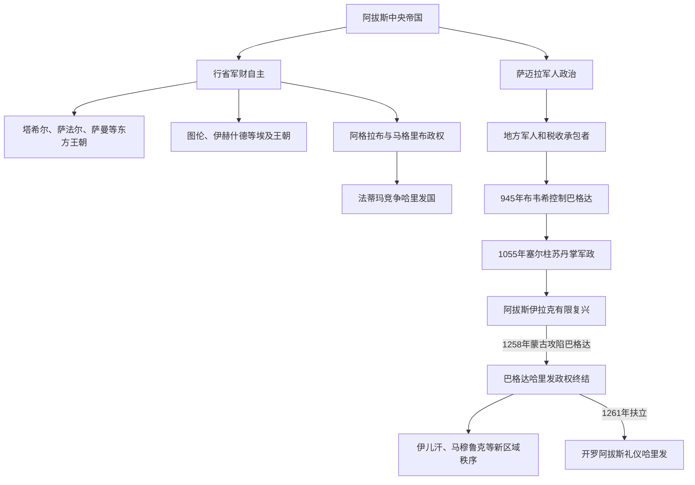

# 后阿拔斯与地方王朝

## 时间

9世纪—13世纪；本页所称“后阿拔斯”指阿拔斯王朝中后期及1258年前后的政治多中心化，不表示9世纪已经进入一个统一的“阿拔斯之后”时代

## 概括

阿拔斯哈里发国没有在9世纪突然解体，而是逐步从直接统治广大行省的帝国，转变为由地方王朝、军事集团、竞争哈里发和城市网络共同构成的多中心政治体系。行省总督把军队、税收和任官权世袭化；宫廷中的突厥军人与军事奴隶集团控制军饷和废立；远方统治者则在实际独立的同时，选择接受阿拔斯册封、在钱币和主麻礼拜中保留哈里发名号。

945年布韦希进入巴格达、1055年塞尔柱进入巴格达，是“哈里发—军政统治者”分工的两个关键节点。法蒂玛另称哈里发，科尔多瓦倭马亚也采用哈里发称号，说明阿拔斯不再垄断最高合法性。1258年蒙古攻陷巴格达终结当地阿拔斯政权，却没有终结各地伊斯兰国家、法学、商业和学术网络；1261年马穆鲁克在开罗重建礼仪性阿拔斯职位，又把哈里发名号嵌入新的苏丹国家。

## 地方化的运行机制

| 机制 | 具体过程 | 不能忽略的限制 |
|---|---|---|
| 总督世袭化 | 中央为换取边疆稳定，把大行省交给有军功或本地网络的家族；继任逐渐由家族内部决定 | 名义册封仍有价值，实际独立不一定公开宣布 |
| 税源地方截留 | 总督以本地税收供养军队、宫廷和公共工程，只向巴格达缴纳约定贡赋或停止汇款 | 地方财政独立程度会随中央远征、内战和统治者能力变化 |
| 职业军与军事奴隶 | 突厥、代莱木、马穆鲁克等军人集团依靠薪饷、封地和首领私人关系组织 | “族群”不是固定政治阵营，军人常跨王朝服务并与地方社会融合 |
| 城市—区域经济 | 开罗、布哈拉、设拉子、加兹尼等城市依赖各自农业、商路和工艺，不再只围绕巴格达 | 商业繁荣可与政治战争并存，不等于社会没有税负和破坏 |
| 册封与礼拜宣名 | 地方统治者接受哈里发称号、旗帜、诏书，在钱币或主麻礼拜中保留其名 | 这些行为表示合法性关系，不必然代表中央能征税或调兵 |
| 竞争性哈里发 | 法蒂玛、科尔多瓦倭马亚等提出独立最高权威 | 承认范围因宗派、地区和外交而异，不能虚构单一“全伊斯兰世界” |
| 苏丹权力 | 塞尔柱以后，苏丹掌军政，哈里发提供王朝与逊尼合法性 | 两者权威重叠且会冲突，不是现代意义的政教分离 |
| 婚姻、学者与商路 | 王室联姻、乌里玛迁徙、朝觐和商贸维持跨国联系 | 文明联系不等于政治统一，地方语言和习惯持续发展 |

## 分阶段过程

### 行省自治的开端（约800—861）

阿拔斯中央为管理北非和东方边疆，容许阿格拉布、塔希尔等家族在缴纳贡赋、接受册封的前提下世袭统治。萨法尔王朝则从锡斯坦地方武装兴起，以征服迫使巴格达承认。地方化既可能由中央授权，也可能由既成军事事实反向取得合法性。

### 萨迈拉军人政治与区域王朝成形（861—945）

突厥近卫介入哈里发废立，中央财政因军饷、内战和津芝叛乱承压。埃及的图伦王朝、河中的萨曼王朝、伊朗和锡斯坦的地方家族建立稳定宫廷与军队；阿拔斯在穆尔台迪德时期仍能收复部分地区，说明地方化不是不可逆直线。909年法蒂玛在北非另称哈里发，969年取得埃及并建立开罗，使政治—宗教竞争进入新阶段。

### 布韦希控制与哈里发—埃米尔分权（945—1055）

代莱木人布韦希军队进入巴格达后，什叶派埃米尔掌握财政、军队和任官，却保留逊尼阿拔斯哈里发。原因既有行政实用，也有阿拔斯名号对多数逊尼臣民和其他统治者的象征价值。哈里发可以发布教义声明、册封和参加礼仪，却难以独立决定军事政策。

### 塞尔柱苏丹体系（1055—约1150）

图格里勒以清除布韦希和保护逊尼秩序的名义进入巴格达，获授苏丹权位。塞尔柱通过突厥军队、波斯语官僚与伊克塔收益统治广阔地区，阿拔斯哈里发提供最高册封。塞尔柱后期继承战争和阿塔贝格分立，又产生叙利亚、伊拉克、伊朗和安纳托利亚多个政权。

### 多中心战争、阿拔斯复兴与蒙古冲击（约1150—1258）

塞尔柱衰退使阿拔斯在伊拉克恢复部分军政；埃及则由法蒂玛转入阿尤布，叙利亚面临十字军国家，东方先后出现花剌子模等强权。各王朝使用逊尼法学、学校、苏菲网络和哈里发册封建立合法性，但没有统一指挥中心。蒙古西征击败花剌子模并重组伊朗，1258年攻陷巴格达，成为旧阿拔斯区域秩序的直接终点。

### 马穆鲁克、开罗哈里发与新秩序（1258—13世纪末）

马穆鲁克在1260年艾因扎鲁特阻止蒙古军继续进入埃及，次年由拜巴尔斯扶立开罗阿拔斯哈里发。苏丹掌军政，哈里发承担册封与礼仪；完整序列见[阿拔斯哈里发世系表](/%E4%BA%BA%E6%96%87%E7%A7%91%E5%AD%A6/%E5%8E%86%E5%8F%B2/%E8%A5%BF%E4%BA%9A/_%E9%80%9A%E5%8F%B2/%E9%98%BF%E6%8B%89%E4%BC%AF%E5%B8%9D%E5%9B%BD/%E9%98%BF%E6%8B%94%E6%96%AF%E5%93%88%E9%87%8C%E5%8F%91%E4%B8%96%E7%B3%BB%E8%A1%A8.md)。伊儿汗、马穆鲁克、安纳托利亚诸贝伊国和其他地方政权构成新的多中心体系。

## 主要政治阶段和王朝

| 王朝或结构 | 大致时间 | 区域、崛起机制与政治性质 |
|---|---|---|
| 阿格拉布王朝 | 800—909 | 伊弗里基亚总督家族，以向阿拔斯纳贡换取世袭自治；组织进入西西里，后被法蒂玛取代。 |
| 塔希尔王朝 | 821—873 | 马蒙功臣家族统治呼罗珊，名义接受阿拔斯任命，实际掌当地军税。 |
| 萨法尔王朝 | 861—1003 | 从锡斯坦地方武装兴起，以雅各布·本·莱斯扩张挑战阿拔斯和塔希尔；后退守锡斯坦。 |
| 萨曼王朝 | 819—999 | 统治河中与呼罗珊，接受阿拔斯逊尼名义；布哈拉成为新波斯语文化和贸易中心。 |
| 图伦王朝 | 868—905 | 突厥军官艾哈迈德·本·图伦控制埃及财政军队并进入叙利亚；905年被阿拔斯军收复。 |
| 伊赫什德王朝 | 935—969 | 埃及总督家族和军人集团掌埃及—叙利亚；最终被法蒂玛征服。 |
| 法蒂玛王朝 | 909—1171 | 伊斯玛仪派竞争哈里发国，从北非转入埃及；969年建立开罗，公开否定阿拔斯唯一正统。 |
| 布韦希王朝 | 934—1062 | 代莱木军人集团控制伊朗与伊拉克；945年掌巴格达，保留阿拔斯哈里发。 |
| 加兹尼王朝 | 977—1186 | 从萨曼军事奴隶体系兴起，连接呼罗珊、阿富汗与南亚；接受阿拔斯称号以强化逊尼合法性。 |
| 塞尔柱帝国 | 约1040—1194 | 突厥军团、波斯官僚和伊克塔体系结合；1055年取得巴格达苏丹权，后分裂为诸支。 |
| 阿尤布王朝 | 1171—1250 | 萨拉丁终结法蒂玛哈里发，在埃及和叙利亚恢复阿拔斯礼拜名义；王朝内部按家族领地分治。 |
| 花剌子模帝国 | 11世纪末—1231 | 从塞尔柱边疆总督发展为东方强权，与阿拔斯既合作又竞争；被蒙古征服。 |
| 马穆鲁克苏丹国 | 1250—1517 | 军事奴隶精英统治埃及—叙利亚；1261年扶立开罗阿拔斯，以苏丹掌实权。 |
| 开罗阿拔斯哈里发 | 1261—1517 | 阿拔斯宗室的礼仪—合法性职位，无巴格达式领土；危机中偶有调停或短暂介入。 |

## 重要事件

| 时间 | 事件 | 过程与历史意义 |
|---|---|---|
| 800年 | 阿格拉布家族获伊弗里基亚世袭治理 | 中央以贡赋换边疆稳定，展示授权型地方化。 |
| 821年 | 塔希尔治理东方 | 功臣家族掌呼罗珊军税，仍保留阿拔斯名义。 |
| 836年 | 建立萨迈拉 | 突厥近卫与宫廷空间结合，军队更直接介入中央继承。 |
| 861—870年 | 萨迈拉无政府时期 | 多位哈里发遭废杀，地方总督趁中央混乱扩大自主。 |
| 868年 | 艾哈迈德·本·图伦掌埃及 | 埃及税收和军队脱离巴格达直接控制，形成跨埃及—叙利亚政权。 |
| 869—883年 | 津芝叛乱 | 伊拉克南部长期战争重创农业、交通和中央财政，后由穆瓦法格平定。 |
| 873年 | 萨法尔灭塔希尔 | 非中央授权的地方军人政权通过征服重组伊朗东部。 |
| 905年 | 阿拔斯收复埃及 | 图伦王朝灭亡，说明中央在特定条件下仍能逆转地方化。 |
| 909年 | 法蒂玛建立竞争哈里发国 | 阿拔斯最高宗教政治名号受到制度性挑战。 |
| 945年 | 布韦希进入巴格达 | 哈里发与实际军政统治者分离，大埃米尔制度化。 |
| 969年 | 法蒂玛征服埃及并建开罗 | 地中海东部形成与巴格达并列的政治、商业和宗教中心。 |
| 999年 | 萨曼王朝终结 | 喀喇汗与加兹尼分割其领域，伊朗—中亚的突厥王朝时代扩展。 |
| 1055年 | 塞尔柱进入巴格达 | 苏丹获哈里发认可，军政与礼仪法统的新组合确立。 |
| 1071年 | 曼齐刻尔特之战 | 拜占庭东部防线受重创，突厥集团进入安纳托利亚的过程加速；不是单场战役立即完成“突厥化”。 |
| 1099年 | 十字军占领耶路撒冷 | 区域诸政权分裂使共同防御困难，后续反击由赞吉、阿尤布等地方王朝承担。 |
| 1171年 | 萨拉丁终结法蒂玛哈里发 | 埃及恢复阿拔斯礼拜名义，实际由阿尤布苏丹统治。 |
| 1180—1225年 | 纳绥尔时期有限复兴 | 阿拔斯在伊拉克恢复部分军队、外交和财政，政治多中心化并非直线衰亡。 |
| 1258年 | 蒙古攻陷巴格达 | 巴格达阿拔斯政权终结，伊朗和伊拉克进入蒙古主导的重组。 |
| 1260—1261年 | 艾因扎鲁特与开罗哈里发重建 | 马穆鲁克取得军事威望，拜巴尔斯以阿拔斯宗室强化苏丹合法性。 |

## 区域主线与差异

| 区域 | 地方化方式 | 长期结果与规范入口 |
|---|---|---|
| 伊朗与锡斯坦 | 总督家族、地方军人和伊朗城市财政结合 | 塔希尔、萨法尔、布韦希等相继出现；详见[伊朗间奏期](/%E4%BA%BA%E6%96%87%E7%A7%91%E5%AD%A6/%E5%8E%86%E5%8F%B2/%E8%A5%BF%E4%BA%9A/%E4%BC%8A%E6%9C%97/%E4%BC%8A%E6%9C%97%E9%97%B4%E5%A5%8F%E6%9C%9F.md)。 |
| 河中与呼罗珊 | 萨曼城市网络、突厥边疆军和草原互动 | 新波斯语宫廷文化与突厥化并行；见[河中绿洲、粟特与萨曼王朝](/%E4%BA%BA%E6%96%87%E7%A7%91%E5%AD%A6/%E5%8E%86%E5%8F%B2/%E4%B8%AD%E4%BA%9A/%E6%B2%B3%E4%B8%AD%E5%9C%B0%E5%8C%BA/%E6%B2%B3%E4%B8%AD%E7%BB%BF%E6%B4%B2%E3%80%81%E7%B2%9F%E7%89%B9%E4%B8%8E%E8%90%A8%E6%9B%BC%E7%8E%8B%E6%9C%9D.md)。 |
| 埃及与叙利亚 | 总督掌尼罗河税源，后形成竞争哈里发与苏丹国 | 图伦、法蒂玛、阿尤布、马穆鲁克依次重组；法蒂玛阶段见[法蒂玛王朝统治下的埃及](/%E4%BA%BA%E6%96%87%E7%A7%91%E5%AD%A6/%E5%8E%86%E5%8F%B2/%E5%8C%97%E9%9D%9E/%E5%9F%83%E5%8F%8A/%E6%B3%95%E8%92%82%E7%8E%9B%E7%8E%8B%E6%9C%9D%E7%BB%9F%E6%B2%BB%E4%B8%8B%E7%9A%84%E5%9F%83%E5%8F%8A.md)。 |
| 马格里布 | 距离、柏柏尔政治和跨撒哈拉网络增强地方自主 | 伊德里斯、阿格拉布、法蒂玛及柏柏尔王朝形成不同主线。 |
| 伊拉克 | 哈里发、军人、城市和灌溉税源持续竞争 | 即使失去帝国，巴格达仍是重要宗教和学术中心，12世纪有有限复兴。 |
| 安纳托利亚 | 塞尔柱诸支、边疆移民与拜占庭地方秩序交错 | 形成罗姆苏丹国与后续贝伊国；见[安纳托利亚突厥化与罗姆苏丹国](/%E4%BA%BA%E6%96%87%E7%A7%91%E5%AD%A6/%E5%8E%86%E5%8F%B2/%E8%A5%BF%E4%BA%9A/%E5%9C%9F%E8%80%B3%E5%85%B6/%E5%AE%89%E7%BA%B3%E6%89%98%E5%88%A9%E4%BA%9A%E7%AA%81%E5%8E%A5%E5%8C%96%E4%B8%8E%E7%BD%97%E5%A7%86%E8%8B%8F%E4%B8%B9%E5%9B%BD.md)。 |

塞尔柱整体过程另见[塞尔柱与突厥化时期](/%E4%BA%BA%E6%96%87%E7%A7%91%E5%AD%A6/%E5%8E%86%E5%8F%B2/%E8%A5%BF%E4%BA%9A/%E4%BC%8A%E6%9C%97/%E5%A1%9E%E5%B0%94%E6%9F%B1%E4%B8%8E%E7%AA%81%E5%8E%A5%E5%8C%96%E6%97%B6%E6%9C%9F.md)。

## 多中心体系形成与旧秩序终结的原因

### 结构因素

- 行省距离、驿传成本和边疆战争使总督必须掌握本地军财，职位容易世袭。
- 伊拉克灌溉和税收遭战争、叛乱与行政失修冲击，巴格达难以持续支付常备军。
- 军事奴隶和职业军依赖私人首领、军饷或伊克塔收益，忠诚不再只面向哈里发。
- 城市和商路多中心发展，使布哈拉、开罗、设拉子、加兹尼等能支撑独立宫廷。

### 政治与社会因素

- 继承内战和宫廷派系竞争削弱中央，同时为地方集团争取册封提供机会。
- 逊尼、什叶、伊斯玛仪等不同合法性传统，以及阿拔斯、法蒂玛、倭马亚等家族主张，促成并立权威。
- 地方王朝可借波斯语、突厥语或柏柏尔政治传统建设国家，又通过阿拉伯语宗教法学保持跨区联系。

### 外部压力与直接转折

- 十字军、草原迁徙和蒙古扩张改变军事均势，但政治分裂早已存在，不能把所有变化归因于外敌。
- 1258年蒙古军围攻是巴格达政权的直接终结；长期防务收缩、地区盟友分散和伊拉克资源局限使其难以抵抗。
- 1261年开罗复建说明名号与宗室仍有价值，却不恢复原帝国；此后区域主权主要由苏丹和地方王朝承担。

## 争议与关键辨析

- “地方王朝独立”不是单一法律时刻。册封、贡赋、钱币、礼拜宣名、实际税收和军事控制可能彼此不一致。
- “伊朗王朝复兴”与“突厥军事兴起”均是长期过程，统治集团常使用波斯官僚、阿拉伯宗教学术和多族军队，不能按单一族群切割。
- 945年不是阿拔斯王朝形式灭亡，1258年也不是伊斯兰世界政治或文明终结。
- 法蒂玛和科尔多瓦哈里发不是阿拔斯地方总督，而是竞争性最高主权；开罗阿拔斯则依赖马穆鲁克苏丹，性质不同。
- 本页维护跨区域政治机制，不重复各王朝全部世系；统治者完整表由对应地区或王朝规范页维护。

## 与文明扩展页的分工

本页解释政治权力为何分裂、地方王朝如何取得军财和合法性，以及哈里发—埃米尔—苏丹关系怎样变化。政治分裂后伊斯兰信仰、阿拉伯语、波斯语文化、贸易与学术网络如何跨越新政权继续扩展，见[帝国分裂后的伊斯兰世界扩展](/%E4%BA%BA%E6%96%87%E7%A7%91%E5%AD%A6/%E5%8E%86%E5%8F%B2/%E8%A5%BF%E4%BA%9A/_%E9%80%9A%E5%8F%B2/%E9%98%BF%E6%8B%89%E4%BC%AF%E5%B8%9D%E5%9B%BD/%E5%B8%9D%E5%9B%BD%E5%88%86%E8%A3%82%E5%90%8E%E7%9A%84%E4%BC%8A%E6%96%AF%E5%85%B0%E4%B8%96%E7%95%8C%E6%89%A9%E5%B1%95.md)。

## 演变关系

- 前一节点：[阿拔斯王朝](/%E4%BA%BA%E6%96%87%E7%A7%91%E5%AD%A6/%E5%8E%86%E5%8F%B2/%E8%A5%BF%E4%BA%9A/_%E9%80%9A%E5%8F%B2/%E9%98%BF%E6%8B%89%E4%BC%AF%E5%B8%9D%E5%9B%BD/%E9%98%BF%E6%8B%94%E6%96%AF%E7%8E%8B%E6%9C%9D.md)。
- 并行过程：[帝国分裂后的伊斯兰世界扩展](/%E4%BA%BA%E6%96%87%E7%A7%91%E5%AD%A6/%E5%8E%86%E5%8F%B2/%E8%A5%BF%E4%BA%9A/_%E9%80%9A%E5%8F%B2/%E9%98%BF%E6%8B%89%E4%BC%AF%E5%B8%9D%E5%9B%BD/%E5%B8%9D%E5%9B%BD%E5%88%86%E8%A3%82%E5%90%8E%E7%9A%84%E4%BC%8A%E6%96%AF%E5%85%B0%E4%B8%96%E7%95%8C%E6%89%A9%E5%B1%95.md)。
- 上级：[阿拉伯帝国](/%E4%BA%BA%E6%96%87%E7%A7%91%E5%AD%A6/%E5%8E%86%E5%8F%B2/%E8%A5%BF%E4%BA%9A/_%E9%80%9A%E5%8F%B2/%E9%98%BF%E6%8B%89%E4%BC%AF%E5%B8%9D%E5%9B%BD/README.md)。
