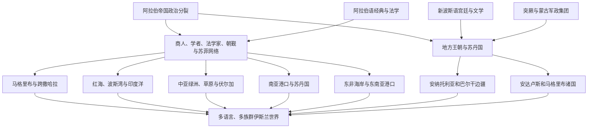

# 帝国分裂后的伊斯兰世界扩展

## 时间

8世纪后期—15世纪；重点为9—13世纪

## 概括

阿拔斯直接统治逐步收缩后，伊斯兰世界仍在地理和社会层面扩展。商人、海员、乌里玛、苏菲、军人、俘虏、移民、朝觐者和地方王朝，把信仰、法律实践、阿拉伯语宗教学术、波斯语宫廷文化和商业制度带入撒哈拉以南非洲、伏尔加—乌拉尔、中亚草原、安纳托利亚、南亚、东非海岸和东南亚。

这不是“阿拉伯帝国继续征服世界”。政治载体越来越多是波斯、突厥、柏柏尔、库尔德、蒙古、南亚和东南亚地方政权；许多地区首先出现港口或宫廷穆斯林社群，乡村人口、语言和日常宗教实践数代后才变化。伊斯兰化、阿拉伯化、波斯化和突厥化相互影响，却从不同机制发生，不能互相替代。

## 必须区分的长期过程

| 过程 | 核心变化 | 常见载体 | 为什么不能混同 |
|---|---|---|---|
| 伊斯兰化 | 个人、家族、社群或国家接受伊斯兰信仰与制度 | 统治者改宗、商贸社群、婚姻、学者、苏菲、教育和司法 | 可在不改用阿拉伯语的情况下发生，也可能只先影响城市或精英 |
| 阿拉伯化 | 阿拉伯语成为日常语言、行政语言或身份标识 | 移民、国家文书、宗教学术、城市市场和部落谱系 | 伊朗、中亚、安纳托利亚、南亚多数穆斯林并未整体阿拉伯化 |
| 波斯化 | 新波斯语宫廷文学、官僚和政治文化扩展 | 萨曼、加兹尼、塞尔柱及南亚诸王朝 | 不等于伊朗政治统治，也不排斥阿拉伯语宗教和突厥语军政 |
| 突厥化 | 突厥语人口、军团和王朝在草原、绿洲或安纳托利亚扩展 | 迁徙、军事集团、草原联盟、王朝和城市融合 | 可与伊斯兰化同步或错开；语言转变不等于人口完全替换 |
| 国家化 | 哈里发、苏丹、埃米尔或地方君主建立税收军政 | 征服、册封、王室联姻、军事奴隶和地方精英合作 | 国家信奉伊斯兰不代表辖区居民立即全部改宗 |
| 网络化 | 朝觐、商路、手稿、法学传承和信用制度跨境连接 | 港口、商队、宗教学校、旅学和侨民 | 跨区联系可在政治敌对国家之间继续存在 |

## 扩展机制

### 商业与侨居社群

红海、波斯湾和印度洋商人依靠季风航行、亲族信用、合伙契约与港口中介建立侨居社区。商人通常先在港口形成清真寺、墓地和婚姻网络，宗教影响再向内陆扩散。商业传播不等于没有强制、奴役或竞争；海上网络同样伴随港口战争和社会等级。

### 国家、军队与边疆

加兹尼、塞尔柱、德里苏丹国及后续政权通过战争建立穆斯林王朝。军队能迅速改变上层主权，却不能独自解释民众改宗。国家提供法官、清真寺、宗教捐赠、学校和城市安全，也会征税、掠夺和迁徙人口；其长期结果取决于地方精英合作和乡村制度。

### 乌里玛、苏菲与教育

法学家通过旅学、司法和授课传播哈乃斐、马立克、沙斐仪、罕百里等传统；苏菲导师、圣徒家族和团体以讲道、收徒、慈善和地方语言进入不同社会。两者不是彼此排斥的“法律伊斯兰”和“民间伊斯兰”，许多苏菲同时是法学家，国家也会资助或监管相关网络。

### 朝觐与圣地

麦加朝觐把西非、印度洋、中亚和南亚的精英与学者带入共同仪式空间。朝觐者交换书籍、法律意见、商品和政治消息；统治者通过保护路线、资助商队和赠送圣地财物积累合法性。交通成本、战争和疫病又限制普通人的参与。

### 翻译、书籍与多语言知识

阿拉伯语保持经典、法学和许多学术领域的跨区地位；纸张生产、抄写和书市降低文本传播成本。新波斯语成为伊朗、中亚和南亚的重要宫廷与文学语言，突厥语、柏柏尔语、斯瓦希里语和南亚诸语言也发展伊斯兰词汇与书写传统。知识传播是希腊语、叙利亚语、中古波斯语、梵语及其他传统的翻译与再创造，不是某民族的单向输出。

## 分阶段过程

### 地中海、非洲与印度洋网络重组（8—10世纪）

阿格拉布王朝从827年起进入西西里，安达卢斯倭马亚形成独立中心；红海和波斯湾贸易把巴士拉、亚丁、阿曼、印度西岸与东非连接。北非的伊德里斯、阿格拉布、法蒂玛及柏柏尔社群采用不同宗派和政权形式，马格里布伊斯兰化不等于全面阿拉伯化。纸张工艺从中亚、伊朗向巴格达等城市扩展，助长文书、教育和书籍市场；把这一技术完全归因于751年怛罗斯单场战役并不可靠。

### 波斯语文化、突厥王朝与草原改宗（9—11世纪）

萨曼宫廷推动新波斯语文学，同时支持逊尼法学和对草原贸易。喀喇汗统治者在10世纪逐步改宗，相关“大批帐户同年改宗”数字带有后世传统色彩；伏尔加保加尔统治者在922年前后接待阿拔斯使团，把伊斯兰用于国家和外交。突厥人进入伊斯兰军队与王朝，不意味着所有草原社会同时改宗。

### 塞尔柱、安纳托利亚与苏丹体系（11—13世纪）

塞尔柱把突厥军团、波斯官僚和逊尼制度结合，1055年取得巴格达苏丹权。1071年曼齐刻尔特后，安纳托利亚的拜占庭内战、突厥迁徙、地方贝伊和城市重组共同推动长期突厥化、伊斯兰化；不是一战后半岛立即改变。罗姆苏丹国、边疆宗教团体和商队驿站把伊朗—中亚网络带入安纳托利亚。

### 南亚的港口、边疆与苏丹国（8—14世纪）

阿拉伯商人在印度西海岸已有长期聚落，信德在8世纪进入倭马亚政治范围，但南亚穆斯林社会的扩大经历多个阶段。加兹尼和古尔远征改变西北政治，1206年德里苏丹国形成持续国家；宫廷、军队、城市工匠、商人、乌里玛和苏菲共同作用。改宗原因包括社会网络、保护、土地开发、王朝服务和地方宗教互动，不能单归于刀剑或低种姓“逃离”。

### 蒙古冲击与后继汗国伊斯兰化（13—15世纪）

蒙古征服摧毁部分城市和政权，也把欧亚交通置于新帝国网络。钦察汗国的别儿哥、伊儿汗合赞等统治者在不同时间改宗，蒙古精英逐步采用伊斯兰法统、波斯语官僚和地方婚姻；察合台领域的伊斯兰化则更慢且地区差异明显。征服者改宗不是被征服社会单向“同化”全部蒙古人，而是新精英和地方制度共同重组。

### 西非、东非与东南亚的港口—王权结合（11—15世纪）

跨撒哈拉贸易把北非商人、盐、金和书写文化连接到萨赫勒宫廷，统治者改宗往往早于乡村社会；1324年马里曼萨·穆萨朝觐提升王国在地中海世界的可见度。东非海岸城市使用斯瓦希里语并参与印度洋伊斯兰网络，不能被简化为“阿拉伯殖民地”。13世纪以后，苏门答腊北部等港口出现穆斯林王国，15世纪马六甲把商贸、王权和伊斯兰制度结合，影响东南亚海域。

## 重要事件

| 时间 | 事件 | 过程与长期意义 |
|---|---|---|
| 756年 | 科尔多瓦倭马亚政权建立 | 安达卢斯出现独立于巴格达的穆斯林国家，证明伊斯兰政治可多中心发展。 |
| 8世纪后期—9世纪 | 纸张生产和书市扩展 | 撒马尔罕、巴格达等城市推广纸张，促进文书、翻译和教育；与怛罗斯之战的直接因果存在争议。 |
| 800年 | 阿格拉布王朝获伊弗里基亚自治 | 地方王朝以阿拔斯名义建立自身军政，为西地中海扩展提供基地。 |
| 827年以后 | 穆斯林进入西西里 | 阿格拉布及后继力量经过长期战争控制岛上多地，形成地中海文化交流和冲突节点。 |
| 909—969年 | 法蒂玛兴起并进入埃及 | 伊斯玛仪派哈里发国从马格里布转向开罗，建立跨北非—红海网络并挑战阿拔斯。 |
| 922年 | 阿拔斯使团到伏尔加保加尔 | 当地统治者借伊斯兰和使团关系巩固国家、外交与宗教制度。 |
| 10世纪 | 喀喇汗统治者改宗 | 突厥王朝与中亚城市伊斯兰网络结合，语言突厥化和宗教伊斯兰化长期交错。 |
| 1055年 | 塞尔柱进入巴格达 | 苏丹、波斯官僚和阿拔斯法统结合，成为多地突厥穆斯林王朝的参照。 |
| 1071年 | 曼齐刻尔特之战 | 拜占庭内战与边疆开放加速突厥集团进入安纳托利亚，长期社会转型随后展开。 |
| 1099—1187年 | 十字军占领与萨拉丁收复耶路撒冷 | 地方王朝而非统一哈里发承担主要战争，圣地政治强化跨区域动员。 |
| 1206年 | 德里苏丹国建立 | 南亚北部形成持续穆斯林苏丹国家，宫廷、城市和地方社会互动数世纪。 |
| 13世纪 | 东非和东南亚港口穆斯林社群扩大 | 印度洋商贸、婚姻和地方王权促成沿海伊斯兰化，内陆变化速度不同。 |
| 1258年 | 蒙古攻陷巴格达 | 阿拔斯领土政权结束，但学者、商人和地方王朝网络继续运作并适应蒙古秩序。 |
| 1295年 | 伊儿汗合赞改宗 | 蒙古统治者采用伊斯兰法统和伊朗官僚，显示征服与宗教文化重组可分阶段发生。 |
| 1324—1325年 | 曼萨·穆萨朝觐 | 马里王国通过朝觐、黄金与学术联系进入北非—西亚视野，萨赫勒城市教育网络增强。 |
| 15世纪 | 马六甲成为穆斯林港口王国 | 王权、商贸和多族侨民推动马来海域伊斯兰网络扩展。 |
| 1453年 | 奥斯曼攻占君士坦丁堡 | 安纳托利亚—巴尔干穆斯林帝国成为新政治中心，但不代表所有伊斯兰地区重新统一。 |

## 区域比较

| 区域 | 早期载体 | 国家与社会变化 | 语言结果 | 主要差异与争议 |
|---|---|---|---|---|
| 马格里布与撒哈拉 | 柏柏尔王朝、城市学者、商队和苏菲 | 北非王朝与萨赫勒宫廷分阶段改宗 | 沿海部分阿拉伯化，柏柏尔及萨赫勒语言持续 | 宫廷改宗早于乡村，不能把跨撒哈拉贸易写成纯和平传播 |
| 红海与印度洋 | 阿拉伯、波斯、印度、东非商人 | 港口清真寺、婚姻和侨居法形成跨海社群 | 阿拉伯语为宗教商业语言之一，地方语言占日常主导 | 港口伊斯兰化与内陆时间差大 |
| 伊朗与中亚 | 波斯语宫廷、突厥王朝、乌里玛和苏菲 | 伊斯兰化、波斯化和突厥化交织 | 新波斯语与突厥语并行，阿拉伯语保留宗教学术地位 | 改宗统计和口述谱系常有夸张 |
| 伏尔加与草原 | 商路、使团、汗廷改宗 | 统治者借伊斯兰连接贸易和外交 | 突厥语持续，采用阿拉伯文字和宗教词汇 | 不同汗国、部落和城市并不同步 |
| 安纳托利亚 | 塞尔柱、迁徙群体、边疆贝伊、宗教团体 | 拜占庭地方秩序与新王朝长期融合竞争 | 突厥语扩展，希腊语、亚美尼亚语等延续 | 曼齐刻尔特不是瞬间族群替换 |
| 南亚 | 港口商人、加兹尼—古尔战争、苏丹国、苏菲 | 城市国家与乡村土地开发共同影响改宗 | 波斯语宫廷、阿拉伯语宗教、南亚语言并存 | 刀剑论和单纯“社会解放论”均不足 |
| 东非海岸 | 印度洋商人、城市王族和本地社群 | 斯瓦希里城邦形成穆斯林城市文化 | 斯瓦希里语吸收大量阿拉伯语词汇但属班图语 | “阿拉伯殖民地”说忽视本地能动性 |
| 东南亚 | 港口商贸、王室改宗、学者与苏菲 | 苏门答腊、马六甲等海洋政权推动扩展 | 马来语等地方语言采用阿拉伯文字与术语 | 改宗起点和最早王国年代有地区争议 |
| 安达卢斯 | 倭马亚支系、城市和学术网络 | 形成独立哈里发、泰法及北非王朝介入 | 阿拉伯语、罗曼语和希伯来语互动 | 地区过程由[安达卢斯与穆斯林统治](/%E4%BA%BA%E6%96%87%E7%A7%91%E5%AD%A6/%E5%8E%86%E5%8F%B2/%E6%AC%A7%E6%B4%B2/%E4%BC%8A%E6%AF%94%E5%88%A9%E4%BA%9A%E5%8D%8A%E5%B2%9B/%E5%AE%89%E8%BE%BE%E5%8D%A2%E6%96%AF%E4%B8%8E%E7%A9%86%E6%96%AF%E6%9E%97%E7%BB%9F%E6%B2%BB.md)维护 |

## 延续、扩展与受阻原因

### 推动因素

- **可复制的城市制度**：清真寺、市场、卡迪、宗教捐赠和学校能在不同王朝下建立。
- **跨区域语言分工**：阿拉伯语连接经典和法学，新波斯语连接宫廷与文学，地方语言承载讲道和日常社群。
- **商贸与信用**：合伙、亲族、侨居和港口保护降低远距离交易成本，宗教共同体提供额外信任但不排除跨教贸易。
- **国家合法性**：新王朝借清真寺、学者、朝觐和哈里发册封证明统治，主动资助伊斯兰机构。
- **迁徙与婚姻**：军人、工匠、商人、学者和俘虏定居，形成长期人口与文化联系。
- **苏菲和乌里玛网络**：师承、圣徒家族、学校与司法把抽象规范嵌入地方社会。

### 限制与逆转

- 山地、草原和乡村常比港口、宫廷改宗更慢；国家边界无法直接决定信仰。
- 王朝压迫、苛税、宗派冲突和战争可激起反抗，穆斯林统治也可能被地方社会推翻。
- 基督教、犹太教、印度教、佛教及本地宗教并未被一次性取代，改宗者常保留语言、习惯和家族制度。
- 商路改道、瘟疫、蒙古战争和海上军事竞争会切断旧中心，同时催生新中心。
- 政权采用“伊斯兰”名号不保证实践一致；法学、苏菲、宫廷和乡村之间长期存在争论。

## 争议与关键辨析

- 阿拉伯帝国的政治分裂不等于伊斯兰文明衰亡，也不意味着一个同质文明无冲突地扩张。
- 伊斯兰化不是只能由征服或只能由商人解释；不同地区通常由国家、市场、婚姻、教育和社会竞争共同推动。
- “黄金时代知识传入欧洲”过于单线。知识在阿拉伯语、波斯语、希腊语、叙利亚语、希伯来语、拉丁语和梵语之间多向翻译。
- 苏菲并非始终与国家对立，也不是所有地区最初改宗的唯一原因；法学家、商人和统治者同样重要。
- 统治者改宗的日期通常比普通人口变化更清楚；缺乏统计时应写“逐步”“约”或“存在争议”，不伪造全国改宗年份。
- 伊斯兰世界是共享部分宗教和制度网络的多国空间，不是阿拔斯灭亡后仍秘密统一的帝国。

## 区域入口

- 政治分裂背景：[后阿拔斯与地方王朝](/%E4%BA%BA%E6%96%87%E7%A7%91%E5%AD%A6/%E5%8E%86%E5%8F%B2/%E8%A5%BF%E4%BA%9A/_%E9%80%9A%E5%8F%B2/%E9%98%BF%E6%8B%89%E4%BC%AF%E5%B8%9D%E5%9B%BD/%E5%90%8E%E9%98%BF%E6%8B%94%E6%96%AF%E4%B8%8E%E5%9C%B0%E6%96%B9%E7%8E%8B%E6%9C%9D.md)。
- 东非印度洋：[斯瓦希里海岸与印度洋世界](/%E4%BA%BA%E6%96%87%E7%A7%91%E5%AD%A6/%E5%8E%86%E5%8F%B2/%E9%9D%9E%E6%B4%B2/%E4%B8%9C%E9%9D%9E/%E6%96%AF%E7%93%A6%E5%B8%8C%E9%87%8C%E6%B5%B7%E5%B2%B8%E4%B8%8E%E5%8D%B0%E5%BA%A6%E6%B4%8B%E4%B8%96%E7%95%8C.md)。
- 南亚国家化：[德里苏丹国](/%E4%BA%BA%E6%96%87%E7%A7%91%E5%AD%A6/%E5%8E%86%E5%8F%B2/%E5%8D%97%E4%BA%9A/%E5%8D%B0%E5%BA%A6/%E5%BE%B7%E9%87%8C%E8%8B%8F%E4%B8%B9%E5%9B%BD.md)与[莫卧儿帝国](/%E4%BA%BA%E6%96%87%E7%A7%91%E5%AD%A6/%E5%8E%86%E5%8F%B2/%E5%8D%97%E4%BA%9A/%E5%8D%B0%E5%BA%A6/%E8%8E%AB%E5%8D%A7%E5%84%BF%E5%B8%9D%E5%9B%BD.md)。
- 安纳托利亚：[安纳托利亚突厥化与罗姆苏丹国](/%E4%BA%BA%E6%96%87%E7%A7%91%E5%AD%A6/%E5%8E%86%E5%8F%B2/%E8%A5%BF%E4%BA%9A/%E5%9C%9F%E8%80%B3%E5%85%B6/%E5%AE%89%E7%BA%B3%E6%89%98%E5%88%A9%E4%BA%9A%E7%AA%81%E5%8E%A5%E5%8C%96%E4%B8%8E%E7%BD%97%E5%A7%86%E8%8B%8F%E4%B8%B9%E5%9B%BD.md)、[奥斯曼帝国](/%E4%BA%BA%E6%96%87%E7%A7%91%E5%AD%A6/%E5%8E%86%E5%8F%B2/%E8%A5%BF%E4%BA%9A/%E5%9C%9F%E8%80%B3%E5%85%B6/%E5%A5%A5%E6%96%AF%E6%9B%BC%E5%B8%9D%E5%9B%BD/README.md)。
- 上级总览：[阿拉伯帝国](/%E4%BA%BA%E6%96%87%E7%A7%91%E5%AD%A6/%E5%8E%86%E5%8F%B2/%E8%A5%BF%E4%BA%9A/_%E9%80%9A%E5%8F%B2/%E9%98%BF%E6%8B%89%E4%BC%AF%E5%B8%9D%E5%9B%BD/README.md)。

## 演变关系

- 前提是阿拔斯直接统治收缩与地方王朝形成，不是某一年单独开始。
- 与[后阿拔斯与地方王朝](/%E4%BA%BA%E6%96%87%E7%A7%91%E5%AD%A6/%E5%8E%86%E5%8F%B2/%E8%A5%BF%E4%BA%9A/_%E9%80%9A%E5%8F%B2/%E9%98%BF%E6%8B%89%E4%BC%AF%E5%B8%9D%E5%9B%BD/%E5%90%8E%E9%98%BF%E6%8B%94%E6%96%AF%E4%B8%8E%E5%9C%B0%E6%96%B9%E7%8E%8B%E6%9C%9D.md)是并行关系：前者维护文明与社会网络，本页所链接的政治页维护军政分裂。
- 15世纪以后由奥斯曼、萨法维、莫卧儿、东南亚苏丹国和非洲诸国等各区域主线继续展开。
