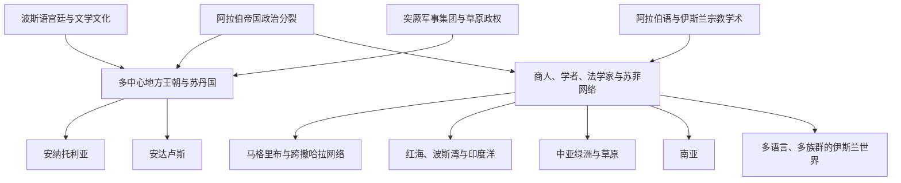

# 帝国分裂后的伊斯兰世界扩展

## 时间

8世纪后期—15世纪；重点为9—13世纪

## 概括

阿拉伯帝国的政治统一逐步瓦解后，伊斯兰世界并未停止扩展。商人、学者、苏菲团体、军人、移民和地方王朝把宗教、法律、语言、文学、商业制度与知识传统带入撒哈拉以南非洲、印度洋、中亚、安纳托利亚和南亚。这个过程不是阿拉伯军队继续征服同一帝国，而是多种国家和社会网络共同形成的长期变化。

## 扩展关系图

## 主要传播路径

| 路径或区域 | 主要载体 | 历史结果 |
|---|---|---|
| 马格里布与撒哈拉 | 商队、城市学者、柏柏尔王朝和苏菲团体 | 伊斯兰制度连接北非与萨赫勒，但阿拉伯化程度因地区而异。 |
| 红海与印度洋 | 阿拉伯、波斯、印度和东非商人 | 港口城市形成跨海穆斯林社群，推动斯瓦希里海岸等区域发展。 |
| 伊朗与中亚 | 波斯语宫廷、突厥王朝、乌里玛和苏菲网络 | 伊斯兰化与波斯化、突厥化交织，形成不同于早期阿拉伯帝国的政治文化。 |
| 安纳托利亚 | 塞尔柱及后续贝伊国、移民和宗教团体 | 拜占庭边疆逐步突厥化和伊斯兰化，最终连接奥斯曼国家形成。 |
| 南亚 | 商贸、边疆战争、苏丹国与苏菲团体 | 伊斯兰政权和社群扩展，但始终与多种宗教、语言和地方制度并存。 |
| 安达卢斯 | 倭马亚后裔政权、城市和学术网络 | 伊比利亚形成独立于巴格达的伊斯兰政治与文化中心。 |

## 语言、知识与制度

- 阿拉伯语继续作为宗教经典、法学和跨区域学术语言，但不是所有穆斯林社会的日常语言。
- 新波斯语在阿拔斯时代以后成为伊朗、中亚和南亚部分宫廷与文学网络的重要语言。
- 突厥语人群进入军政体系并建立王朝，使伊斯兰政治不再由阿拉伯王朝主导。
- 麦加朝觐、法学学派、书信、手稿、学校和商路帮助不同政权下的城市保持联系。
- 数学、医学、天文学、哲学和地理知识在阿拉伯语及其他语言中整理、翻译和传播；知识网络不能简单归为某一民族的单向输出。
- 地方习惯、既有宗教和社会组织持续存在，伊斯兰化往往经历数代甚至数世纪。

## 区域入口

- 政治分裂背景：[后阿拔斯与地方王朝](/%E4%BA%BA%E6%96%87%E7%A7%91%E5%AD%A6/%E5%8E%86%E5%8F%B2/%E8%A5%BF%E4%BA%9A/_%E9%80%9A%E5%8F%B2/%E9%98%BF%E6%8B%89%E4%BC%AF%E5%B8%9D%E5%9B%BD/%E5%90%8E%E9%98%BF%E6%8B%94%E6%96%AF%E4%B8%8E%E5%9C%B0%E6%96%B9%E7%8E%8B%E6%9C%9D.md)。
- 安达卢斯：[安达卢斯与穆斯林统治](/%E4%BA%BA%E6%96%87%E7%A7%91%E5%AD%A6/%E5%8E%86%E5%8F%B2/%E6%AC%A7%E6%B4%B2/%E4%BC%8A%E6%AF%94%E5%88%A9%E4%BA%9A%E5%8D%8A%E5%B2%9B/%E5%AE%89%E8%BE%BE%E5%8D%A2%E6%96%AF%E4%B8%8E%E7%A9%86%E6%96%AF%E6%9E%97%E7%BB%9F%E6%B2%BB.md)。
- 东非印度洋：[斯瓦希里海岸与印度洋世界](/%E4%BA%BA%E6%96%87%E7%A7%91%E5%AD%A6/%E5%8E%86%E5%8F%B2/%E9%9D%9E%E6%B4%B2/%E4%B8%9C%E9%9D%9E/%E6%96%AF%E7%93%A6%E5%B8%8C%E9%87%8C%E6%B5%B7%E5%B2%B8%E4%B8%8E%E5%8D%B0%E5%BA%A6%E6%B4%8B%E4%B8%96%E7%95%8C.md)。
- 南亚国家化过程：[德里苏丹国](/%E4%BA%BA%E6%96%87%E7%A7%91%E5%AD%A6/%E5%8E%86%E5%8F%B2/%E5%8D%97%E4%BA%9A/%E5%8D%B0%E5%BA%A6/%E5%BE%B7%E9%87%8C%E8%8B%8F%E4%B8%B9%E5%9B%BD.md)。
- 安纳托利亚与后续帝国：[安纳托利亚突厥化与罗姆苏丹国](/%E4%BA%BA%E6%96%87%E7%A7%91%E5%AD%A6/%E5%8E%86%E5%8F%B2/%E8%A5%BF%E4%BA%9A/%E5%9C%9F%E8%80%B3%E5%85%B6/%E5%AE%89%E7%BA%B3%E6%89%98%E5%88%A9%E4%BA%9A%E7%AA%81%E5%8E%A5%E5%8C%96%E4%B8%8E%E7%BD%97%E5%A7%86%E8%8B%8F%E4%B8%B9%E5%9B%BD.md)、[奥斯曼帝国](/%E4%BA%BA%E6%96%87%E7%A7%91%E5%AD%A6/%E5%8E%86%E5%8F%B2/%E8%A5%BF%E4%BA%9A/%E5%9C%9F%E8%80%B3%E5%85%B6/%E5%A5%A5%E6%96%AF%E6%9B%BC%E5%B8%9D%E5%9B%BD/README.md)。

## 关键辨析

- 阿拉伯帝国的分裂不等于伊斯兰文明衰亡。
- 伊斯兰化是宗教和制度变化，阿拉伯化是语言和身份变化，二者并不同步。
- “伊斯兰世界”是跨越多国、多语言和多族群的历史网络，不是单一帝国。
- 商业传播并非完全和平，征服、奴役和政治竞争也参与塑造这些网络。
- 相关区域应引用阿拉伯帝国主线，同时把地方社会的具体变化保留在各区域笔记中。

## 演变关系

- 政治背景：[后阿拔斯与地方王朝](/%E4%BA%BA%E6%96%87%E7%A7%91%E5%AD%A6/%E5%8E%86%E5%8F%B2/%E8%A5%BF%E4%BA%9A/_%E9%80%9A%E5%8F%B2/%E9%98%BF%E6%8B%89%E4%BC%AF%E5%B8%9D%E5%9B%BD/%E5%90%8E%E9%98%BF%E6%8B%94%E6%96%AF%E4%B8%8E%E5%9C%B0%E6%96%B9%E7%8E%8B%E6%9C%9D.md)。
- 上级总览：[阿拉伯帝国](/%E4%BA%BA%E6%96%87%E7%A7%91%E5%AD%A6/%E5%8E%86%E5%8F%B2/%E8%A5%BF%E4%BA%9A/_%E9%80%9A%E5%8F%B2/%E9%98%BF%E6%8B%89%E4%BC%AF%E5%B8%9D%E5%9B%BD/README.md)。
- 后续由伊朗、中亚、北非、安纳托利亚、南亚和非洲各区域历史分别展开。
