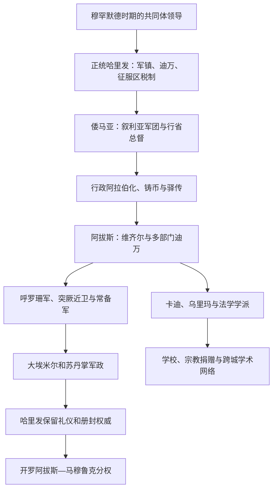

# 阿拉伯帝国的行政与宗教结构

## 时间

7世纪—13世纪；开罗阿拔斯礼仪制度延续至1517年

## 概括

哈里发国家没有一份一次制定、此后不变的“帝国宪法”。其制度在征服、财政管理、王朝内战和宗教共同体扩张中逐步形成：早期以哈里发、部落军、军镇和军饷迪万组织征服；倭马亚吸收拜占庭与萨珊行省经验，推进阿拉伯语文书、独立铸币和驿传监督；阿拔斯又发展维齐尔、分工更细的迪万、常备军和跨区域官僚体系。

政治与宗教权威既结合又分化。哈里发使用“信士的长官”等称号，任命法官并主持公共宗教；《古兰经》、圣训、法学和神学解释却逐渐由乌里玛、法学家、传述者和地方教学网络共同塑造。布韦希、塞尔柱和马穆鲁克时期，哈里发、苏丹、军人、法官与学者各有不同权力来源。把这种结构称为现代意义的“政教合一”或“政教分离”都会遮蔽其多层权威。

## 中央与地方行政

| 层级 / 机构 | 主要职能 | 历史变化与权力边界 |
|---|---|---|
| 哈里发 | 最高任命、统军、公共财政、司法与共同体合法性 | 从早期不固定协商转为王朝继承；9世纪后实际军政权可转移给军人、大埃米尔或苏丹 |
| 王储与王族 | 行省治理、军队指挥和继承安排 | 预立多个继承人可能减少临终真空，也会制造分区权力和内战 |
| 维齐尔 | 协调文书、财政、任官、宫廷与哈里发命令 | 阿拔斯时期制度化；权力取决于哈里发授权和官僚家族网络，可能被罢黜、没收或处死 |
| 哈吉卜 / 宫廷长官 | 管理觐见、宫廷安全和接近统治者的渠道 | 宫廷复杂化后能影响信息与任命，不同王朝职权不完全一致 |
| 迪万 | 军饷、税务、文书、印玺、驿传等部门的统称 | 欧麦尔时期军饷名册是早期形态；倭马亚—阿拔斯逐步分化，非现代单一“内阁” |
| 行省总督 | 征税、军事、治安和任官 | 大行省可由一人统军财，也可能分设军政和财政官；远方总督容易世袭化 |
| 阿米勒 / 税务官 | 登记土地、人口和税收，向中央或总督汇款 | 大量地方人员和旧税册被保留，语言、税率和征收方式因地区不同 |
| 巴里德 | 驿传、公文与地方情报 | 既传递命令，也绕过总督向宫廷报告；维护成本高、覆盖不均 |
| 卡迪 | 审理婚姻、财产、契约、继承等案件 | 由国家任命但依赖法学声望；行政、刑罚和军法不都归卡迪 |
| 最高卡迪 | 协调法官任命与司法政策 | 阿拔斯时期逐渐重要，仍不能把多地法学统一成单一法典 |
| 穆赫塔西卜 | 市场秩序、度量衡和公共规范 | 职权随城市和时期变化，兼有行政与道德监督 |
| 马扎利姆审理 | 统治者或高级官员处理对官吏、税务和强权的申诉 | 与卡迪法院并存，体现国家行政司法而非纯粹宗教法庭 |
| 贝特·马勒 | 公共收入、军饷和支出的概括性财政机构 | 不等于现代统一国库；中央、行省、军镇和专项收入可分别管理 |

## 行省治理与军镇

征服初期，阿拉伯军队多集中在库法、巴士拉、福斯塔特和开罗安等军镇，领取军饷而不普遍瓜分全部耕地。这样既保持远征力量，也让原有农民、庄园、灌溉和税务人员继续运作。军镇随后发展为人口复杂的城市：老征服者、后到部落、马瓦里、工匠、商人和宗教学者争夺名册、土地与政治代表。

倭马亚依赖叙利亚军区和强势总督平定伊拉克、北非和呼罗珊；阿拔斯建国依赖呼罗珊军，随后建立更多职业军。地方总督若同时掌握军队、税收和任官，就能把职位变成家族政权。中央有时以册封换贡赋，有时派军收复；因此“行省”与“独立王朝”之间常有长期过渡，而非一次宣布。

## 财政、土地与社会身份

| 税费 / 身份 | 基本含义 | 变化与误区 |
|---|---|---|
| 天课 | 穆斯林财产、牲畜或农产的宗教义务 | 具体税基、征收与分配由法学和行政共同塑造，不是所有国家收入 |
| 萨达卡 | 施舍或早期文献中的贡纳称谓 | 在早期盟约和里达战争语境中，不一定等同后世固定税目 |
| 吉兹亚 | 通常向有保护地位的成年非穆斯林男子征收的人头税 | 妇女、儿童、老人、贫困者、僧侣等豁免因时地而异；早期术语使用并不完全统一 |
| 哈拉吉 | 主要指土地税 | 可由穆斯林或非穆斯林土地承担，取决于土地法律地位；不能简单写成“异教徒税” |
| 乌什尔 | 十分之一或相关比例的农产、贸易税称谓 | 对象、比例和边境贸易实践不同，不是全帝国固定单率 |
| 关税与穆库斯 | 市场、口岸或贸易附加税 | 统治者因财政需要征收，法学家常批评不正当税；实际仍广泛存在 |
| 马瓦里 | 与阿拉伯部落建立庇护—依附关系的非阿拉伯人，许多为改宗者 | 不是固定“二等民族”；法律、税负和政治地位随地区、年代和个人身份变化 |
| 迪米 | 受穆斯林政权保护的非穆斯林社群 | 可保留礼拜、家事和社群组织，同时承担税赋与身份限制；宽容与歧视程度并不恒定 |
| 宗教捐赠 | 把财产收益长期用于清真寺、学校、慈善或家族公益 | 后期成为社会服务和学术自主的重要基础，也可能被精英用于保护家产和政治网络 |

征服不意味着全部土地立即国有，也不意味着居民立即改宗。许多地方延续拜占庭、萨珊、科普特和伊朗税制，中央逐步重分类。改宗会改变人头税、军饷和社会网络，地方政府有时因害怕税源下降而阻碍免税，成为倭马亚后期政治动员议题；不能据此推断所有改宗者始终继续缴纳同样税款。

## 军事结构演变

| 阶段 | 核心军力 | 财政基础 | 政治后果 |
|---|---|---|---|
| 穆罕默德与里达战争 | 半岛部落盟军和宗教共同体动员 | 战利品、盟约贡纳与共同体资源 | 能迅速动员，但联盟忠诚需不断协商 |
| 正统哈里发 | 军镇驻军、部落单位和迪万军饷 | 征服收益、土地税与人头税 | 军镇成为跨区域征服支点，也能影响哈里发继承 |
| 倭马亚 | 叙利亚军团、行省军和边疆盟军 | 行省税收、军饷和征服所得 | 王朝稳定依赖特定军团，部落—军职竞争影响内战 |
| 阿拔斯建国 | 呼罗珊革命军及其后裔 | 伊拉克、伊朗税源与中央迪万 | 权力中心东移，旧阿拉伯军镇优先地位下降 |
| 9世纪阿拔斯 | 突厥等职业军人和近卫 | 现金军饷、税收承包及专门驻地 | 专业化增强特定战力，却让掌宫廷安全的军官能废立哈里发 |
| 地方王朝与塞尔柱 | 代莱木、突厥、军事奴隶、部族军及伊克塔持有者 | 地方税收、土地收益权和私人军户 | 军政从中央分散到埃米尔、苏丹和地方家族 |
| 马穆鲁克 | 以军事奴隶训练和首领家户关系组织的精英军队 | 埃及农业税、伊克塔与贸易 | 苏丹掌实权，开罗阿拔斯哈里发主要提供礼仪合法性 |

“军事奴隶”并非普通家内奴隶。军人通常在年轻时被购买、改宗和训练，获释后仍以师主、同侪和家户关系组成政治集团。这个制度能制造专业军队和统治精英，也使继承依赖军官联盟而非稳定王室血统。

## 宗教权威、法学与司法

### 经典与传承

《古兰经》是核心经典，圣训和先知实践为规范的重要来源。奥斯曼时期的标准文本统一是传承关键，但诵读传统和注释学仍继续发展。8—9世纪，学者收集、筛选和分类圣训；不同城市对个人意见、类比、地方实践和传述可靠性的权衡并不相同。

### 法学学派

哈乃斐、马立克、沙斐仪、罕百里等逊尼法学传统在8—10世纪逐步成形，并非四位创始人一次完成全部后世教义。什叶诸支围绕伊玛目权威发展不同法学。法学学派通过师承、著作、卡迪任命和学校传播，地理分布会随国家资助和学者迁徙变化。

### 乌里玛与国家

乌里玛不是一个拥有统一总部的“教会”。学者以教学、司法、讲道、法学意见和宗教捐赠建立权威，可能任国家法官、接受宫廷资助，也可能拒绝职位或批评统治者。国家能任命卡迪和控制部分公共机构，却难以垄断所有解释传统。

### 米赫纳的边界

833年马蒙要求法官和学者接受《古兰经》受造等特定神学立场，继任者继续审查；穆塔瓦基勒于848年前后结束。米赫纳失败不表示哈里发从此没有宗教权威，而是显示强制统一教义会遭学者网络、民众声望和政治环境制约。

### 苏菲、圣徒与宗教捐赠

苏菲修行从个人禁欲、师徒圈发展出更稳定的道场和团体，许多人物同时受过法学训练。宗教捐赠支持清真寺、学校、旅舍、医院和慈善，使城市社会服务不完全依赖年度国库；统治者和家族也用捐赠塑造声望、联盟与财产连续性。

## 哈里发、埃米尔与苏丹

| 权位 | 理想主张 | 实际演变 |
|---|---|---|
| 哈里发 | 继承先知的共同体政治领导，维护宗教、司法与秩序 | 早期掌军政；945年后常保留礼仪、册封和宗教象征，12世纪在伊拉克一度恢复部分实权 |
| 大埃米尔 | 代表哈里发统领军政 | 10世纪成为军阀控制巴格达的制度性称号 |
| 苏丹 | 强调实际权力、军事保护与统治能力 | 塞尔柱获哈里发承认后制度化；可自行统治广大领土，并以哈里发册封增强合法性 |
| 开罗阿拔斯哈里发 | 提供阿拔斯血统和逊尼普遍性象征 | 无独立领土军财，受马穆鲁克苏丹废立；1412年穆斯塔因短暂兼任苏丹是例外 |

这种分工不是“宗教领袖管信仰、世俗国王管国家”的固定二元制。苏丹资助学校、任命法官并发动宗教战争；哈里发也可能参与军政。权力范围由军队、财政、宗室、学者和城市社会共同决定。

## 重要制度转折

| 时间 | 转折 | 制度结果 |
|---|---|---|
| 622年 | 麦地那共同体形成 | 宗教盟约、仲裁、军事和社会互助结合为新的政治共同体。 |
| 632—633年 | 里达战争 | 麦地那重新界定部落联盟、贡纳和共同体权威，中央动员加强。 |
| 欧麦尔时期 | 军镇与迪万军饷 | 征服军集中驻扎并按名册领取俸禄，奠定早期财政军政结构。 |
| 644—656年 | 总督与宗族网络扩大 | 广域治理依赖强势代理人，任官和分配争议促成第一次内战。 |
| 685—705年 | 阿卜杜勒·马立克改革 | 行政阿拉伯化、独立铸币、驿传和伊拉克重建加强倭马亚中央。 |
| 750—762年 | 阿拔斯革命与巴格达建都 | 呼罗珊军、伊朗官僚和伊拉克财政进入新中央体系。 |
| 8—9世纪 | 维齐尔与迪万分工扩展 | 文书、财政、军队和宫廷行政专业化，官僚家族影响增强。 |
| 833—848年前后 | 米赫纳及终止 | 国家统一神学的尝试失败，乌里玛规范权威更难由宫廷垄断。 |
| 836年 | 萨迈拉建立 | 近卫与宫廷空间结合，突厥军官日益掌握继承和军饷政治。 |
| 861—870年 | 萨迈拉无政府时期 | 多位哈里发遭废杀，军队从工具转为最高权力仲裁者。 |
| 934年以后 | 大埃米尔出现 | 哈里发承认军政实权外移；945年布韦希控制巴格达使其常态化。 |
| 1055年 | 塞尔柱进入巴格达 | 哈里发—苏丹分权形成新政治语言，伊克塔与地方军事统治扩大。 |
| 11—12世纪 | 宗教学校与捐赠网络扩展 | 法学教育、官员培养和王朝合法性结合，跨王朝制度连续性增强。 |
| 1258年 | 蒙古攻陷巴格达 | 当地阿拔斯中央终结，法学、学校、行政术语和城市网络由其他政权继续。 |
| 1261年 | 开罗阿拔斯哈里发建立 | 马穆鲁克苏丹掌实际军政，阿拔斯宗室承担礼仪和册封；完整世系见[阿拔斯哈里发世系表](/%E4%BA%BA%E6%96%87%E7%A7%91%E5%AD%A6/%E5%8E%86%E5%8F%B2/%E8%A5%BF%E4%BA%9A/_%E9%80%9A%E5%8F%B2/%E9%98%BF%E6%8B%89%E4%BC%AF%E5%B8%9D%E5%9B%BD/%E9%98%BF%E6%8B%94%E6%96%AF%E5%93%88%E9%87%8C%E5%8F%91%E4%B8%96%E7%B3%BB%E8%A1%A8.md)。 |

## 制度韧性与帝国分裂原因

### 韧性来源

- **吸收既有制度**：保留地方税册、语言、官吏和农业关系，使征服后仍可征税和供养军队。
- **共同文书语言**：阿拉伯语连接中央、宗教和跨区域学术，又不完全排除波斯语、希腊语、科普特语等地方语言。
- **多层司法**：卡迪、行政官、军法、社群内部规范和马扎利姆审理分担争端，不由单一法院承载全部治理。
- **宗教社会网络**：法学、朝觐、捐赠和教育能跨越王朝边界，使制度在政治分裂后继续复制。
- **合法性可分层**：地方统治者自行统军征税，同时接受哈里发册封；这种弹性减少“中央一弱全部崩溃”。

### 分裂因素

- **距离与通信成本**：远方总督必须就地筹饷和决策，中央监督依赖不稳定驿传。
- **军财合一**：掌军者控制税源后能世袭化，中央若无独立收入便难以撤换。
- **继承制度**：王储分区、兄弟竞争、幼主和宫廷政变不断打断政策连续性。
- **财政压力**：常备军、宫廷、边疆战争和灌溉维护需要稳定现金，税源受叛乱和地方截留冲击。
- **多重权威**：哈里发、阿里后裔、法蒂玛、乌里玛、苏丹和地方圣徒家族各有合法性，中央无法完全垄断。
- **外部冲击**：拜占庭战争、十字军和蒙古扩张加剧压力，但不是地方化的唯一起点。

## 争议与易混点

- 不能把7—13世纪所有税制写成同一固定方案；同一术语在早期文献和后世法学中含义会变化。
- “迪米制度”既提供受保护的法律位置，也包含税赋和身份限制；不同王朝与城市的执行差异巨大。
- “哈里发是教皇、苏丹是皇帝”会误导。伊斯兰世界没有与拉丁教会相同的中央教阶，哈里发和苏丹的宗教—政治职能均有重叠。
- 行政阿拉伯化是渐进过程，不是阿卜杜勒·马立克某一道命令让全帝国在同一天改用阿拉伯语。
- 军事奴隶制度既能提升专业军力，也可能形成新的国家；不能只作为“腐化衰落”证据。
- 宗教法不是一部由哈里发颁布的统一法典，而是经典、圣训、法学推理、司法实践和国家命令长期互动的结果。

## 演变关系

- 王朝阶段：[伊斯兰兴起与正统哈里发时期](/%E4%BA%BA%E6%96%87%E7%A7%91%E5%AD%A6/%E5%8E%86%E5%8F%B2/%E8%A5%BF%E4%BA%9A/_%E9%80%9A%E5%8F%B2/%E9%98%BF%E6%8B%89%E4%BC%AF%E5%B8%9D%E5%9B%BD/%E4%BC%8A%E6%96%AF%E5%85%B0%E5%85%B4%E8%B5%B7%E4%B8%8E%E6%AD%A3%E7%BB%9F%E5%93%88%E9%87%8C%E5%8F%91%E6%97%B6%E6%9C%9F.md)、[倭马亚王朝](/%E4%BA%BA%E6%96%87%E7%A7%91%E5%AD%A6/%E5%8E%86%E5%8F%B2/%E8%A5%BF%E4%BA%9A/_%E9%80%9A%E5%8F%B2/%E9%98%BF%E6%8B%89%E4%BC%AF%E5%B8%9D%E5%9B%BD/%E5%80%AD%E9%A9%AC%E4%BA%9A%E7%8E%8B%E6%9C%9D.md)、[阿拔斯王朝](/%E4%BA%BA%E6%96%87%E7%A7%91%E5%AD%A6/%E5%8E%86%E5%8F%B2/%E8%A5%BF%E4%BA%9A/_%E9%80%9A%E5%8F%B2/%E9%98%BF%E6%8B%89%E4%BC%AF%E5%B8%9D%E5%9B%BD/%E9%98%BF%E6%8B%94%E6%96%AF%E7%8E%8B%E6%9C%9D.md)。
- 权力地方化：[后阿拔斯与地方王朝](/%E4%BA%BA%E6%96%87%E7%A7%91%E5%AD%A6/%E5%8E%86%E5%8F%B2/%E8%A5%BF%E4%BA%9A/_%E9%80%9A%E5%8F%B2/%E9%98%BF%E6%8B%89%E4%BC%AF%E5%B8%9D%E5%9B%BD/%E5%90%8E%E9%98%BF%E6%8B%94%E6%96%AF%E4%B8%8E%E5%9C%B0%E6%96%B9%E7%8E%8B%E6%9C%9D.md)。
- 上级：[阿拉伯帝国](/%E4%BA%BA%E6%96%87%E7%A7%91%E5%AD%A6/%E5%8E%86%E5%8F%B2/%E8%A5%BF%E4%BA%9A/_%E9%80%9A%E5%8F%B2/%E9%98%BF%E6%8B%89%E4%BC%AF%E5%B8%9D%E5%9B%BD/README.md)；[西亚](/%E4%BA%BA%E6%96%87%E7%A7%91%E5%AD%A6/%E5%8E%86%E5%8F%B2/%E8%A5%BF%E4%BA%9A/README.md)。
