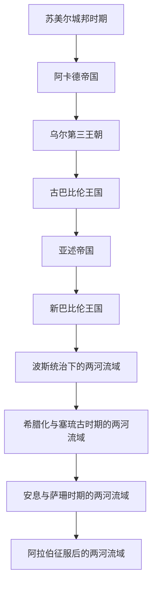

# 两河流域文明

## 概括

两河流域文明主要指幼发拉底河与底格里斯河流域的古代文明传统，核心区域在美索不达米亚，包含苏美尔、阿卡德、巴比伦、亚述等政治和文化层次。它不是现代伊拉克单独的历史，而是西亚古代文明、帝国传统、楔形文字、城邦政治、王权神授、法律传统和早期城市化的重要源头。

## 对象类型与规范分工

- **对象类型**：跨越现代伊拉克、叙利亚、土耳其和伊朗部分地区的区域文明长时段。
- **规范入口**：本目录集中维护苏美尔、阿卡德、巴比伦、亚述及后续帝国统治的两河主线。
- **国家视角**：[伊拉克](/%E4%BA%BA%E6%96%87%E7%A7%91%E5%AD%A6/%E5%8E%86%E5%8F%B2/%E8%A5%BF%E4%BA%9A/%E4%B8%A4%E6%B2%B3%E6%B5%81%E5%9F%9F/%E4%BC%8A%E6%8B%89%E5%85%8B/README.md)从现代国家地域回望前史，并重点维护奥斯曼末期、委任统治、王国、共和国与联邦体制；不复制完整古代文明史。

## 演变图

## 按时间排序的时期导航

| 顺序 | 阶段 | 时间 | 入口 | 简要概括 |
|---:|---|---|---|---|
| 1 | 苏美尔城邦时期 | 约前4千纪末-前2334年 | [苏美尔城邦时期](/%E4%BA%BA%E6%96%87%E7%A7%91%E5%AD%A6/%E5%8E%86%E5%8F%B2/%E8%A5%BF%E4%BA%9A/%E4%B8%A4%E6%B2%B3%E6%B5%81%E5%9F%9F/%E8%8B%8F%E7%BE%8E%E5%B0%94%E5%9F%8E%E9%82%A6%E6%97%B6%E6%9C%9F.md) | 乌鲁克、乌尔、拉伽什等城邦兴起，楔形文字、神庙经济、城邦王权和早期城市文明成熟。 |
| 2 | 阿卡德帝国 | 约前2334年-前2154年 | [阿卡德帝国](/%E4%BA%BA%E6%96%87%E7%A7%91%E5%AD%A6/%E5%8E%86%E5%8F%B2/%E8%A5%BF%E4%BA%9A/%E4%B8%A4%E6%B2%B3%E6%B5%81%E5%9F%9F/%E9%98%BF%E5%8D%A1%E5%BE%B7%E5%B8%9D%E5%9B%BD.md) | 萨尔贡建立以阿卡德语和军事王权为核心的区域帝国，是两河流域早期统一帝国之一。 |
| 3 | 乌尔第三王朝 | 约前2112年-前2004年 | [乌尔第三王朝](/%E4%BA%BA%E6%96%87%E7%A7%91%E5%AD%A6/%E5%8E%86%E5%8F%B2/%E8%A5%BF%E4%BA%9A/%E4%B8%A4%E6%B2%B3%E6%B5%81%E5%9F%9F/%E4%B9%8C%E5%B0%94%E7%AC%AC%E4%B8%89%E7%8E%8B%E6%9C%9D.md) | 乌尔第三王朝重建苏美尔—阿卡德秩序，以行政文书、神庙经济和王权集中化著称。 |
| 4 | 古巴比伦王国 | 约前1894年-前1595年 | [古巴比伦王国](/%E4%BA%BA%E6%96%87%E7%A7%91%E5%AD%A6/%E5%8E%86%E5%8F%B2/%E8%A5%BF%E4%BA%9A/%E4%B8%A4%E6%B2%B3%E6%B5%81%E5%9F%9F/%E5%8F%A4%E5%B7%B4%E6%AF%94%E4%BC%A6%E7%8E%8B%E5%9B%BD.md) | 巴比伦兴起，汉谟拉比统一两河大部，并以《汉谟拉比法典》成为古代法律传统代表。 |
| 5 | 亚述帝国 | 约前14世纪-前609年 | [亚述帝国](/%E4%BA%BA%E6%96%87%E7%A7%91%E5%AD%A6/%E5%8E%86%E5%8F%B2/%E8%A5%BF%E4%BA%9A/%E4%B8%A4%E6%B2%B3%E6%B5%81%E5%9F%9F/%E4%BA%9A%E8%BF%B0%E5%B8%9D%E5%9B%BD.md) | 亚述从北部两河强国发展为新亚述帝国，建立高强度军事、行省和迁徙统治体系。 |
| 6 | 新巴比伦王国 | 前626年-前539年 | [新巴比伦王国](/%E4%BA%BA%E6%96%87%E7%A7%91%E5%AD%A6/%E5%8E%86%E5%8F%B2/%E8%A5%BF%E4%BA%9A/%E4%B8%A4%E6%B2%B3%E6%B5%81%E5%9F%9F/%E6%96%B0%E5%B7%B4%E6%AF%94%E4%BC%A6%E7%8E%8B%E5%9B%BD.md) | 迦勒底王朝控制巴比伦，尼布甲尼撒二世时期重建巴比伦城并成为西亚强权。 |
| 7 | 波斯统治下的两河流域 | 前539年-前331年 | [波斯统治下的两河流域](/%E4%BA%BA%E6%96%87%E7%A7%91%E5%AD%A6/%E5%8E%86%E5%8F%B2/%E8%A5%BF%E4%BA%9A/%E4%B8%A4%E6%B2%B3%E6%B5%81%E5%9F%9F/%E6%B3%A2%E6%96%AF%E7%BB%9F%E6%B2%BB%E4%B8%8B%E7%9A%84%E4%B8%A4%E6%B2%B3%E6%B5%81%E5%9F%9F.md) | 阿契美尼德征服巴比伦后，两河流域成为波斯帝国核心行省和财政、交通、王权象征中心之一。 |
| 8 | 希腊化与塞琉古时期的两河流域 | 前331年-前141年左右 | [希腊化与塞琉古时期的两河流域](/%E4%BA%BA%E6%96%87%E7%A7%91%E5%AD%A6/%E5%8E%86%E5%8F%B2/%E8%A5%BF%E4%BA%9A/%E4%B8%A4%E6%B2%B3%E6%B5%81%E5%9F%9F/%E5%B8%8C%E8%85%8A%E5%8C%96%E4%B8%8E%E5%A1%9E%E7%90%89%E5%8F%A4%E6%97%B6%E6%9C%9F%E7%9A%84%E4%B8%A4%E6%B2%B3%E6%B5%81%E5%9F%9F.md) | 亚历山大征服后，两河进入希腊化秩序，塞琉西亚等城市成为塞琉古王朝东方核心。 |
| 9 | 安息与萨珊时期的两河流域 | 前2世纪-651年 | [安息与萨珊时期的两河流域](/%E4%BA%BA%E6%96%87%E7%A7%91%E5%AD%A6/%E5%8E%86%E5%8F%B2/%E8%A5%BF%E4%BA%9A/%E4%B8%A4%E6%B2%B3%E6%B5%81%E5%9F%9F/%E5%AE%89%E6%81%AF%E4%B8%8E%E8%90%A8%E7%8F%8A%E6%97%B6%E6%9C%9F%E7%9A%84%E4%B8%A4%E6%B2%B3%E6%B5%81%E5%9F%9F.md) | 两河成为安息、萨珊与罗马 / 拜占庭竞争的核心边疆，也是萨珊王朝的重要政治中心。 |
| 10 | 阿拉伯征服后的两河流域 | 7世纪以后 | [阿拉伯征服后的两河流域](/%E4%BA%BA%E6%96%87%E7%A7%91%E5%AD%A6/%E5%8E%86%E5%8F%B2/%E8%A5%BF%E4%BA%9A/%E4%B8%A4%E6%B2%B3%E6%B5%81%E5%9F%9F/%E9%98%BF%E6%8B%89%E4%BC%AF%E5%BE%81%E6%9C%8D%E5%90%8E%E7%9A%84%E4%B8%A4%E6%B2%B3%E6%B5%81%E5%9F%9F.md) | 阿拉伯征服后，两河流域进入伊斯兰世界；阿拔斯时期巴格达成为哈里发帝国中心。 |

## 长世系专表

- [苏美尔城邦王朝与统治者表](/%E4%BA%BA%E6%96%87%E7%A7%91%E5%AD%A6/%E5%8E%86%E5%8F%B2/%E8%A5%BF%E4%BA%9A/%E4%B8%A4%E6%B2%B3%E6%B5%81%E5%9F%9F/%E8%8B%8F%E7%BE%8E%E5%B0%94%E5%9F%8E%E9%82%A6%E7%8E%8B%E6%9C%9D%E4%B8%8E%E7%BB%9F%E6%B2%BB%E8%80%85%E8%A1%A8.md)：区分《苏美尔王表》的传说正统叙事与同期铭文可证的并立城邦序列，不构造统一世系。
- [亚述君主世系表](/%E4%BA%BA%E6%96%87%E7%A7%91%E5%AD%A6/%E5%8E%86%E5%8F%B2/%E8%A5%BF%E4%BA%9A/%E4%B8%A4%E6%B2%B3%E6%B5%81%E5%9F%9F/%E4%BA%9A%E8%BF%B0%E5%90%9B%E4%B8%BB%E4%B8%96%E7%B3%BB%E8%A1%A8.md)：列出中亚述兴起前序至前609年末代残余政权的51位公认君主、短暂争位者和年代分歧。

## 现代国家子目录

- [伊拉克](/%E4%BA%BA%E6%96%87%E7%A7%91%E5%AD%A6/%E5%8E%86%E5%8F%B2/%E8%A5%BF%E4%BA%9A/%E4%B8%A4%E6%B2%B3%E6%B5%81%E5%9F%9F/%E4%BC%8A%E6%8B%89%E5%85%8B/README.md)：以现代伊拉克的地域和国家形成视角，承接两河古代文明、阿拔斯巴格达、奥斯曼行省、委任统治、王国和共和国历史。
- 本目录的阶段笔记继续维护跨越现代边界的两河区域文明；伊拉克子目录不重复完整的苏美尔、巴比伦和亚述通史。

## 关键辨析

- “两河流域文明”主要是区域文明概念，不等同于某一个现代国家，也不等同于单一民族文明。
- 苏美尔、阿卡德、巴比伦、亚述不是简单前后替代的民族国家，而是在语言、城邦、王权和帝国体系上层层叠加。
- 前6世纪以后，两河流域多次成为外来帝国的核心行省：波斯、希腊化王朝、安息、萨珊、阿拉伯帝国都在这里重组统治。
- 阿拉伯征服后的区域主线在本目录保留到阿拔斯中心形成；后续地方史与现代国家史由伊拉克子目录继续展开。

## 相关西亚与北非历史

- 波斯帝国与两河行省关系见[阿契美尼德王朝](/%E4%BA%BA%E6%96%87%E7%A7%91%E5%AD%A6/%E5%8E%86%E5%8F%B2/%E8%A5%BF%E4%BA%9A/%E4%BC%8A%E6%9C%97/%E9%98%BF%E5%A5%91%E7%BE%8E%E5%B0%BC%E5%BE%B7%E7%8E%8B%E6%9C%9D.md)。
- 塞琉古、安息和萨珊时期分别与[塞琉古统治与希腊化伊朗](/%E4%BA%BA%E6%96%87%E7%A7%91%E5%AD%A6/%E5%8E%86%E5%8F%B2/%E8%A5%BF%E4%BA%9A/%E4%BC%8A%E6%9C%97/%E5%A1%9E%E7%90%89%E5%8F%A4%E7%BB%9F%E6%B2%BB%E4%B8%8E%E5%B8%8C%E8%85%8A%E5%8C%96%E4%BC%8A%E6%9C%97.md)、[安息帝国](/%E4%BA%BA%E6%96%87%E7%A7%91%E5%AD%A6/%E5%8E%86%E5%8F%B2/%E8%A5%BF%E4%BA%9A/%E4%BC%8A%E6%9C%97/%E5%AE%89%E6%81%AF%E5%B8%9D%E5%9B%BD.md)、[萨珊帝国](/%E4%BA%BA%E6%96%87%E7%A7%91%E5%AD%A6/%E5%8E%86%E5%8F%B2/%E8%A5%BF%E4%BA%9A/%E4%BC%8A%E6%9C%97/%E8%90%A8%E7%8F%8A%E5%B8%9D%E5%9B%BD.md)相关。
- 阿拉伯征服和巴格达阿拔斯中心见[伊斯兰兴起与正统哈里发时期](/%E4%BA%BA%E6%96%87%E7%A7%91%E5%AD%A6/%E5%8E%86%E5%8F%B2/%E8%A5%BF%E4%BA%9A/_%E9%80%9A%E5%8F%B2/%E9%98%BF%E6%8B%89%E4%BC%AF%E5%B8%9D%E5%9B%BD/%E4%BC%8A%E6%96%AF%E5%85%B0%E5%85%B4%E8%B5%B7%E4%B8%8E%E6%AD%A3%E7%BB%9F%E5%93%88%E9%87%8C%E5%8F%91%E6%97%B6%E6%9C%9F.md)、[阿拔斯王朝](/%E4%BA%BA%E6%96%87%E7%A7%91%E5%AD%A6/%E5%8E%86%E5%8F%B2/%E8%A5%BF%E4%BA%9A/_%E9%80%9A%E5%8F%B2/%E9%98%BF%E6%8B%89%E4%BC%AF%E5%B8%9D%E5%9B%BD/%E9%98%BF%E6%8B%94%E6%96%AF%E7%8E%8B%E6%9C%9D.md)。

## 相关欧洲历史

- 希腊化时期与亚历山大东征、塞琉古王朝相关，可与[希腊化时代](/%E4%BA%BA%E6%96%87%E7%A7%91%E5%AD%A6/%E5%8E%86%E5%8F%B2/%E6%AC%A7%E6%B4%B2/_%E9%80%9A%E5%8F%B2/%E5%8F%A4%E5%B8%8C%E8%85%8A/%E5%B8%8C%E8%85%8A%E5%8C%96%E6%97%B6%E4%BB%A3.md)对读。
- 安息、萨珊时期的两河流域是罗马 / 拜占庭东方边疆的重要背景，可与[罗马帝国](/%E4%BA%BA%E6%96%87%E7%A7%91%E5%AD%A6/%E5%8E%86%E5%8F%B2/%E6%AC%A7%E6%B4%B2/_%E9%80%9A%E5%8F%B2/%E5%8F%A4%E7%BD%97%E9%A9%AC/%E7%BD%97%E9%A9%AC%E5%B8%9D%E5%9B%BD.md)、[东罗马帝国与拜占庭帝国](/%E4%BA%BA%E6%96%87%E7%A7%91%E5%AD%A6/%E5%8E%86%E5%8F%B2/%E6%AC%A7%E6%B4%B2/_%E9%80%9A%E5%8F%B2/%E5%8F%A4%E7%BD%97%E9%A9%AC/%E4%B8%9C%E7%BD%97%E9%A9%AC%E5%B8%9D%E5%9B%BD%E4%B8%8E%E6%8B%9C%E5%8D%A0%E5%BA%AD%E5%B8%9D%E5%9B%BD.md)对读。

## 相关笔记

- 直接上级：[西亚](/%E4%BA%BA%E6%96%87%E7%A7%91%E5%AD%A6/%E5%8E%86%E5%8F%B2/%E8%A5%BF%E4%BA%9A/README.md)。
- 所属总览：[西亚通史](/%E4%BA%BA%E6%96%87%E7%A7%91%E5%AD%A6/%E5%8E%86%E5%8F%B2/%E8%A5%BF%E4%BA%9A/_%E9%80%9A%E5%8F%B2/README.md)、[西亚](/%E4%BA%BA%E6%96%87%E7%A7%91%E5%AD%A6/%E5%8E%86%E5%8F%B2/%E8%A5%BF%E4%BA%9A/README.md)。
- 帝国横向比较：[世界大帝国时空图](/%E4%BA%BA%E6%96%87%E7%A7%91%E5%AD%A6/%E5%8E%86%E5%8F%B2/_%E9%80%9A%E5%8F%B2/%E4%B8%96%E7%95%8C%E5%A4%A7%E5%B8%9D%E5%9B%BD%E6%97%B6%E7%A9%BA%E5%9B%BE.md)。
