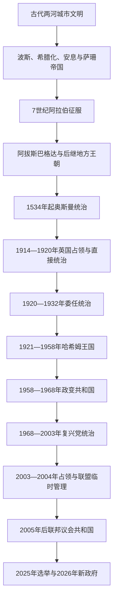

# 伊拉克

## 概括

伊拉克位于底格里斯河、幼发拉底河中下游及北部两河平原。它既包含古代美索不达米亚多个核心城市，也承接阿拔斯巴格达、奥斯曼边疆行省与20世纪现代国家建构。现代国界主要在第一次世界大战、英国占领和委任统治中形成，把原奥斯曼巴士拉、巴格达、摩苏尔三个行政空间及多种地方社会纳入同一王国。

理解伊拉克史需同时观察五组关系：河流农业与石油经济、巴格达中央与库尔德自治、阿拉伯人与库尔德人等族群、逊尼派与什叶派等宗教社群、国内制度与外部力量。上述类别彼此并不重合，任何单一“宗派冲突”叙事都不足以解释王国覆亡、复兴党威权、2003年国家崩解或此后的联邦政治。

古代苏美尔、阿卡德、巴比伦和亚述的完整过程与长世系统一维护在[两河流域文明](/%E4%BA%BA%E6%96%87%E7%A7%91%E5%AD%A6/%E5%8E%86%E5%8F%B2/%E8%A5%BF%E4%BA%9A/%E4%B8%A4%E6%B2%B3%E6%B5%81%E5%9F%9F/README.md)；本目录从今伊拉克地域回望前史，重点展开奥斯曼末期、委任统治、哈希姆王国、共和国、库尔德斯坦地区和2003年后的联邦制度。

## 全史演进图

## 历史主线

- **文明与都会**：南部灌溉城市、北部亚述中心、萨珊泰西封和阿拔斯巴格达先后把两河连接到更大的帝国、贸易和知识网络。王朝更替频繁，但城市、河道、宗教和行政传统并非每次中断。
- **边疆与地方社会**：奥斯曼通过多个行省、总督、城市名流、部落和宗教机构治理；巴格达马穆鲁克总督、库尔德埃米尔及南部部落都拥有不同时期的自主空间。
- **国家形成**：英国把三个原奥斯曼省区纳入委任统治，并于1921年扶植费萨尔一世。1932年独立并未终止英国军事影响，也未解决土地、代表权、族群和地区分配问题。
- **军政与石油国家**：1958年后军队和革命委员会取代王室；1968年复兴党建立党国。1970年代石油收入扩大公共服务和国家能力，随后战争、个人独裁与制裁将其反向耗损。
- **占领与联邦重建**：2003年旧国家机器迅速崩解。2005年宪法确立议会共和与联邦制，承认库尔德斯坦地区；正式制度之外，党派配额、武装组织和外部国家仍深刻影响治理。
- **当代重组**：2014—2017年击败“伊斯兰国”主要领土政权后，反腐、公共服务、武器归属国家、巴格达—埃尔比勒财政和经济多元化成为核心议题。2025年议会选举后的新总统与新总理于2026年产生。

## 按时间排序的导航

| 顺序 | 阶段 | 时间 | 简要概括 |
|---:|---|---|---|
| 1 | [古代两河文明与帝国统治](/%E4%BA%BA%E6%96%87%E7%A7%91%E5%AD%A6/%E5%8E%86%E5%8F%B2/%E8%A5%BF%E4%BA%9A/%E4%B8%A4%E6%B2%B3%E6%B5%81%E5%9F%9F/%E4%BC%8A%E6%8B%89%E5%85%8B/%E5%8F%A4%E4%BB%A3%E4%B8%A4%E6%B2%B3%E6%96%87%E6%98%8E%E4%B8%8E%E5%B8%9D%E5%9B%BD%E7%BB%9F%E6%B2%BB.md) | 约前4千纪末—1534年 | 从城市革命、两河诸王朝到阿拔斯巴格达、蒙古征服和土库曼诸朝；以地域连续性为主，不重复上级长世系。 |
| 2 | [奥斯曼统治、委任统治与伊拉克王国](/%E4%BA%BA%E6%96%87%E7%A7%91%E5%AD%A6/%E5%8E%86%E5%8F%B2/%E8%A5%BF%E4%BA%9A/%E4%B8%A4%E6%B2%B3%E6%B5%81%E5%9F%9F/%E4%BC%8A%E6%8B%89%E5%85%8B/%E5%A5%A5%E6%96%AF%E6%9B%BC%E7%BB%9F%E6%B2%BB%E3%80%81%E5%A7%94%E4%BB%BB%E7%BB%9F%E6%B2%BB%E4%B8%8E%E4%BC%8A%E6%8B%89%E5%85%8B%E7%8E%8B%E5%9B%BD.md) | 1534—1958年 | 奥斯曼多省治理、英国占领、1920年大起义、委任统治和哈希姆王国的完整过程。 |
| 3 | [共和国、复兴党与战后伊拉克](/%E4%BA%BA%E6%96%87%E7%A7%91%E5%AD%A6/%E5%8E%86%E5%8F%B2/%E8%A5%BF%E4%BA%9A/%E4%B8%A4%E6%B2%B3%E6%B5%81%E5%9F%9F/%E4%BC%8A%E6%8B%89%E5%85%8B/%E5%85%B1%E5%92%8C%E5%9B%BD%E3%80%81%E5%A4%8D%E5%85%B4%E5%85%9A%E4%B8%8E%E6%88%98%E5%90%8E%E4%BC%8A%E6%8B%89%E5%85%8B.md) | 1958年至今 | 政变共和国、复兴党、地区战争、2003年占领、联邦宪制、库尔德自治区及当代政府。 |

## 重要转折与时间节点

| 时间 | 转折 | 历史意义 |
|---|---|---|
| 约前4千纪末 | 乌鲁克城市化与文字形成 | 两河城市、行政记录和专业分工成熟。 |
| 762年 | 巴格达建城 | 阿拔斯帝国的政治、商业与知识中心形成。 |
| 1258年 | 蒙古攻陷巴格达 | 巴格达阿拔斯哈里发终结，区域进入汗国和地方王朝重组。 |
| 1534年、1638年 | 奥斯曼两度取得巴格达 | 两河纳入奥斯曼—萨法维边界体系，1638年后奥斯曼长期占优。 |
| 1914—1918年 | 英国军事占领 | 巴士拉、巴格达和摩苏尔被纳入战后英国控制。 |
| 1920年 | 反英大起义 | 直接统治成本上升，英国转向王室和条约支撑的间接统治。 |
| 1921年 | 费萨尔一世即位 | 现代伊拉克王国建立。 |
| 1932年 | 加入国际联盟 | 委任统治结束，条约和英国基地影响仍延续。 |
| 1958年 | 七月革命 | 哈希姆王朝覆亡，共和国与军人政治开始。 |
| 1968年 | 复兴党再次夺权 | 党、革命指挥委员会和安全机构构成长期威权国家。 |
| 1972—1979年 | 石油国有化、收入激增与萨达姆接班 | 国家能力和社会工程扩张，权力同步个人化。 |
| 1980—1988年 | 两伊战争 | 社会军事化、债务和对库尔德地区的大规模暴力加深。 |
| 1990—1991年 | 入侵科威特与海湾战争 | 制裁开始，南北起义被镇压，库尔德地区形成事实自治。 |
| 2003年 | 联军入侵 | 复兴党政权被推翻，国家机构断裂、占领与叛乱展开。 |
| 2005年 | 新宪法公投 | 确立联邦议会共和国并承认库尔德斯坦地区。 |
| 2014—2017年 | 对“伊斯兰国”战争 | 联邦军、人民动员力量、佩什梅格与国际联盟共同作战，武装多元化延续。 |
| 2019年 | 十月运动 | 跨宗派青年集中挑战腐败、失业、配额和外部影响。 |
| 2025—2026年 | 议会选举与新政府形成 | 新议长、总统和总理依次产生，联盟组阁和非正式权力分享继续塑造制度。 |

## 关键辨析

- **美索不达米亚不等于现代伊拉克**：古代文明跨越今伊拉克及邻国，现代国界不可倒推到古代王朝。
- **三个奥斯曼省不是固定国界模板**：辖境和行政等级曾变化，英国占领与战后条约才把它们更稳定地接合。
- **1932年独立不等于英国影响终止**：英国由高级专员统治转为条约、基地、大使和亲英精英网络影响。
- **1958年后也不是一条同质共和国线**：卡塞姆、阿里夫、贝克尔—萨达姆党国、占领过渡和2005年后联邦制的权力结构显著不同。
- **库尔德斯坦地区不是普通省**：它拥有地区总统、议会、政府和佩什梅格，但仍属伊拉克联邦；预算、油气和争议领土需同中央协调。
- **“穆哈萨萨”不是宪法明定宗派职位表**：总统由库尔德人、总理由什叶派、议长由逊尼派担任主要是2003年后的政治惯例和联盟交易。
- **人民动员力量不是单一组织**：其各组成力量的来源、党派联系、对总理指挥的服从和对外关系均有差异。

## 区域关系

- 直接上级与古代规范入口：[两河流域文明](/%E4%BA%BA%E6%96%87%E7%A7%91%E5%AD%A6/%E5%8E%86%E5%8F%B2/%E8%A5%BF%E4%BA%9A/%E4%B8%A4%E6%B2%B3%E6%B5%81%E5%9F%9F/README.md)。
- 阿拔斯跨区域制度与哈里发世系见[阿拉伯帝国](/%E4%BA%BA%E6%96%87%E7%A7%91%E5%AD%A6/%E5%8E%86%E5%8F%B2/%E8%A5%BF%E4%BA%9A/_%E9%80%9A%E5%8F%B2/%E9%98%BF%E6%8B%89%E4%BC%AF%E5%B8%9D%E5%9B%BD/README.md)。
- 奥斯曼整体制度、王朝世系与帝国解体见[奥斯曼帝国](/%E4%BA%BA%E6%96%87%E7%A7%91%E5%AD%A6/%E5%8E%86%E5%8F%B2/%E8%A5%BF%E4%BA%9A/%E5%9C%9F%E8%80%B3%E5%85%B6/%E5%A5%A5%E6%96%AF%E6%9B%BC%E5%B8%9D%E5%9B%BD/README.md)。
- 萨法维边界、两伊战争和当代影响的伊朗侧见[伊朗](/%E4%BA%BA%E6%96%87%E7%A7%91%E5%AD%A6/%E5%8E%86%E5%8F%B2/%E8%A5%BF%E4%BA%9A/%E4%BC%8A%E6%9C%97/README.md)。
- 入侵科威特和海湾战争的另一侧见[科威特](/%E4%BA%BA%E6%96%87%E7%A7%91%E5%AD%A6/%E5%8E%86%E5%8F%B2/%E8%A5%BF%E4%BA%9A/%E9%98%BF%E6%8B%89%E4%BC%AF%E5%8D%8A%E5%B2%9B/%E7%A7%91%E5%A8%81%E7%89%B9/README.md)。
- “伊斯兰国”跨境扩张与叙利亚内战背景见[叙利亚](/%E4%BA%BA%E6%96%87%E7%A7%91%E5%AD%A6/%E5%8E%86%E5%8F%B2/%E8%A5%BF%E4%BA%9A/%E9%BB%8E%E5%87%A1%E7%89%B9/%E5%8F%99%E5%88%A9%E4%BA%9A/README.md)。

## 目录层级

- 直接上级：[两河流域文明](/%E4%BA%BA%E6%96%87%E7%A7%91%E5%AD%A6/%E5%8E%86%E5%8F%B2/%E8%A5%BF%E4%BA%9A/%E4%B8%A4%E6%B2%B3%E6%B5%81%E5%9F%9F/README.md)
- 宏观区域：[西亚](/%E4%BA%BA%E6%96%87%E7%A7%91%E5%AD%A6/%E5%8E%86%E5%8F%B2/%E8%A5%BF%E4%BA%9A/README.md)
- 历史总览：[历史](/%E4%BA%BA%E6%96%87%E7%A7%91%E5%AD%A6/%E5%8E%86%E5%8F%B2/README.md)
