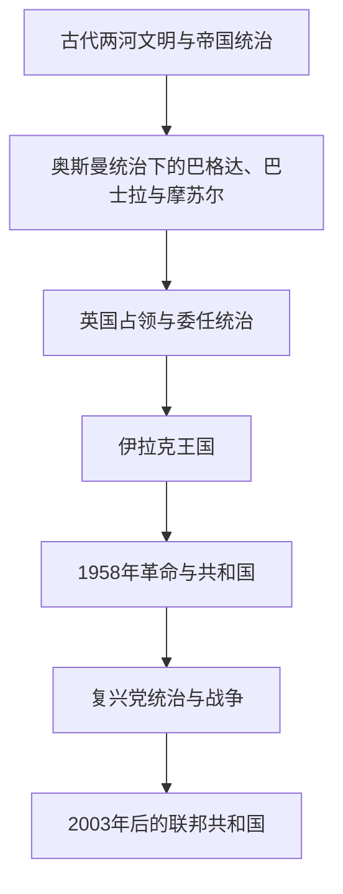

# 伊拉克

## 概括

伊拉克位于底格里斯河与幼发拉底河中下游，是古代美索不达米亚文明的核心区域，也是阿拔斯时代巴格达、奥斯曼帝国边疆行省和现代阿拉伯国家的重要历史空间。现代伊拉克的国界与制度主要形成于第一次世界大战后，但其社会长期由阿拉伯人与库尔德人、逊尼派与什叶派穆斯林以及亚述人、土库曼人、雅兹迪人等多种社群共同构成。

古代苏美尔、阿卡德、巴比伦和亚述的完整历史集中放在[两河流域文明](/%E4%BA%BA%E6%96%87%E7%A7%91%E5%AD%A6/%E5%8E%86%E5%8F%B2/%E8%A5%BF%E4%BA%9A/%E4%B8%A4%E6%B2%B3%E6%B5%81%E5%9F%9F/README.md)；本目录从现代伊拉克的地域视角串联这些前史，并重点展开奥斯曼末期、英国委任统治、王国、共和国和战后联邦体制。

## 对象类型与规范分工

- **对象类型**：现代国家通史与现代伊拉克地域视角。
- **前史入口**：古代文明与跨境帝国主线以[两河流域文明](/%E4%BA%BA%E6%96%87%E7%A7%91%E5%AD%A6/%E5%8E%86%E5%8F%B2/%E8%A5%BF%E4%BA%9A/%E4%B8%A4%E6%B2%B3%E6%B5%81%E5%9F%9F/README.md)为规范页。
- **本页重点**：把共享前史落实到今伊拉克地域，并展开现代边界、国家制度、族群与宗派结构、石油经济及对外关系。

## 演变图

## 历史主线

伊拉克历史可分为三条相互衔接的主线：第一是两河流域的城市文明与跨区域帝国传统；第二是奥斯曼—英国统治转换以及哈希姆王国建立；第三是1958年后的共和国、复兴党威权统治、多次地区战争和2003年后的联邦重建。现代国家史必须同时观察巴格达中央政府、库尔德地区、宗派政治、石油经济与外部力量介入。

## 时期导航

| 顺序 | 阶段 | 时间 | 简要概括 |
|---:|---|---|---|
| 1 | [古代两河文明与帝国统治](/%E4%BA%BA%E6%96%87%E7%A7%91%E5%AD%A6/%E5%8E%86%E5%8F%B2/%E8%A5%BF%E4%BA%9A/%E4%B8%A4%E6%B2%B3%E6%B5%81%E5%9F%9F/%E4%BC%8A%E6%8B%89%E5%85%8B/%E5%8F%A4%E4%BB%A3%E4%B8%A4%E6%B2%B3%E6%96%87%E6%98%8E%E4%B8%8E%E5%B8%9D%E5%9B%BD%E7%BB%9F%E6%B2%BB.md) | 约前4千纪末—1534年 | 从苏美尔城市化到阿拔斯巴格达、蒙古征服和后续地方王朝，形成伊拉克的文明与城市前史。 |
| 2 | [奥斯曼统治、委任统治与伊拉克王国](/%E4%BA%BA%E6%96%87%E7%A7%91%E5%AD%A6/%E5%8E%86%E5%8F%B2/%E8%A5%BF%E4%BA%9A/%E4%B8%A4%E6%B2%B3%E6%B5%81%E5%9F%9F/%E4%BC%8A%E6%8B%89%E5%85%8B/%E5%A5%A5%E6%96%AF%E6%9B%BC%E7%BB%9F%E6%B2%BB%E3%80%81%E5%A7%94%E4%BB%BB%E7%BB%9F%E6%B2%BB%E4%B8%8E%E4%BC%8A%E6%8B%89%E5%85%8B%E7%8E%8B%E5%9B%BD.md) | 1534—1958年 | 奥斯曼行省、英国占领与委任统治被整合为现代伊拉克王国。 |
| 3 | [共和国、复兴党与战后伊拉克](/%E4%BA%BA%E6%96%87%E7%A7%91%E5%AD%A6/%E5%8E%86%E5%8F%B2/%E8%A5%BF%E4%BA%9A/%E4%B8%A4%E6%B2%B3%E6%B5%81%E5%9F%9F/%E4%BC%8A%E6%8B%89%E5%85%8B/%E5%85%B1%E5%92%8C%E5%9B%BD%E3%80%81%E5%A4%8D%E5%85%B4%E5%85%9A%E4%B8%8E%E6%88%98%E5%90%8E%E4%BC%8A%E6%8B%89%E5%85%8B.md) | 1958年至今 | 共和国革命、复兴党统治、地区战争、2003年政权更替及联邦政治重建。 |

## 重要转折与时间节点

| 时间 | 事件 | 意义 |
|---|---|---|
| 762年 | 巴格达建城 | 阿拔斯王朝的新都成为伊斯兰世界重要政治、商业与学术中心。 |
| 1258年 | 蒙古军攻陷巴格达 | 阿拔斯在巴格达的统治终结，两河政治格局重组。 |
| 1534年 | 奥斯曼帝国占领巴格达 | 两河大部逐渐纳入奥斯曼—萨法维竞争和奥斯曼行省体系。 |
| 1921年 | 费萨尔一世即位 | 英国主导的现代伊拉克王国建立。 |
| 1932年 | 伊拉克加入国际联盟 | 委任统治正式结束，伊拉克取得形式上的完整独立。 |
| 1958年 | 七月革命 | 哈希姆王朝被推翻，共和国成立。 |
| 1968年 | 复兴党重新掌权 | 威权党国体制逐步巩固。 |
| 1980—1988年 | 两伊战争 | 长期消耗战争深刻影响国家、社会与地区秩序。 |
| 2003年 | 美国主导的联军入侵伊拉克 | 复兴党政权被推翻，占领、叛乱和制度重建随之展开。 |
| 2005年 | 新宪法通过 | 伊拉克确立联邦制与议会共和框架。 |

## 区域关系

- 直接上级：[两河流域](/%E4%BA%BA%E6%96%87%E7%A7%91%E5%AD%A6/%E5%8E%86%E5%8F%B2/%E8%A5%BF%E4%BA%9A/%E4%B8%A4%E6%B2%B3%E6%B5%81%E5%9F%9F/README.md)；宏观区域：[西亚](/%E4%BA%BA%E6%96%87%E7%A7%91%E5%AD%A6/%E5%8E%86%E5%8F%B2/%E8%A5%BF%E4%BA%9A/README.md)。
- 古代文明详见[两河流域文明](/%E4%BA%BA%E6%96%87%E7%A7%91%E5%AD%A6/%E5%8E%86%E5%8F%B2/%E8%A5%BF%E4%BA%9A/%E4%B8%A4%E6%B2%B3%E6%B5%81%E5%9F%9F/README.md)。
- 伊斯兰帝国背景见[阿拉伯帝国](/%E4%BA%BA%E6%96%87%E7%A7%91%E5%AD%A6/%E5%8E%86%E5%8F%B2/%E8%A5%BF%E4%BA%9A/_%E9%80%9A%E5%8F%B2/%E9%98%BF%E6%8B%89%E4%BC%AF%E5%B8%9D%E5%9B%BD/README.md)。
- 奥斯曼整体主线见[奥斯曼帝国](/%E4%BA%BA%E6%96%87%E7%A7%91%E5%AD%A6/%E5%8E%86%E5%8F%B2/%E8%A5%BF%E4%BA%9A/%E5%9C%9F%E8%80%B3%E5%85%B6/%E5%A5%A5%E6%96%AF%E6%9B%BC%E5%B8%9D%E5%9B%BD/README.md)。
- 萨法维—奥斯曼竞争的伊朗侧见[伊朗](/%E4%BA%BA%E6%96%87%E7%A7%91%E5%AD%A6/%E5%8E%86%E5%8F%B2/%E8%A5%BF%E4%BA%9A/%E4%BC%8A%E6%9C%97/README.md)。

## 目录层级

- 直接上级：[两河流域](/%E4%BA%BA%E6%96%87%E7%A7%91%E5%AD%A6/%E5%8E%86%E5%8F%B2/%E8%A5%BF%E4%BA%9A/%E4%B8%A4%E6%B2%B3%E6%B5%81%E5%9F%9F/README.md)
- 宏观区域：[西亚](/%E4%BA%BA%E6%96%87%E7%A7%91%E5%AD%A6/%E5%8E%86%E5%8F%B2/%E8%A5%BF%E4%BA%9A/README.md)
- 历史总览：[历史](/%E4%BA%BA%E6%96%87%E7%A7%91%E5%AD%A6/%E5%8E%86%E5%8F%B2/README.md)
