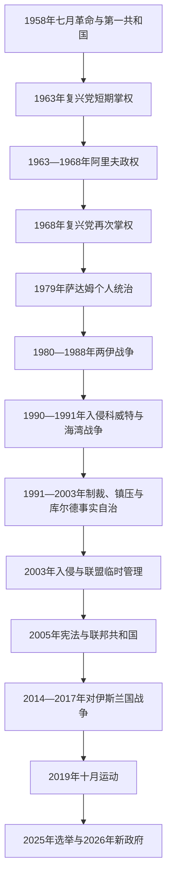

# 共和国、复兴党与战后伊拉克

## 时间

1958年至今

## 核验截止

当代职务与事件核验至2026年7月13日。伊拉克2025年议会选举后的组阁在2026年仍分阶段完成，故本页把已获议会确认的职务与仍在协商的内阁席位明确区分。

## 概括

1958年七月革命推翻哈希姆王国，伊拉克先后经历卡塞姆军政、阿里夫兄弟统治、复兴党党国和萨达姆个人化威权。石油国有化与1970年代收入增长一度支持教育、医疗、基础设施和国家整合，但权力集中、对库尔德地区的战争、两伊战争、入侵科威特、国际制裁和高压统治耗尽社会与财政基础。

2003年美国主导的入侵推翻复兴党政权，联盟临时管理当局的去复兴党化与解散军队同国家崩解、占领反抗、宗派动员及圣战组织扩张相互作用。2005年宪法建立联邦议会共和国并确认库尔德斯坦地区，然而正式机构之外仍有党派配额、宗教权威、部落、武装组织和外部国家影响。2014—2017年对“伊斯兰国”的战争重新扩大国家和民兵力量；2019年“十月运动”则以跨宗派抗议质疑腐败、失业、公共服务不足和外部干预。

2025年11月议会选举后，政府形成再次经历长期协商。2026年4月议会选出尼扎尔·穆罕默德·赛义德·艾迈迪为总统，5月批准阿里·法利赫·扎伊迪的政府纲领及首批14名部长。至7月13日，联邦政府仍需完成部分内阁任命，并在国家武器垄断、反腐、油气财政和巴格达—埃尔比勒关系上推进艰难协调。

## 政权演进图

## 分阶段发展

### 卡塞姆、阿里夫与政变共和国（1958—1968年）

1958年7月14日，自由军官控制巴格达，王国在数小时内覆亡。新政权设三人主权委员会为集体国家元首，阿卜杜勒·卡里姆·卡塞姆兼任总理、国防部长和武装力量总司令，才是实际最高领导人。他退出巴格达条约、颁布土地改革并扩大国家在石油特许区的权利，又在阿拉伯统一派、伊拉克民族主义者、共产党人与库尔德运动之间保持平衡。

卡塞姆拒绝立即加入埃及主导的阿拉伯联合共和国，与主张泛阿拉伯统一的阿卜杜勒·萨拉姆·阿里夫决裂。1959年摩苏尔起事、基尔库克暴力和党派民兵冲突加深政治极化；1961年政府与穆斯塔法·巴尔扎尼领导的库尔德运动开战。1963年2月复兴党人与民族主义军官发动“斋月政变”，处决卡塞姆，复兴党国民卫队随即大规模打击共产党人与异议者。

1963年11月，阿卜杜勒·萨拉姆·阿里夫借军队解除复兴党武装，建立更偏军人—纳赛尔主义的政权。1966年他因直升机失事去世，兄长阿卜杜勒·拉赫曼·阿里夫继任。内阁短命、库尔德战争和军方派系竞争使政权缺乏稳定基础，1968年7月17日复兴党军官无血夺权，7月30日又排除合作的阿卜杜勒·拉扎克·纳伊夫集团。

### 复兴党国家的建立与石油繁荣（1968—1979年）

艾哈迈德·哈桑·贝克尔任总统、总理兼革命指挥委员会主席，萨达姆·侯赛因任副主席并逐步控制党务、安全机构和干部任用。政权以革命指挥委员会高于内阁和议会，复兴党支部深入军队、行政、学校与群众组织；多套相互监督的情报安全机关降低政变风险，却也形成系统性镇压。

1970年政府同库尔德民主党达成自治协议，承诺承认库尔德民族权利、分享中央职位并在四年内实施自治。基尔库克边界、人口政策和权力分配未获解决，1974年自治法遭库尔德领导层拒绝，战争重启。1975年伊拉克与伊朗签署《阿尔及尔协议》，以边界让步换取伊朗停止援助，库尔德起义迅速崩溃。

1972年伊拉克石油公司国有化，随后油价上涨使国家收入激增。政府扩展教育、医疗、住房、灌溉和工业，女性教育与就业亦增加。石油租金让中央减少对社会协商和直接税收的依赖，也使发展、党组织与安全体系共同受总统核心分配。1979年贝克尔辞职，萨达姆集党、军、政最高职务于一身，并通过党内清洗确立个人统治。

### 战争、镇压与制裁（1979—2003年）

1980年伊拉克入侵革命后的伊朗，试图利用对方军政混乱、重定边界并取得地区优势。战争很快转为八年消耗战，双方实施城市袭击、导弹战和化学武器作战。伊拉克依靠海湾国家贷款、外部军备和全面动员维持战事，1988年停火时虽避免战败，却负债累累、军队膨胀。1987—1988年“安法尔行动”摧毁大量库尔德村庄，哈拉卜贾化学袭击成为政权对平民大规模暴力的象征。

为解决债务、石油价格和地区领导权问题，萨达姆于1990年8月吞并科威特。联合国制裁后，美国主导多国部队在1991年海湾战争中击败伊军。停火后南部什叶派与北部库尔德地区爆发起义，政府在中南部血腥镇压；北方在国际禁飞与人道干预背景下脱离巴格达实际控制，库尔德民主党和库尔德斯坦爱国联盟建立两套地方行政，并在1994—1998年发生内战。

1990年代全面制裁、战争破坏和国家配给使社会贫困化，专业人才外流，儿童与公共卫生受重创。1996年“石油换食品”计划缓解部分人道危机，同时让政权以配给网络维持控制。萨达姆依靠亲族、安全机构、部落化任用和精锐共和国卫队防范政变；其对大规模杀伤性武器项目的隐瞒、销毁与国际核查争端相互纠缠。2003年入侵前并未发现后来宣称的现役大规模杀伤性武器库存，战争理由与情报使用因此引发长期争议。

### 入侵、占领与制度重建（2003—2011年）

2003年3月美国主导联军入侵，4月巴格达陷落，萨达姆政权的正规指挥体系迅速崩溃。最初由杰伊·加纳领导的重建与人道援助办公室处理过渡，5月起保罗·布雷默领导的联盟临时管理当局掌握最高行政、立法和规章权。广泛去复兴党化及解散军队使大批官员和武装人员失去职位，叠加抢掠、边境失控和占领反感，为叛乱、犯罪与民兵扩张提供条件；这不是宗派战争的唯一原因，却是国家能力断裂的重要机制。

2003年7月成立的伊拉克管理委员会由联盟当局任命并轮值主席，主权仍在占领当局。2004年6月权力移交临时政府，伊亚德·阿拉维任总理；2005年选举产生过渡国民议会，新宪法在公投中通过。宪法规定伊拉克为联邦议会共和国，承认库尔德斯坦地区及既有机关，并把未专属联邦的权力留给地区和省。逊尼派阿拉伯人对制宪参与不足、联邦边界与去复兴党化的疑虑未被充分化解。

2006年萨迈拉阿里·哈迪清真寺爆炸后，基地组织分支、什叶派民兵、叛乱组织和安全部队间的报复把宗派暴力推向高峰，巴格达许多社区被强制分隔。2007—2008年美军增兵、逊尼部落“觉醒委员会”反对基地组织、马赫迪军停火以及伊拉克安全部队扩张共同降低暴力。2008年美伊安全协议规定美军撤离时间表，2011年底大部分美军撤出。

### “伊斯兰国”、联邦争议与社会抗议（2011—2022年）

努里·马利基政府在安全机构和人事上的集权、对逊尼政治对手的司法追诉，以及叙利亚内战外溢，加深部分地区不满。2013年政府驱散哈维贾抗议营等事件推动武装化。2014年6月，“伊斯兰国”攻占摩苏尔和大片北部、西部地区，部分伊军单位溃散；其对雅兹迪人实施种族灭绝式暴力，并迫害基督徒、什叶派和反抗的逊尼社群。

什叶派最高宗教权威阿里·西斯塔尼发布防卫号召后，多支既有与新建武装纳入“人民动员力量”。联邦军、反恐部队、人民动员力量、库尔德佩什梅格以及美国主导国际联盟从不同方向作战，2017年收复摩苏尔并结束“伊斯兰国”主要领土统治。人民动员力量于2016年被纳入国家法律框架并受总理兼总司令领导，但其内部组织的党派关系、指挥自主程度及同伊朗的联系差异很大，不能视为单一民兵。

2017年库尔德斯坦地区举行独立公投，绝大多数投票者支持独立，联邦政府否认其法律效力，并在库尔德内部派系分歧下重新控制基尔库克等争议区。中央与地区此后围绕石油出口、预算转移、公务员工资、海关和宪法第140条争议持续谈判。

2019年10月起，巴格达和南部城市爆发“十月运动”。青年抗议者把就业、停电、腐败、党派配额、武装压制与伊朗等外部影响联系起来，运动具有明显跨宗派和伊拉克民族取向。安全部队及武装人员的镇压造成大量死伤，总理阿迪勒·阿卜杜勒·迈赫迪辞职。2020年穆斯塔法·卡迪米政府在疫情、油价下跌和武装组织竞争中执政；2021年选举后，萨德尔派虽席位领先却未能组阁，其议员2022年集体辞职，协调框架最终支持穆罕默德·希亚·苏达尼出任总理。

### 2022—2026年：建设议程与再次组阁

苏达尼政府以基础设施、公共服务和“伊拉克优先”平衡外交为重点，同时处于美国安全合作、伊朗影响、人民动员力量派系和地区冲突之间。2023年通过三年预算扩大支出，石油收入继续决定财政空间。加沙战争后部分伊拉克武装袭击驻伊美军和地区目标，政府既谴责侵犯主权，也需约束名义上处于国家体系内外的不同武装。

2025年11月举行第六届议会选举，苏达尼领导的“重建与发展联盟”取得最多单一联盟席位，但什叶派“协调框架”汇集多党后宣布为最大议会集团。12月30日新议会选出海贝特·哈尔布西为议长。总统选举因库尔德党派竞争和法定人数政治延至2026年4月11日，议会最终选出库尔德斯坦爱国联盟人物尼扎尔·艾迈迪。

艾迈迪总统随后委任政治新人阿里·法利赫·扎伊迪组阁。5月14日议会批准政府纲领和23个部长席位中的首批14人，部分安全与服务部门人选未获通过或延期表决。至7月13日，完成内阁、打击腐败、让武器和安全决定归于国家、平衡美伊关系，以及处理库尔德地区预算与能源，仍是新政府的核心议题。

## 国家元首与实际最高权力

| 顺序 | 国家元首或过渡权力 | 任期 | 法定身份 | 实际权力说明 |
|---:|---|---|---|---|
| 1 | 穆罕默德·纳吉布·鲁巴伊 | 1958—1963年 | 三人主权委员会主席 | 集体国家元首偏礼仪；总理卡塞姆控制政府、军队和政策。 |
| 2 | 阿卜杜勒·萨拉姆·阿里夫 | 1963—1966年 | 总统 | 1963年2月先与复兴党分享权力，11月解除复兴党国民卫队后掌握军政。 |
| 3 | 阿卜杜勒·拉赫曼·阿里夫 | 1966—1968年 | 总统 | 依赖军官和短命内阁，1968年政变中被迫下台。 |
| 4 | **艾哈迈德·哈桑·贝克尔** | 1968—1979年 | 总统、革命指挥委员会主席 | 形式和实权最高领导；1970年代后期副手萨达姆已控制安全与党务核心。 |
| 5 | **萨达姆·侯赛因** | 1979—2003年 | 总统、革命指挥委员会主席 | 个人化党国最高领导，长期兼任总理和军队统帅；2003年政权被入侵推翻。 |
| — | 联盟临时管理当局 | 2003年5月—2004年6月 | 占领期最高管理机关 | 保罗·布雷默任行政长官，拥有最高规章与行政权；伊拉克管理委员会仅具受限、轮值的本地代表权。 |
| 6 | 加齐·亚瓦尔 | 2004—2005年 | 临时总统 | 权力受《过渡时期行政法》与临时政府限制，总理阿拉维主管行政。 |
| 7 | **贾拉勒·塔拉巴尼** | 2005—2014年 | 过渡及宪法下总统 | 首位库尔德人总统；2006年后总统偏礼仪与协调，行政实权属于总理。2012年后因病长期在外。 |
| 8 | 福阿德·马苏姆 | 2014—2018年 | 总统 | 在“伊斯兰国”危机中依宪法委任阿巴迪组阁，日常行政由总理掌握。 |
| 9 | 巴尔哈姆·萨利赫 | 2018—2022年 | 总统 | 在抗议与多次组阁失败间承担提名和协调职能。 |
| 10 | 阿卜杜勒·拉蒂夫·拉希德 | 2022—2026年 | 总统 | 委任苏达尼组阁；任期延续至2025年选后继任人产生。 |
| 11 | **尼扎尔·穆罕默德·赛义德·艾迈迪** | 2026年4月11日至今 | 总统 | 截至2026年7月13日在任；依宪法委任扎伊迪组阁，总统仍以代表、批准和协调权为主。 |

## 历任总理与行政最高领导

| 顺序 | 总理或对应行政权力 | 任期 | 政权与备注 |
|---:|---|---|---|
| 1 | **阿卜杜勒·卡里姆·卡塞姆** | 1958—1963年 | 总理、国防部长兼实际最高领导；1963年政变中被处决。 |
| 2 | 艾哈迈德·哈桑·贝克尔 | 1963年2—11月 | 复兴党第一次执政的总理，后被阿里夫解除。 |
| 3 | 塔希尔·叶海亚 | 1963—1965年 | 军人政府总理。 |
| 4 | 阿里夫·阿卜杜勒·拉扎克 | 1965年9月 | 短期总理，随后发动未遂政变。 |
| 5 | 阿卜杜勒·拉赫曼·巴扎兹 | 1965—1966年 | 共和国首位重要文官总理，尝试同库尔德方面停火。 |
| 6 | 纳吉·塔利卜 | 1966—1967年 | 军人总理。 |
| 7 | 阿卜杜勒·拉赫曼·阿里夫 | 1967年5—7月 | 总统短期兼总理。 |
| 8 | 塔希尔·叶海亚 | 1967—1968年 | 再次组阁，七月政变中下台。 |
| 9 | 阿卜杜勒·拉扎克·纳伊夫 | 1968年7月17—30日 | 政变联合者，任总理不足两周即被复兴党排除。 |
| 10 | **艾哈迈德·哈桑·贝克尔** | 1968—1979年 | 总统兼总理，复兴党长期统治奠基者。 |
| 11 | **萨达姆·侯赛因** | 1979—1991年 | 总统兼总理，个人化威权统治。 |
| 12 | 萨阿敦·哈马迪 | 1991年3—9月 | 海湾战争后短期总理。 |
| 13 | 穆罕默德·哈姆扎·祖拜迪 | 1991—1993年 | 制裁初期总理。 |
| 14 | 艾哈迈德·侯赛因·胡达伊尔·萨马赖 | 1993—1994年 | 总理职权仍受总统与革命指挥委员会支配。 |
| 15 | **萨达姆·侯赛因** | 1994—2003年 | 再度兼任总理，直至政权覆亡。 |
| — | 杰伊·加纳、保罗·布雷默与伊拉克管理委员会 | 2003—2004年 | 无主权伊拉克总理；先由重建办公室、后由联盟临时管理当局掌最高权力，管理委员会轮值主席。 |
| 16 | 伊亚德·阿拉维 | 2004—2005年 | 临时政府总理，处理主权移交、叛乱与选举准备。 |
| 17 | 易卜拉欣·贾法里 | 2005—2006年 | 过渡政府总理，制宪和宗派危机加深。 |
| 18 | **努里·马利基** | 2006—2014年 | 首位2005年宪法下长期总理；任内暴力下降后又出现权力集中和“伊斯兰国”危机。 |
| 19 | 海德尔·阿巴迪 | 2014—2018年 | 领导收复“伊斯兰国”占领区并处理库尔德独立公投后危机。 |
| 20 | 阿迪勒·阿卜杜勒·迈赫迪 | 2018—2020年 | 2019年抗议后辞职并看守至继任者产生。 |
| 21 | 穆斯塔法·卡迪米 | 2020—2022年 | 看守改革、提前选举及美军任务调整。 |
| 22 | 穆罕默德·希亚·苏达尼 | 2022—2026年5月 | 协调框架支持组阁；2025年选后留任看守至新政府获批。 |
| 23 | **阿里·法利赫·扎伊迪** | 2026年5月14日至今 | 截至2026年7月13日在任；政府纲领和首批14名部长获议会批准，余缺继续协商。 |

## 2005年后联邦权力结构

| 层级或机构 | 法定角色 | 实际运行与争议 |
|---|---|---|
| 总统 | 国家统一象征，批准法律、委任最大议会集团候选人组阁等 | 依政治惯例多由库尔德政治人物担任；这一族群分配是非正式协商，并非宪法明文配额。 |
| 总理与部长会议 | 联邦行政首脑；总理兼武装力量总司令 | 掌预算、任命和安全政策，是最有实权的宪法职位；依赖多党联盟和议会信任。 |
| 国民议会 | 329席，立法、预算、监督、选举总统并批准内阁 | 议长通常由逊尼派阿拉伯政治人物担任，同样属于政治惯例；组阁联盟往往在选后形成。 |
| 联邦司法 | 联邦最高法院解释宪法、裁决联邦争议 | 对选举、最大议会集团、地区法律和油气权限的判决直接塑造政治。 |
| 库尔德斯坦地区 | 地区议会、地区政府、总统及佩什梅格；享宪法自治 | 截至2026年，内奇尔万·巴尔扎尼任地区总统；2024年地区议会选举后第十届内阁尚未完成组建，马斯鲁尔·巴尔扎尼领导的第九届地区政府继续履职；地区预算工资、石油与争议领土仍待协调。 |
| 省级政府 | 非地区省享地方行政权限，部分省可组成地区 | 财政仍高度依赖联邦预算；地方选举、官僚和党派网络影响服务分配。 |
| 人民动员力量 | 依法纳入国家安全架构并受总司令指挥 | 内部包含宗教号召志愿者、党派武装和既有亲伊朗组织；服从程度与政治利益不一。 |
| 什叶派宗教权威 | 无宪法行政职位 | 纳杰夫最高宗教权威可通过宗教和社会声望影响危机动员，但不等同于伊朗式教士统治。 |
| “穆哈萨萨”配额政治 | 非正式族群—宗派分享职位与资源 | 有助于精英妥协，却也造成部门党派化、责任分散和腐败；2019年抗议者重点反对这一机制。 |

## 重要事件

| 时间 | 事件 | 结果与长期影响 |
|---|---|---|
| 1958年7月14日 | 七月革命 | 王国覆亡，共和国建立，军队成为政权核心。 |
| 1961年 | 第一次库尔德战争扩大 | 自治承诺与中央集权冲突军事化。 |
| 1963年2月、11月 | 两次政变 | 复兴党短暂掌权后被阿里夫排除，暴力清洗加深。 |
| 1968年7月17日、30日 | 复兴党夺权与内部清洗 | 贝克尔—萨达姆核心建立长期党国。 |
| 1970年 | 库尔德自治协议 | 承认原则未化为双方接受的领土和权力安排。 |
| 1972年 | 石油国有化 | 油价上涨后国家财政和社会工程迅速扩张。 |
| 1975年 | 《阿尔及尔协议》 | 伊朗停止援助后库尔德起义崩溃，中央控制加强。 |
| 1979年 | 萨达姆接班与清洗 | 总统个人、家族和安全机构控制党国。 |
| 1980—1988年 | 两伊战争 | 巨额伤亡、债务和军事化；安法尔与化学武器造成严重国际罪行。 |
| 1990—1991年 | 入侵科威特与海湾战争 | 伊军败退、制裁开始，南北起义被镇压，库尔德事实自治形成。 |
| 1996年 | “石油换食品”启动 | 缓解部分人道危机，却未结束制裁经济和国家配给控制。 |
| 2003年 | 联军入侵、去复兴党化与解散军队 | 旧政权覆亡，国家能力断裂，叛乱和占领秩序展开。 |
| 2005年 | 选举与宪法公投 | 确立联邦议会共和框架和库尔德地区地位。 |
| 2006年 | 萨迈拉清真寺爆炸 | 宗派报复和人口强制迁移进入高峰。 |
| 2007—2008年 | 增兵、觉醒运动与民兵停火 | 多重因素共同降低暴力，国家安全力量扩张。 |
| 2011年 | 美军大规模撤出 | 伊拉克恢复更完整安全主权，国内权力集中与叙利亚危机风险上升。 |
| 2014年 | “伊斯兰国”攻占摩苏尔 | 国家军队危机、人民动员力量兴起及国际联盟再介入。 |
| 2017年 | 摩苏尔收复与库尔德公投 | “伊斯兰国”失去主要领土，中央重占基尔库克等争议区。 |
| 2019年 | 十月运动 | 跨宗派青年挑战配额、腐败与外部影响，政府辞职。 |
| 2021—2022年 | 选后僵局与萨德尔派退出议会 | 协调框架接管多数席位并组成苏达尼政府。 |
| 2025—2026年 | 第六届选举与新政府形成 | 议长、总统、总理依次产生；组阁再次显示多党协商和非正式配额的决定性。 |

## 兴盛、危机与重建因素

### 国家能力的来源

- 石油出口为教育、医疗、基础设施、军队和公共就业提供财政，1970年代和2010年代高油价期尤其明显。
- 巴格达的官僚与大学体系、南部港口和北部油田构成全国经济网络；2005年后的选举与联邦制度为竞争提供正式渠道。
- 地方、部落、宗教和库尔德机关并非只有“分裂”作用，它们也在国家崩解时承担治安、救援和政治代表功能。

### 结构性危机

- **租金依赖**：预算、工资和进口受油价波动制约，非石油产业、私营就业与供电长期不足。
- **权力集中与制度断裂**：复兴党安全国家压缩社会自治；2003年又以突然解散而非有序改造旧机构，造成两次相反方向的国家能力危机。
- **族群与地区安排未完成**：库尔德自治已有宪法基础，但基尔库克、油气法、预算和佩什梅格整合仍无稳定终局。
- **配额与问责矛盾**：多党分享可防止单一集团垄断，却把部委变为党派资源，选民难以追究统一责任。
- **武装多元化**：正规军、反恐部队、人民动员力量、佩什梅格和地方武装在反恐中互补，也带来指挥、法治和国家武器垄断问题。

### 外部压力

伊朗、美国、土耳其和海湾国家通过安全、贸易、能源和党派关系影响伊拉克；叙利亚战争、巴以冲突和库尔德跨境问题又不断外溢。伊拉克政府通常采取平衡而非完全倒向一方的策略，但境内武装的跨境行动可能使国家被卷入并非由内阁决定的冲突。

### 直接触发因素与避免单因解释

1958年、1963年、1968年和2003年的政权更替分别由军事行动或外来入侵直接触发；两伊战争源于边界、革命安全焦虑和领导人误判；“伊斯兰国”扩张则同时利用叙利亚战争、伊拉克政治排斥、军队腐败和圣战网络。把这些转折仅归结为“宗派冲突”会忽略国家制度、阶层、地区和国际因素。

## 演变关系

- 前一阶段：[奥斯曼统治、委任统治与伊拉克王国](/%E4%BA%BA%E6%96%87%E7%A7%91%E5%AD%A6/%E5%8E%86%E5%8F%B2/%E8%A5%BF%E4%BA%9A/%E4%B8%A4%E6%B2%B3%E6%B5%81%E5%9F%9F/%E4%BC%8A%E6%8B%89%E5%85%8B/%E5%A5%A5%E6%96%AF%E6%9B%BC%E7%BB%9F%E6%B2%BB%E3%80%81%E5%A7%94%E4%BB%BB%E7%BB%9F%E6%B2%BB%E4%B8%8E%E4%BC%8A%E6%8B%89%E5%85%8B%E7%8E%8B%E5%9B%BD.md)。
- 两伊战争及伊朗影响的另一侧见[伊朗](/%E4%BA%BA%E6%96%87%E7%A7%91%E5%AD%A6/%E5%8E%86%E5%8F%B2/%E8%A5%BF%E4%BA%9A/%E4%BC%8A%E6%9C%97/README.md)。
- 1990年入侵和海湾战争的科威特侧见[科威特](/%E4%BA%BA%E6%96%87%E7%A7%91%E5%AD%A6/%E5%8E%86%E5%8F%B2/%E8%A5%BF%E4%BA%9A/%E9%98%BF%E6%8B%89%E4%BC%AF%E5%8D%8A%E5%B2%9B/%E7%A7%91%E5%A8%81%E7%89%B9/README.md)。
- “伊斯兰国”跨境扩张及叙利亚战争背景见[叙利亚](/%E4%BA%BA%E6%96%87%E7%A7%91%E5%AD%A6/%E5%8E%86%E5%8F%B2/%E8%A5%BF%E4%BA%9A/%E9%BB%8E%E5%87%A1%E7%89%B9/%E5%8F%99%E5%88%A9%E4%BA%9A/README.md)。
- 土耳其同库尔德问题、边境安全和水资源的关系见[土耳其](/%E4%BA%BA%E6%96%87%E7%A7%91%E5%AD%A6/%E5%8E%86%E5%8F%B2/%E8%A5%BF%E4%BA%9A/%E5%9C%9F%E8%80%B3%E5%85%B6/README.md)。
- 国家总览见[伊拉克](/%E4%BA%BA%E6%96%87%E7%A7%91%E5%AD%A6/%E5%8E%86%E5%8F%B2/%E8%A5%BF%E4%BA%9A/%E4%B8%A4%E6%B2%B3%E6%B5%81%E5%9F%9F/%E4%BC%8A%E6%8B%89%E5%85%8B/README.md)。
