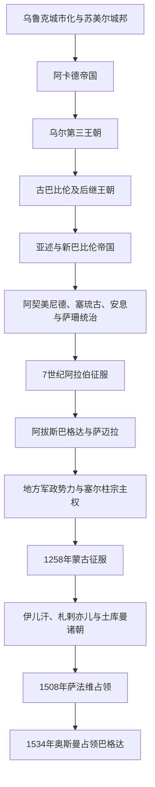

# 古代两河文明与帝国统治

## 时间

约前4千纪末—1534年

## 概括

今伊拉克大体覆盖底格里斯河、幼发拉底河中下游和北部两河平原，是古代美索不达米亚多个文明中心的所在地。然而，苏美尔、阿卡德、巴比伦、亚述以及后来的哈里发帝国都越出现代国界，不能倒推为一个连续不变的“伊拉克国家”。本页只从地域角度说明城市、灌溉网络、南北政治中心和巴格达都会传统如何层层叠加；各王朝的完整过程与世系仍由[两河流域文明](/%E4%BA%BA%E6%96%87%E7%A7%91%E5%AD%A6/%E5%8E%86%E5%8F%B2/%E8%A5%BF%E4%BA%9A/%E4%B8%A4%E6%B2%B3%E6%B5%81%E5%9F%9F/README.md)及其专页维护。

这片区域的长期优势来自冲积平原农业、河道运输以及连接伊朗高原、安纳托利亚、叙利亚和波斯湾的交通位置；它的脆弱性也源于同一条件：河道改道、盐碱化、灌溉失修、游牧—定居边界变化和跨区域战争会同时打击财政与城市供给。所谓“文明衰落”通常不是一次灾变，而是生态约束、政治分裂、贸易重心变化和军事征服反复叠加的结果。

## 地域演进图

## 分阶段发展

### 城市革命与早期统一

约前4千纪末，乌鲁克等南部城市依靠灌溉农业、神庙—宫廷组织、专业手工业和远距离交换扩大。楔形文字最初服务于物资、劳役和土地记录，随后成为行政、法律、文学和知识传承工具。前3千纪的南部并非单一王国，而是乌鲁克、乌尔、拉伽什、基什等城邦在联盟、战争和短期霸权间转换；相关传说王表与铭文可证序列见[苏美尔城邦王朝与统治者表](/%E4%BA%BA%E6%96%87%E7%A7%91%E5%AD%A6/%E5%8E%86%E5%8F%B2/%E8%A5%BF%E4%BA%9A/%E4%B8%A4%E6%B2%B3%E6%B5%81%E5%9F%9F/%E8%8B%8F%E7%BE%8E%E5%B0%94%E5%9F%8E%E9%82%A6%E7%8E%8B%E6%9C%9D%E4%B8%8E%E7%BB%9F%E6%B2%BB%E8%80%85%E8%A1%A8.md)。

萨尔贡约于前24世纪建立[阿卡德帝国](/%E4%BA%BA%E6%96%87%E7%A7%91%E5%AD%A6/%E5%8E%86%E5%8F%B2/%E8%A5%BF%E4%BA%9A/%E4%B8%A4%E6%B2%B3%E6%B5%81%E5%9F%9F/%E9%98%BF%E5%8D%A1%E5%BE%B7%E5%B8%9D%E5%9B%BD.md)，以王室任命、驻军和跨语言行政把南北两河连成更大政治空间。帝国在继承斗争、地方反抗和外部压力下瓦解后，[乌尔第三王朝](/%E4%BA%BA%E6%96%87%E7%A7%91%E5%AD%A6/%E5%8E%86%E5%8F%B2/%E8%A5%BF%E4%BA%9A/%E4%B8%A4%E6%B2%B3%E6%B5%81%E5%9F%9F/%E4%B9%8C%E5%B0%94%E7%AC%AC%E4%B8%89%E7%8E%8B%E6%9C%9D.md)以高度文书化的税赋、劳役和行省体系重建秩序。两者都显示一个反复出现的机制：统一能扩大灌溉、贸易与军事动员，却也提高长距离统治和持续征收的成本。

### 巴比伦、亚述与帝国行省

前2千纪初阿摩利人诸王国竞争，[古巴比伦王国](/%E4%BA%BA%E6%96%87%E7%A7%91%E5%AD%A6/%E5%8E%86%E5%8F%B2/%E8%A5%BF%E4%BA%9A/%E4%B8%A4%E6%B2%B3%E6%B5%81%E5%9F%9F/%E5%8F%A4%E5%B7%B4%E6%AF%94%E4%BC%A6%E7%8E%8B%E5%9B%BD.md)的汉谟拉比通过外交、战争和治水控制两河大部；其死后属国离心、边疆压力与资源不足使版图迅速收缩。随后加喜特王朝在巴比伦维持较长稳定，北方亚述则逐步发展出以国王、军队、行省和贡赋为核心的帝国结构。

前1千纪的[亚述帝国](/%E4%BA%BA%E6%96%87%E7%A7%91%E5%AD%A6/%E5%8E%86%E5%8F%B2/%E8%A5%BF%E4%BA%9A/%E4%B8%A4%E6%B2%B3%E6%B5%81%E5%9F%9F/%E4%BA%9A%E8%BF%B0%E5%B8%9D%E5%9B%BD.md)依靠常备化军队、道路、总督和有计划的人口迁徙建立西亚强权，但持续战争、王位危机、属地反叛及米底—新巴比伦联盟共同导致其灭亡。前626年后，[新巴比伦王国](/%E4%BA%BA%E6%96%87%E7%A7%91%E5%AD%A6/%E5%8E%86%E5%8F%B2/%E8%A5%BF%E4%BA%9A/%E4%B8%A4%E6%B2%B3%E6%B5%81%E5%9F%9F/%E6%96%B0%E5%B7%B4%E6%AF%94%E4%BC%A6%E7%8E%8B%E5%9B%BD.md)以巴比伦为中心重建南部王权与城市工程；前539年居鲁士二世入城后，两河成为阿契美尼德帝国的重要财政、交通和王权象征中心，而非突然失去城市传统。

### 波斯、希腊化与伊朗诸帝国

阿契美尼德、塞琉古、安息和萨珊统治都把两河视为帝国腹地或关键西部核心。塞琉古时期，底格里斯河畔塞琉西亚等新城与巴比伦旧有祭司、书吏共同存在；安息和萨珊时期，泰西封一带成为王都群，并处于与罗马、拜占庭反复争夺的前线。希腊语、阿拉米语、中古波斯语和多种宗教社群并存，犹太学术中心、东方基督教会与祆教机构都在这里发展。详细过程分别见[波斯统治下的两河流域](/%E4%BA%BA%E6%96%87%E7%A7%91%E5%AD%A6/%E5%8E%86%E5%8F%B2/%E8%A5%BF%E4%BA%9A/%E4%B8%A4%E6%B2%B3%E6%B5%81%E5%9F%9F/%E6%B3%A2%E6%96%AF%E7%BB%9F%E6%B2%BB%E4%B8%8B%E7%9A%84%E4%B8%A4%E6%B2%B3%E6%B5%81%E5%9F%9F.md)、[希腊化与塞琉古时期的两河流域](/%E4%BA%BA%E6%96%87%E7%A7%91%E5%AD%A6/%E5%8E%86%E5%8F%B2/%E8%A5%BF%E4%BA%9A/%E4%B8%A4%E6%B2%B3%E6%B5%81%E5%9F%9F/%E5%B8%8C%E8%85%8A%E5%8C%96%E4%B8%8E%E5%A1%9E%E7%90%89%E5%8F%A4%E6%97%B6%E6%9C%9F%E7%9A%84%E4%B8%A4%E6%B2%B3%E6%B5%81%E5%9F%9F.md)和[安息与萨珊时期的两河流域](/%E4%BA%BA%E6%96%87%E7%A7%91%E5%AD%A6/%E5%8E%86%E5%8F%B2/%E8%A5%BF%E4%BA%9A/%E4%B8%A4%E6%B2%B3%E6%B5%81%E5%9F%9F/%E5%AE%89%E6%81%AF%E4%B8%8E%E8%90%A8%E7%8F%8A%E6%97%B6%E6%9C%9F%E7%9A%84%E4%B8%A4%E6%B2%B3%E6%B5%81%E5%9F%9F.md)。

萨珊末年长期对拜占庭战争、王位频繁更替、瘟疫与财政军事压力削弱边防。633—642年前后的阿拉伯征服不是单场战役完成：卡迪西亚失利、泰西封陷落和纳哈万德战役相继瓦解萨珊在两河与伊朗高原的统治。新政权沿用并调整地税、文书和地方精英网络，同时建立巴士拉、库法等军营城市。

### 哈里发中心与巴格达都会

656年阿里把政治中心移至库法，伊拉克由此成为第一次内战的重要舞台；倭马亚时期总督哈查只等人从库法、巴士拉及新建的瓦西特控制税收和军队。什叶派关于阿里与侯赛因的记忆，使纳杰夫、卡尔巴拉后来成为跨区域宗教学术与朝圣中心。

750年阿拔斯革命从呼罗珊向伊拉克推进。762年曼苏尔营建巴格达，利用河运、陆路、波斯行政经验和帝国税收，使其成为政治、商业、翻译、法学与学术枢纽。836—892年，哈里发因近卫军与首都政治矛盾迁驻萨迈拉；9世纪以后，军队财政化、地方税源脱离和宫廷派系竞争削弱哈里发直接统治。869—883年赞吉起义重创南部种植园与巴士拉地区，也暴露劳役、族群和财政秩序的矛盾。

945年白益王朝进入巴格达，1055年塞尔柱人接掌军政，阿拔斯哈里发多保留宗教合法性和册封功能。12世纪部分哈里发一度恢复伊拉克中部控制，却未重建早期跨区域帝国。阿拔斯制度、过程及37位巴格达哈里发分别见[阿拔斯王朝](/%E4%BA%BA%E6%96%87%E7%A7%91%E5%AD%A6/%E5%8E%86%E5%8F%B2/%E8%A5%BF%E4%BA%9A/_%E9%80%9A%E5%8F%B2/%E9%98%BF%E6%8B%89%E4%BC%AF%E5%B8%9D%E5%9B%BD/%E9%98%BF%E6%8B%94%E6%96%AF%E7%8E%8B%E6%9C%9D.md)与[阿拔斯哈里发世系表](/%E4%BA%BA%E6%96%87%E7%A7%91%E5%AD%A6/%E5%8E%86%E5%8F%B2/%E8%A5%BF%E4%BA%9A/_%E9%80%9A%E5%8F%B2/%E9%98%BF%E6%8B%89%E4%BC%AF%E5%B8%9D%E5%9B%BD/%E9%98%BF%E6%8B%94%E6%96%AF%E5%93%88%E9%87%8C%E5%8F%91%E4%B8%96%E7%B3%BB%E8%A1%A8.md)，本页不重复长世系。

### 蒙古征服至奥斯曼进入

1258年旭烈兀攻陷巴格达，处死末代巴格达哈里发穆斯台绥木，伊拉克进入伊儿汗国体系。征服造成严重人口与城市损失，但“灌溉体系在一日内永久毁灭”的说法过度简化；河道淤积、战争、税制失衡、瘟疫和长期维护不足在此前后共同作用，且不同地区恢复程度不一。

伊儿汗国解体后，札剌亦儿王朝以巴格达为中心；帖木儿在1393年、1401年两度攻城，随后黑羊王朝、白羊王朝争夺两河。1508年萨法维沙阿伊斯玛仪一世取得巴格达，把什叶派王朝扩张与伊拉克圣城联系起来；1534年奥斯曼苏莱曼一世进入巴格达，开启此后数世纪奥斯曼—萨法维边界竞争。

## 统治与社会机制

| 机制 | 延续与变化 | 历史影响 |
|---|---|---|
| 河流与灌溉 | 南部需长期疏浚、筑堤和分水，北部更多依靠降雨农业 | 能组织劳役和维护水网的政权更易汲取剩余；战乱与失修会使聚落和耕地转移。 |
| 城市—腹地关系 | 乌鲁克、巴比伦、尼尼微、泰西封、库法、巴士拉、巴格达依次成为不同网络中心 | 政治中心迁移不等于前一城市传统完全消失，商业、宗教和工艺常跨王朝延续。 |
| 帝国行政 | 从城邦宫廷、行省与贡赋到地税、军镇和官僚制 | 新征服者通常改组而非完全废弃既有税收、文书与地方精英。 |
| 多语与多宗教社会 | 苏美尔语、阿卡德语、阿拉米语、希腊语、波斯语、阿拉伯语先后占据不同领域 | 语言更替与宗教变化历时数世纪，不能等同于一次征服后的整体人口替换。 |
| 南北差异 | 南部冲积平原、中央巴格达走廊与北部摩苏尔—亚述平原生态不同 | 现代伊拉克把这些区域纳入一国，但其地方政治、农业与社群结构并不相同。 |

## 重要事件

| 时间 | 事件 | 过程与影响 |
|---|---|---|
| 约前3400—前3000年 | 乌鲁克城市化与文字形成 | 城市、专业分工和行政记录扩展，奠定两河城市文明的制度基础。 |
| 约前2334年 | 萨尔贡建立阿卡德帝国 | 首次较持久地把南北两河和外围地区纳入同一军事—行政网络。 |
| 约前2112年 | 乌尔第三王朝建立 | 以密集文书、税赋和行省制度重建苏美尔—阿卡德政治秩序。 |
| 前18世纪 | 汉谟拉比扩张 | 巴比伦取得短期统一，《汉谟拉比法典》体现王权司法与社会等级秩序。 |
| 前612—前609年 | 亚述帝国灭亡 | 内乱、属地反抗与米底—新巴比伦联合进攻共同瓦解帝国。 |
| 前539年 | 波斯占领巴比伦 | 两河并入阿契美尼德帝国，同时保留巴比伦行政和宗教传统。 |
| 637年前后 | 卡迪西亚战役与泰西封陷落 | 萨珊在两河的核心军政体系瓦解，阿拉伯征服转入制度接管。 |
| 762年 | 巴格达建城 | 阿拔斯帝国建立新的都会、财政和知识中心。 |
| 836—892年 | 萨迈拉时期 | 突厥近卫与宫廷政治改变哈里发权力结构，财政压力上升。 |
| 945年、1055年 | 白益与塞尔柱先后进入巴格达 | 哈里发与实际军政控制分离成为常态。 |
| 1258年 | 蒙古攻陷巴格达 | 巴格达阿拔斯哈里发终结，伊拉克被纳入伊儿汗统治。 |
| 1401年 | 帖木儿再度攻陷巴格达 | 城市与人口受重创，随后土库曼诸王朝竞逐当地。 |
| 1508—1534年 | 萨法维占领与奥斯曼夺取 | 两河成为奥斯曼—萨法维帝国竞争的关键边区。 |

## 兴盛与转折原因

- **兴盛条件**：可灌溉农业提供高密度人口与税收；河海交通连接波斯湾和内陆；帝国首都带来官僚、消费、学术和手工业集聚；多族群商人与宗教网络增强跨区域联系。
- **结构性压力**：灌溉维护成本、土地盐碱化、河道变化、城乡税负不均及军队财政需求，会在中央失控时互相放大。
- **外部压力**：伊朗高原、草原—山地与叙利亚方向的军事力量都可沿交通走廊进入；伊拉克既是交通枢纽，也是帝国边界战争的反复战场。
- **直接转折**：王位危机、地方税源脱离、联盟入侵和首都陷落常是政权更替的触发点，但不能单独解释长时段社会变化。
- **连续性**：新王朝往往继承旧有城市、税制、运河和宗教机构；因此应区分“统治王朝灭亡”“首都衰退”与“区域社会中断”。

## 演变关系

- 古代完整分期和长世系见[两河流域文明](/%E4%BA%BA%E6%96%87%E7%A7%91%E5%AD%A6/%E5%8E%86%E5%8F%B2/%E8%A5%BF%E4%BA%9A/%E4%B8%A4%E6%B2%B3%E6%B5%81%E5%9F%9F/README.md)、[苏美尔城邦王朝与统治者表](/%E4%BA%BA%E6%96%87%E7%A7%91%E5%AD%A6/%E5%8E%86%E5%8F%B2/%E8%A5%BF%E4%BA%9A/%E4%B8%A4%E6%B2%B3%E6%B5%81%E5%9F%9F/%E8%8B%8F%E7%BE%8E%E5%B0%94%E5%9F%8E%E9%82%A6%E7%8E%8B%E6%9C%9D%E4%B8%8E%E7%BB%9F%E6%B2%BB%E8%80%85%E8%A1%A8.md)、[亚述君主世系表](/%E4%BA%BA%E6%96%87%E7%A7%91%E5%AD%A6/%E5%8E%86%E5%8F%B2/%E8%A5%BF%E4%BA%9A/%E4%B8%A4%E6%B2%B3%E6%B5%81%E5%9F%9F/%E4%BA%9A%E8%BF%B0%E5%90%9B%E4%B8%BB%E4%B8%96%E7%B3%BB%E8%A1%A8.md)及[阿拔斯哈里发世系表](/%E4%BA%BA%E6%96%87%E7%A7%91%E5%AD%A6/%E5%8E%86%E5%8F%B2/%E8%A5%BF%E4%BA%9A/_%E9%80%9A%E5%8F%B2/%E9%98%BF%E6%8B%89%E4%BC%AF%E5%B8%9D%E5%9B%BD/%E9%98%BF%E6%8B%94%E6%96%AF%E5%93%88%E9%87%8C%E5%8F%91%E4%B8%96%E7%B3%BB%E8%A1%A8.md)。
- 伊朗高原诸帝国与伊拉克的交叉脉络见[伊朗](/%E4%BA%BA%E6%96%87%E7%A7%91%E5%AD%A6/%E5%8E%86%E5%8F%B2/%E8%A5%BF%E4%BA%9A/%E4%BC%8A%E6%9C%97/README.md)；这不是两条互不相干的国家史。
- 后一阶段进入[奥斯曼统治、委任统治与伊拉克王国](/%E4%BA%BA%E6%96%87%E7%A7%91%E5%AD%A6/%E5%8E%86%E5%8F%B2/%E8%A5%BF%E4%BA%9A/%E4%B8%A4%E6%B2%B3%E6%B5%81%E5%9F%9F/%E4%BC%8A%E6%8B%89%E5%85%8B/%E5%A5%A5%E6%96%AF%E6%9B%BC%E7%BB%9F%E6%B2%BB%E3%80%81%E5%A7%94%E4%BB%BB%E7%BB%9F%E6%B2%BB%E4%B8%8E%E4%BC%8A%E6%8B%89%E5%85%8B%E7%8E%8B%E5%9B%BD.md)。
- 国家总览见[伊拉克](/%E4%BA%BA%E6%96%87%E7%A7%91%E5%AD%A6/%E5%8E%86%E5%8F%B2/%E8%A5%BF%E4%BA%9A/%E4%B8%A4%E6%B2%B3%E6%B5%81%E5%9F%9F/%E4%BC%8A%E6%8B%89%E5%85%8B/README.md)。
