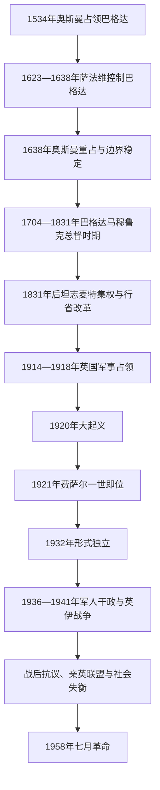

# 奥斯曼统治、委任统治与伊拉克王国

## 时间

1534—1958年

## 概括

1534年奥斯曼苏莱曼一世占领巴格达后，今伊拉克地区逐渐处于奥斯曼帝国与萨法维帝国竞争的边界。奥斯曼并未把“伊拉克”作为一个边界固定、行政统一的现代国家治理，而是通过巴格达、巴士拉、摩苏尔等省区，结合总督、驻军、城市名流、宗教机构、库尔德埃米尔和阿拉伯部落首领实行层级不一的统治。17世纪的奥斯曼—萨法维战争、18世纪巴格达马穆鲁克总督的半自治和19世纪坦志麦特集权，依次改变地方权力关系。

第一次世界大战中，英国从波斯湾沿河谷向北占领三省。直接军政统治和战后委任安排激起1920年大起义，英国遂转向以条约、顾问和本地君主为支点的间接统治。1921年费萨尔一世即位，现代伊拉克王国把巴士拉、巴格达和摩苏尔三个原奥斯曼行政空间纳入一国。1932年委任统治结束后，王国拥有国际法上的主权，但英国基地与条约权利、土地精英、王室—首相网络和军官集团仍共同决定政治。王国最终在1958年七月革命中覆亡。

## 演进图

## 奥斯曼统治的形成与调整

### 奥斯曼—萨法维边界

苏莱曼一世于1534年从萨法维手中取得巴格达，朝觐圣城、波斯湾航路和伊朗西部边界由此成为奥斯曼战略重点。萨法维沙阿阿拔斯一世于1623年重占巴格达；奥斯曼穆拉德四世在1638年围城成功，1639年《席林堡条约》大体稳定两帝国边界。边界稳定并未终止部落迁徙、商贸和什叶派朝圣网络，纳杰夫、卡尔巴拉的宗教学者与伊朗长期保持联系。

巴格达、巴士拉和摩苏尔的行政地位与辖境多次变化，不能把三个行省机械视为现代国界的固定前身。巴士拉面向波斯湾、印度洋贸易及蒙塔菲克等部落联盟；巴格达控制中部河谷和通往伊朗的路线；摩苏尔联系安纳托利亚、叙利亚、库尔德山区与亚述平原。帝国中央通常需要地方名流、税农、部落酋长和库尔德埃米尔协助征税、治安和征兵。

### 巴格达马穆鲁克总督与地方自治

1704年以后，哈桑帕夏、艾哈迈德帕夏及其培养的格鲁吉亚裔马穆鲁克官僚—军人集团逐步控制巴格达。1749—1831年间，这一集团多由内部推举总督，在名义承认苏丹宗主权的同时掌握军队、税收和对部落关系。大苏莱曼帕夏、阿里帕夏、小苏莱曼帕夏和达乌德帕夏等总督整顿治安、经营贸易并扩展对巴士拉的影响，但继承斗争、财政压力、部落冲突及中央集权复兴削弱其自主性。

1831年瘟疫、洪水与政治危机重创巴格达，奥斯曼军队罢黜达乌德帕夏，恢复中央任命总督。马穆鲁克时期不是独立王朝，也没有脱离奥斯曼法理；其意义在于展示地方军政精英如何在帝国边疆形成相对自主的治理网络。

### 坦志麦特、土地与社会变化

19世纪中期后，奥斯曼推行新式军队、户籍、征兵、学校、邮政和土地登记。米德哈特帕夏任巴格达总督期间（1869—1872年）推动轮船交通、行政区划、教育和土地确权，希望把部落纳入定居农业与税收体系。1858年土地法在地方实施时，大量公地或部落使用地登记到酋长、城市权贵和中间人名下；这既增加国家控制，也强化后来王国时期的大地产结构。

帝国改革并未均匀覆盖全境。什叶派圣城的宗教捐产和跨境学术网络、南部部落联盟、北部库尔德与基督徒社群各有权力基础。19世纪末至20世纪初，电报、学校、军队和报刊塑造新的奥斯曼官僚与阿拉伯知识精英，但地方认同、奥斯曼主义、阿拉伯民族主义和宗派归属仍相互交叠。

## 第一次世界大战与英国占领

1914年11月，英属印度军队在法奥登陆并占领巴士拉，以保护波斯湾航路和石油利益。1915年底英军深入至库特，被奥斯曼军包围，1916年4月投降；重组后英军于1917年3月占领巴格达。1918年《穆德洛斯停战协定》后，英军继续进入摩苏尔，由此引发同奥斯曼继承国土耳其的归属争议。

英国最初采用带有英属印度经验的直接军政管理，以政治官、土地税和部落条例控制地方。战时承诺、战后巴黎和会及1920年圣雷莫会议却把伊拉克交由英国委任，独立期望与实际统治之间的落差迅速扩大。

### 1920年大起义

1920年夏，反对委任统治、征税和外来行政的行动从中幼发拉底河地区扩散。纳杰夫、卡尔巴拉什叶派宗教学者、部分逊尼派城市民族主义者和多个部落共同参与，但各地目标与参与程度并不一致。起义者一度切断铁路、包围据点，英国依靠增援、空军和与友好部落合作镇压。

大起义未立即实现独立，却使直接统治成本大增。英国在1921年开罗会议后选择建立受条约约束的阿拉伯君主国，以少量英国顾问、基地和财政军事影响维持战略利益。它也成为后来国家叙事中的共同反殖民记忆，但不能掩盖参与者间的地区、阶层与宗派差异。

## 委任统治的实际权力

| 顺序 | 英国最高代表 | 任期 | 职务与实际作用 |
|---:|---|---|---|
| 1 | 阿诺德·威尔逊 | 1918—1920年 | 代理民政专员；主张较直接的英印式行政，1920年起义后离任。 |
| 2 | **珀西·考克斯** | 1920—1923年 | 高级专员；组织临时政府、推动费萨尔即位并谈判1922年英伊条约，是间接统治架构的主要设计者。 |
| 3 | 亨利·多布斯 | 1923—1929年 | 高级专员；监督制宪、议会与条约执行，处理摩苏尔归属和石油特许等问题。 |
| 4 | 吉尔伯特·克莱顿 | 1929年 | 高级专员；任内去世，任期短暂。 |
| 5 | 弗朗西斯·汉弗莱斯 | 1929—1932年 | 高级专员；推进1930年英伊条约及伊拉克加入国际联盟，委任结束后转任英国大使。 |

英国高级专员不是伊拉克君主，却在委任期对外交、军事、财政顾问体系和重大任命拥有决定性影响。费萨尔、内阁、制宪议会和地方精英也并非毫无能动性：他们利用条约谈判、民族主义动员和英国内部政策分歧争取空间。实际统治因此是英国优势下的不对称协商，而非单线命令链。

## 王国建立与制度

1921年8月23日，曾短暂统治叙利亚的哈希姆家族成员费萨尔即位。1922年英伊条约以顾问和军事安排限制主权；1924年制宪议会批准条约，1925年《基本法》建立世袭君主、两院议会和责任内阁。选举受到政府操纵、间接选举和地方权贵网络影响，土地所有者、前奥斯曼军官与官僚占据优势。

国际联盟于1925年建议把摩苏尔纳入伊拉克，1926年英、伊、土条约确认边界，土耳其获得一段时期的石油收益分成。1927年基尔库克附近巴巴古尔古尔发现大油田；伊拉克石油公司及英国等外国资本长期控制开发，石油收入直到后期才显著扩大国家能力。

1930年英伊条约承诺支持独立，同时保留英国空军基地、战时通行与合作权。1932年10月伊拉克加入国际联盟，委任统治正式结束。独立并未自动解决国家认同：1933年西美莱屠杀中，军队杀害亚述平民，显示政府以强制手段塑造统一主权的危险；库尔德自治诉求、什叶派地方不满和部落征服行动亦持续存在。

## 哈希姆王朝完整君主世系

| 顺序 | 君主 | 王室 | 在位时间 | 生卒 | 与前任关系 | 关键事件与备注 |
|---:|---|---|---|---|---|---|
| 1 | **费萨尔一世** | 哈希姆王朝 | 1921年8月23日—1933年9月8日 | 1885—1933年 | 开国君主；汉志国王侯赛因之子 | 经英国支持即位；推动制宪、整合三省与1932年独立，在阿拉伯民族主义、英国关系和国内社群间协调。 |
| 2 | 加齐一世 | 哈希姆王朝 | 1933年9月8日—1939年4月4日 | 1912—1939年 | 费萨尔一世独子 | 军队和泛阿拉伯民族主义影响上升；1936年政变发生于其统治期；因车祸去世，死亡引发政治猜疑但无定论。 |
| 3 | **费萨尔二世** | 哈希姆王朝 | 1939年4月4日—1958年7月14日 | 1935—1958年 | 加齐一世独子 | 幼年即位，1953年亲政；在阿拉伯联邦成立数月后被七月革命推翻并遇害，为末代国王。 |

### 摄政与王位特殊情况

| 摄政者 | 时间 | 法理地位与说明 |
|---|---|---|
| **阿卜杜勒·伊拉** | 1939—1941年、1941—1953年 | 费萨尔二世的舅父和法定摄政；1941年政变时离开巴格达，英国获胜后复位，1953年国王成年后改任王储。 |
| 谢里夫·沙拉夫·本·拉吉赫 | 1941年4—5月 | 拉希德·阿里和“金方阵”军官另立的短期摄政；未形成新王统，英军胜利后其任命失效。 |

## 王室、首相、军队与英国的权力关系

| 权力中心 | 代表人物或机构 | 作用 |
|---|---|---|
| 王室与宫廷 | 费萨尔一世、摄政阿卜杜勒·伊拉 | 任命首相、解散议会并协调精英；幼主时期摄政权尤其重要。 |
| 资深首相与土地精英 | 努里·赛义德、贾米勒·米德法伊、亚辛·哈希米等 | 通过反复组阁、选举安排和英方关系控制行政；努里·赛义德先后14次组阁，是王国末期最具影响力的政治人物。 |
| 军官集团 | 贝克尔·西德基、“金方阵”、自由军官 | 1936年后把军队变成政权更替仲裁者，民族主义和内部派系相互竞争。 |
| 英国政府与驻军 | 英国大使、哈巴尼亚与舍巴空军基地 | 1932年后不再拥有委任法权，却依据条约保留军事、外交和危机干预能力。 |
| 议会与政党 | 众议院、参议院、民族主义与左翼团体 | 提供宪政形式和公开辩论，但选举受行政与精英网络约束；街头运动常在正式制度外施压。 |
| 宗教、部落与地方社会 | 什叶派乌里玛、部落酋长、库尔德党派与地方名流 | 既被国家吸纳，也围绕土地、征兵、自治和资源分配反抗中央。 |

## 王国的重要事件

| 时间 | 事件 | 过程与结果 |
|---|---|---|
| 1921年 | 费萨尔一世即位 | 英国由直接统治转向条约和本地王室支撑的国家建构。 |
| 1925—1926年 | 摩苏尔归属确定 | 国际联盟建议及英伊土条约把摩苏尔省保留在伊拉克，库尔德人口与石油区纳入王国。 |
| 1930—1932年 | 新条约与独立 | 英国支持伊拉克入盟，换取基地和战时合作；法理独立与实质依赖并存。 |
| 1933年 | 西美莱屠杀 | 军队镇压亚述人，贝克尔·西德基声望上升，也暴露少数社群保护失败。 |
| 1936年 | 贝克尔·西德基政变 | 军方迫使国王改组政府，是阿拉伯世界较早的现代军事政变之一；1937年西德基被刺后政权瓦解。 |
| 1941年 | 拉希德·阿里政变与英伊战争 | “金方阵”排挤摄政并与轴心国接近；英国从基地和巴士拉进军，恢复亲英王室秩序。 |
| 1941年6月 | 法胡德事件 | 巴格达权力真空和战时煽动引发针对犹太社群的暴力，成为伊拉克犹太史的重要断裂。 |
| 1948年 | 《朴次茅斯条约》与“跃动”抗议 | 学生、工人与民族主义者迫使政府放弃被视为延续英国控制的新条约；同年伊拉克参加第一次中东战争。 |
| 1952年 | 大规模起义与戒严 | 物价、失业、选举和反英诉求汇合，军队恢复秩序，制度改革未触及精英结构。 |
| 1955年 | 加入巴格达条约组织 | 努里·赛义德强化亲西方安全路线，加剧泛阿拉伯主义者和反殖民力量反对。 |
| 1958年2月 | 同约旦组成阿拉伯联邦 | 回应埃及—叙利亚联合共和国，未能获得广泛社会支持。 |
| 1958年7月14日 | 七月革命 | 阿卜杜勒·卡里姆·卡塞姆、阿卜杜勒·萨拉姆·阿里夫等自由军官夺取巴格达，王室与努里·赛义德被杀，王国终结。 |

## 王国崛起与覆亡原因

### 建立与维持条件

- 英国需要以较低成本保护波斯湾交通、空军路线和石油利益，因而支持一个条约约束下的本地王国。
- 费萨尔一世具有阿拉伯起义与哈希姆宗教声望，能够联结前奥斯曼军官、城市民族主义者和英国政策制定者。
- 官僚、军队、学校、铁路和税制把三个原行省逐步接入中央国家；摩苏尔并入及石油开发扩大领土与财政基础。
- 王室通过地方酋长、土地精英和反复组阁维持政治联盟，1932年独立又提供国际合法性。

### 结构性衰落

- 大地产、农村贫困、城市化和公共服务差距扩大，石油收益尚未充分转化为广泛社会福利。
- 选举操纵、短命内阁和少数精英反复执政削弱议会代表性，军队因此被视为快速更替政府的工具。
- 英国条约、基地与1941年再干预持续损害王室民族主义合法性；巴格达条约又把政府置于冷战亲西方阵营。
- 库尔德自治、什叶派政治参与、少数社群保护及中央集权之间缺乏稳定安排，国家认同常以军力强制塑造。
- 埃及纳赛尔主义、巴勒斯坦战争和反殖民浪潮提升泛阿拉伯军官与学生运动号召力。

### 直接灭亡过程

1958年7月，原计划经约旦调动的部队在自由军官领导下转向巴格达，迅速控制电台、王宫和关键设施。王室成员在投降后被杀，努里·赛义德逃亡失败并身亡。政变几乎没有遇到有组织的王党抵抗，说明军队、宫廷与社会支持已经断裂。王国的覆亡由长期合法性与分配危机造成，七月军事行动则是直接触发因素。

## 演变关系

- 前一阶段：[古代两河文明与帝国统治](/%E4%BA%BA%E6%96%87%E7%A7%91%E5%AD%A6/%E5%8E%86%E5%8F%B2/%E8%A5%BF%E4%BA%9A/%E4%B8%A4%E6%B2%B3%E6%B5%81%E5%9F%9F/%E4%BC%8A%E6%8B%89%E5%85%8B/%E5%8F%A4%E4%BB%A3%E4%B8%A4%E6%B2%B3%E6%96%87%E6%98%8E%E4%B8%8E%E5%B8%9D%E5%9B%BD%E7%BB%9F%E6%B2%BB.md)。
- 奥斯曼总体制度与王朝世系见[奥斯曼帝国](/%E4%BA%BA%E6%96%87%E7%A7%91%E5%AD%A6/%E5%8E%86%E5%8F%B2/%E8%A5%BF%E4%BA%9A/%E5%9C%9F%E8%80%B3%E5%85%B6/%E5%A5%A5%E6%96%AF%E6%9B%BC%E5%B8%9D%E5%9B%BD/README.md)；伊拉克行省不能等同于奥斯曼全部历史。
- 萨法维—奥斯曼边界竞争的伊朗侧见[伊朗](/%E4%BA%BA%E6%96%87%E7%A7%91%E5%AD%A6/%E5%8E%86%E5%8F%B2/%E8%A5%BF%E4%BA%9A/%E4%BC%8A%E6%9C%97/README.md)。
- 伊拉克委任统治由英国负责，与黎凡特的英法安排有关但不是同一行政实体，可对读[英法委任统治时期](/%E4%BA%BA%E6%96%87%E7%A7%91%E5%AD%A6/%E5%8E%86%E5%8F%B2/%E8%A5%BF%E4%BA%9A/%E9%BB%8E%E5%87%A1%E7%89%B9/%E8%8B%B1%E6%B3%95%E5%A7%94%E4%BB%BB%E7%BB%9F%E6%B2%BB%E6%97%B6%E6%9C%9F.md)。
- 哈希姆王室的另一国家分支见[约旦](/%E4%BA%BA%E6%96%87%E7%A7%91%E5%AD%A6/%E5%8E%86%E5%8F%B2/%E8%A5%BF%E4%BA%9A/%E9%BB%8E%E5%87%A1%E7%89%B9/%E7%BA%A6%E6%97%A6/README.md)；1958年阿拉伯联邦不是两国王位合并为一条世系。
- 后一阶段：[共和国、复兴党与战后伊拉克](/%E4%BA%BA%E6%96%87%E7%A7%91%E5%AD%A6/%E5%8E%86%E5%8F%B2/%E8%A5%BF%E4%BA%9A/%E4%B8%A4%E6%B2%B3%E6%B5%81%E5%9F%9F/%E4%BC%8A%E6%8B%89%E5%85%8B/%E5%85%B1%E5%92%8C%E5%9B%BD%E3%80%81%E5%A4%8D%E5%85%B4%E5%85%9A%E4%B8%8E%E6%88%98%E5%90%8E%E4%BC%8A%E6%8B%89%E5%85%8B.md)。
- 国家总览见[伊拉克](/%E4%BA%BA%E6%96%87%E7%A7%91%E5%AD%A6/%E5%8E%86%E5%8F%B2/%E8%A5%BF%E4%BA%9A/%E4%B8%A4%E6%B2%B3%E6%B5%81%E5%9F%9F/%E4%BC%8A%E6%8B%89%E5%85%8B/README.md)。
