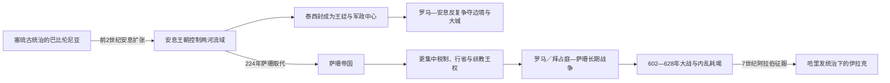

# 安息与萨珊时期的两河流域

## 时间

前141年左右—637年。安息王米特里达梯一世前141年控制巴比伦尼亚；萨珊于224—226年取代安息。萨珊帝国王统延续到651年，但其两河首都泰西封在637年即被阿拉伯军占领。

## 概括

安息和萨珊时代的两河不是伊朗帝国的遥远边疆，而是王都、税粮、贸易与对罗马战争的核心。安息在底格里斯河东岸发展泰西封作为冬都，与西岸希腊城市塞琉西亚形成双城；萨珊将“苏莱斯坦 / 阿苏里斯坦”建设为帝国心脏，泰西封都市群聚集宫廷、官僚、商人、犹太学院和东方教会领袖。这里也是罗马—伊朗反复争夺区，北部美索不达米亚和亚美尼亚常为缓冲，南部灌溉平原则长期留在伊朗王权之下。

## 王朝与区域重心演变图

两河流域在两朝都是帝国核心，但王室完整世系分别由伊朗专表维护；本页关注安息分封贵族、萨珊中央官僚及罗马边疆战争如何改变当地实际权力和城市网络。

## 阶段发展

- **安息接管（前141—前129年）**：米特里达梯一世占领米底后进入巴比伦尼亚，楔形文字文书显示前141年其权威已达乌鲁克。安条克七世前130年一度反攻成功，次年败亡，塞琉古永久退出。
- **阿尔沙克双城体系**：塞琉西亚保有希腊公民和铸币传统，泰西封从军营、王室驻地发展为冬都；南部卡剌肯王国控制河口贸易，时而臣服、时而高度自治。
- **罗马—安息战争**：前53年卡莱战役阻止罗马深入；1—2世纪罗马三次攻入泰西封，却因补给、继承或其他战线撤退，未能永久吞并南部两河。
- **萨珊建国（224—226年）**：阿尔达希尔一世在霍尔木兹甘击杀阿尔达班四世，随后控制泰西封；安息另一支沃洛吉斯六世可能在巴比伦尼亚坚持至约228年，交替并非一日完成。
- **萨珊核心区（3—6世纪）**：王室加强行省、税收和军区控制，泰西封成为加冕与冬季宫廷中心；北部边界随战争和和约反复移动。
- **末期大战与征服（602—637年）**：霍斯劳二世先占拜占庭大片领土，后被希拉克略反攻；628年后王位频繁更替、瘟疫和财政军政危机并发。阿拉伯军在卡迪西亚获胜后于637年占领泰西封。

## 王朝世系与区域权力

安息的并立诸王、罗马扶立者与编号争议见[安息王世系表](/%E4%BA%BA%E6%96%87%E7%A7%91%E5%AD%A6/%E5%8E%86%E5%8F%B2/%E8%A5%BF%E4%BA%9A/%E4%BC%8A%E6%9C%97/%E5%AE%89%E6%81%AF%E7%8E%8B%E4%B8%96%E7%B3%BB%E8%A1%A8.md)；萨珊复位、共治和628—632年争位者见[萨珊君主世系表](/%E4%BA%BA%E6%96%87%E7%A7%91%E5%AD%A6/%E5%8E%86%E5%8F%B2/%E8%A5%BF%E4%BA%9A/%E4%BC%8A%E6%9C%97/%E8%90%A8%E7%8F%8A%E5%90%9B%E4%B8%BB%E4%B8%96%E7%B3%BB%E8%A1%A8.md)。本页不重复两张长表，只说明区域实际权力结构。

| 阶段 | 最高权力 | 区域结构 |
|---|---|---|
| 安息 | 阿尔沙克“万王之王” | 王族和大贵族共同支撑王权；塞琉西亚有城市自治，泰西封为王室冬都，卡剌肯、奥斯若恩、哈特拉等地方王国保留不同程度自治。 |
| 罗马短期占领 | 图拉真等皇帝 / 罗马将领 | 116—117年曾设美索不达米亚等行省并扶立帕尔塔马斯帕提斯，但哈德良即撤退；165、198年的攻占主要是战争洗劫。 |
| 萨珊 | “伊朗人与非伊朗人的万王之王” | 宫廷、宰相、财政官和地方长官治理阿苏里斯坦；泰西封为帝都，北部边境由要塞、军区和附庸阿拉伯王国防卫。 |
| 社群领袖 | 犹太流亡者首领、东方教会大公、城市与乡村精英 | 在王权之下管理婚姻、教育、慈善和部分司法；宗教自治程度随战争和君主政策变化。 |

## 统治、经济与社会

| 机制 | 内容 |
|---|---|
| 灌溉财政 | 迪亚拉和南部冲积平原以渠网、堤坝和土地税供养首都；后世记载称伊拉克贡献萨珊国家约三分之一地税，具体比例难以核实，但其财政地位无疑极高。 |
| 都市群 | 塞琉西亚、泰西封、维赫阿尔达希尔和“霍斯劳的胜利安条克”等聚落沿河组成“诸城”；王宫、作坊、市场与宗教社区并存。 |
| 长途贸易 | 陆路连接伊朗高原、中亚和叙利亚，水路通波斯湾与印度洋；泰西封既是王都也是丝绸、香料和金属贸易终点。 |
| 语言与宗教 | 阿拉米语各方言占多数，希腊语逐渐衰退，中古波斯语服务于萨珊王室；祆教统治精英、基督徒、犹太人、曼尼教徒及本地传统并存。 |
| 边境治理 | 幼发拉底—底格里斯上游要塞、亚美尼亚和阿拉伯附庸构成纵深；萨珊撤销拉赫姆王国后失去一层沙漠缓冲，是否显著促成阿拉伯征服仍有争议。 |

## 重要事件

1. 前141年米特里达梯一世占领塞琉西亚和巴比伦尼亚，乌鲁克文书开始以阿尔沙克王纪年。
2. 前130—前129年安条克七世反攻，一度收复两河，因驻军负担、地方反抗和安息反击而战败身亡。
3. 前53年安息将领苏雷纳在卡莱击败克拉苏，罗马东扩受挫，两河继续处于安息战略纵深。
4. 35 / 36—42年左右塞琉西亚反抗阿尔沙克王权约七年，显示城市自治与王室控制长期紧张。
5. 116年图拉真攻取泰西封并扶立帕尔塔马斯帕提斯；117年哈德良放弃新增行省，安息恢复控制。
6. 165年阿维狄乌斯·卡西乌斯军攻陷塞琉西亚、破坏泰西封；返军可能把“安敦尼瘟疫”带入罗马帝国。
7. 198年塞普蒂米乌斯·塞维鲁再次洗劫泰西封并迁走人口，仍未长期占据南部两河。
8. 224年阿尔达希尔一世击败阿尔达班四世，226年前后在泰西封加冕；萨珊取代分裂中的安息。
9. 260年沙普尔一世在埃德萨俘虏罗马皇帝瓦勒良，萨珊取得巨大声望；北部两河仍在双方拉锯。
10. 283年罗马皇帝卡鲁斯攻入泰西封后突然去世，罗马撤军；这是萨珊时期穆斯林征服前首都唯一被罗马成功占领的一次。
11. 298年纳尔塞战败，尼西比斯和亚美尼亚安排有利于罗马；363年尤利安远征未克泰西封且战死，继任者又把尼西比斯等地割还萨珊。
12. 410年泰西封宗教会议整合波斯境内基督教会，说明帝都也是跨区域宗教中心。
13. 540年霍斯劳一世攻陷安条克，把俘民安置到泰西封附近新城；其税制和军区改革增强帝国动员。
14. 602—628年萨珊—拜占庭大战先使萨珊抵达埃及和君士坦丁堡附近，后被希拉克略反攻；霍斯劳二世被废杀。
15. 628—632年萨珊出现多位短期君主与地方争位者；亚兹德格德三世即位时中央军政尚未恢复。
16. 卡迪西亚战役通常定在636或637年；萨珊主力败退，637年穆斯林军渡底格里斯进入泰西封，王室和军队向伊朗高原撤离。

## 强盛条件

- 两河农业税、人口和手工业可直接供养王都与大军。
- 泰西封位于波斯湾—伊朗高原—地中海网络交汇处，适合作为跨区域帝国中心。
- 安息以地方自治换取贵族、城市和附庸支持，统治成本较低；萨珊则以更统一的税政和官僚提高动员。
- 两王朝都利用多层边疆：要塞、亚美尼亚王权、阿拉伯附庸和地方大族共同缓冲罗马。
- 即便首都数次被攻破，罗马难以越过漫长补给线长期占领灌溉平原，安息和萨珊能在其撤军后恢复。

## 转型、衰落与直接终结

### 安息被萨珊取代

- **结构因素**：阿尔沙克王族分支并立，大贵族可改立国王；塞琉西亚、卡剌肯等地方权力保存较强自主性。
- **外部压力**：罗马反复洗劫首都并扶植竞争者，但未直接终结王朝。
- **直接触发**：法尔斯地方王阿尔达希尔利用沃洛吉斯六世与阿尔达班四世争位扩大势力，霍尔木兹甘决战后掌握王权核心。
- **延续性**：多个帕提亚贵族家族加入萨珊体系，泰西封继续为首都，所以更替不是社会和行政的全面断裂。

### 萨珊失去两河

- **结构因素**：高度财政军事化国家依赖稳定税收、渠网和贵族合作；王室、军区将领、祭司和大族之间长期存在权力竞争。
- **外部与灾害压力**：602—628年全面战争耗尽军队和国库，反复征发及查士丁尼瘟疫后续波次削弱人口；拜占庭虽未占泰西封，却摧毁王室威信。
- **继承危机**：卡瓦德二世清洗王族后早死，四年内多名君主并立，地方将领难以协调。
- **直接终结**：卡迪西亚失败使首都失去屏障；泰西封被放弃而非长期守住，灌溉平原与税源转入新政权。651年亚兹德格德三世死去，王朝在伊朗全境终结。

## 演变关系

- 前一节点：[希腊化与塞琉古时期的两河流域](/%E4%BA%BA%E6%96%87%E7%A7%91%E5%AD%A6/%E5%8E%86%E5%8F%B2/%E8%A5%BF%E4%BA%9A/%E4%B8%A4%E6%B2%B3%E6%B5%81%E5%9F%9F/%E5%B8%8C%E8%85%8A%E5%8C%96%E4%B8%8E%E5%A1%9E%E7%90%89%E5%8F%A4%E6%97%B6%E6%9C%9F%E7%9A%84%E4%B8%A4%E6%B2%B3%E6%B5%81%E5%9F%9F.md)。
- 后续节点：[阿拉伯征服后的两河流域](/%E4%BA%BA%E6%96%87%E7%A7%91%E5%AD%A6/%E5%8E%86%E5%8F%B2/%E8%A5%BF%E4%BA%9A/%E4%B8%A4%E6%B2%B3%E6%B5%81%E5%9F%9F/%E9%98%BF%E6%8B%89%E4%BC%AF%E5%BE%81%E6%9C%8D%E5%90%8E%E7%9A%84%E4%B8%A4%E6%B2%B3%E6%B5%81%E5%9F%9F.md)。
- 王朝主线：[安息帝国](/%E4%BA%BA%E6%96%87%E7%A7%91%E5%AD%A6/%E5%8E%86%E5%8F%B2/%E8%A5%BF%E4%BA%9A/%E4%BC%8A%E6%9C%97/%E5%AE%89%E6%81%AF%E5%B8%9D%E5%9B%BD.md)、[萨珊帝国](/%E4%BA%BA%E6%96%87%E7%A7%91%E5%AD%A6/%E5%8E%86%E5%8F%B2/%E8%A5%BF%E4%BA%9A/%E4%BC%8A%E6%9C%97/%E8%90%A8%E7%8F%8A%E5%B8%9D%E5%9B%BD.md)。
- 对照欧洲：[罗马帝国](/%E4%BA%BA%E6%96%87%E7%A7%91%E5%AD%A6/%E5%8E%86%E5%8F%B2/%E6%AC%A7%E6%B4%B2/_%E9%80%9A%E5%8F%B2/%E5%8F%A4%E7%BD%97%E9%A9%AC/%E7%BD%97%E9%A9%AC%E5%B8%9D%E5%9B%BD.md)、[东罗马帝国与拜占庭帝国](/%E4%BA%BA%E6%96%87%E7%A7%91%E5%AD%A6/%E5%8E%86%E5%8F%B2/%E6%AC%A7%E6%B4%B2/_%E9%80%9A%E5%8F%B2/%E5%8F%A4%E7%BD%97%E9%A9%AC/%E4%B8%9C%E7%BD%97%E9%A9%AC%E5%B8%9D%E5%9B%BD%E4%B8%8E%E6%8B%9C%E5%8D%A0%E5%BA%AD%E5%B8%9D%E5%9B%BD.md)。
- 所属总览：[两河流域文明](/%E4%BA%BA%E6%96%87%E7%A7%91%E5%AD%A6/%E5%8E%86%E5%8F%B2/%E8%A5%BF%E4%BA%9A/%E4%B8%A4%E6%B2%B3%E6%B5%81%E5%9F%9F/README.md)。
