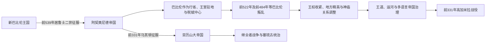

# 波斯统治下的两河流域

## 时间

前539—前331年，即阿契美尼德帝国统治巴比伦尼亚时期。

## 概括

居鲁士二世攻取巴比伦后，没有摧毁其城市、神庙和书吏体系，而是采用“巴比伦王、诸国之王”等称号，以恢复祭祀和秩序的语言接管新巴比伦国家。两河流域既是人口稠密、农业与商业发达的税源，也是连接伊朗、叙利亚、安纳托利亚和波斯湾的交通中心。巴比伦数次出现拥立“尼布甲尼撒”的复国叛乱，波斯中央遂逐步收紧控制；但即使在薛西斯镇压后，区域经济、神庙档案和楔形文字学术仍持续发展。

## 帝国接管与终结图

波斯国王完整世系由伊朗主线维护；本页区分大王、巴比伦行省官员、地方神庙精英和短期叛王，避免把帝国统治误写成一条本地王朝世系。

## 接管与阶段过程

- **居鲁士的合法化接管**：前539年波斯军在奥皮斯击败巴比伦军，西帕尔无战投降；将领戈布里亚斯先入巴比伦，居鲁士随后举行入城仪式。居鲁士圆柱把胜利解释为马尔杜克抛弃那波尼德并选择居鲁士，这是征服者的政治文本，不是中立战报。
- **冈比西斯时期**：冈比西斯二世可能在父王在世时即参与巴比伦新年礼仪，继位后保留巴比伦王号；征服埃及后，两河成为帝国中央交通与军需节点。
- **大流士的重建**：前522—前521年两名反叛者先后自称那波尼德之子“尼布甲尼撒”，控制巴比伦及多座城市。大流士一世两次镇压，随后增加波斯官员、驻军、税赋和王家行政。
- **薛西斯的转折**：前484年贝尔希曼尼、前482年沙马什埃里巴反叛，薛西斯军围攻并严厉处置。巴比伦王号此后淡出，部分神庙财产和政治特权受损；关于彻底摧毁埃萨吉拉或搬走马尔杜克金像的程度，古典文献与楔形文字证据解释仍有争议。
- **后期延续**：阿尔塔薛西斯诸王仍在巴比伦驻留、营建和调动军队。前401年小居鲁士在巴比伦附近的库纳克萨战败，显示两河仍是帝国内战战略核心。
- **马其顿征服**：前331年高加米拉战役后，巴比伦总督马扎亚斯向亚历山大投降；阿契美尼德区域统治结束。

## 王权与区域统治者

完整阿契美尼德皇帝序列、复位与争位者见[阿契美尼德王朝](/%E4%BA%BA%E6%96%87%E7%A7%91%E5%AD%A6/%E5%8E%86%E5%8F%B2/%E8%A5%BF%E4%BA%9A/%E4%BC%8A%E6%9C%97/%E9%98%BF%E5%A5%91%E7%BE%8E%E5%B0%BC%E5%BE%B7%E7%8E%8B%E6%9C%9D.md)。下表只列直接改变巴比伦尼亚政治地位的人物，不另复制全帝国世系。

| 人物 | 身份与时期 | 对两河流域的影响 |
|---|---|---|
| **居鲁士二世** | 前539—前530年为巴比伦统治者 | 征服新巴比伦，采用本地王号并保留神庙、官僚与城市精英。 |
| 冈比西斯二世 | 前530—前522年 | 延续巴比伦王号；把区域纳入通往埃及的帝国军需线。 |
| 尼丁图贝尔 | 前522年叛王，自称尼布甲尼撒三世 | 以那波尼德之子名义复国，被大流士军击败处死。 |
| 阿拉哈 | 前521年叛王，自称尼布甲尼撒四世 | 控制巴比伦、乌鲁克、锡帕尔等地数月，被镇压。 |
| **大流士一世** | 前522—前486年 | 两次平叛，重组行省、税收、驻军和交通；仍在巴比伦营建与驻跸。 |
| 贝尔希曼尼 | 前484年叛王 | 统治约两周或数月，文书见于巴比伦、博尔西帕和迪尔巴特，年代与沙马什埃里巴关系有争论。 |
| 沙马什埃里巴 | 前482—前481年左右叛王 | 控制范围较广，围城后被薛西斯军镇压；确切起止年仍有不同重建。 |
| **薛西斯一世** | 前486—前465年 | 镇压巴比伦反叛，弱化独立王国式地位并加强中央控制。 |
| 小居鲁士 | 前401年王子叛乱 | 在库纳克萨战死；希腊雇佣军撤退成为帝国军事史重要事件。 |
| 大流士三世 / 马扎亚斯 | 前336—前331年；末任帝王与巴比伦总督 | 高加米拉失败后，马扎亚斯向亚历山大交城并继续任总督。 |

## 统治结构

| 层级 | 运作方式 |
|---|---|
| 大王与总督 | 巴比伦尼亚可能与“河西”在不同时期组成或拆分大总督区；总督、驻军统帅、税务官和王家监察并存，行政边界并非两百年不变。 |
| 城市与神庙 | 巴比伦、锡帕尔、博尔西帕、乌鲁克等保留神庙、祭司、长老与地方档案；神庙土地须纳税并接受官员监督。 |
| 王家土地与军役 | 土地可编入弓手、骑手或战车手等服役单位；持有人以租税、军役或装备义务回报。 |
| 商业家族 | 埃吉比、穆拉舒等家族经营借贷、租佃、税务代理、运河和军役土地，连接王室、神庙与乡村生产者。 |
| 语言与文书 | 阿卡德语楔形文字继续用于法律、天文和神庙档案，帝国阿拉米语在跨地区行政中上升；波斯官名和词汇进入巴比伦文书。 |
| 交通与粮赋 | 王家道路、幼发拉底—底格里斯河运与运河把苏萨、波斯波利斯、萨第斯和黎凡特连接；巴比伦尼亚供应粮食、白银和军队。 |

## 重要事件

1. 前539年奥皮斯战役后波斯军控制底格里斯通道，西帕尔及巴比伦相继投降。
2. 居鲁士以马尔杜克选择自己的修辞恢复神像与祭祀，把征服包装为合法王位继承。
3. 前522年尼丁图贝尔发动第一次“尼布甲尼撒”叛乱，被大流士将领在底格里斯和幼发拉底沿线击败。
4. 前521年阿拉哈发动第二次复国叛乱，楔形文字文书显示其权力一度覆盖南北巴比伦尼亚。
5. 大流士一世重组税区和王家土地，开辟或整修帝国道路，使巴比伦成为苏萨—地中海体系枢纽。
6. 前484年前后贝尔希曼尼叛乱迅速失败；前482年沙马什埃里巴再起，波斯军经历围城后取胜。
7. 薛西斯镇压后不再稳定使用“巴比伦王”头衔，传统独立王权在制度上终结，但城市并未荒废。
8. 前401年库纳克萨战役发生在巴比伦附近，小居鲁士失败，阿尔塔薛西斯二世保住王位。
9. 前4世纪，巴比伦仍是大王驻地、军队集结点和繁荣农业—商业区，所谓“薛西斯后立即衰亡”并不成立。
10. 前331年高加米拉战役后马扎亚斯交城，亚历山大保留部分波斯官僚并举行巴比伦祭祀。

## 兴盛条件与统治韧性

- 居鲁士沿用本地官僚与宗教语言，降低初次征服成本。
- 巴比伦尼亚密集渠网、粮食和白银收入是帝国可靠财政基础。
- 多语言文书、商业家族与神庙构成长期稳定的地方治理网络。
- 巴比伦位于伊朗高原通往叙利亚、埃及和安纳托利亚的交汇处，任何帝国都难以忽视。
- 波斯能在反叛后调集跨行省军队，同时让多数日常经济制度继续运转。

## 结构矛盾与阶段终结

- **结构因素**：波斯大王既要借马尔杜克传统证明本地王权，又要阻止巴比伦恢复独立；税收、军役和神庙特权之间长期紧张。
- **地方反抗**：叛王采用尼布甲尼撒名号，说明新巴比伦记忆仍具号召力；但反叛并非全体居民一致行动，许多机构继续为波斯王纪年。
- **外部压力**：帝国后期的宫廷斗争、埃及反复叛乱和马其顿战争分散军力；不能把阿契美尼德覆亡简化为“奢侈腐败”。
- **直接终结**：大流士三世在高加米拉失败后撤离，马扎亚斯选择投降，巴比伦未经历长期围城。区域行政随后转入[希腊化与塞琉古时期的两河流域](/%E4%BA%BA%E6%96%87%E7%A7%91%E5%AD%A6/%E5%8E%86%E5%8F%B2/%E8%A5%BF%E4%BA%9A/%E4%B8%A4%E6%B2%B3%E6%B5%81%E5%9F%9F/%E5%B8%8C%E8%85%8A%E5%8C%96%E4%B8%8E%E5%A1%9E%E7%90%89%E5%8F%A4%E6%97%B6%E6%9C%9F%E7%9A%84%E4%B8%A4%E6%B2%B3%E6%B5%81%E5%9F%9F.md)。
- **制度延续**：税制、总督、王家道路、楔形文书与本地祭祀被马其顿和塞琉古统治者选择性接收。

## 演变关系

- 前一节点：[新巴比伦王国](/%E4%BA%BA%E6%96%87%E7%A7%91%E5%AD%A6/%E5%8E%86%E5%8F%B2/%E8%A5%BF%E4%BA%9A/%E4%B8%A4%E6%B2%B3%E6%B5%81%E5%9F%9F/%E6%96%B0%E5%B7%B4%E6%AF%94%E4%BC%A6%E7%8E%8B%E5%9B%BD.md)。
- 后续节点：[希腊化与塞琉古时期的两河流域](/%E4%BA%BA%E6%96%87%E7%A7%91%E5%AD%A6/%E5%8E%86%E5%8F%B2/%E8%A5%BF%E4%BA%9A/%E4%B8%A4%E6%B2%B3%E6%B5%81%E5%9F%9F/%E5%B8%8C%E8%85%8A%E5%8C%96%E4%B8%8E%E5%A1%9E%E7%90%89%E5%8F%A4%E6%97%B6%E6%9C%9F%E7%9A%84%E4%B8%A4%E6%B2%B3%E6%B5%81%E5%9F%9F.md)。
- 帝国主线：[阿契美尼德王朝](/%E4%BA%BA%E6%96%87%E7%A7%91%E5%AD%A6/%E5%8E%86%E5%8F%B2/%E8%A5%BF%E4%BA%9A/%E4%BC%8A%E6%9C%97/%E9%98%BF%E5%A5%91%E7%BE%8E%E5%B0%BC%E5%BE%B7%E7%8E%8B%E6%9C%9D.md)。
- 所属总览：[两河流域文明](/%E4%BA%BA%E6%96%87%E7%A7%91%E5%AD%A6/%E5%8E%86%E5%8F%B2/%E8%A5%BF%E4%BA%9A/%E4%B8%A4%E6%B2%B3%E6%B5%81%E5%9F%9F/README.md)。
