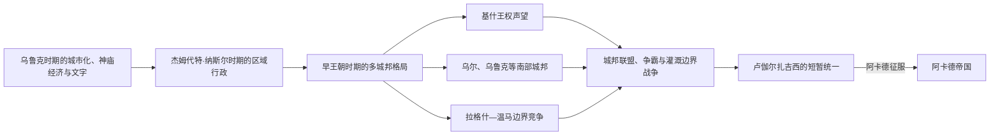

# 苏美尔城邦时期

## 时间

约前4千纪末—前2334年；其中早王朝时期通常约前2900—前2334年。第三千纪的绝对年代仍有误差，本文只把约年用于定位。

## 概括

苏美尔城邦时期不是一个统一王朝，而是南部美索不达米亚多个城市国家长期并立、竞争和结盟的阶段。乌鲁克、乌尔、拉伽什、温马、基什、尼普尔等城市依靠河道、灌溉农田、神庙机构、手工业和远距离贸易形成复杂社会；各城的兴衰往往彼此重叠，政治霸权也会迅速转移。约前3300年前后的原始楔形文字最初服务于粮食、牲畜和劳动力核算，随后扩展为契约、王室铭文、法律与文学书写。

## 城邦形成与统一尝试图

城邦长期并立，《苏美尔王表》所写的“王权从一城转到另一城”是后世政治叙事，不代表每个阶段只有一个统治中心。同期铭文可确认的地方王序另见专表。

## 形成背景与阶段过程

- **乌鲁克城市化（约前4000—前3100年）**：大型神庙区、标准量器、印章和行政筹码集中出现，乌鲁克文化影响扩展到两河以外；这种扩展是贸易、移民与地方互动的混合过程，不能简单称为统一殖民帝国。
- **捷姆迭特·那色阶段（约前3100—前2900年）**：文字和行政分类继续发展，区域网络收缩，南部城市出现更鲜明的地方传统。
- **早王朝前中期（约前2900—前2500年）**：各城建立城墙、宫殿和军事随从，王权从神庙主持者与战时领袖中强化；“基什之王”等称号成为跨城霸权象征。
- **早王朝晚期（约前2500—前2334年）**：拉伽什—温马边界战争、乌尔与乌鲁克的竞争和短暂联盟日益频繁。卢伽尔扎格西一度控制南部多城，但没有消灭地方制度，最终败于萨尔贡。

## 统治结构

| 层级 | 机制 |
|---|---|
| 城邦与保护神 | 城市共同体以本城神祇和主神庙为认同中心；神庙持有土地、仓库、畜群和作坊，但私人、家族与宫廷经济也同时存在。 |
| ensi 与 lugal | ensi常译“城邦统治者 / 总督”，lugal意为“大人、王”；实际称号随城市和时期变化，不能机械理解为固定上下级。 |
| 长老与集会 | 文学文本保存长老、战士集会参与决策的记忆，但其真实权限和普遍性难以量化。 |
| 书吏行政 | 泥板记录配给、劳役、田亩、债务和贸易，印章用于确认身份；书写能力主要掌握在机构书吏手中。 |
| 军事与水利 | 城墙、战车、矛兵和随从保障城市安全；河道与田界既是合作基础，也是拉伽什—温马冲突的直接焦点。 |

苏美尔不存在可连续排列的统一君主世系。传说王、同期铭文可证统治者与并立地方王朝的区别，见[苏美尔城邦王朝与统治者表](/%E4%BA%BA%E6%96%87%E7%A7%91%E5%AD%A6/%E5%8E%86%E5%8F%B2/%E8%A5%BF%E4%BA%9A/%E4%B8%A4%E6%B2%B3%E6%B5%81%E5%9F%9F/%E8%8B%8F%E7%BE%8E%E5%B0%94%E5%9F%8E%E9%82%A6%E7%8E%8B%E6%9C%9D%E4%B8%8E%E7%BB%9F%E6%B2%BB%E8%80%85%E8%A1%A8.md)。

## 重要事件

1. **约前3300年前后**：乌鲁克出现最早一批原始楔形文字泥板，行政核算开始转化为可扩展的书写制度。
2. **约前2900年后**：城市防御、王墓和宫廷随葬显示社会分层及军事王权增强。
3. **约前26世纪**：基什的恩美巴拉格西获得同期铭文证明；后世“基什之王”成为区域霸权头衔。
4. **约前25世纪**：乌尔王室墓地反映精英财富、跨区域材料和带有强制性的宫廷丧葬仪式。
5. **约前2450年左右**：拉伽什的伊安那图姆（Eannatum）击败温马，“鹫碑”记录已知较早的战争叙事和边界主张。
6. **约前24世纪**：恩铁美那与乌鲁克统治者结盟，并继续通过条约、界碑和灌渠管理拉伽什—温马争端。
7. **约前2350年左右**：乌鲁卡吉那的改革铭文宣称制止官吏、祭司和富户侵夺；它是王权合法化文本，不能直接等同现代社会改革法典。
8. **约前2334年前后**：卢伽尔扎格西攻破拉伽什并取得南部霸权，继而被萨尔贡击败，城邦体系被纳入阿卡德帝国。

## 成熟条件

- 冲积平原的高产灌溉农业可供养非农人口，但必须持续组织渠系和堤防。
- 波斯湾、伊朗高原、阿曼和叙利亚方向的贸易补充木材、石料与金属等南部稀缺资源。
- 神庙和宫廷把剩余产品转化为公共工程、礼仪、军队及专业手工业。
- 印章、度量衡和书写降低跨机构管理成本，并积累可复制的行政知识。
- 多城竞争刺激筑城、联盟和军事创新，也让文化样式在冲突中迅速传播。

## 结构压力与阶段终结

- **结构因素**：城邦领土狭小却高度依赖相互贯通的河道；上游改渠、盐碱化和土地边界都可能把经济摩擦转化为战争。机构土地和债务关系也造成内部利益冲突。
- **外部与区域压力**：这不是“苏美尔人被阿卡德人突然替代”。苏美尔语与阿卡德语人群早已共处，变化主要是北部军事—政治中心扩张和更大尺度的资源动员。
- **直接终结**：卢伽尔扎格西的短暂霸权消耗并压服部分南部城邦；萨尔贡随后击败他，任命地方官并建立跨区域王权。各城、神庙、苏美尔语和书吏传统并未消失，而是在[阿卡德帝国](/%E4%BA%BA%E6%96%87%E7%A7%91%E5%AD%A6/%E5%8E%86%E5%8F%B2/%E8%A5%BF%E4%BA%9A/%E4%B8%A4%E6%B2%B3%E6%B5%81%E5%9F%9F/%E9%98%BF%E5%8D%A1%E5%BE%B7%E5%B8%9D%E5%9B%BD.md)及[乌尔第三王朝](/%E4%BA%BA%E6%96%87%E7%A7%91%E5%AD%A6/%E5%8E%86%E5%8F%B2/%E8%A5%BF%E4%BA%9A/%E4%B8%A4%E6%B2%B3%E6%B5%81%E5%9F%9F/%E4%B9%8C%E5%B0%94%E7%AC%AC%E4%B8%89%E7%8E%8B%E6%9C%9D.md)继续重组。

## 演变关系

- 前史是欧贝德与乌鲁克城市化过程；本库从成熟城市文明阶段展开。
- 后续节点：[阿卡德帝国](/%E4%BA%BA%E6%96%87%E7%A7%91%E5%AD%A6/%E5%8E%86%E5%8F%B2/%E8%A5%BF%E4%BA%9A/%E4%B8%A4%E6%B2%B3%E6%B5%81%E5%9F%9F/%E9%98%BF%E5%8D%A1%E5%BE%B7%E5%B8%9D%E5%9B%BD.md)。
- 苏美尔政治文化在[乌尔第三王朝](/%E4%BA%BA%E6%96%87%E7%A7%91%E5%AD%A6/%E5%8E%86%E5%8F%B2/%E8%A5%BF%E4%BA%9A/%E4%B8%A4%E6%B2%B3%E6%B5%81%E5%9F%9F/%E4%B9%8C%E5%B0%94%E7%AC%AC%E4%B8%89%E7%8E%8B%E6%9C%9D.md)中再次成为国家合法性核心，但不是对早王朝城邦秩序的原样恢复。
- 所属总览：[两河流域文明](/%E4%BA%BA%E6%96%87%E7%A7%91%E5%AD%A6/%E5%8E%86%E5%8F%B2/%E8%A5%BF%E4%BA%9A/%E4%B8%A4%E6%B2%B3%E6%B5%81%E5%9F%9F/README.md)。
